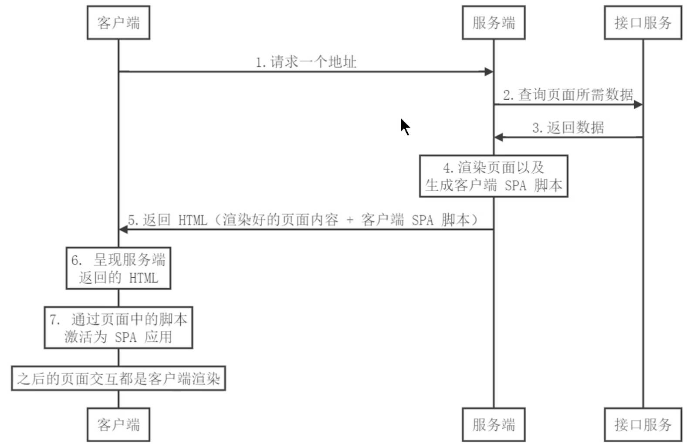
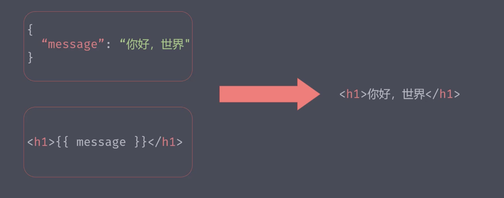

# 服务端渲染基础

## 概述

随着前端技术栈和工具链的迭代成熟, 前端工程化、模块化也成了当下的主流技术方案

在这波技术浪潮中, 涌现了诸如Angular、React和Vue等基于客户端渲染的前端技术框架

### SPA单页面应用

#### 优点

+ 用户体验号
+ 开发效率高
+ 渲染性能好
+ 可维护性好
+ ...等

#### 缺陷

+ 首屏渲染时间长
  - 与传统服务端渲染, 直接渲染已有的HTML不同, 单页应用会在客户端使用js生成HTML来呈现网页内容
  - 用户需要等待客户端js解析执行完, 才能看到页面
  - 这样会使得首屏时间过长从而影响用户体验
+ 不利于SEO
  - 搜索引擎爬取网站HTML文件时,  单页面的HTML是没有内容的
  - 需要通过js解析执行完, 才能生成网页内容
  - 而目前主流搜索引擎对于这部分的抓取还不是特别友好

### 解决

为了解决上述问题, 业界借鉴了传统的服务端直出HTML的方案, 提出在服务器端执行前端框架代码来生成网页内容, 然后将渲染好的网页内容返回给客户端

客户端只需要负责展示

## 客户端激活为SPA

不仅仅像上面一样那么简单, 为了获得更好的用户体验以及页面交互, 同时会在客户端将来自服务端渲染的内容激活为一个SPA应用

也就数说之后的页面应用交互, 其实都是通过客户端渲染来进行处理的

## 同构应用

+ 通过服务端渲染首屏直出, 解决SPA应用首屏渲染慢以及不利于SEO的问题
+ 通过客户端渲染接管页面内容交互得到更好的用户体验

> 这种方式通常称为现代化的服务端渲染, 也叫同构渲染
> 
> 这种方式构建的应用, 一般称之为服务端应用或者是同构应用

## 相关概念

为了更好的理解SSR应用, 需要了解一下渲染相关的概念

主要涉及到:

+ 什么是渲染
+ [传统的服务端渲染](/blogs/BaseSSR/2.html)
+ 客户端渲染
+ 现代化的服务端渲染(同构渲染)

### 什么是渲染

这里所说的渲染, 指的就是将`【数据】`+`【模板】`拼接到一起的这个事

对于前端开发来说, 最常见的一种场景就是请求数据接口, 将数据通过模板绑定语法绑定到页面当中, 最终呈现给用户

这个过程就是我们所说的渲染

渲染的本质其实就是字符串的解析替换, 实现的方式有很多种

不过前端关注的并不是如何渲染, 而是`在哪里渲染`的问题
