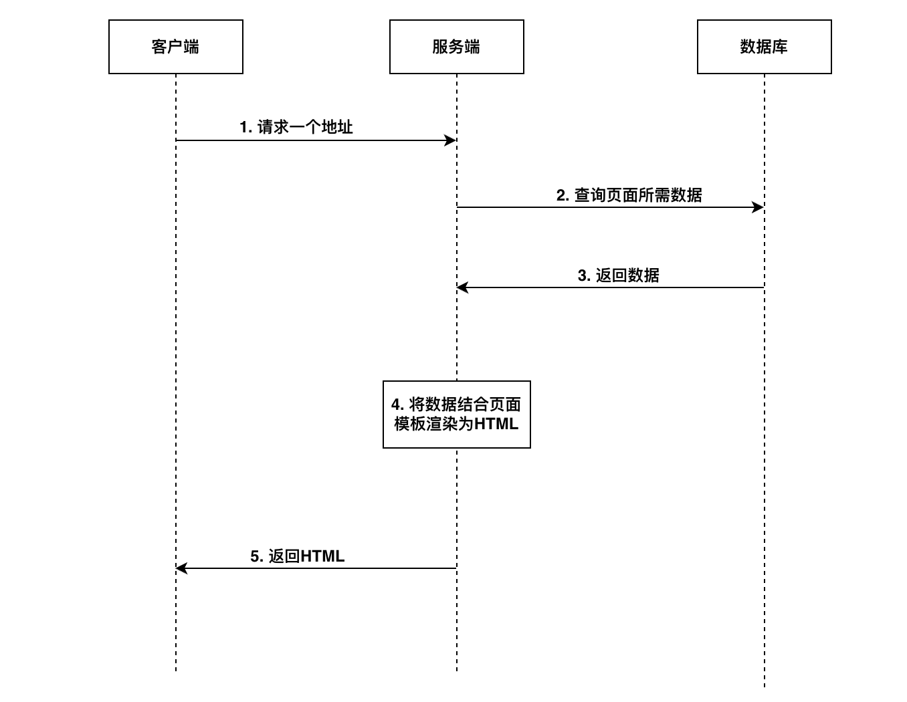

# 传统的服务端渲染

## 早期SSR

早期为web页面渲染都是在服务端进行的, 也就是服务端在运行过程中, 将所需要的数据, 结合页面模板渲染为HTML, 然后响应给客户端浏览器

所以客户端呈现出来的直接就包含了HTML页面

整体流程如下图所示:



1. 首先客户端发起一个请求, 请求服务端
2. 当服务端收到请求后, 首先查询数据库去拿到页面所需要的数据
3. 拿到数据后, 将数据结合模板渲染为完整的HTML
4. 渲染完毕后将整体的HTML发送给客户端
5. 客户端收到内容后, 直接将HTML展示在浏览器中

其中最重要的是第四步, 也就是渲染这个事情, 是在服务端进行的

## Node.js演示传统的服务端渲染模式

1. 通过express快速搭建服务端项目
2. 通过art-template处理模板


### 主要代码

```html
<!DOCTYPE html>
<html lang="en">

<head>
  <meta charset="UTF-8">
  <meta http-equiv="X-UA-Compatible" content="IE=edge">
  <meta name="viewport" content="width=device-width, initial-scale=1.0">
  <title>{{title}}</title>
</head>

<body>
  <h1>{{title}}</h1>
  <ul>
    <!-- 遍历语法 -->
    {{ each posts }}
    <li key={{$value.id}}>
      <h2>{{ $value.title }}</h2>
      <div>{{ $value.body }}</div>
    </li>
    {{ /each }}
  </ul>
</body>

</html>
```

```js
const express = require('express');
const fs = require('fs');
const template = require('art-template');

const app = express();

// 相应根路径请求
app.get('/', (req, res) => {
  // 1. 获取页面模板(通过读取文件的方式)
  // * 此时该内容并不是一个字符串, 默认编码模式是二进制模式, 简单操作就是给一个uft-8
  const templateStr = fs.readFileSync('./index.html', 'utf-8');
  // 2. 获取数据
  const data = JSON.parse(fs.readFileSync('./data.json', 'utf-8'));
  // console.info(data);
  // 3. 渲染: 数据 + 模板 = 最终结果
  const html = template.render(templateStr, data)
  // const { title, posts } = data;
  // const html = template.render(templateStr, { title: title, list: posts.map(({ id, title, body }) => `<li key=${id}>
  //   <h2>${title}</h2>
  //   <div>${body}</div>
  // </li>`) });
  // 4. 将渲染结果发送给客户端
  res.send(html);
});

// 监听端口号
app.listen(4000, () => console.info('running...'));

```

### 结论

1. 通过这种方式获得的页面是一个动态页面, 受到模板和数据的影响
2. 通过这种方式, 可以方便的创建动态网页, 这也是早期的动态网页技术
3. 虽然这种方式简单, 但是又很多[缺点](/blogs/BaseSSR/2.html#缺点)

## 缺点

在网页越来越复杂的情况下, 存在很多不足

+ 前后端代码完全耦合在一起, 不利于开发和维护
  - 对比现有的前后端分离的模式, 这种方式非常麻烦, 这种模式下根本就没有前端的概念
+ 前端没有足够的发挥空间
+ 服务端压力大
  - 对于服务端的压力会更大 
+ 用户体验一般
  - 相比spa应用, 每次查看其他页面, 都需要进行一次完整的刷新
  - 而spa应用程序, 不需要刷新页面, 可以直接在客户端重渲染 

> 但是在应用没有那么复杂的情况下, 这种方式其实还是非常快的


