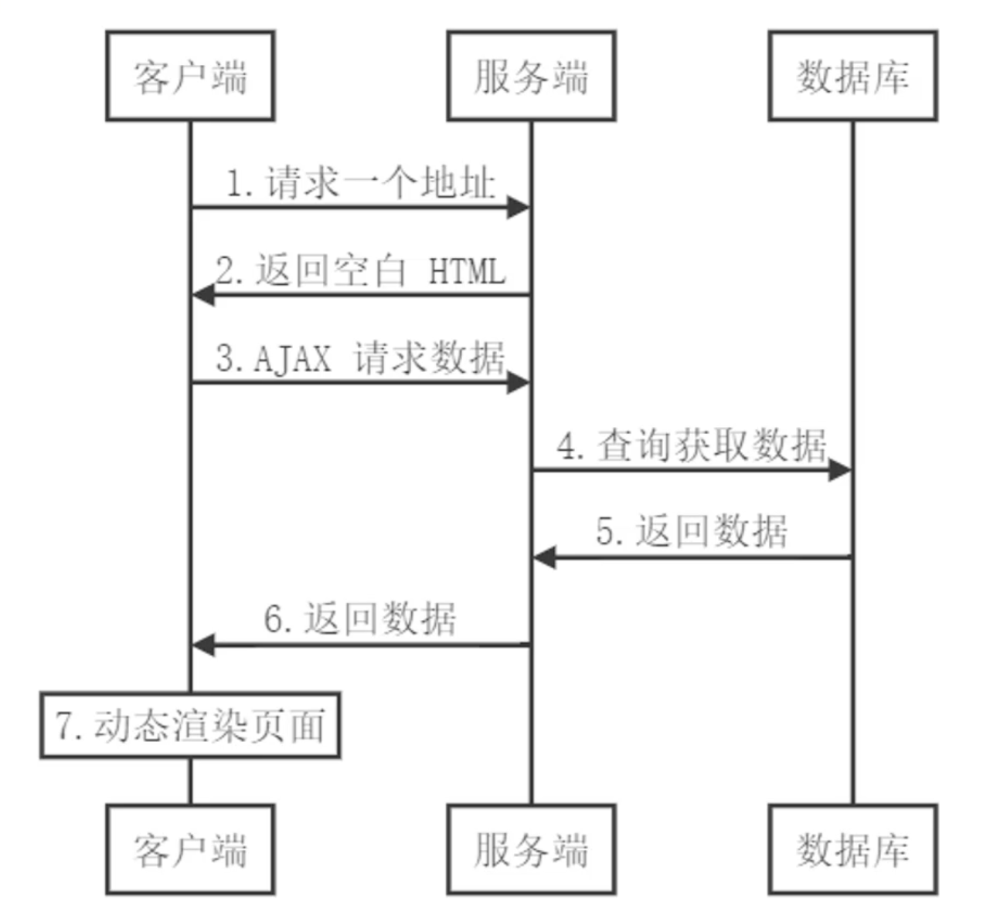

# 客户端渲染

之前了解到, 传统的服务端渲染存在这样那样的问题, 比如前后端代码混合在一起, 服务端压力大, 体验不够友好等

但是这些问题随着客户端Ajax技术的诞生和普及, 得到了有效的解决

Ajax使得客户端动态获取数据成为了可能

也就是说之前只能在服务端进行渲染的工作, 现在可以放到客户端来解决

## 为什么要放到客户端?

其实又回到刚才说的问题了

传统的SSR, 将前后端代码混合在一起

### 1. 职责划分更加清晰, 提高开发效率和可维护性

而页面渲染放到客户端进行, 那么人员的职责划分会变得更加清晰

后端的人员就只需要负责数据的处理, 将接口提供给前端

而前端则专注于处理视图的渲染, 可以极大的提高开发的效率和可维护性

### 2. 减轻服务端压力

渲染工作抽离服务端, 极大的降低服务端的压力

### 3. 体验问题

传统SSR加载不同页面需要不停地重新创建document文档, 会不停地刷新, 而SPA应用, 没有页面刷新, 体验极佳

## 客户端渲染基本流程

1. 首先在客户端发起请求, 服务端接收到请求后返回一个空白的html页面(无实质内容, 但是有挂载点)
2. 获取到空页面后, 加载执行js代码, 如果有动态数据, 会发起ajax请求, 获取数据
3. 服务端收到请求后, 开始查库操作, 然后将查询到的数据进一步返回到客户端
4. 客户端拿到数据后, 对数据进行处理以及渲染动态页面内容
5. 最终呈现完整的页面内容

> 上述环节中, 服务端仅负责数据的处理, 而页面渲染的工作, 都移动到了客户端
> 
> 分离前后端, 极大减轻服务端消耗
> 
> 通过这种方式, 前端也变得更加独立, 不在受限于后端

## 缺点

但是SPA也有一些明显的不足

1. 首屏渲染慢
2. 不利于SEO
