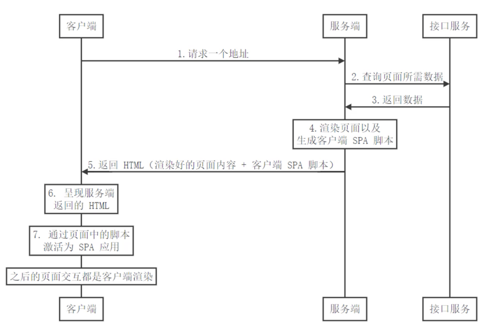
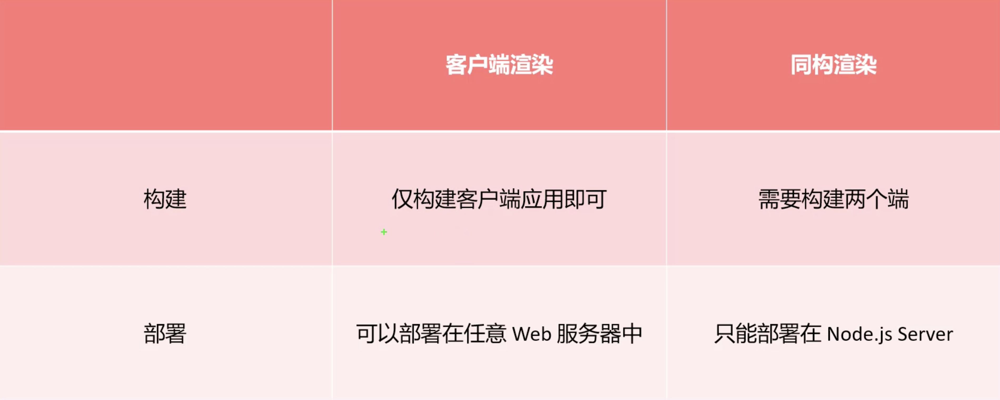

# 现代化的服务端渲染

上一节说了CSR渲染的显著问题, 也就是`首屏渲染慢`和`不利于SEO`

其实解决他们的方式非常简单, 就是结合服务端渲染, 来解决这两个问题

## 服务端渲染

从本质上来说, 肯定是要使用服务端渲染, 但是又不是传统意义上的SSR, 和之前说的传统的SSR是不同的

现代化的服务端渲染, 其实应该叫做 -> `同构渲染`

## 同构渲染

其实就是后端渲染 + 前端渲染

在这种模式下, 既有后端渲染的优点, 又有前端渲染的优点

+ 基于React、Vue等框架, 客户端渲染和服务端渲染的结合
  - 在服务器端执行一次框架代码, 用于实现服务端渲染(首屏直出)
  - 在客户端在执行一次框架代码, 用于接管页面交互, 从而将其生成一个SPA应用(之后所有的交互, 都是CSR)
+ 核心解决SEO和首屏渲染慢的问题
+ 拥有传统服务端渲染的优点, 也有客户端渲染的优点

### 核心流程

1. 首先在客户端请求网页地址
2. 服务端收到请求后, 查询页面所需数据
3. 拿到数据后, 渲染页面以及生成客户端SPA脚本
4. 渲染完成后返回HTML(渲染好的页面内容 + 客户端SPA脚本)
5. 客户端拿到内容后, 直接呈现服务端返回的HTML内容
6. 为了保持SPA的优点, 所以需要通过页面中的脚本激活为SPA应用
7. 之后所有的页面交互, 都变成了CSR

### 如何实现同构渲染?

+ 使用Vue、React等框架的官方解决方案
  - 优点: 有助于理解原理 
  - 缺点: 需要搭建环境, 比较麻烦
+ 使用第三方的解决方案
  - React生态的Next.js 
  - Vue生态的Nuxt.js
  - ...其他

## 同构渲染的问题

+ 开发条件所限
  - 浏览器特定的代码只能在某些生命周期钩子函数中使用
  - 一些外部扩展库可能需要特殊处理才能在SSR应用中运行
  - 不能再Server Render期间操作DOM
  - ...
  - 某些代码需要区分运行环境(基本都是这个问题, 因为nuxt既要运行到服务端, 也要运行到客户端)
+ 设计构建设置和部署的更多要求
  - 
+ 更多的服务器端负载
  - 在Node中渲染完整的应用程序, 相比仅仅提供静态文件的服务器需要大量占用CPU资源
  - 如果应用在高流量环境下使用, 需要准备相应的服务器负载
  - 需要更多的服务端渲染优化工作处理

## SSR使用建议

+ 首屏渲染速度是否真的重要?
+ 是否真的需要SEO?
