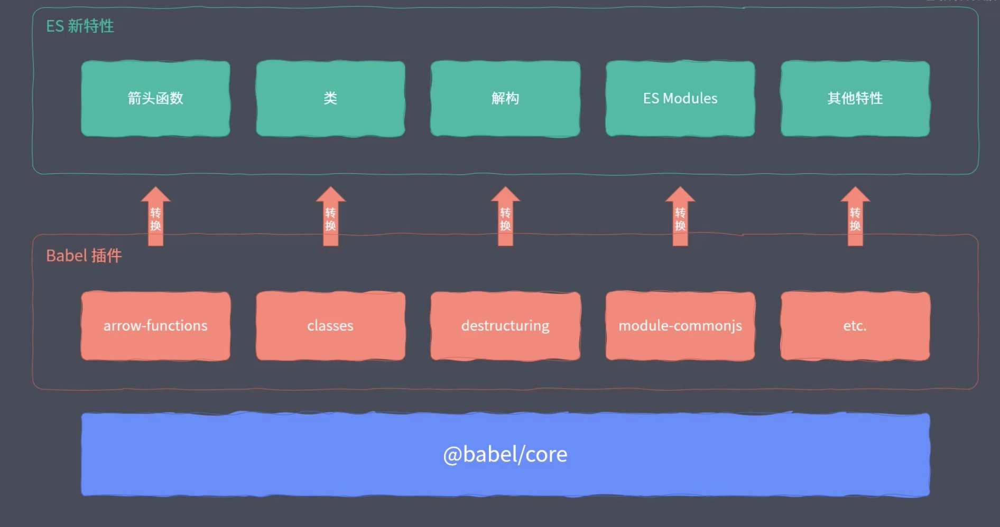
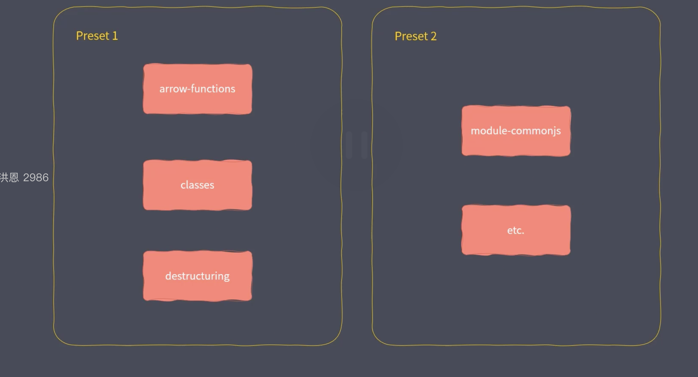

# ES Modules in Node.js

## Node中使用 ES Module

node 8.5以上, 内部就已经开始以实验特性支持 `ES Module` 了

首先要将扩展名修改为`.mjs`

然后执行文件，需要加入后缀, `--experimental-modules`(12版本已经不需要这个了)

```shell
node --experimental-modules 2.mjs
```

这里会报一个警告(node:31604) ExperimentalWarning: The ESM module loader is experimental.

告诉你这是一个实验特性, 希望不要再生产中使用(当我切换到14版本之后, 就没有这个警告了, 但是文件后缀还是要改成.mjs)

当然, 原生模块也可以使用, 第三方模块也可以, 如下

```javaScript
// 原生模块
import fs from 'fs';
fs.writeFileSync("./foo.txt", "hello ES Module");
// 第三方模块
import _ from 'lodash';
console.info(_.camelCase("ES Module")); // esModule
```

但是不能如下使用

```javaScript
import {camelCase} from 'lodash';

camelCase("ES Module"); // 报错, 因为他并不是一个解构

import { writeFileSync } from 'fs';// 但是这样可以, 因为原生模块做了兼容性处理
```


## ES Module 中载入 CommonJs

```javaScript
// common.js
module.exports = {
    foo: "commonjs exports value"
}

// index.mjs
import mod from './common.js';
console.info(mod); // {foo: "commonjs exports value"}
```

import 并且不能直接提取common.js导出的成员, 只能将它整个导入进来


node环境中CommonJs 不能通过 require 载入 ES Module(当然webpack处理后可以)


### 总结

+ ES Module 中可以导入 CommonJS模块
+ CommonJS中不能导入 ES Module模块
+ CommonJS始终只会导出一个默认成员
+ 注意 import 不是解构导出对象

## ES Module 和 CommonJS的差异

以下有两个js文件

```javaScript
// cjs.js

// 加载模块函数
console.info(require);

// 模块对象
console.info(module);

// 导出对象别名
console.info(exports);

// 当前文件的绝对路径
console.info(__filename);

// 当前文件所在目录
console.info(__dirname);

```

执行之后他们是可以正常工作的

换到es module中尝试使用

```javaScript
// esm.mjs

// 加载模块函数
console.info(require);

// 模块对象
console.info(module);

// 导出对象别名
console.info(exports);

// 当前文件的绝对路径
console.info(__filename);

// 当前文件所在目录
console.info(__dirname);
```

会发现他们全部都不能被访问, 因为这五个成员实际上都是CommonJS把模块包装成函数, 通过参数提供进来的成员

但是ES Module发生变化, 没有CommonJS中那些模块的全局变量了

`require`, `module`, `exports`可以通过 `import` 和 `export`去替换


`import.meta.url`在import下面, 这里拿到的是当前工作的文件url地址

同时, `url`模块中有一个 `fileURLToPath这`个方法, 可以将文件url转换成路径

`path` 模块中有一个 `dirname`方法, 可以将完整的文件路径提取出文件夹的部分, 就可以得到__dirname这个成员了

```import { fileURLToPath } from 'url'```

`__filename` 可以通过 `fileURLToPath(import.meta.url)`来获取

`__dirname` 可以通过 `dirname(__filename)` 来获取


```javaScript
import { fileURLToPath } from 'url';
import { dirname } from 'path';

const __filename = fileURLToPath(import.meta.url);

const __dirname = dirname(__filename);

console.info(__filename);
console.info(__dirname);
```

CommonJS对模块处理的源代码

```javaScript
let wrap = function(script) {
    return Module.wrapper[0] + script + Module.wrapper[1];
};

const wrapper = [
    'function (exports, require, module, __filename, __dirname) {',
    '\n});'
];
```

就会发现上述五个成员都是将script包装后的一个形参, 所以他们是伪全局对象

## 新版本进一步支持

将node切换到12.10.0的版本(我的版本是12.18.3)

12的版本可以添加一个package.json, 在其中添加一个

```json
{
    "type": "module"
}
```

他就可以不需要将文件名修改为`.mjs`了

如果还想使用commonjs的话, 直接使用会报错, 但是可以对commonjs的方式做处理, 就是对文件名修改为`.cjs`, 就可以使用了


### babel兼容方案

早期node版本, 可以使用babel进行兼容 ES Module

babel主要依赖插件进行转换, 如下图



而`preset-env`就包含了所有es 的新特性, 就可以借助这个`preset-env`进行转换



新增一个文件叫做babel.config.js(或者.babelrc)

```javaScript
// babel.config.js
module.exports = {
  presets: [
    "@babel/preset-env"
  ],
};
```

然后就可以直接使用 `yarn babel-node xxx.js`

当然, 也可以单独使用一个插件`@babel/plugin-transform-modules-commonjs`

```javaScript
module.exports = {
  // presets: [
  //   "@babel/preset-env"
  // ],
  plugins: [
    "@babel/plugin-transform-modules-commonjs"
  ]
};
```
`presets`代表的是一组插件, 而`plugins`就是单独的一个一个的插件

