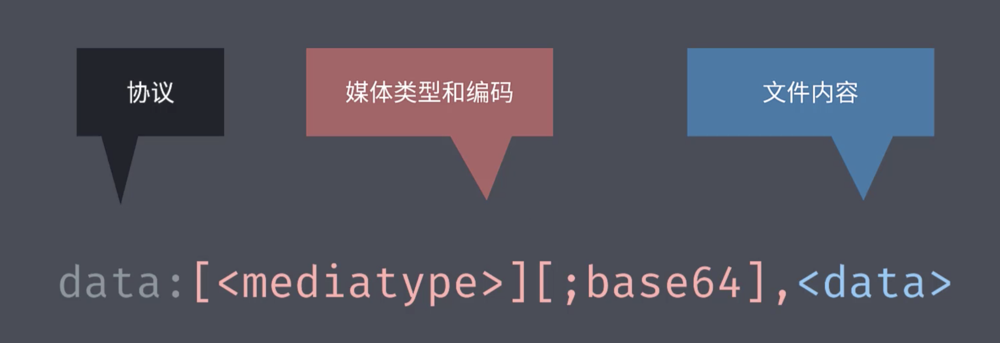
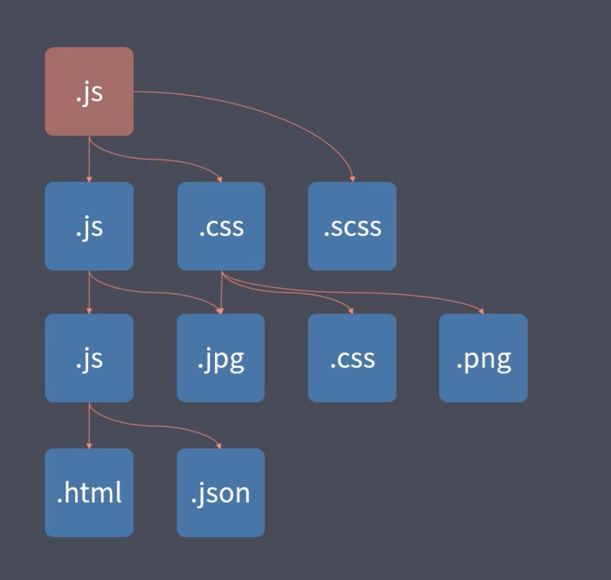

# webpack资源加载

## webpack模块资源加载

webpack不仅仅是js的模块化打包工具, 他应该是前端工程的模块打包工具, 他可以打包前端项目中的任意类型文件

### webpack打包CSS文件

如果说直接修改入口文件为css文件, 然后运行打包命令, 会直接报错, 错误信息是`遇到了非法字符`, 因为webpack内部默认只会处理js文件, 他会将打包过程中所有的文件都当成js来解析。

因此, 处理css文件, 需要特定的`loader(加载器)`, 内部默认只有js的`loader`

因此需要先安装一个`css-loader`

```shell
yarn add css-loader --dev
```

webpack配置如下

```javaScript
module: {
    rules: [
        {
            test: /.css$/,// 表示匹配所有的.css结尾的文件, 也就是匹配所有的css文件
            use: [ 'style-loader', 'css-loader' ]
        }
    ]
}
```

由于webpack默认转换的只有js代码, 也就是说如果没有额外配置的loader, 他默认只有js的loader

如果要设置loader, 就需要在`webpack.config.js`导出的对象中, 添加一个`module`, 然后将配置写入其下的`rules数组`中

rules就是针对其他资源的加载规则配置, 每一个规则对象都有两个属性：

+ 一个test属性, 是正则表达式, 用于匹配打包过程中所遇到的文件路径
+ 一个use属性, 用于表示使用的loader

配置css需要两个loader, `css-loader`和`style-loader`, `css-loader`将css文件转换成一个js模块, 具体实现就是将css代码转换成字符串push到了一个数组中

但如果只使用`css-loader`就会发现, 打包出来的js中, 只有这一串css字符串, 并没有任何一个地方使用它, 因此还需要`style-loader`, 将这一串字符串生成一个style标签挂载到html的header中。

通过设置两个loader就会发现 __webpack_modules__下面多了两个模块, 主要代表的就是css-loader和style-loader模块

css-loader生成的css字符串, 就通过 insertStyleElement函数 创建一个style标签, 挂载到页面中

`rules`下的`use`改成数组后就像是一个栈一样, 先进后出, 先进去的后执行, 因此执行顺序是从右往左

loader是整个webpack实现前端模块化的核心, 通过不同的loader可以实现加载任何类型的资源


## 导入资源模块

上面加载css时, 我们直接将css文件作为了打包入口, 但是一般来说, 打包入口还是应该是js文件

打包入口从某种程度上来说应该是项目的运行入口, 而就现在来说, js才是驱动整个前端应用的核心

因此正确的做法还是用js文件作为入口, 然后通过在js文件中import css的方式来打包css文件

> 问题: 但是传统的做法是将js, css, html分开, 但是webpack又让我们直接在js中引入css, 这是为什么呢？
> 答: `其实webpack不仅仅是建议我们在js中引入css, 而是建议在开发过程中, 去引入任何当前代码所需要的文件, 因为真正需要这个资源的并不是整体的前端应用, 而是此时正在编写的模块。这也是webpack的哲学(哈哈哈哈)`
> 
> 主要为了防止一个问题, 就比如说当前模块需要`xxx.css`文件, 如果添加到整体的项目中而不是模块中, 那么模块中如果不需要这个css文件了, 还需要在项目中移除他, 让简单的事情复杂化了
> 
> 也就是说
> + 根据代码的需要动态导入资源
> + 需要资源的不是应用, 而是代码(模块要正常工作, 就必须加载对应地资源)

js往小了说是完成整个应用的业务功能, 放大了说就是驱动了整个前端应用

如果需要用到样式, 图片等资源文件, 如果建立了这样一种依赖关系, 会有如下好处:

+ 一来逻辑合理, js确实需要这些资源文件(功能需要这些资源的配合来实现)
+ 二来确保上线资源不会缺失, 都是很有必要的

```
建议: 学习新事物, 并不仅仅是使用, 因为照着文档, 都会用。

只有学习他的思想, 明白他为什么要这样设计, 才能有提高和突破
```

## webpack文件资源加载器

目前`webpack`社区提供了非常多的资源加载器, 基本上能想到的所有合理的需求, 都有loader

首先是`文件资源加载器`

大多数加载器都类似上面提到的`css-loader`, 将资源模块转换为js代码的实现方式去工作, 但是还有一些经常使用的资源文件, 比如项目中的图片或者字体等, 没有办法通过js的方式去表示, 对于这些资源文件, 需要用到文件资源加载器————`file-loader`

如果在文件中有一个图片`icon.png`, 按照webpack的思想, 应该在要用到它的地方通过`import`的方式去导入这个图片, 让webpack去处理资源的加载

> 图片的导入需要接收一个默认导出, 因为图片的默认导出就是`打包后图片所在的资源路径`
> 然后需要创建一个image标签, 将它插入到body中
> 安装一个file-loader
> 然后添加规则
> 打包

打包后发现dist下出现了一张图片, 就是使用的哪一个图片, 但是文件名称发生了改变

在`bundle.js`中对图片的处理也很简单, 如下

```javaScript
(__unused_webpack_module, __webpack_exports__, __webpack_require__) => {

__webpack_require__.r(__webpack_exports__);
/* harmony export */ __webpack_require__.d(__webpack_exports__, {
/* harmony export */   "default": () => (__WEBPACK_DEFAULT_EXPORT__)
/* harmony export */ });
/* harmony default export */ const __WEBPACK_DEFAULT_EXPORT__ = (__webpack_require__.p + "36ec3111be91d52e372f6da442eaf229.png");
}
```

这个模块实际上就是图片模块, 然后初始化一下他的`exports`, 为`exports`添加一个默认导出项, 这个默认导出项就是那张图片的地址

上面的`__webpack_require__.p`就是指向了服务器上的生产包对应地放图片的地址, 这里没有任何设置, 就是`localhost:xxxx/dist/`

其实就直接导出了那张图片

入口使用如下: 

```javaScript
var _github_png__WEBPACK_IMPORTED_MODULE_2__ = __webpack_require__(9);
...
img.src = _github_png__WEBPACK_IMPORTED_MODULE_2__.default;
```

入口实际上就是使用了那个导出的文件路径

> 在webpack4.x中, 会出现找不到目标图片的问题, 因为没有设置publicPath, 默认是空字符串, 也就是当前目录, 他不会去dist中找图片, 因此就要出事情
>  
> 不过解决这个问题, 主要就是设置publicPath: 'dist/'(`注意: 这里的'/'不能省略`)
> 
> 但是webpack5.x没有这个问题, 原因在于`__webpack_require__.p`在没有设置`publicPath`的时候, 他有一套计算规则, 如下

```javaScript
/* webpack/runtime/publicPath */
/******/ 	(() => {
/******/ 		var scriptUrl;
/******/ 		if (__webpack_require__.g.importScripts) scriptUrl = __webpack_require__.g.location + "";
/******/ 		var document = __webpack_require__.g.document;
/******/ 		if (!scriptUrl && document) {
/******/ 			if (document.currentScript)
/******/ 				scriptUrl = document.currentScript.src
/******/ 			if (!scriptUrl) {
/******/ 				var scripts = document.getElementsByTagName("script");
/******/ 				if(scripts.length) scriptUrl = scripts[scripts.length - 1].src
/******/ 			}
/******/ 		}
/******/ 		// When supporting browsers where an automatic publicPath is not supported you must specify an output.publicPath manually via configuration
/******/ 		// or pass an empty string ("") and set the __webpack_public_path__ variable from your code to use your own logic.
/******/ 		if (!scriptUrl) throw new Error("Automatic publicPath is not supported in this browser");
/******/ 		scriptUrl = scriptUrl.replace(/#.*$/, "").replace(/\?.*$/, "").replace(/\/[^\/]+$/, "/");
/******/ 		__webpack_require__.p = scriptUrl;
/******/ 	})();
```

这一串就是在自动计算publicPath

> + 首先查看是否设置了`window.importScripts`这个东西, 如果有, 那么`scriptUrl`直接就是字符串类型的当前url(`window.location + ""`会自动转换为当前url的字符串)
> + 一般都是没有设置, 继续走
> + document就是当前的html文档
> + 然后进入判断中, `currentScript`如果存在, 那么`scriptUrl`就是`currentScript.src`
> + 如果不存在, 继续走, 直接获取html中的script标签组成的数组, 赋值给`scripts`
> + 只要存在一个script标签, 那么这个`scriptUrl`就是最后一个`script`标签的`src`属性
> + 然后做一个判断, 如果上述操作还拿不到`scriptUrl`, 说明有问题, 要抛错了
> + 如果拿到了, 就对`scriptUrl`做处理, 正则中的`.`表示匹配除换行符之外的任何单个字符。, `*`表示匹配0次或多次, 也就是滤掉了`?`或者`#`开头的所有东西, `^`在`[]`中表示不接受该方括号表达式中的字符集合, 这一串`replace`过后最终留下的就是服务器路径+script所在的文件路径
> + `/#.*$/`表示匹配`#`开头的任意除换行符之外的字符
> + `/\?.*$/`表示匹配`?`开头的任意除换行符之外的字符
> + `/\/[^\/]+$/`表示匹配以`/`开头且除去`/`之外的所有字符
> + 通过一通操作, 最后剩下的就是一串url之后去掉所有的search和hash之后, 在去掉最后一串`/xxxx`替换成一个`/`, 拼接成的路径, 其实就是最后一个`script`所在的服务器上的文件路径

总结文件加载过程:

1. webpack在打包时遇到图片等文件
2. 然后根据webpack.config.js当中的配置, 匹配对应的文件加载器
3. 然后文件加载器开始工作, 先将导入的文件拷贝到输出的目录
4. 然后在`__webpack_modules__`中定义相应的文件模块, 然后将导出路径设置为`__webpack_require__.p + 输出路径中该文件对应地文件名`
5. 其中`__webpack_require__.p`在设置了`publicPath`的情况下就是`publicPath`的值, 如果没有设置, 就采用上述算法, 一般是最后一个`script标签`所在的文件路径
6. 这样对于应用来说, 所需要的应用资源就发不出来了, 同时可以通过模块的导出成员拿到模块的导出路径

## webpack URL加载器

除了`file-loader`这种通过拷贝物理文件的形式去处理文件的方式以外, 还有一种通过`data-url`的方式去表示文件, 这种方式也非常常见。

`Data Urls`是一种特殊的url协议, 可以用来直接去表示一个文件(base64)

传统的url一般要求服务器上要求有一个对应地文件, 然后通过请求这个地址, 得到服务器上对应地文件

而`data url`是一种当前url就可以直接去表示文件内容的一种方式, 这种url当中的文本, 就已经包含了文件的内容, 这种url在使用的时候不用去发送一个http请求



比如这样一段url: `data:text/html;charset=UTF-8,<h1>hello world</h1>`

浏览器可以直接解析出来, 内容是一段包含`h1`标签的html代码, `charset`是utf-8

如果是图片或者字体这一类无法直接通过文本去表示的二进制类型文件, 可以直接将文件内容通过base64编码, 然后将base64编码的结果通过一段url去标识文件的内容, 比如

`data:image/png;base64,内容`

这一串url就可以用于表示一个`png`类型的文件, 一般情况下, base64比较长

webpack在加载资源模块时同样可以使用这种方式去实现, 通过`dataUrl`可以通过代码的方式表示任何文件

先要安装一下`url-loader`

安装完成后, 打开`webpack`配置文件, 找到之前使用的`file-loader`

这样打包出来, 在图片模块中, 直接 `__WEBPACK_DEFAULT_EXPORT__`就是一串`base64代码`(很长), 并且不会在有一个图片文件了

当然这种方式适合项目中体积小的资源, 毕竟资源大了之后, 打包结果就会变得非常大, 影响运行速度

因此应该做如下设置:

+ 小文件使用Data Urls, 减少请求次数
+ 较大文件依然通过单独提取存放, 提高加载速度

这里可以作如下设置达到上面的需要:

```javaScript
{
    test: /.(jpg|png|gif|bmp|jpeg)$/,
    use: {
        loader: 'url-loader',
        // 其实所有的loader都可以通过这种方式去配置
        options: {
            limit: 10 * 1024, // 10kb大小限制, 这样之后大于10kb的依然会使用file-loader
        }
    }
}
```
> 注: 这种方式一定不要忘了安装`file-loader`, 因为`url-loader`对超出的文件依然会使用`file-loader`

## webpack 常用资源加载器分类

资源加载器有点像工厂里的生产车间, 用来处理和加工打包过程中的资源文件

常用loader大致分为三类(个人觉得):

+ 编译转换类: 将加载到的资源文件, 转换为js代码, 例如`css-loader`, 将css代码转换为一个模块
+ 文件操作类: 将加载到的资源模块, 拷贝到输出目录, 同时向外导出这个文件的访问路径, 比如`file-loader`
+ 代码检查类: 一般用于校验代码, 统一代码风格, 提高代码质量, 一般不会修改生产包的代码

## webpack编译 ES2015

很多人都认为webpack会自动编译ES Next到es5, 但实际上并不会, 它仅仅是对模块完成打包工作, 所以他才会对代码中的import和export做转换, 但除此之外, 其他的特性他并不会转换, 从打包出来的bundle.js来看, 使用的`箭头函数`和`const关键字`都么有被处理

如果需要转换`ES Next`, 那需要额外的配置一个编译用`loader`, 常见的就是`babel-loader`

`babel-loader`需要babel的核心模块, 以及转换用的插件, 毕竟`babel`只是一个转换js代码的平台, 他还需要运行在上面的插件来对js代码做转换

```javaScript
{
    test: /.js$/,
    use: {
        loader: "babel-loader",
        options: {
            presets: ['@babel/preset-env']
        }
    }
},
```

总结:

+ webpack只是一个打包工具, 不会处理`esNext`的新特性, 如果要处理, 需要使用`loader`
+ 加载器可以用来编译转换代码

## webpack模块加载的方式

1. 遵循ES Modules 标准的 import 声明

这是一直在用也是最常用的一种方式

2. 遵循 CommonJS 标准的 require函数

当然, 如果通过`require()`载入一个 esmodule, 获取default, 需要这样操作

```const def = require('./heading').default```

3. 遵循 AMD 标准的 define函数 和 requrie函数

也就是说webpack兼容各种模块化标准, 当然, 除非必要情况, 不要混合使用这些标准.

除了上述三种方式以外, 还有一些独立的加载器, 在工作时, 也会去处理加载到的资源中的导入模块, 也就是说: loader加载的非js也会触发资源的加载

4. css的`@import`

比如`css-loader`加载css文件, 在css文件中的`@import`指令和url函数, 也会触发相应的函数加载, 还有HTML代码中图片的src属性, 也会触发资源加载。

例如一段css代码如下所示:

```css
body {
    margin: 0 auto;
    padding: 0 20px;
    max-width: 800px;
    background: #f4f8fb;
    background-image: url(./background.png);
    background-size: cover;
}
```

当他使用css-loader处理图片时, 遇到有一个url()函数载入图片, 他就会将这个图片作为资源模块加入到打包过程, webpack会根据配置文件中, 针对遇到的文件找到相应的loader, 也就是说用上面设置的url-loader去处理这个图片

除了`url()`函数, 还有`@import`指令, 也会触发资源的加载

5. html中img标签的`src`属性和a标签的`href`属性
html当中, 也有引用其他资源的可能性。

> + `import "xx.html"`会得到一个html字符串, 因为要接收一下
> + 可以打印出来, 会发现他就是个字符串, 同时内部的src属性也会触发资源的加载, 可以看到在dist目录下又多创建了一个图片(尽管是重复的)
> + 但是不能使用write去添加, 这样会报提示错误, 并且添加不进去(webpack5.x)
> + 并且其他标签也会触发资源加载, 比如a标签的href属性, 但是默认情况下是不处理的
> + 因此需要添加options, 配置`attrs`属性(webpack4.x)
> + 现在的`html-loader`已经移除`attrs`属性, 并且也没有`attributes`
> + 应当使用`sources`属性, 但是目前还不支持a标签的任何属性(不过本身a标签的作用应该用于跳转, 而不是引用模块, 毕竟他跳转的目标模块一定是打包过的)

```javaScript
options: {
    // attrs: ['img:src', 'a:href']
    sources: {
        list: [
            {
                tag: 'img',
                attribute: 'src',
                type: 'src',
            },
        ]
    },
}
```

总结:
也就是说几乎代码中所有需要引用到的资源, 或者说有可能性的地方, 都会被webpack找出来, 交给不同的loader去处理, 然后整体打包到目录, webpack, 就是基于这样的特点实现整个项目的模块化

## webpack核心工作原理

其实webpack官网就已经很清楚的描述了webpack的核心工作原理。

以一个普通的前端工程为例, 在项目中一般都会散落着各类代码以及资源文件, 比如js, png, jpg, css, html, less, scss等

webpack会根据我们的配置, 找到一个文件作为入口, 然后顺着入口文件中的代码, 根据代码中出现的`import`或者`require`语句, 解析推断出文件所依赖的资源模块, 分别去解析每个资源模块对应地依赖, 最终形成一个整个项目中表示依赖关系的`依赖树`(依赖树如下图)



有了整个依赖树后, webpack会根据递归遍历这颗树, 找到每一个资源文件, 最后再根据webpack.config.js下配置中的rules属性, 去找到每一个文件所对应的资源加载器(loader), 交给对应地加载器去加载模块, 最后会将加载后的结果, 放入bundle.js中, 完成整个项目的打包。

因此, webpack的核心就是`loader`, 如果没有各种各样的loader, 他就无法实现各类资源文件的加载, 对于webpack来说他就只能算是一个打包或者合并js代码的工具了。

