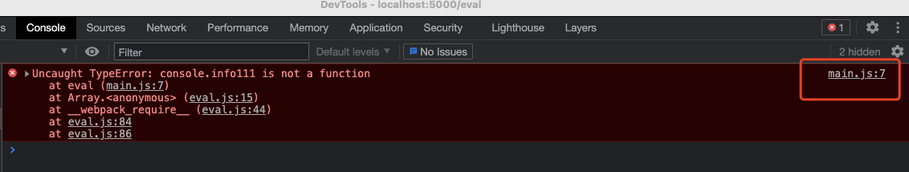
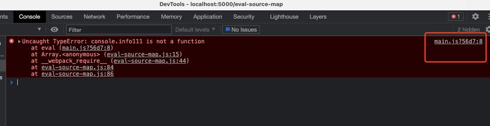
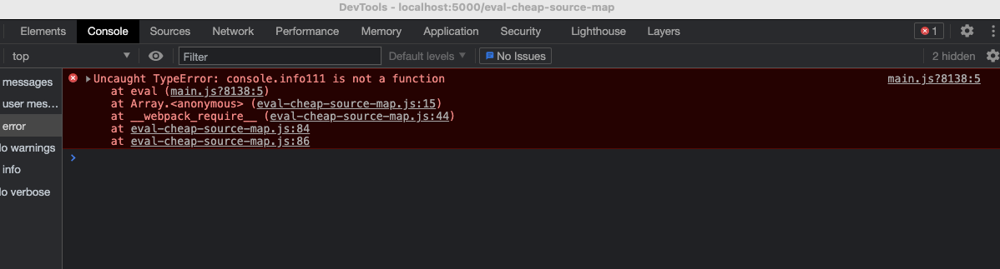
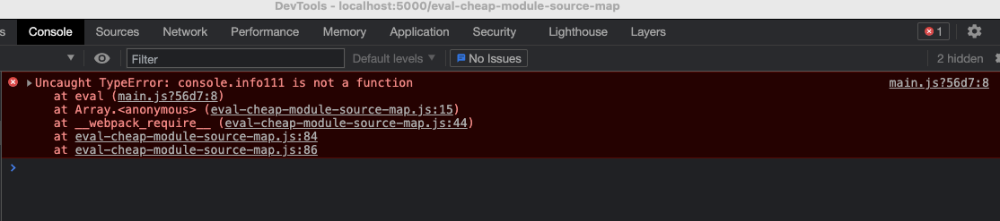

# Source Map

通过构建编译之类的操作, 我们可以将开发阶段的原代码转换为能够在生产中运行的代码

当然, 这样也就造成了运行代码与源代码之前是完全不同的

如果需要调试应用, 或者是生产环境上出现错误无法定位(错误定位困难)

主要就是因为我们的`报错`和`调试`都是基于转换后的代码进行的

Source Map就是解决这类问题最好的办法, 这个名字翻译过来就很直接, 叫做`源代码地图`,  他的作用就是:

```映射源代码和转换后代码之间的一个关系```

一段转换后的代码, 通过转换过程中生成的Source Map文件就可以逆向得到源代码

目前很多第三方的库, 发布的文件中, 都有一个.map后缀的 Source Map文件, 内部记录的就是转换后的代码和源代码之间的映射关系

里面有几个属性:

## 映射文件.map下的属性

### version

所使用的Source Map标准的版本 

### Sources

记录的是转换之前的源文件名称, 由于可能是多个文件, 转换成一个文件, 因此这个属性是一个数组

### names

指的是源代码中使用的一些成员名称

压缩代码时, 将开发阶段指定的有意义的变量名转换成简短的字符, 从而去压缩整体的体积, 这个属性中记录的就是原始对应的名称

### mappings

这个就是整个Source Map的核心属性, 是一个Base64-VLQ编码的一个字符串, 记录的就是转换过后代码中的字符和源代码的映射关系

有了它过后, 我们就可以在转换后的代码中, 通过引入一行注释来引入Source Map这个文件

## SourceMap的意义

它主要是为了调试错误的, 实际上对生产并没有太大的意义

通过添加注释的方式引入, 这个注释就是如下格式

```javaScript
//# SourceMappingURL=xxx.map
```

只要浏览器加载的js文件最后有一行这个注释, 他就会自动的去请求这个SourceMap文件, 根据文件的内容, 逆向解析源代码, 便于调试

SourceMap作用如下:

> + 如果出现了错误, 就很容易对应到源代码的位置了
> + 可以断点调试源代码, 而不用去看生产代码了
> + 解决了源代码与运行代码不一致产生的调试问题

## webpack配置 Source Map

webpack的打包过程同样支持为打包结果生成对应的Source Map文件, 用法上也非常简单, 提供了很多模式

### devtool

需要配置devtool, 这个属性就是配置开发过程中的辅助工具

可以直接将它设置为`source-map`

然后执行打包命令, 就会发现出现了一个bundle.js.map的文件, 并且在bundle.js最后引入了这个文件

当然, 这样简单的使用对实际效果还差的比较远, 截止到目前为止(webpack5.x), webpack支持26种不同的方式

每种方式生成的效果和速度都不一样(每种方式的效率和效果各不相同)

一般速度快的用处不是特别大, 要找一个适合的, 才是最重要的

### webpack的Source Map下的各种模式

在文档中有一个不同模式的对比表, 并且在`webpack5.x`只能按照这个表中devtool描述的顺序来设置devtool的值

这个表分别列出了`初次构建速度`, `更新后重新构建速度`, `是否能在生产中使用`, `质量`以及`webpack给出的评价`

去对比了他们的差异

当然, 其中的体验, 还是要自己去体悟才会明白个中区别

#### eval模式

eval是js中的一个函数, 可以用来执行字符串的js代码, 这段代码会运行在一个临时的虚拟机环境中

可以通过sourceURL来声明这段代码, 就像是上面使用SourceMap的那段注释一样, 放在字符串的最后, 他就会运行在目标js文件中

比如

```javaScript
eval('console.info(123) // # sourceURL=./foo/bar.js');
```

这段代码运行位置就变成了`./foo.bar.js`

也就是说可以通过sourceURL改变运行的环境名称, 当然, 他还是运行在虚拟机中, 只是告诉了执行引擎这段js所属的路径, 只是个标识

> !只是个标识!只是个标识!只是个标识
> 
> 还是在虚拟机中

接下来设置为eval, 执行打包操作, 发现打印的文件点击进去, 看到的是打包后的模块代码

因为`eval`模式并不会输出一个.map文件, 而是将所有的模块所转换出的代码都转换成了使用eval去执行, 并且在最后通过这种注释的方式去告诉浏览器这段代码所标识的路径在哪里

比如这样:

```javaScript
/* 0 */
 ((__unused_webpack_module, __webpack_exports__, __webpack_require__) => {

eval("__webpack_require__.r(__webpack_exports__);\n/* harmony import */ var _main_css__WEBPACK_IMPORTED_MODULE_0__ = __webpack_require__(1);\n// import createHeading from './heading.js';\n// // import conSomething from './testExport.js';\n// import './main.css';\n// import url from './github.png';\n// const heading = createHeading();\n// document.body.append(heading);\n// const img = new Image();\n// img.src = url;\n// document.body.append(img);\n// ! 部分loader加载的资源中一些方法也会触发资源模块加载\n // import footerHtml from './footer.html';\n// document.write(footerHtml);\n\n//# sourceURL=webpack://01/./src/main.js?");

 }),
```

这第一个模块就是标识他在`./src/main.js`中

这样浏览器就知道这段代码所对应的源代码是哪个文件了, 从而去实现定位错误的文件


> 这种模式只能定位文件, 不能定位行列
> 
> 他不会输出.map， 因此他的速度最快

### 不同devtool模式对比

#### 第一步, 输出文件

webpack.config.js支持我们输出一个数组, 用于表示不同的配置, 因此可以一次编译这25种文件, 来做一次对比

webpack.config.js如下:

```javaScript
const allModes = [
    'eval',
    // 'cheap-eval-source-map', // 这两个不能用了
    // 'cheap-module-eval-source-map',
    'eval-source-map',
    'cheap-source-map',
    'cheap-module-source-map',
    'inline-cheap-source-map',
    'inline-cheap-module-source-map',
    'source-map',
    'inline-source-map',
    'hidden-source-map',
    'nosources-source-map',
    // 往后版本新增
    'eval-nosources-cheap-source-map',
    'eval-cheap-source-map',
    'eval-cheap-module-source-map',
    'eval-nosources-cheap-module-source-map',
    'eval-nosources-source-map',
    'inline-nosources-cheap-source-map',
    'inline-nosources-cheap-module-source-map',
    'inline-nosources-source-map',
    'nosources-cheap-source-map',
    'nosources-cheap-module-source-map',
    'hidden-nosources-cheap-source-map',
    'hidden-nosources-cheap-module-source-map',
    'hidden-nosources-source-map',
    'hidden-cheap-source-map',
    'hidden-cheap-module-source-map',
]; // 数组中每一个成员就是devtool配置取值的一种

const path = require("path");

const HtmlWebpackPlugin = require('html-webpack-plugin');

// * webpack的配置对象可以是一个数组, 数组中每一个元素就是一个单独的打包配置, 这样就可以在一次打包过程中, 同时执行多个打包任务
module.exports = allModes.map(item => {
    return {
        devtool: `${item}`,
        mode: 'none',
        entry: './src/main.js',
        output: {
            filename: `js/${item}.js`
        },
        module: {
            rules: [
                {
                    test: /\.js$/,
                    use: {
                        loader: "babel-loader",
                        options: {
                            // * 主要为了辨别不同模式之间的差异
                            presets: ['@babel/preset-env']
                        },
                    },
                    exclude: path.join(__dirname, 'node_modules')
                }
            ]
        },
        plugins: [
            new HtmlWebpackPlugin({
                filename: `${item}.html`
            })
        ]
    }
})
```

配置babel主要是为了区别不同模式之间的差异

如果不输出到一个单独的目录下, 那么这里混合的文件就会非常的多, 对比极其不容易

#### 第二部, 对比差异

这里先看几个典型的模式

+ `eval`

就是上面所说的eval, 将模块代码放到`eval`函数中执行, 并且通过`sourceURL`标注文件路径, 他没有`Source Map`, 只是标注了是哪一个文件出错(行列信息是错误的)



+ `eval-source-map`

同样也是使用eval执行模块代码, 不过他处理定位错误出现的文件, 还可以定位具体的行和列的信息, 并且他生成了`Srouce Map`



+ `eval-cheap-source-map`

该模式就是在eval-source-map之上加了一个cheap, 也就是生成了一个阉割版的sourceMap, 只有行信息, 没有列信息, 少了点信息, 但是生成速度快了很多



+ `eval-cheap-module-source-map`

这个模式就是在eval-cheap-source-map的基础上多了一个module, 也只能定位到行, 但是他定位的文件没有被`babel`翻译过



> 总结:
> 
> 其实有了上面的模式, 其他的模式基本上就没有太大的区别了, 就是针对这几个基础模式做了排列组合, 但是从webpack5.x开始, 必须遵循官方给出的特定顺序, 不能自己乱排序
> 
> + `eval`: 是否使用eval执行模块代码
> 
> + `cheap`: Source Map是否包含行信息
> 
> + `module`: 是否能够找到Loader处理之前的源代码
> 
> + `inline`:  以dataUrl的方式嵌入Source Map文件, 而不是物理文件(和eval略像, eval是字符串, 个人觉得最不好用, 因为dataURL会导致源代码体积大很多)
> 
> + `hidden`: 开发工具中看不到Source Map的效果, 但是确实生成了Source Map文件, 但是代码中不引入(上线的包有用)
> 
> + `nosources`: 能看到错误出现的位置, 但是点击错误信息, 点进去看不到源代码, 只提供行列信息, 在生产中保护源代码不被暴露

比如还有一个模式叫做`cheap-source-map`, 他就是没有用eval执行代码, 并且包含了行信息, 但是是编译过后的型号


## 选择一个合适的Source Map模式

一般开发的时候只用得上几种, 实际上不会有太多的选择, 这里推荐几种汪大佬的选择

### 开发环境

eval-cheap-module-source-map

原因如下:

+ 代码每行不超过80个字符, 因此不需要定位到列
+ 使用框架情况很多, 经过loader转换过后的差异较大, 肯定要使用转换前的源代码
+ 虽然首次打包速度比较慢, 但是重新打包相对较快

### 生产环境

none

> 主要就是Source Map会暴露源代码, 因此生产不能暴露任何源代码
> 
> 调试是开发阶段的事情, 应该在开发阶段尽可能的找出来, 而不是全民测生产
> 
> 如果对代码没有信心, 也应该尽量选择nosources-source-map

不应该寻找通用法则, 而是要理解不同模式的差异, 适配不同的环境


