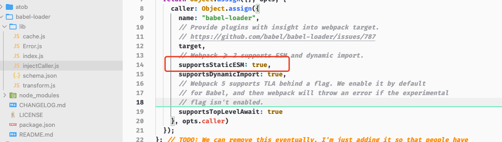
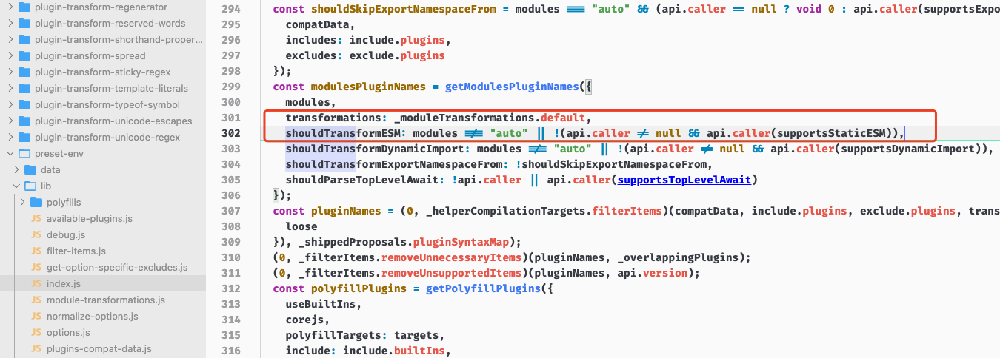

# 优化生产环境

前面所有的开发环境的体验提升, 都会导致生产包变得越来越臃肿

这是因为, webpack为了实现这些特性, 会自动往输出结果中, 添加额外代码, 比如`Source Map`和`HMR`

但是这些额外的代码, 对于生产环境来说是冗余的

生产环境和开发环境有很大的差异, 生产注重运行效率(需要更少量更轻量的代码)

但是开发环境我们更注重方便, 一切为了提高开发效率

针对这个问题, webpack4.x提出了`模式(mode)`, `production`这个选项就已经做了大量的处理

同时webpack也建议为不同的工作环境创建不同的配置, 以便于让打包结果适用于不同环境

## 不同环境下的配置

先尝试为不同的工作环境创建不同的配置

方式有两种:

1. 配置文件根据环境不同导出不同的配置(process.env可以判断环境)
2. 一个环境对应一个配置文件(确保每个环境有一个对应的文件)

### 方式一. 配置文件根据环境不同导出不同的配置

webpack配置文件, 支持导出一个函数, 在函数中, 返回配置对象, 接收两个参数, 一个是`env`, 一个是`argv`

`env`是通过cli传递的运行环境名参数

`argv`是运行cli过程中所传入的所有参数

运行的时候使用`yarn webpack --env production`, 这就相当于在给webpack传递了一个env的参数, 就是production

此时接收到的`env`就是`{ WEBPACK_BUNDLE: true, WEBPACK_BUILD: true, production: true }` 

如果是development就是 `{ WEBPACK_BUNDLE: true, WEBPACK_BUILD: true, development: true }` 

如下所示:

```javaScript
module.exports = (env, argv) => {
    console.info(env)
    const config = {
        // 开发模式变量
        entry: './src/main.js', // 入口文件, 如果是一个相对路径, 前面的./是不能省略的
        output: { // output设置输出文件的配置, 该属性是一个对象
            filename: 'bundle.js', // 设置输出文件名称
            path: path.join(__dirname, 'dist'), // path执行文件输出所在的目录, 他必须使用绝对路径, 默认就是dist
            // publicPath: '/'
        },
        mode: 'none',
        devtool: 'eval',
        module: { // 使用loader需要添加具体的配置, 就是在webpack.config.js中添加一个module, 下面配置rules数组
            // rules就是针对其他资源的加载规则配置, 每一个规则对象都有两个属性：
            // 一个test属性, 是正则表达式, 用于匹配打包过程中所遇到的文件路径
            // 一个use属性, 用于表示使用的loader
            rules: [
                {
                    test: /.js$/,
                    use: {
                        loader: "babel-loader",
                        options: {
                            presets: ['@babel/preset-env']
                        },
                    },
                    exclude: path.join(__dirname, 'node_modules')
                },
                {
                    test: /.css$/,// 表示匹配所有的.css结尾的文件, 也就是匹配所有的css文件
                    use: [
                        // 改成数组后, 配置多个loader, 执行是从后往前执行, 就像一个栈一样, 先进后出, 最先进去的最后执行
                        'style-loader', 'css-loader'
                    ] // cssloader的作用就是将css文件转换成一个js模块, 具体实现就是将css代码转换成字符串push到了一个数组中
                    // 但是单纯向上面这样只使用一个css-loader就会发现没有任何代码引用这一串字符串
                    // 因此这里还需要一个style-loader, 就是将css的字符串通过style标签放到页面上
                    // 通过设置两个loader就会发现 __webpack_modules__下面多了两个模块, 主要代表的就是css-loader和style-loader模块
                    // css-loader生成的css字符串, 就通过 insertStyleElement函数 创建一个style标签, 挂载到页面中
                },
                {
                    test: /.(jpg|png|gif|bmp|jpeg)$/,
                    use: {
                        loader: 'url-loader',
                        // 其实所有的loader都可以通过这种方式去配置
                        options: {
                            limit: 10 * 1024, // 10kb大小限制, 这样之后大于10kb的依然会使用file-loader
                            // 这种方式是默认使用file-loader, 因此一定不要忘了安装file-loader
                        }
                    }
                },
                {
                    test: /.html$/,
                    use: {
                        loader: 'html-loader',
                        options: {
                            // attributes: ["img:src", "a:href"], // 目前已弃用这种方式
                            sources: {
                                list: [
                                    {
                                        tag: 'img', // 标签名
                                        attribute: 'src', // 挂载标签上的属性名
                                        type: 'src', // 属性名对应地原类型
                                    },
                                ]
                            },
                            minimize: process.env === 'production' ? true : false,
                            esModule: true
                        }
                    },
                    exclude: path.join(__dirname, 'index.html')
                }
            ]
        },
        plugins: [ // 配置插件的数组
            new HtmlWebpackPlugin({
                title: 'webpack学习',
                filename: 'index.html',
                template: 'index.html',
                inject: 'body',
                // meta: {
                //     viewport: 'width=device-width'
                // }
            }),
            // new CopyWebpackPlugin({
            //     patterns: [
            //         { from: "src/favicons", to: "dest" },
            //     ],
            // }),
            new myPlugin(),
            new webpack.HotModuleReplacementPlugin()
        ],
        devServer: {
            http2: true,
            hot: true,
            // open: true,
            // https: true,
            contentBase: [
                path.join(__dirname, 'src/favicons')
            ], // 可以是字符串, 也可以是数组
            proxy: {
                '/api': {
                    // 也就是说请求 localhost:3000/api/users -> https://api.github.com/api/users
                    target: 'https://api.github.com',
                    // 但是在https://api.github.com的接口中并没有/api, 因此需要添加一层代理路径的重写
                    pathRewrite: {
                        '^/api': "", // 这个属性最终会生成一个正则去匹配上面的路径
                    },
                    // ws: true,
                    // timeout: 9999999999,
                    // 不能使用localhost:3000作为请求 github 的主机名
                    // 主机名由于服务端判断请求应该走哪一个网站, 设置changeOrigin为true, 就会将代理请求作为实际的主机名去请求
                    changeOrigin: true,
                }
            }
        }
    }
    if (env.production) {
        // env.production 已经不再是以前那种直接就是值了, 而是确定下面的production是否为true
        console.info("123")
        config.mode = 'production';
        config.devtool = false;
        config.plugins = [
            ...config.plugins,
            // 这里添加clean-webpack-plugin和copy-webpack-plugin, 这两个就是之前说的开发阶段可以省略的插件
            new CleanWebpackPlugin(),
            new CopyWebpackPlugin({
                patterns: [
                    { from: "src/favicons", to: "dest" },
                ],
            })
        ]
    }
    return config;
}
```

当然, 也可以在全局做判断, 根据不同的环境, 导出不同的配置

### 方式二. 不同环境对应不同的配置文件

方式一只适合中小型项目, 如果一旦项目变得复杂, 那么配置文件也会一起变得复杂起来

一般我们都有三个webpack配置文件, 其中有两个用于适配不同的环境, 另一个是公共配置, 因为开发和生产, 并不是所有的都不同

生产和开发需要合并common的配置, 这里使用`webpack-merge`这个模块提供的`merge`函数, 毕竟使用原生方法, 对于引用类型的合并不好操作(当然也可以自己写一个, 也可以使用lodash.merge函数)

并且在使用的时候要使用`--config webpack.prod.js`去指定对应的配置文件

```javaScript
// common
const path = require('path');
const HtmlWebpackPlugin = require('html-webpack-plugin'); // 载入HtmlWebpackPlugin, 他不需要解构, 默认导出就是
const webpack = require('webpack');

class myPlugin {
    // 定义一个类, 然后定义一个apply方法
    apply(compiler) {
        // apply方法会在webpack启用时, 自动被调用
        // 接收一个compiler对象参数, 这个对象就是webpack工作过程中的核心对象, 包含了此次构建的所有配置信息, 也是通过这个对象去注册钩子函数
        // 这里编写一个插件用于去除打包过程后bundle.js下所有的注释, 因此, 这个过程应该是在bundle.js出现后实施
        // emit在 输出 asset 到 output 目录之前执行(就是即将往输出目录输出文件)
        // ! 通过compiler.hooks.emit去访问到这个钩子, 通过tap方法去注册函数
        // ! tap方法接收两个参数, 第一个是插件名称, 第二个就是挂载到这个钩子上的函数了
        compiler.hooks.emit.tap("myPlugin", compilation => {
            // * compilation这个对象可以理解成此次打包过程中的上下文, 打包结果都会放到这个对象中
            // assets是即将写入目录中的资源文件信息, 是一个对象, 键名是文件的名称
            for (const name in compilation.assets) {
                // 通过source方法可以拿到对应地内容
                // 需求是做一个去除bundle.js注释的插件, 因此要判断文件名
                if (name.match(/.js$/)) {
                    // console.info(compilation.assets[name].source())
                    // 然后进行处理
                    const contents = compilation.assets[name].source();
                    const withoutComments = contents.replace(/\/\*\*+\*\//g, "");
                    // 处理完成后, 需要去替换compilation.assets下的对应地内容
                    compilation.assets[name] = {
                        source: () => withoutComments, // 依然使用一个source方法去暴露
                        size: () => withoutComments.length, // 还需要一个size方法, 去返回一个内容的大小, 这个是webpack要求的所必须的方法
                    }
                }
            }
        })
    }
}

module.exports = {
    // 开发模式变量
    entry: './src/main.js', // 入口文件, 如果是一个相对路径, 前面的./是不能省略的
    output: { // output设置输出文件的配置, 该属性是一个对象
        filename: 'bundle.js', // 设置输出文件名称
        path: path.join(__dirname, 'dist'), // path执行文件输出所在的目录, 他必须使用绝对路径, 默认就是dist
        // publicPath: '/'
    },
    mode: 'none',
    devtool: 'eval',
    module: {
        rules: [
            {
                test: /.js$/,
                use: {
                    loader: "babel-loader",
                    options: {
                        presets: ['@babel/preset-env']
                    },
                },
                exclude: path.join(__dirname, 'node_modules')
            },
            {
                test: /.css$/,
                use: [
                    'style-loader', 'css-loader'
                ]
            },
            {
                test: /.(jpg|png|gif|bmp|jpeg)$/,
                use: {
                    loader: 'url-loader',
                    options: {
                        limit: 10 * 1024,
                    }
                }
            },
            {
                test: /.html$/,
                use: {
                    loader: 'html-loader',
                    options: {
                        // attributes: ["img:src", "a:href"], // 目前已弃用这种方式
                        sources: {
                            list: [
                                {
                                    tag: 'img', // 标签名
                                    attribute: 'src', // 挂载标签上的属性名
                                    type: 'src', // 属性名对应地原类型
                                },
                            ]
                        },
                        minimize: process.env === 'production' ? true : false,
                        esModule: true
                    }
                },
                exclude: path.join(__dirname, 'index.html')
            }
        ]
    },
    plugins: [ // 配置插件的数组
        new HtmlWebpackPlugin({
            title: 'webpack学习',
            filename: 'index.html',
            template: 'index.html',
            inject: 'body',
        }),
        new myPlugin(),
        new webpack.HotModuleReplacementPlugin()
    ],
    devServer: {
        http2: true,
        hot: true,
        // open: true,
        // https: true,
        contentBase: [
            path.join(__dirname, 'src/favicons')
        ], // 可以是字符串, 也可以是数组
        proxy: {
            '/api': {
                // 也就是说请求 localhost:3000/api/users -> https://api.github.com/api/users
                target: 'https://api.github.com',
                // 但是在https://api.github.com的接口中并没有/api, 因此需要添加一层代理路径的重写
                pathRewrite: {
                    '^/api': "", // 这个属性最终会生成一个正则去匹配上面的路径
                },
                // ws: true,
                // timeout: 9999999999,
                // 不能使用localhost:3000作为请求 github 的主机名
                // 主机名由于服务端判断请求应该走哪一个网站, 设置changeOrigin为true, 就会将代理请求作为实际的主机名去请求
                changeOrigin: true,
            }
        }
    }
}

// prod
const common = require('./webpack.common');
const CopyWebpackPlugin = require('copy-webpack-plugin');
const { CleanWebpackPlugin } = require("clean-webpack-plugin"); // 这个模块解构出来一个CleanWebpackPlugin, 就是用于清除dist目录的插件
const { merge } = require('webpack-merge');

// 使用Object.assign会后项完全覆盖前项相同键名的属性, 但是对于引用类型, 我们只希望做添加, 而不是完全覆盖
// 所以Object.assign并不合适, 可以使用lodash.merge, 不过社区中提供了专用的webpackMerge这个库
module.exports = merge(common, {
    mode: "production",
    plugins: [
        new CleanWebpackPlugin(),
        new CopyWebpackPlugin({
            patterns: [
                { from: "src/favicons", to: "dest" },
            ],
        }),
    ],
    devtool: false
})
```

## DefinePlugin

webpack4新增了很多开箱即用优化配置, 用起来很爽, 但是要了解原理, 会让我们无从下手, 因此如果我们要深入了解, 还是要单独研究一下背后的作用

第一个就是这个插件`DefinePlugin`

为代码注入全局成员, 这个东西默认会启用起来, 并且注入了一个叫做`process.env.NODE_ENV`的变量, 很多模块都是通用这个成员去判断运行环境, 决定是否执行打印日志等操作

这个插件的构造函数接收一个对象, 对象的每一个键值, 都是往process.env中注入的东西

使用如下:

```javaScript
new webpack.DefinePlugin({
   // 注入api服务地址
   API_BASE_URL: 'https://api.example.com'
)
```

找到打包结果, 可以发现他其实就是把注入成员的值, 直接替换到了代码中

```javaScript
// main.js
console.info(API_BASE_URL);

// bundle.js
console.info(https://api.example.com);
```

会发现有点问题, 因为没有引号了, 因为他要求的实际上是传递一段js的代码片段, 并不是用于传值的

需要修改为 `API_BASE_URL: '"https://api.example.com"'`

当然, 如果要传值, 最好的方式还是使用`JSON.stringify()`处理一波

> 结论: 有了这个插件, 我们可以注入任何我们想要的一些特殊字段

## Tree-shaking

字面意思就是摇树，伴随这一个摇树的动作, 树上的枯树枝等就会落下来

这里的tree-shaking就是`摇掉`代码中未引用的部分

这部分代码有一个专业术语叫做`未引用代码(dead-code)`

他可以自动检测出未引用的代码, 并移除他们

这个功能会在生产环境下自动开启

### 使用tree-shaking

需要注意的是, tree shaking不是指某个配置选项, 他是一组功能搭配使用过后的效果, 这个功能会在production模式下自动开启

如果在其他模式下手动开启tree-shaking

可以添加一个`optimization`属性， 这个属性就是集中配置webpack中优化功能的属性

我们只需要配置两个成员, `usedExports`用于标记未使用的成员, `minimize`压缩代码(去除未使用的成员)

```javaScript
optimization: {
    usedExports: true,
    minimize: true
}
```

可以将`usedExports`比作标记枯树枝, `minimize`负责「摇掉」他们


## webpack合并模块

除了`usedExports`以外, 还可以使用`concatenateModules`继续优化输出, 普通的打包结果, 是将每一个模块单独放在一个函数当中, 也就是说如果我们的模块很多, 也就意味着我们在输出结果中会有很多这样的模块函数

先对上面的配置做修改

```javaScript
optimization: {
    usedExports: true,
    // minimize: true
    concatenateModules: true,
}
```

该属性尽可能的将所有模块全部合并到一起输出到一个函数中, 及提升了运行效率, 又减少了代码的体积

这个特性叫做Scope Hoisting(作用域提升), webpack3.x新增

## Tree-shaking&Babel

有些东西根据版本的不同, 变化较大, 对于`Tree-shaking`来说更是如此, 有的说配置了Babel之后, Tree-shaking会失效

其还是Tree-shaking的实现, 前提是必须使用ES Module, 由Webpack打包的代码必须使用ESM

webpack在打包模块之前, 现将模块交给loader去处理, 然后再将所有loader处理的结果, 打包到一起

为了转换代码中的ECMAScript的新特性, 很多时候我们都会选择`babel-loader`处理JS, 而babel处理js代码的过程中, 就看会把`ES MOdules`转换为`CommonJS`, 具体要看有没有转换插件

比如上面使用的`@babel/preset-env`这个插件, 一般来说, 使用之后, preset-env就会将代码中的ES Module转换为CommonJS, 那webpack在此打包时, 拿到的就是CommonJS组织的代码, 那么tree-shaking就会失效

但实际上, 我们的tree-shaking并没有失效

实际上就是在最新版本的babel-loader中, 就关闭了ESModule转换为CommonJS这个功能

如下:

这里就标识了babel支持ES Modules





因此, 最新版的babel-loader, 会根据配置去看是否转换, 默认是根据环境识别, 所以webpack打包的时候, 还是ES Module的代码

其实也可以通过配置去控制, 如下配置preset-env

```javaScript
use: {
    loader: 'babel-loader',
    options: {
        presets: [
            ["@babel/preset-env", { modules: 'commonjs' }]
        ]
    }
}
```

这样就强制转换成commonJS了

一般情况下这里是这样``` ["@babel/preset-env", { modules: 'auto' }]```, 就是交给环境去判断

因此, 最新版本的babel-loader, 并不会导致esmodule失效

## sideEffects(副作用)

webpack4.x新增内容, 可以通过配置的方式去标识代码是否有副作用, 从而为tree-shaking压缩更大的空间

副作用: 模块执行时除了导出成员之外所做的事情

sideEffects一般用于npm包标记是否有副作用

由于官网中将sideEffects的介绍和tree-shaking混到了一起, 所以很多人以为他们关系很紧密, 实际上他们没有什么关系

比如这样一个场景

一个components下面有一个index.js文件, 然后所有的导出都经过index.js统一设置一个出口

但是我们使用的时候, 只想要其中一个, 并且也只引入了其中一个, 但是打包出来的结果确实其他所有的都会被执行, 毕竟esModue导入时会执行整个文件

那么`sideEffects`就是用来解决这类问题

直接在optimization属性中开启这个属性`sideEffects`

(这个属性生产环境打包模式自动开启)

开启之后, webpack在打包的时候, 会先检查当前代码所属的package.json中有没有`sideEffects`的标识, 以此来判断这个模块有没有副作用, 如果没有, 那么这些没有用到的模块, 就不会被打包

因此, 要先设置`package.json`中添加一个`sideEffects: false`

`package.json`中的用于标识代码没有副作用

`optimization`中的是用于开启这个功能

他们不是一个意思

### sideEffects注意

使用它的前提就是: `一定要确保代码真的没有副作用`, 否则webpack打包的时候, 就会误删有副作用的代码

比如基于原型的扩展方法:

```javaScript
// extend.js模块
Number.prototype.pad = function(size) {
    let result = this + '';
    while (result.length < size) {
        result = '0' + result;
    }
    return result;
}
```

然后导入这个模块的时候, 他并不需要导入任何成员, 仅仅扩展Number, 并且这个就是副作用

如果还是要求没有任何副作用, 就要出事, 因为他会被移除

解决办法就是, package.json中关闭副作用, 或者标识有副作用的模块

如下

```json
{
    "sideEffects": [
        "./src/extend.js",
        "*.css"
    ]
}
```

即可忽略内部声明模块的副作用, webpack不会把他处理掉

## Code Splitting(代码分割)

通过webpack实现前端项目,整体模块化的优势固然明显, 但是所有的代码打包在一起, 当项目特别大的时候, bundle的体积就会变得非常庞大, 很多时候超过3MB甚至30MB都是非常常见的事情

但是事实情况就是`并不是每个模块在启动时都是必要的`

但是这些模块又被全部打包到了一起, 那么我们需要任何一个模块, 都必须把项目整体打包下来才能使用

而我们的应用一般又是运行在浏览器端, 那么意味着, 我们会浪费掉很多的流量或者带宽

因此, 更为合理的需求, 就是将我们的bundle, 按照一定的规则, 分离到多个bundle当中, 然后根据应用的运行需要按需加载这些模块, 这样我们的应用的响应速度和运行效率, 就会大大提高

但是这里有一个问题: `期初就有一个说法, 说的是webpack主要是将散落的模块, 合并到一起, 从而去提高运行效率。但是这里又说要分开, 是否自相矛盾呢？`

### 结论： 

> 其实这并不是矛盾, 只是物极必反而已, 资源太大了也不行, 太碎了, 也不行。毕竟项目中划分的模块颗粒度一般会非常的细, 很多时候, 一个模块只是提供了一个小小的工具函数, 它并不能形成一个完整的功能单元
> 
> 如果不把散落的模块合并到一起, 那么很可能运行一个小小的功能时, 就会加载非常多的模块
> 
> 并且在HTTP1.1版本, 本身有非常多的缺陷, 比如我们不能对同域名下的并行发起很多次的请求(HTTP1.1并发请求需要建立更多的TCP链接, 以chrome为例, 限制是最大六个链接并发)
> 
> 而且每一次请求会有一定延迟
> 
> 请求的Header浪费带宽流量
> 
> 综上所述, 模块打包是必要的
> 
> 当然, 随着HTTP2不断地流行, 多路复用的情况下, 允许我们任意并发请求, 这个时候, 可以渐渐的放开模块细粒度(甚至出现了像是vite2.0这类开发环境直接不打包的新时代构建工具)

### 处理

为了解决上面的矛盾点, webpack出了一种支持分包的功能, 可以称为`代码分割`

他通过我们设定的规则, 将模块打包到不同的bundle当中, 从而去提高应用的响应速度

目前实现分包的方式主要有两种, 

1. 根据业务的不同, 配置不同的打包入口, 也就是所谓的`多入口打包`
2. 使用`ES Module的动态导入`

## 多入口打包

多入口打包一般适合传统的多页面应用程序(MPA), 最常见的划分规则, 就是一个页面对应一个打包入口， 对于不同页面, 公共部分单独提取到公共结果当中

如果需要多个入口, 就可以把`entry`定义为一个对象, `(如果是数组的话, 会把多个文件打包到一起, 对于整个项目来说还是一个入口)`, 对象的键名是入口的名称, 值就是入口对应的文件路径

输出的文件名, 也需要修改, 因此这里要给output.filename做修改, 给他换成`[name].bundle.js`, 这里的`[name]`, 就会根据入口动态生成

同时为了防止打包结果被每一个页面同时载入, 需要配置多个 HtmlWebpackPlugin的实例, 表示不同的页面, 去设置`chunks`, 用以载入不同的模块(如果不设置, 他默认就是载入所有的打包结果)

```javaScript
const { CleanWebpackPlugin } = require('clean-webpack-plugin')
const HtmlWebpackPlugin = require('html-webpack-plugin')

module.exports = {
  mode: 'none',
  entry: {
    index: './src/index.js',
    album: './src/album.js'
  },
  output: {
    filename: '[name].bundle.js'
  },
  module: {
    rules: [
      {
        test: /\.css$/,
        use: [
          'style-loader',
          'css-loader'
        ]
      }
    ]
  },
  plugins: [
    new CleanWebpackPlugin(),
    new HtmlWebpackPlugin({
      title: 'Multi Entry',
      template: './src/index.html',
      filename: 'index.html',
      chunks: ['index']
    }),
    new HtmlWebpackPlugin({
      title: 'Multi Entry',
      template: './src/album.html',
      filename: 'album.html',
      chunks: ['album']
    })
  ]
}

```

## 提取公共模块(split chunks)

有一个小问题, 就是在不同入口中肯定会有公共模块

按照上述的方式, 在不同的打包入口中, 可能会有相同的部分出现, 就是他们的公共模块

如果公共的模块很大, 那么打包出来的影响就会特别大, 重复很多

其实优化公共模块的方法很简单, 就是在`optimization`中添加`chunks`属性, 如果设置成`all`, 就表示会把所有的公共模块都提取到bundle当中

这时候就会生成一个额外的文件, 他就是两个入口公共的部分了

## 动态导入(按需加载)

常说的按需加载, 指的是加载数据

但是这里的`按需加载`是指需要用到某个模块时, 再加载这个模块, 可以极大的节省带宽和流量

webpack中支持动态导入的方式, 来实现模块的按需加载, 而且所有动态导入的模块, 会被自动分包

分包的目的, 有一点很重要就是让模块实现按需加载, 从而提高应用的响应速度

在需要导入组件的地方, 通过`import('路径')`这种方式, 返回一个promise, then中的值, 就是他的模块对象, 如下：

```javaScript
// 动态导入
if (hash === "#posts") {
    // 拿到成员后解构出来, 放到posts变量中
    import("./ports/posts").then({default: posts} => {
        mainElement.addpendChild(posts());
    })
}

```

这样以后的打包文件, 就会自动导入, 动态分包

整个过程不需要任何配置, 只需要使用`ES Module`的动态导入即可, webpack会自己处理

## 魔法注释

默认通过动态导入打包出来的bundle文件, 他的名称只是一个序号, 这其实并没有什么不好, 因为在生产中, 不需要关心名称是什么

如果还是想要命名, 那么可以使用webpack的魔法注释

就是通过如下所示的注释方式, 在`import`的时候路径前面给出注释, 打包出来就有名字了

如果chunk的name相同, 那么相同的chunk name最终会被打包到一起

```javaScript
import(/* webpackChunkName: 'posts' */'./posts/post').then({default: posts} => {
    mainElement.addpendChild(posts());
})
```

## MiniCssExtractPlugin

MiniCssExtractPlugin是一个可以将CSS代码从打包结果中提取出来的插件, 通过它, 我们可以实现CSS模块的按需加载

直接`yarn add mini-css-extract-plugin`, 然后导入进webpack模块, 导出的就是plugin本身, 然后在plugins下创建一个实例即可

除此之外, 目前所使用的样式模块, 都是先交给css-loader去解析, 然后再交给style-loader去处理, 它的作用就是将css代码, 通过style标签的方式, 注入页面中, 从而使样式可以工作

但是使用`MiniCssExtractPlugin`, 样式会单独存放到文件中, 不需要style标签, 而是直接通过link去引入, 这里就不需要使用style-loader, 而是使用`MiniCssExtractPlugin`提供的一个插件, 给他注入

如下:

```javaScript
{
    test: /.css$/,
    use: [
        // 'style-loader',  // 使用MiniCssExtractPlugin就用不上他了, 不需要注入style标签的方式, 而是直接link
        MiniCssExtractPlugin.loader,
        'css-loader'
    ] 
},
```

当然, 如果css并不是很大, 这样没有必要, 一般css超过50kb, 才考虑是否单独提出来, 否则的话, 减少一次请求, 效果可能更好(当然HTTP2, 没有这种顾虑)

## OptimizeCssAssetsWebpackPlugin(压缩输出的CSS文件)

使用`MiniCssExtractPlugin`过后, 样式文件就可以被单独的提取到css文件中了, 但是这里同样有一个小问题, 这里尝试以生产模式去打包, 按照之前的了解, 在生产模式下, webpack会自动去压缩输出的结果

但是我们会发现, 样式文件, 没有压缩css文件, 这是因为webpack默认只会压缩js代码, 并不会处理其他文件

这里我们需要一个`optimize-css-assets-webpack-plugin`这个插件用于压缩样式文件

这样就会发现, 他就被压缩了

不过有一点, 官方文档中, 他其实并不是添加在plugins数组下的, 而是配置在`optimization`属性中的`minimizer`性数组中

其实如果将插件配置在plugins数组中, 那么所有的地方, 都会工作, 但是配置在`minimizer`数组中, 我们可以通过压缩功能的开启关闭去控制他

这样只要不开启压缩, 那么他就不会被压缩

但是这样配置, 就需要将js的压缩, 也放进来

内置压缩插件叫做`terser-webpack-plugin`

## webpack输出文件名Hash

一般部署前端文件时, 都会启用服务器的静态资源缓存(CDN分发, 走CDN缓存), 这样对用户的浏览器而言, 就可以缓存静态资源, 这样他就不用去请求了, 节约大量时间

但是开启客户端缓存, 也有不小的问题, 比如过期时间太短, 不好控制, 太长, 不容易更新到客户端

为了解决上述问题, 我们将为输出文件名提供一个hash后缀, 然后将强缓存设置`cache-control`下的`max-age`设置为一年

然后每一次更新, 就上传最新的文件名(不同CDN有不同文件数量的限制, 满了清一下就好)

这样每一次新的文件名, 就是全新的请求

解决方案: `生产环境下, 文件名使用Hash`

webpack中的`filename`和大多数插件的filename属性一样, 都支持通过占位符的方式, 给文件名设置Hash

不过他们支持三种Hash, 效果不尽相同

1. 最普通的, 他是整个项目级别的, 一旦项目中有任何一个地方, 发生改动那么这一次打包过程中的hash值都会发生变化
   - 这个就造成了有一个地方修改, 所有的hash都刷新了

```javaScript
const filename = {
    filename: '[name]-[hash].bundle.js'
}
```
2. chunkHash, chunk级别, 打包过程中, 同一个级别的都会单独打包 (不同的chunk, 就是一路, 比如多入口以及他们的公共模块, 就是一个入口对应一个chunk, 公共模块对应一个chunk)
   - 比上面的好一点, 但是联动的文件还是太多, 毕竟一个chunk下面起码都是一个js一个css, 甚至更多, 一次修改, 他们都会联动改变
   - 同时入口文件(引入他们的), 也会改变

```javaScript
const filename = {
    filename: '[name]-[chunkhash].bundle.js'
}
```

3. contenthash, 文件级别的hash, 根据输出文件的内容生成的hash, 不同的文件, 就有不同的hash

```javaScript
const filename = {
    filename: '[name]-[contenthash].bundle.js'
}
```

相比于前两个, 最好的其实就是contenthash, 因为他精确定位到了文件级别, 只有文件变化, 他才会更新掉文件名

另外, 如果hash长度太长, 我们通过在hash名的后面用`:+长度`可以指定hash指定长度, 比如`contenthash:8`, 就是8位hash
