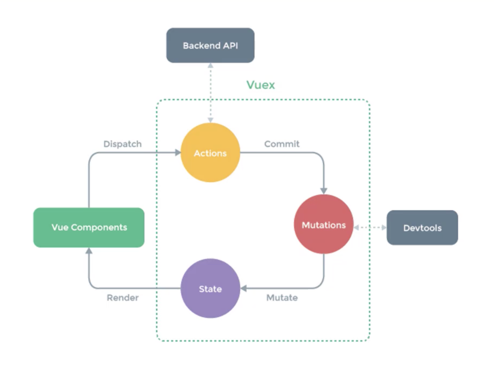

# Vuex概念回顾

上一节中使用的store, 其实就类似于Vuex中的仓库

## 什么是vuex

+ Vuex是专门为Vue.js设计的状态管理库
+ Vuex采用集中式的方式存储需要共享的状态, 但是在状态过多的情况下, 不一管理, 所以vuex允许我们按模块的方式划分不同功能的状态
+ Vuex的作用是进行状态管理, 解决复杂组件通信, 数据共享
+ Vuex集成到了devtools中, 提供了time-travel时光旅行历史回滚功能

## 什么时候使用vuex

+ 非必要情况下不要使用vuex
+ 大型的单页应用程序
    - 多个视图依赖同一状态
    - 来自不同视图的行为需要变更同一状态(比如购物车)

> 滥用Vuex会让业务变得更复杂

## Vue3推荐pinan

## Vuex核心概念

上图演示了Vuex的核心概念和整个工作流程

+ state是管理的全局状态
+ 将状态管理到组件, 也就是视图上, 渲染到用户界面, 展示给用户
+ 用户操作时, 通过dispatch, 分发action
+ action中可以做异步操作(如请求), 不必直接提交mutation, 当需要时, 通过commit, 提交mutation, 记录状态的变更
+ mutation必须是同步的, 所有状态的更改, 都必须要通过mutation, 这样做的目的是可以通过devTools追踪到左右状态的变化, 阅读代码的时候更容易分析应用内部的状态改变, 以及记录每一次状态的改变实现高级的调试功能:time-travel以及历史回滚

> store: 状态仓库(数据管理总线), 是一个容器, 包含应用中几乎所有的全局状态
> State, 状态, 保存在store中, 是唯一的(响应式的状态)
> getter, 类似计算属性, 可以对计算的结果进行缓存, 当依赖结果发生改变时才会重新计算
> Mutation, 改变状态必须提交Mutation
> Action, 支持异步操作, 内部改变状态时, 必须提交Mutation进行操作, 禁止直接操作state 
> Module, 模块, 由于使用单一状态树, 所以状态会集中到一起, 如果状态过多, store会变得很臃肿, 允许我们分发模块, 拆分状态, 每一个模块中都有自己的state, getters, mutations, actions
