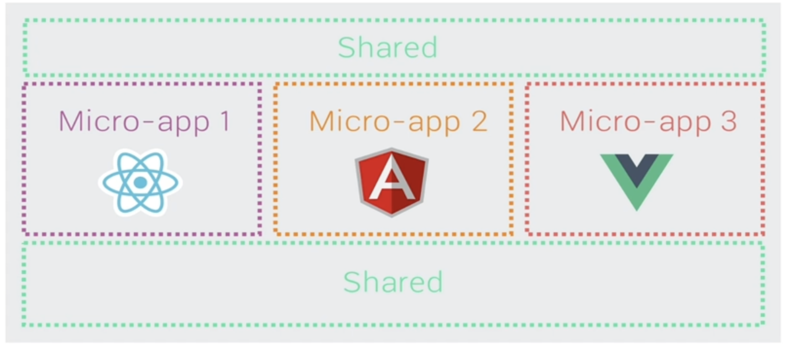

# 微前端入门

## 什么是微前端?

微前端指的是一种软件架构, 能够将一些庞大的应用进行拆分, 拆分为一些更小的能够独立开发部署的微型应用, 然后再将这些应用进行组合使其成为整体应用的架构模式。

微前端架构类似于组件架构, 但不同的是组件不能独立的构建和发布, 但是微前端中的应用是可以的

微前端架构与框架无关, 每个应用都可以使用不同的框架

## 微前端架构带来的价值

### 1.增量迁移

迁移是一项非常耗时且艰难的任务, 比如有一个管理系统使用的AngularJs开发维护已经有三年的时间了，但是随着时间的推移和团队成员的变更, 无论从开发成本还是从用人需求上， AngularJs已经不能满足要求, 于是团队想要更新技术栈, 想在其他框架中实现新的需求, 但是现有的项目怎么办?直接迁移是不可能的, 在新的框架中完全重写也不太现实。

使用微前端架构可以解决问题, 在保留原有项目的同时, 完全可以使用新的框架开发新的需求, 然后再使用微前端架构方式, 将新的项目和旧的项目进行整合。这样既可以使产品得到更好的用户体验, 也可以使团队成员在技术上得到进步, 产品开发成本也降到最低。

### 2.独立发布

在目前的单页应用架构中, 使用组件构建用户页面, 应用中每个组件或功能开发完成或者bug修复完成后, 每次都需要对整个产品进行重新构建和发布, 任务耗时操作上也比较繁琐。

然而在使用微前端架构后, 可以将不同的功能模块拆分为独立的应用, 此时功能模块就可以单独构建, 单独发布了。构建时间也会变得非常快, 应用发布后, 不需要修改其他内容, 就能够自动更新, 意味着可以进行平凡的构建发布操作了。

### 3.允许单个团队做出技术决策

因为微前端架构与框架无关, 当一个应用由多个团队进行开发时, 每个团队都可以使用自己擅长的技术栈进行开发, 也就是他可以适当的让团队决策使用哪种技术, 从而使团队协作变得不再僵硬。

## 微前端的使用场景

> 1. 拆分巨型应用, 使应用变得更加可维护
> 
> 2. 兼容历史应用, 实现增量开发

## 如何实现微前端

### 1. 多个微应用如何进行组合?

在微前端架构当中, 除了包含多个微应用以外, 还存在一个容器应用, 每个微应用都需要被注册到容器应用中。通过容器应用来管理微应用的加载、运行以及卸载。

微前端中每个应用在浏览器中都是一个独立的JS模块, 通过模块化的方式被容器应用启动和运行。

使用模块化的方式运行微应用可以防止不同微应用在同时运行时发生冲突。

### 2. 在微应用中如何实现路由

在微前端架构中, 当路由发生变化时, 容器应用首先会拦截路由的变化，根据路由匹配微前端应用，当匹配到微应用以后, 在启动微应用路由, 匹配具体的页面组件。

### 3. 微应用与微应用之间如何实现状态共享

通过发布订阅模式实现状态共享, 比如使用RxJs。

### 4. 微应用与微应用之间如何实现框架和库的共享

通过import-map(允许加载网络模块)和webpack的externals属性。

只需要提前配置好模块的名字和对应的模块地址就可以了。这样每个微应用都可以引用提前配置好的模块, 可以解决微应用共享框架和库的问题。

通过externals属性去解决哪些模块不需要打包的问题。

