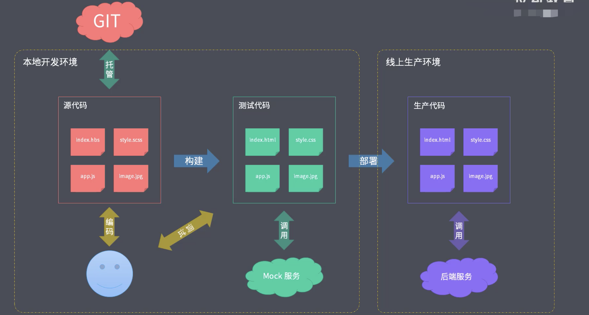

# 工程化和工具的区别

## 工程化 !== 工具

`一种错觉:`

主要是现阶段有些工具过于强大比如webpack。所有就产生了一种错觉, webpack就是工程化，但其实他只是工具。

工具并不是工程化的核心, 它的核心应该是对项目的整体规划或架构, 而工具只是实现这种规划或者架构的手段。

以一个非常普通的项目为例:

第一件事就是规划项目整体的工作流架构, 包括文件的组织结构, 源代码的开发范式(指我们使用的语法, 规范和标准去编写代码), 前后端分离的方式(ajax还是BFF层)

有了上面的整体规划后, 才应该去考虑我们应该选择搭配哪些工具做哪些具体的选项来实现工程化整体的规划

## 成熟的工程化集成

+ create-react-app
+ vue-cli
+ angular-cli
+ gatsby-cli

其实他们并不是简单的脚手架, 不同于之前的工具, 这里的工具其实是对于特定类型的项目, 官方给出的集成式工程化方案

就如vue-cli, 他不仅帮我们创建了项目, 也约定了vue项目的结构, 并且还提供了工具, 有热更新服务, 自动编译vue的单文件组件(vue-loader)以及其他的模块文件(less-loader、sass-loader等), 除此之外可以做代码风格的校验(ts-lint)。他们都集成在vue-cli内部的services中。

所以它主要做的并非创建项目, 而是后面的一系列前期服务, 而这就是工程化中的主要维度, 这些东西也就叫做工程化的集成。

