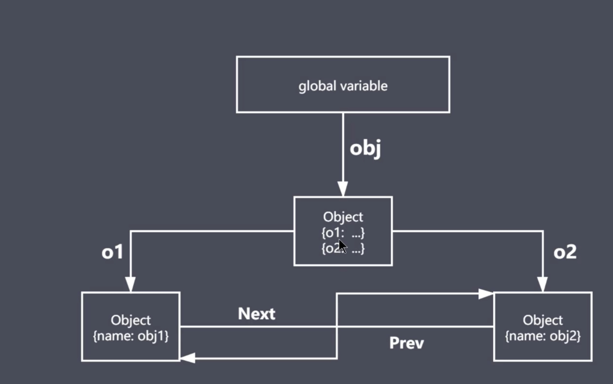
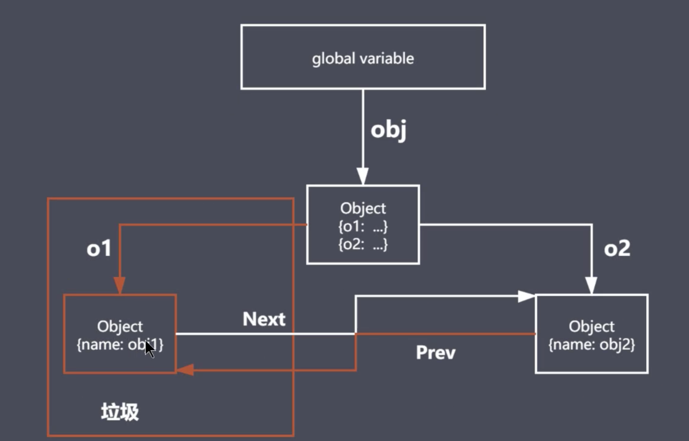

# 垃圾回收

## js中的垃圾回收

> JS中内存管理是自动的, 每当创建数组、对象或者函数时, 就会开辟堆内存空间
> 对象不在被引用时就是垃圾
> 对象不能从根上访问到时就是垃圾

## js的可达对象

> 可以访问到的对象就是可达对象 (对象、作用域链)
> 可达的标准就是从根触发是否能够被找到
> js中的根可以理解为是全局变量对象

### js中的引用和可达

引用示例如下:


```javaScript
let obj = {name: 'zs'}; // 当前空间就是张三的空间, 就像相当于当前空间被obj引用。
// 在全局来说, 当前的obj可以在全局被找到, 对全局来说, 他就是可达的

let lis = obj; // 可以认为张三的空间又多了一次引用, 有一个引用数值变化。后续引入数值算法中会用到

obj = null; // 本身来说张三这个空间是有两个引用的，但是到这里, 就断掉了。

// 但实际上, 他还是可达的, 因为lis还在引用obj
```

可达示例如下:

```javaScript
function objGroup(obj1, obj2) {
    // 函数接收两个变量, 然后让他们互相指引一下, 再返回
    obj1.next = obj2;
    obj2.prev = obj1;

    return {
        o1: obj1,
        o2: obj2
    }
}


let obj = objGroup({name: 'obj1'}, {name: 'obj2'});

// 当发生下面的事情后, obj通过o1指向o1空间的路就断了, 同时obj2通过prev指向o1的路, 也断了
delete obj.o1;


console.info(obj)
```

上述引用关系过于复杂, 使用几张张图来帮助理解

> 通过`let obj = objGroup({name: 'obj1'}, {name: 'obj2'});`在全局定义了一个obj, 通过o1和o2两个属性，指向了o1的空间和o2的空间, 
> 同时o1通过next指向了o2的空间, 相当于通过next.prev指向了自己
> o2 通过prev指向了o1的空间, 相当于通过prev.next指向了自己
> 其实就是o1和o2做了一个互相的引用
> 这样一来, 代码里面的所有对象, 都可以通过根(global variable)去查找, 如图一所示


图一

> 当发生`delete obj.o1`之后, obj通过o1指向o1空间的路就没有了, 同时obj2通过prev指向o1的路也断了。
> 但是o1空间并没有立即清除, 在gc开启之前, o1空间就成了垃圾(孤儿), 谁也访问不了他了, 如图二所示

图二

从根出来, 没有任何一个可达路径抵达一个空间之后, 这个空间就成了垃圾, 等待gc回收。

## GC算法

### GC定义与作用

+ GC就是垃圾回收机制的简写
+ GC可以找到内存中的垃圾、并释放和回收空间

### 什么是GC中的垃圾

> 程序中不在需要使用的对象

```javaScript
function func() {
    name = "lg";
    return `${name} is a coder`;
}
func()
```
当函数调用完成后, 就不再需要使用name了, name就成了垃圾

> 程序中不能在访问到的对象

```javaScript
function func() {
    const name = "lg";
    return `${name} is a coder`
}
func()
```

const内部定义的name, 函数使用完后, 就找不到了, 也是垃圾

### GC算法是什么

+ GC是一种机制, 垃圾回收器完成具体的工作
+ 工作的内容就是查找垃圾释放空间、回收空间
+ 算法就是工作时查找和回收所遵守的规则

### 常见GC算法

+ 引用计数
+ 标记清除
+ 标记整理
+ 分代回收

### 引用计数算法

+ 核心思想: 设置引用数, 判断当前引用数是否为0来决定是不是一个垃圾对象

当计数变为0, gc就开始回收该应用类型, 清理堆内存

#### 内部依赖一个引用计数器

引用关系改变时引用计数器就会修改引用数值

比如代码中有一个对象, 只要有一个值指向他, 引用数就加一,

#### 当引用数字为0时, 就开始回收垃圾

如下例子:

```javaScript
const user1 = {age: 11}
const user2 = {age: 22}
const user3 = {age: 33}

const nameList = [use1.age, user2.age, use3,age];

function fn() {
    num1 = 1;
    num2 = 2;
}

// * 全局下有五个变量, user1, user2, user3, nameList, num1, num2
// * 所以这个时候对于这些引用来说他们的引用计数肯定都不是0

// 下面对fn做修改

function fn() {
    const num1 = 1;
    const num2 = 2;
}
// 这个时候num1和num2全局就找不到了, 当函数执行完后, 就会被回收

// 但是当脚本执行完后, 就发现user1, user2, user3, 空间都还在被引用着, 就在nameList中, 所以他们就不会被回收

fn();
```

其实就是依靠对象的引用数值是不是0来判断数值是不是一个垃圾对象, 因此缺陷挺大的。

### 引用技术算法优缺点

#### 优点

+ 发现垃圾时立即回收
+ 最大限度减少程序暂停: 由于堆内存是有限制的， 比如chrome限制是1.4G(默认)(但是chrome堆内存是基于标记清除法回收堆内存), 应用程序在执行过程中必然要消耗内存, 但是引用计数算法实时监控引用对象, 当引用对象的引用计数为0, 就会立即展开回收, 降低堆内存沾满的风险。这就是减少程序暂停。

#### 缺点

+ 无法回收循环引用对象
+ 时间开销大: 时刻监控当前对象的引用数值是否需要修改, 本身数值修改就要消耗时间, 当很多对象很快的先后修改了引用数, 那么时间开销就更大了

> 演示对象循环引用

```javaScript
function fn() {
    const obj1 = {};
    const obj2 = {};

    obj1.name = obj2;
    obj2.name = obj1;

    return "";
}

fn();
// 函数执行结束后, 内部所在的空间就需要回收, 比如obj1和obj2, 因为在全局就不在使用了, 但是这个时候, 就发现obj1的引用计数是1, obj2的引用计数还是1, 因为他们在函数作用域内互相引用, 因此在这种情况下, 引用计数算法下的gc, 就不会回收他们了, 这就是一种空间浪费。
```

### 标记清除算法

#### 实现原理

+ 核心思想: 分为标记阶段和清除阶段
+ 遍历所有对象找标记活动对象
+ 遍历所有对象, 清除所有没有标记的对象, 清除后, 抹掉标记
+ 回收相应空间


他会找到所有的可达对象, 同时如果可达对象下面还有儿子, 他会递归的去找他们的儿子, 并且添加标记

但是对于a1和b1直接不是可达对象, 就不会做标记, gc回收直接清除

#### 标记清除算法优缺点

> 优点
>> 最大的优点就是可以解决对象循环引用的回收
> 缺点
>> 如下图所示, 从根开始查找有一个直接的可达区域, 就是红色标注的区域, 这是a对象, 但是他左右两侧有两个无法直接可达的区域, 一个叫B一个叫C, 这一在清除的时候, BC就会被直接回收, 再把这部分空间添加到空闲链表上, 后续程序可以直接进来从空闲链表上申请空间使用。
>> 这样问题就出来了, 比如任何一个空间都有两个部分, 一个是头, 一个是域, 头用于存储源信息(大小, 地址), 域用于存放数据。这样左右两侧的空间释放后, 中间有一段还在使用的空间, 他们的空间就不连续, 如果下一次要使用1.5个域, 这个时候如果用B, 就多了, 但是用C又不够。
>> 就是缺点————空间碎片化(需要碎片整理)


### 标记整理算法实现原理

+ 标记整理可以看做是标记清除的增强
+ 标记阶段的操作和标记清除一致
+ 清除阶段先执行整理，移动对象位置, 然后清除没有标记的对象(碎片整理)

碎片整理后, 分散的小空间就不存在了, 所有的空闲空间都紧密的联系在一起

### 常见GC算法总结

+ 引用计数: 通过一个对象的引用数值是否归零来决定是否清除
  - 优点: 可以及时回收垃圾对象, 减少程序卡顿时间
  - 缺点: 无法回收循环引用对象, 资源消耗大(引用计数器频繁修改引用数导致的) 
+ 标记清除: 分为标记阶段和清除阶段, 遍历对象标记活动对象, 清除不代标记的对象并取消所有标记
  - 优点: 可以回收循环引用的空间
  - 缺点: 产生碎片, 无法最大化利用空间, 也不能立即回收垃圾
+ 标记整理: 在清除阶段后进行碎片整理
  - 优点: 解决碎片问题
  - 缺点: 不能立即回收垃圾对象


