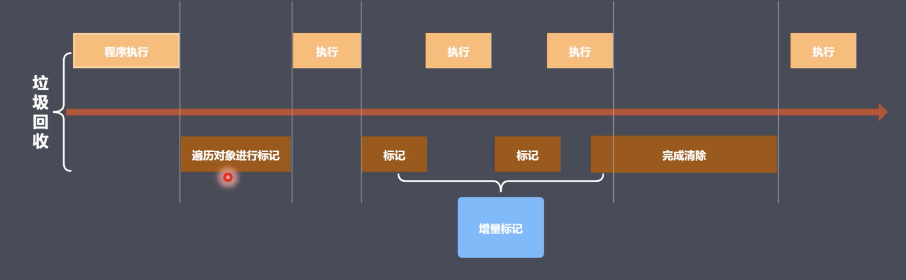

# v8

+ v8是一款主流的js执行引擎, 可以将js高速运转
+ v8采用及时编译(将频繁出现的字节码启动编译器编译为机器码存储起来, 优化执行速度)
+ v8堆内存上限(1.4个g), 现有内存大小对于网页来说够用了, 在完全回收1.4个g的情况下, 大约消耗50ms, 但是采用非增量式, 则会达到1s, 会让用户反感。

当然新生代和老生代都可以调整堆内存大小。

```
// 新生代(单位是kb)
node --max-new -space-size = 2048 xxx.js
// 老生代(单位是mb)
node --max-old-space-size = 2048 xxx.js
```

## v8垃圾回收策略

+ 采用分代回收思想
+ 将内存分为新生代和老生代
+ 针对不同对象采用不同算法

### v8常用GC算法

+ 分代回收
+ 空间复制
+ 标记清除
+ 标记整理
+ 标记增量

### 回收新生代对象

+ 将新生代一分为二, From表示正在使用的内存, to表示闲置的内存(from和to是一样大的, 均分为二)。(32MB | 16MB)
+ 新生代存储存活时间较短的对象
+ 回收过程采用复制算法+标记整理算法
+ 在进行垃圾回收的时候, 将所有的对象都放到from中，然后v8将From部分的对象都检查一遍, `标记整理`后，如果是存活的对象直接复制到to中(To中的内存是按顺序从头到尾放置的, 防止碎片化), 非存活对象直接回收(from直接回收)
+ 当所有的存活对象都按顺序进入To中之后, 然后To和From身份对调, From中的内存被闲置, To中正在使用， 如此循环
+ 当然, 可能会出现存活对象在堆中分配不均匀的情况, 这就是所谓内存碎片, 需要使用一个算法对To中的内存进行整理(Scavenge算法), 也叫碎片整理
+ 新生代的劣势很明显, 就是只使用了一半的空间, 但是处理生命周期很短的对象, 这样的对象不多, 因此效率很高

#### 回收细节

+ 拷贝的过程中可能出现晋升
+ 晋升就是将新生代对象移动到老生代
+ 晋升的条件:
  - 一轮GC之后还存活的新生代需要晋升
  - To空间的使用率超过25%(当他超过这个值后，他变成from后, 从原来的from进来对象后, 剩余的空间就不足了)


### 回收老生代对象

老生代:

+ 老生代对象存放在上面那个图的右侧
+ 64位操作系统大约1.4G，32位操作系统大约700MB
+ 老生代对象就是指存活时间较长的对象(全局变量, 闭包)

回收实现:

+ 主要采用标记清除、标记整理和增量标记算法
+ 首先采用标记清除完成垃圾空间的回收, 首先对所有对象打上标记, 然后对存活对象取消标记, 然后直接回收所有带标记的对象
+ 采用标记整理进行空间优化(一般在触发晋升的时候, 很粗暴, 直接从一端往另一端移动)
+ 采用增量标记进行优化效率(执行一会儿js, 在标记一段, 将一口气完成的标记拆分开来, 不会因为标记任务重阻塞js执行)

细节对比:

+ 新生代区域垃圾回收使用空间换时间, 虽然一拆为二, 但是处理的都是生命周期很短的对象, 一来他们周期短，二来这样的对象不多, 因此这个交换还是实惠
+ 老生代区域垃圾回收不适合复制算法, 因为老生代空间足够大, 复制算法过于浪费性能

#### 增量标记

由于垃圾回收会阻塞js执行，这就是有一个空档期, 所谓的增量标记就是将一口气做完的标记，拆分为一段一段的, 标记一段, 运行一会儿js，这一就不会阻塞js执行了。

遍历对象进行标记, 这个遍历不能省.

看起来程序停下来了很多次， 但是其实他更紧凑， 因为增量标记真的省时(遍历越长的数组越耗时, 同时从前往后越往后越慢)



## v8总结

> v8是一款主流的js执行引擎
> v8的内存是设置上限的，毕竟在有上限的情况下，采用费增量式完全回收1.4个g堆内存都需要1s以上，都已经给了用户的明显停顿感，因此必须设置上限
> v8采用基于分代回收思想实现垃圾回收
> v8内存分为新生代(32MB | 16MB)和老生代(1.4G | 700MB)
> v8垃圾回收常见的GC算法: 分代回收、空间复制、标记清除、标记整理、标记增量


