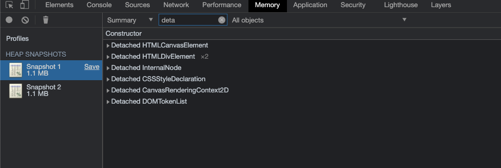
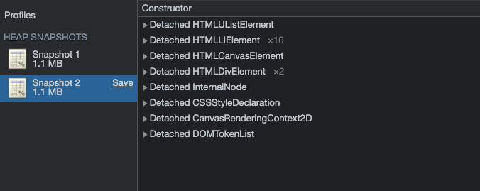

# JS性能

## 为什么要使用Performace

+ GC的目的是为了实现内存空间的良性循环
+ 良性循环的基石是合理使用(但是js并没有提供操作内存空间的api, 因此我们也不知道是否合理)
+ 必须要时刻关注到内存变化才能确定是否合理
+ Performance就是监视内存的一个工具

通过Performance实时监控内存

### 使用步骤

+ 打开浏览器输入目标网址
+ 进入开发人员工具面板， 选择性能
+ 开启录制功能，访问具体界面
+ 执行用户行为， 一段时间后停止录制
+ 分析界面中记录的内存信息

## 内存问题的体现

### 外在表现

+ 页面出现延迟加载或经常性暂停(可能会有频繁的垃圾回收, 说明有代码瞬间让程序内存飙升)
+ 页面持续性出现糟糕的性能(可能底层有内存膨胀, 就是说明底层可能申请了更多的内存，并且内存超过了本机的承载)
+ 页面的性能随时间延长越来越差(可能有内存泄漏, 就是代码执行过程中, 回收的空间越来越少, 越来越多的空间无法回收)

## 监控内存的集中方式

### 界定内存问题的标准

+ 内存泄漏: 内存使用持续升高
+ 内存膨胀: 在多数设备上都存在性能问题。(我们在多种设备上, 都存在性能问题, 那说明就是程序本身的问题了)
+ 频繁垃圾回收: 通过内存变化图进行分析(毕竟通过界面无法感知)

### 方式

1. 浏览器任务管理器
2. Timeline时序图记录
3. 堆快照查找分离DOM(分离DOM也就是一种内存上的泄漏)
4. 判断是否存在频繁的垃圾回收

## 任务管理器监控内存

可以在右上角通过头像边上的更多操作选择更多工具打开任务管理器

然后再上面的tab栏上右键将js内存展示出来， 我们主要关注内存和js内存

内存表示的原生内存, 也就是DOM节点展示的内存, 如果不断增大, 说明不停在创建DOM

js内存表示js堆, 小括号中表现的是可达引用使用的内存, 如果没有变化， 说明堆内存没有增长

js内存没有增长就没有问题, 如果不停增长, 说明问题很大。

但是他只能告诉我们有没有问题，不能定位问题

## Timeline记录内存

由于任务管理器只能帮助我们判断是否出问题，但是不能定位问题。

这里通过时间线记录内存变化的方式，让我们更精确的定位在什么时间节点发生，和什么代码相关。

```HTML
<button id="btn">add</button>
    <script>
        const arrList = [];

        function test() {
            // 通过一个循环大量创建节点
            for (let i = 0; i < 100000; i++) {
                document.body.appendChild(document.createElement("p"));
            }

            arrList.push(new Array(1000000).join("x"))
        }

        document.getElementById("btn").addEventListener("click", test);
    </script>
```

在HTML中搞一段这个命令, 然后再performance中记录一段时间内存的变化, 就会发现内存在点击add开始就开始飙升, 但是运行一段时间后就非常平稳，同时会开始滑落, 然后再涨上去, 在落下来。基本保持一个稳定状态, 略微有一点上升，这就说明v8在脚本运行稳定后就开始对非活动对象进行回收了。 涨就是申请内存，落就是回收内存。

但是后面有一段时间, 他就会只上升不滑落了，说明这里有了内存泄漏

## 堆快照查找分离DOM

使用浏览器的堆快照功能监控运行时的js内存

相当于找到一个js堆, 然后进行一个拍照, 并且照片会存储起来, 就可以通过这个照片看到所有的信息，就可以看到他们的由来

堆快照更像是针对于分离DOM的查找行为

### 什么是分离DOM

+ 界面元素存活在DOM树上
+ 垃圾对象时的DOM节点(节点脱离了DOM树, 并且js没有引用这个节点)
+ 分离状态的DOM节点(仅仅是从DOM树上脱离, 但是js还在引用。因此在DOM树上看不到了，但是js还在用，这就造成了内存泄漏)

> 可以通过以下例子演示分离DOM的存在

```HTML
<body>
    <button id="btn">add</button>
    <script>
        let tmpEle;

        function fn() {
            let ul = document.createElement("ul");

            for (let i = 0; i < 10; i++) {
                let li = document.createElement("li");
                ul.appendChild(li);
            }
            tmpEle = ul; // 此处只是将ul挂到了tmpEle上面, 但是又没有挂载到页面上, 这里的11个节点就是分离DOM
        }
        document.getElementById("btn").addEventListener("click", fn);
    </script>
</body>
```

然后在点击事件执行前后获取堆快照如下 图2-1 和 图2-2

图2-1

图2-2

就可以发现在图2-2中比图2-1多了10个li节点和一个ul节点，但是页面上又没有挂上来，这11个节点就是分离DOM

解决这个问题很简单, 直接将```tmpEle = null;```即可, 这样这个引用就没有了, 他也会被回收

堆快照专门用于查找分离DOM, 主要是页面中不存在, 但是内存中却在引用, 它就是一种内存浪费，因此我们利用堆快照找到分离DOM并且可以定位到节点，这样就可以处理这样的内存浪费。

## 频繁的垃圾回收

### 为什么要确定频繁的垃圾回收

+ GC工作时应用程序是停止的
+ 频繁且过长的GC会导致应用假死
+ 用户使用中会感知应用卡顿

### 确定频繁的垃圾回收的方式

+ timeline中频繁上升下降
+ 任务管理器中数据频繁的增加减小

## Performance总结

+ 使用流程
+ 内存问题的相关分析(内存泄漏，内存膨胀，频繁GC)
+ 时序图记录程序执行时内存变化
+ 任务管理器监控内存变化
+ 堆快照查找分离DOM


