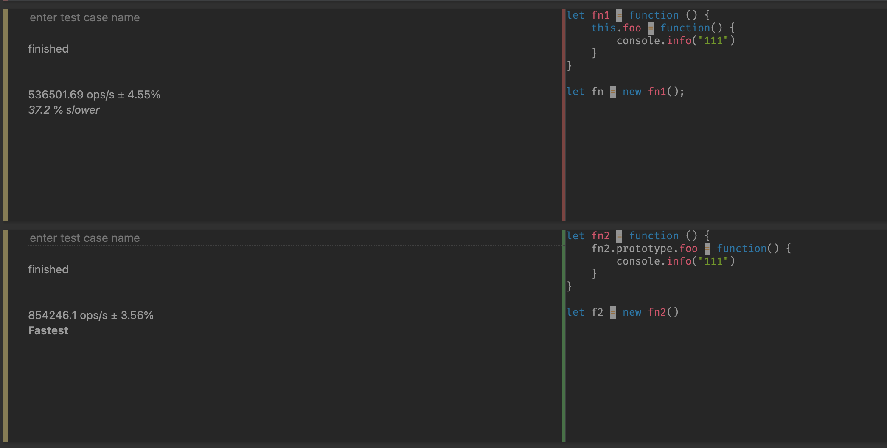
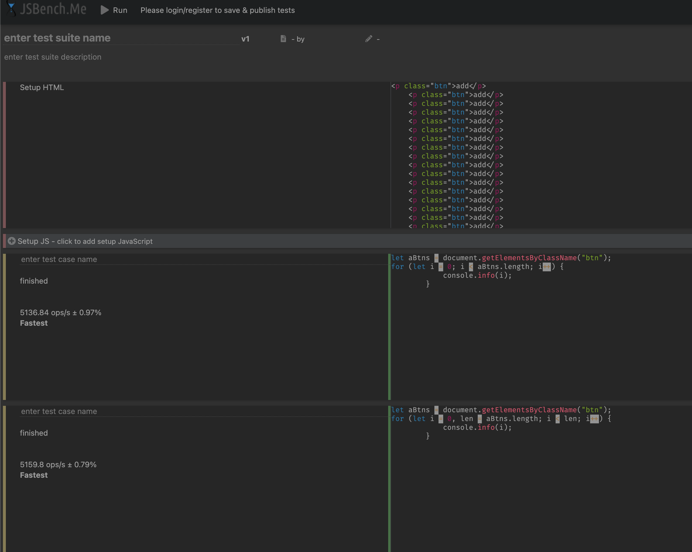
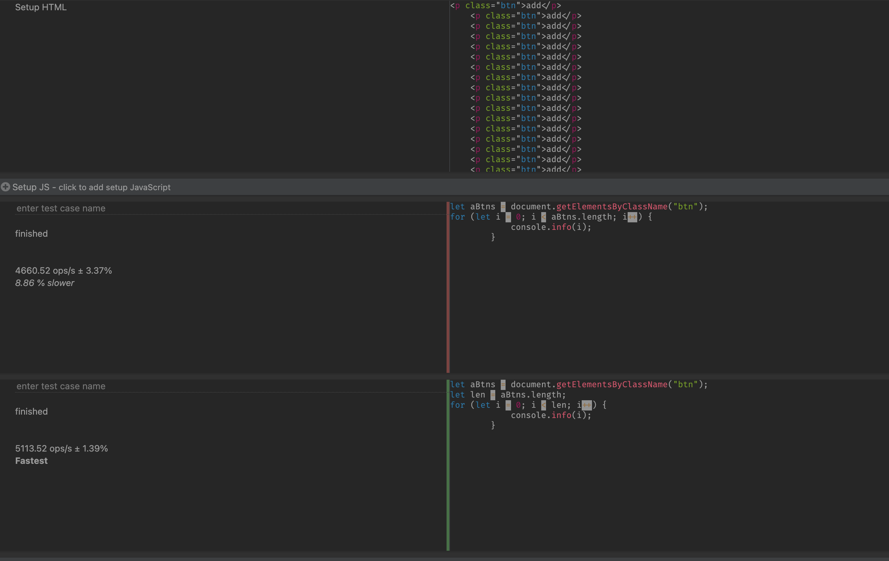

# JS代码优化

## 如何精确的测试js性能

+ 本质上就是经过大量的数据采集执行样本进行数学统计和分析
+ 但是我们不能过多地关注数学统计和分析，因此我们使用基于Benchmark.js的[网站](https://jsbench.me/)来完成

## Jsperf使用流程(jsperf已经停止维护, 使用JSBench)

+ 使用github账号登录
+ 填写个人信息(非必须)
+ 填写详细的测试用例信息(title, slug)
+ 填写准备代码(DOM操作时经常使用的)
+ 填写必要的setup(释放操作)和teardown代码
+ 填写测试代码片段

## 慎用全局变量

### 为什么要慎用

+ 全局变量定义在全局执行上下文, 是所有作用域链的顶端。
  - 按照层级往上查找的过程来说, 下面某些局部作用域没有找到的变量, 都会查找到上面的全局上下文, 因此这一一层一层往上查找就消耗了大量的时间, 因此应该尽量将变量定义在距离使用它最近的作用域中。
+ 全局执行上下文一直存在与上下文执行栈, 直到程序退出之前都不会被回收
+ 如果某个局部作用域出现了同名变量则会遮蔽或污染全局

### 对比效果

```javaScript
var i, str = "";
// 全局
for (i = 0; i < 1000; i++) {
    str += 1;
}
// 局部
for (let i = 0; i < 1000; i++) {
    let str = "";
    str += 1;
}
```

上述两个例子的出来的结果就是使用局部变量的执行效率会远高于全局变量, 通过这个就可以得出, 实际上我们应该慎用全局变量

## 缓存全局变量


实际就是在程序执行过程中, 针对使用全局变量是无法避免的, 因此可以选择将大量重复使用并且无法避免要使用的全局变量缓存到局部作用域中

```HTML
<body>
    <input type="button" value="btn" id="btn1"/>
    <input type="button" value="btn" id="btn2"/>
    <input type="button" value="btn" id="btn3"/>
    <input type="button" value="btn" id="btn4"/>
    <p>111</p>
    <input type="button" value="btn" id="btn5"/>
    <input type="button" value="btn" id="btn6"/>
    <p>222</p>
    <input type="button" value="btn" id="btn7"/>
    <input type="button" value="btn" id="btn8"/>
    <p>333</p>
    <input type="button" value="btn" id="btn9"/>
    <input type="button" value="btn" id="btn10"/>
    <script>
        function getBtn() {
            let oBtn1 = document.getElementById("btn1")
            let oBtn3 = document.getElementById("btn3")
            let oBtn5 = document.getElementById("btn5")
            let oBtn7 = document.getElementById("btn7")
            let oBtn9 = document.getElementById("btn9")
        }

        function getBtn2() {
            let obj = document;
            let oBtn1 = obj.getElementById("btn1")
            let oBtn3 = obj.getElementById("btn3")
            let oBtn5 = obj.getElementById("btn5")
            let oBtn7 = obj.getElementById("btn7")
            let oBtn9 = obj.getElementById("btn9")
        }
    </script>
</body>
```

然后就会发现使用缓存的结果, 会比没有使用缓存的结果在性能上稍微有一些提升。

这就是通过缓存全局变量来提高js的性能

## 通过原型新增方法

在原型对象上添加实例对象经常需要的方法

```javaScript
// 证明在实例中直接使用会比调用原型上的方法更慢

let fn1 = function () {
    this.foo = function() {
        console.info("111")
    }
}

let fn = new fn1();

let fn2 = function () {
    fn2.prototype.foo = function() {
        console.info("111")
    }
}

let f2 = new fn2()
```

就会发现如下结果了


## 避开闭包陷阱

### 闭包特点

+ 在外部具有指向内部的引用
+ 在"外"部作用域访问"内"部作用域的数据
+ 这个外和内并不严谨, 这个外部就是在外部调用父函数, 实际上这个函数指向了内部, 内部调用的是外层函数的变量


```javaScript
function foo() {
    let name = "zs";
    return () => {
        console.info(name);
    }
}
let a = foo();
a(); // zs
```

### tips

+ 闭包是一种强大的语法
+ 闭包使用不当很容易出现内存泄漏
+ 不要为了闭包而去闭包

应该避开闭包带来的内存泄漏

### 闭包陷阱

```HTML
<body>
    <button id="btn">add</button>
    <script>
        function foo() {
            let el = document.getElementById("btn");
            el.onclick = () => {
                console.info(el.id);
            }
        }
        foo();

        // 这个函数就是一个闭包, 因为ocClick并不在foo这个作用域下，他调用的时候是点击的时候
        // 因此在这个情况下, 由于onClick函数是一直存在的, 因此el属性永远都不会被回收, 也就一直被缓存下来了、
        // 类似于这样的操作越来越多, 那么内存就会被一直消耗，也就成了内存泄漏了

        // 如下方式可以解决上述问题

        function foo2() {
            let el = document.getElementById("btn");
            el.onclick = () => {
                console.info(el.id);
                el = null;
            }
        }
        foo2();
    </script>
</body>
```

首先btn这个dom节点本身就存在dom中, 就算不通过el引用这个dom节点, 它也存在的, 也就是他的引用计数是两次。

当有一天，dom中的引用没有了，但是代码中的el还有引用，这个dom对象就变成了分离dom, 垃圾回收就不会在回收他了，内存泄漏就来了

但如果说在点击事件执行后，清除el，那么代码中对btn这个dom的引用就结束了，只要dom树中清除了他，那么他就会被回收

## 避免属性访问方法使用

为了更好地实现这个封装，我们会将一个属性和方法放在一个函数(类)的内部，然后向外暴露一些方法来对这个属性进行增删改查(CRUD)

+ JS不需要属性的访问方法，所有的属性都是外部可见的
+ 使用属性访问方法只会增加一层重定义，没有访问的控制力

```javaScript
// 对比两个代码，一个有属性访问一个没有

function Person() {
    this.name = "icode";
    this.age = 18;
    this.getAge = function () {
        return this.age;
    }
}
let p1 = new Person();
let a = p1.getAge();
function Person1() {
    this.name = "zs";
    this.age = 18;
}
let p2 = new Person1();
let b = p2.age;
```

然后就会发现, 第二个比第一个快多了, 他们差距真的挺大的, 因此我觉得如果没有一定要使用暴露属性访问方法的必要，还是直接访问比较好，毕竟执行更快。

## for循环优化

for是一个经常使用的语法解构, 大量的可遍历对象都需要进行遍历, 这里就可以具体通过代码片段对for进行稍微的处理。

```HTML
<p class="btn">add</p>
    <p class="btn">add</p>
    <p class="btn">add</p>
    <p class="btn">add</p>
    <p class="btn">add</p>
    <p class="btn">add</p>
    <p class="btn">add</p>
    <p class="btn">add</p>
    <p class="btn">add</p>
    <p class="btn">add</p>
    <p class="btn">add</p>
    <p class="btn">add</p>
    <p class="btn">add</p>
    <p class="btn">add</p>
    <p class="btn">add</p>
    <p class="btn">add</p>
    <p class="btn">add</p>
    <script>
        let aBtns = document.getElementsByClassName("btn");

        for (let i = 0; i < aBtns.length; i++) {
            console.info(i);
        }
        // 方式二
        let len = aBtns.length;
        for (let i = 0; i < len; i++) {
            console.info(i);
        }
    </script>
```

主要就是优化了每一次都要去获取长度的这一步操作，而是存储了起来。

第一种方式实际上差距并不是很大(但是方式二还是更快), 单独将len提出来更明显





## 采用最优循环方式

```javaScript
let arrList = new Array(1, 2, 3, 4, 5, 6, 7);

arrList.forEach(item => {
    console.info(item);
})

for (let i = 0, len = arrList.length; i < len; i++) {
    console.info(arrList[i]);
}

for (let i in arrList) {
    console.info(arrList[i]);
}
```

最终得出的结果, 实际上是forEach是最好的, 其次是优化后的for, 最后是for in。

## 节点添加优化

节点的添加操作必然会有回流和重绘

```HTML
<body>
    <script>
        for (let i = 0; i < 10; i++) {
            let oP = document.createElement("p");
            oP.innerHTML = i;
            document.body.appendChild(oP);
        }

        // 优化
        const fragEle = document.createDocumentFragment();
        for (let i = 0; i < 10; i++) {
            let oP = document.createElement("p");
            oP.innerHTML = i;
            fragEle.appendChild(oP);
        }
        document.body.appendChild(fragEle);
    </script>
</body>
```

同样差距不大，但是优化后稍微快一点

## 克隆优化节点操作

就是将一个已经存在的节点直接克隆一遍, 继承他所有的属性就不用重新创建了

```HTML
<body>
    <p id="box1">old</p>
    <script>
        for (let i = 0; i < 3; i++) {
            let oP = document.createElement("p");
            oP.innerHTML = i;
            document.body.appendChild(oP);
        }

        let oldP = document.getElementById("box1");
        for (let i = 0; i < 3; i++) {
            let newP = oldP.cloneNode(false);
            newP.innerHTML = i;
            document.body.appendChild(newP);
        }
    </script>
</body>
```

最终的结果还是差距不大，但是采用克隆的时候稍微快一点点。

## 直接量替换 Object 操作

定义对象或者数组的时候可以使用new也可以使用字面量

```javaScript
let a = [1, 2, 3, 4];

let a1 = new Array(4);
a1[0] = 1;
a1[0] = 2;
a1[0] = 3;
a1[0] = 4;
```

实际上结果很显然, 肯定是字面量更快, 差异极其显著。
