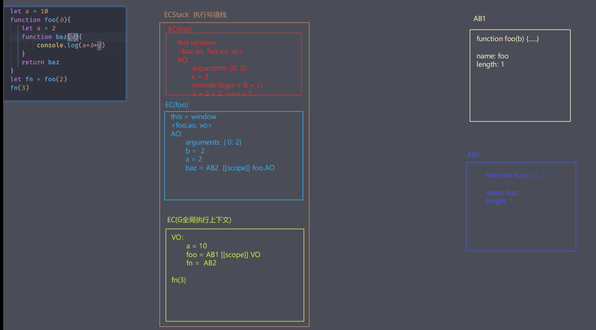
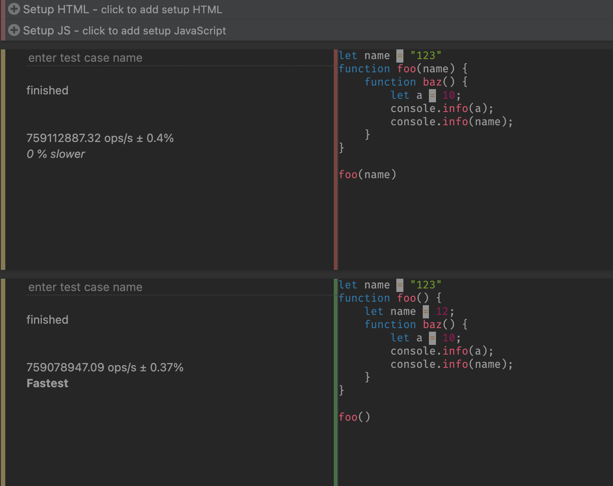

# js优化2

`由于jsperf停止维护, 因此采用JSBench(上一节开头就写了)`

要么空间换时间

要么时间节省更多的空间

## 堆栈中的js执行过程

看如下一段代码

```javaScript
let a = 10;
function foo(b) {
    let a = 2;
    function baz(c) {
        console.info(a + b + c);
    }
    return baz;
}

let fn = foo(2);
fn(3);
```
如上面函数执行过程描述如下图所示:

> js代码开始执行后首先会在堆内存中创建一个执行环境栈(ECStack), 内部用于存放不同的执行上下文, 然后代码从上往下执行，最先创建的是全局的执行上下文(ECG), 其中声明和存放了全局作用域下的代码
> 
> 基本类型值就是直接存放在栈中(由JS主线程管理释放), 引用类型就存储在堆中(gc机制进行管理)
> 
> 每当遇到函数执行的时候就会重新生成一个执行上下文, 就会入栈, 当代码执行完毕后由是否产生闭包来决定这个执行栈是否销毁, 如果有闭包, 这个执行栈将直接到ECG的最下方, 如果没有闭包, 那么ESP指针下移, 栈顶空间就释放了
> 
> 在这里就是首先在ECStack中创建ECG, ECG的 VO中定义e，foo和fn
> 
> 但是foo是一个新的函数, 于是就在堆中开辟一个新的内存AB1用于存放foo函数, ECG中定义了一个foo指针指向AB1这个堆, 堆中定义了foo函数以及他的名字和长度
> 
> 接下来就是foo执行，在ECStack中就会创建一个新的栈, ESP指针上移, 进入新的栈EC(foo)中, 首先定义this此处没有用到, 直接就是window
> 
> 接下来是继承上级作用域创建自己的作用域链, foo中只有两个就是他自己的foo.ao以及全局的VO
> 然后开始进入AO中, 创建arguments，获取到b = 2, a = 2, 定义baz
> 
> 开辟新的堆AB2, 堆中定义baz函数, 同时在EC(foo)下将baz指向AB2
> 
> 然后执行foo后获取到EC(foo)的返回值, 也就是fn, 将fn指向AB2
> 
> 同时在baz函数中有来自外部foo的引用, 因此这里形成了一个闭包foo, 所以EC(foo)将沉入栈底, ESP指针上移, 执行fn函数就会执行baz函数, 开辟EC(baz)和上述foo过程一样
> 
> 当baz执行完毕后, ESP指针下移, 栈顶空间回收, 最终清空整个ECStack, 而堆中空间的回收交给gc去完成



## 减少判断层级

具体来说就是在代码执行过程中出现if else多层嵌套的问题导致性能变差, 我们可以通过提前return掉无效的判断条件达到嵌套层级的优化效果

如下所示:

```javaScript
function doSome(part, chapter) {
    const parts = ["ES2016", "工程化", "Vue", "React"];
    if (part) {
        if (parts.includes(part)) {
            console.info("是这样");
            if (chapter > 5) {
                console.info("不要天天想着白嫖");
            }
        }
    } else {
        console.info("请确认模块信息");
    }
}

// * 优化后
function doSome(part, chapter) {
    const parts = ["ES2016", "工程化", "Vue", "React"];
    if (!part) {
        console.info("请确认模块信息");
        return;
    }
    if (!parts.includes(part)) return;
    console.info("是这样");
    if (chapter > 5) {
        console.info("不要天天想着白嫖");
    }
}
```

在JSBench中跑出来的结果就发现, 优化后明显会快很多

当然, 对于确定值得判断(全等)建议使用switch case, 这样的代码整洁并易于维护(当然, 并不是易于维护性能就一定好)

## 减少作用域链查找层级

主要是减少查找执行上下文的层级，如果就近调用，就会减少树形结构的查找，查找树形结构是较慢的，并且层级越多越慢，因此尽量少用全局变量。但是采用内部定义的方式, 会增大内存的消耗，因此最好的方式是传参(差距极小, 但是这样内存开销也节省了)。

如下图所示：



## 减少数据读取次数

js中经常使用的数据分为字面量, 局部的变量、数组元素和对象属性这四种(最常见), 对于这四种, 访问字面量和局部变量最快，因为他们都存储在栈区中，但是对象和数组的等存在原型链查找，因此就稍微会慢一点, 就像作用域链一样。

```HTML
<body>
    <div id="skip" class="skip"></div>
    <script>
        let box = document.getElementById("skip");
        function hasEle (ele, cls) {
            // return ele.className === cls;
            // 上述代码如果只使用一次, 确实没有太大的问题, 但是如果多次重复使用, 就会导致多次去ele中查找属性, 导致查找这一步的性能浪费, 因此我们可以将它存储起来, 以优化执行效率。当然这样的优化也造成了内存消耗, 不过如果是大规模的访问, 还是值得, 比如react中对props的解构赋值, vue中优化computed属性时可以对第一个参数进行解构(第一个参数是this)
            let className = ele.className;
            return className === cls;
        }
        hasEle(box, "skip");
    </script>
</body>
```

## 字面量和构造式

测试字面量和构造式的执行效率

```javaScript
let test = () => {
    let obj = new Object();
    obj.name = "zs";
    obj.age = 28;
    obj.slogan = "我的使命";
    return obj;
}

// * 方式二
let test = () => {
    let obj = {};
    obj.name = "zs";
    obj.age = 28;
    obj.slogan = "我的使命";
    return obj
}
```

当然测试结果也是意料之中, 使用字面量会快很多, 因为new关键字创建对象的时候, 要执行Objet的构造体并且要改变内部this指向, 需要一定的时间, 因此使用new关键字会慢很多。当然引用类型差距并不大, 如果是基础类型, 那就真的是天差地别了, 并且一个是原始类型一个是引用类型。

当然基础数据类型执行过程中, 查找原型方法时, 实际上内部做了一次转换, 先转换为引用类型, 在调用原型链上的方法。但是字面始终来说解约了空间, 也解约了时间

## 减少循坏体中活动

简单的说就是将循环体中不是每次都改变的业务抽离到循环体的外面去完成, 毕竟循环本身就耗资源了, 不做更改还每次都执行就是纯粹对资源的一种浪费了。如下代码所示:

```javaScript
let test = () => {
    let arr = ['zce', 38, '我的使命'];
    for (let i = 0; i < arr.length; i++) {
        console.info(arr[i])
    }
}

// 由于循环体中并没有什么操作, 因此这里做的实际上就是之前优化for循环一样的思路, 将每次都执行的arr.length拿到外面去,缓存起来, 只取一次

let test = () => {
    let arr = ['zce', 38, '我的使命'];
    let len = arr.length;
    for (let i = 0; i < len; i++) {
        console.info(arr[i])
    }
}


// 这样操作之后, 执行效率大大提高了

// 当然, 使用while会更快, 因为操作更少(当然要从后往前遍历), 毕竟for循环不可避免的每一次都要去重新给i赋值, 并且要比较

let test = () => {
    let arr = ['zce', 38, '我的使命'];
    let i = 0;
    let len = arr.length;
    while(len--) {
        console.info(arr[len]);
    }
}
```

## 减少声明以及语句数

实际上就是之前`减少数据读取次数`相反的一种概念, 他们中我们需要寻找一个奇点, 那就是这个值使用多不多, 如果说只有一两次, 而不是十几次上百次的复用, 那么我们应该减少声明以及语句数, 而不是不停地缓存值。

因为每一次定义, 解释器都要多做一句词法分析和语法分析, 构建AST树生成字节码, 然后看是否有重复出现的字节码需要启动编译器编译成机器码存储起来。这一步还是比较长的。

同时连续定义, 执行效率也会提高, 因为解释器不需要大量的对关键字做词法分析和语法分析。但是多层逗号操作符, 并不是那么好阅读。因此不推荐连续使用逗号操作符+一个关键字去初始化定义数据, 这一不好阅读, 也不好维护。


## 事件委托

原理就是原本委托在子节点上的事件, 将事件放在父节点上, 借用事件冒泡机制来触发事件。(React中就采用了事件委托，当然他叫`合成事件`，就是将所有的事件都合成到了document上(17之前, 17之后是根节点挂载的那个#app上))

```HTML
<body>
    <ul id="ul">
        <li>ZCE</li>
        <li>18</li>
        <li>我的使命</li>
    </ul>
    <script>
        let list = document.querySelectorAll("#ul li");
        function showText(ev) {
            console.info(ev.target.innerHTML);
        }
        // * 传统方式, 挂载到每一个li上, 极其不推荐使用
        list.forEach(item => {
            item.onClick = showText;
        });

        // * 事件委托
        let ul = document.querySelector("#ul");
        function showText(ev) {
            if (ev.target.nodeName === 'li') {
                console.info(ev.target.innerHTML);
            }
        }
        ul.addEventListener('click', showText, true);

        // 这样的方式不太好测试, 不过原理上很好说, 就是大量绑定在子元素上会增大绑定消耗, 毕竟每一个DOM上面元素都绑定了一个事件, 性能也好不到那里去, 这就事件委托
    </script>
</body>
```


