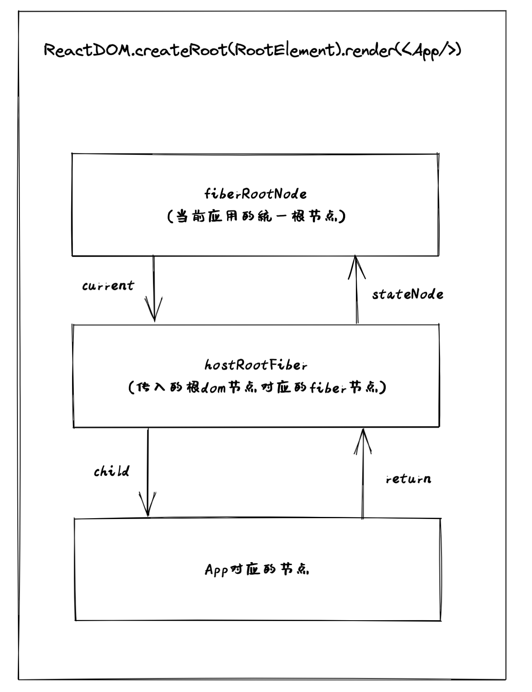

# reconciler - 触发更新

## 常见触发更新的方式

+ ReactDOM.createRoot().render
+ this.setState
+ useState中的dispatch方法

其实我们更加希望的是能够实现一套统一的更新机制:

+ 兼容上述触发更新的方式
+ 便于后续扩展

## 更新机制的组成部分

+ 代表更新的数据结构 - Update
+ 消费 update 的数据结构 - updateQueue(这一点, Vue的更新队列其实也是类似的)

## 调用setState的方式

调用setState的方式有两种
+ 直接传入新的state
+ 传入回调函数, 回调函数参数接收修改前的state, 执行结果为新的state

## 更新队列实现

为了对上述更新方式做处理, 同时兼容更新的数据结构, 实现方式如下:

```ts
// 更新队列
import { Action } from "@mini-react/shared";

// Update数据结构
export interface Update<State> {
  // 触发更新的函数
  action: Action<State>;
}

// ------------------------------- React触发更新的方式 ------------------------------------------
// 对于React有两种触发更新的方式
// 不仅可以传一个状态的最新值, 还可以传一个函数, 返回值表示最新的状态
// 因此 Action 要处理下面两种形式
// this.setState({xx:1})和this.setState(() => ({xx:2}))
// ------------------------------- React触发更新的方式 ------------------------------------------

export interface UpdateQueue<State> {
  shared: {
    pending: Update<State> | null
  }
}

// 创建 update
export const createUpdate = <T>(action: Action<T>): Update<T> => {
  return {
    action
  }
}

// 创建 updateQueue
export const createUpdateQueue = <Action>(): UpdateQueue<Action> => {
  return {
    shared: {
      pending: null
    }
  } as UpdateQueue<Action>
}

// 往updateQueue中添加update
export const enqueueUpdate = <Action>(
  updateQueue: UpdateQueue<Action>,
  update: Update<Action>
) => {
  updateQueue.shared.pending = update;
}

// UpdateQueue消费Update的方法
// 这个方法接收一个初始状态以及需要消费的update
export const processUpdateQueue = <State>(
  baseState: State,
  pendingUpdate: Update<State> | null
): { memorizedState: State } => {
  const result: ReturnType<typeof processUpdateQueue<State>> = {
    memorizedState: baseState
  }
  
  // ---------------------- 消费过程 ------------------------------
  // 有两种消费的情况
  // 如果pendingUpdate存在
  if (pendingUpdate !== null) {
    // baseUpdate: 1, update: 2 -> memorizedState: 2
    // baseUpdate: 1, update: x => 2*x -> memorizedState: update(baseUpdate)
    const action = pendingUpdate.action;
    if (action instanceof Function) {
      // action为函数, 对应第二种类型
      result.memorizedState = action(baseState);
    } else {
      // 否则memorizedState 就是 action本身(也就是传入setState的参数)
      result.memorizedState = action;
    }
  }
  return result;
}
```

## 需要考虑的事情

+ 更新可能发生于任意组件, 而更新的流程是从根节点递归的
+ 需要一个统一的根节点保存通用信息

比如:
```tsx
ReactDOM.createRoot(RootElement).render(<App/>)
```

在调用 `ReactDOM.createRoot(RootElement)` 就会创建一个当前应用的统一根节点, 也就是 `fiberRootNode`

传入的DOM, `RootElement`也有自己对应的 FiberNode, 也就是 `hostRootFiber`

在 `fiberRootNode` 和 `hostRootFiber`之间通过 `current` 以及 `stateNode` 指针连接

最后执行 render 方法传入一个`<App/>`组件, 会生成 App对应的 FiberNode, `AppFiberNode` 和 `hostRootFiber`之间通过 `child`和`return`连接



> React也是通过FiberNode节点间的这些连接, 去实现的从发生更新的组件, 遍历到根节点, 在进行递归更新


## fiberRootNode 实现

```ts
// 应用入口对应的FiberNode
export class FiberRootNode {
  // ? 对应宿主环境的挂载点, 也就是 rootElement, 使用中常用的 <div id="app"></div>
  // ? 不过这里并不能直接设置为DOM Element, 而是应该采用更抽象的类型, 因为React并不仅是为web端服务
  public container: Container;

  // ? 指向 hostRootFiber, 也是一个 FiberNode
  public current: FiberNode;
  // ? 指向更新完成后的 hostRootFiber
  public finishedWork: FiberNode | null;

  constructor(container: Container, hostRootFiber: FiberNode) {
    this.container = container;
    this.current = hostRootFiber;
    // hostRootFiber 通过 stateNode 与 FiberRootNode 建立连接
    hostRootFiber.stateNode = this;
    this.finishedWork = null;
  }
}
```

## mount更新流程

### mount更新的目的:

+ 生成 workInProgress FiberNode树
+ 标记副作用flags

### 更新流程步骤

+ 递: beginWork
  - HostRoot:
    1. 计算状态最新值
    2. 创建子fiberNode
  - updateHostComponents(不会触发更新)
    1. 只会创建子fiberNode 
+ 归: completeWork


## beginWork 流程

以如下节点为例:

```html
<A>
  <B />
</A>
```

当进入A的beginWork时, 通过对比B的current fiberNode与B的ReactElement, 生成B的wip fiberNode

在`beginWork`过程中, 最多会标记两类与`结构变化`相关的flags:
+ Placement
  - 插入: a -> ab
  - 移动: abc -> acb
+ ChildDeletion
  - 删除: abc -> ab

> 注: 这个过程中不会包含与属性变化相关的`flag: Update`

### 优化策略

考虑如下结构的ReactElement

```tsx
<div>
  <span>练习时长</span>
  <p>两年半</p>
</div>
```

理论上mount后包含的flags:

+ 两年半 Placement
+ span Placement
+ 练习时长 Placement
+ p Placement
+ div Placement

相比于执行5次 Placement 这种多次插入DOM的方式, 我们有一个优化策略:

我们先构建好一棵`离屏DOM树`, 对div执行一次Placement操作

在这棵离屏DOM树中, 内部的节点已经提前构建好了, 只需要对div执行一次Placement操作, 就可以将整棵树插入到DOM节点中


