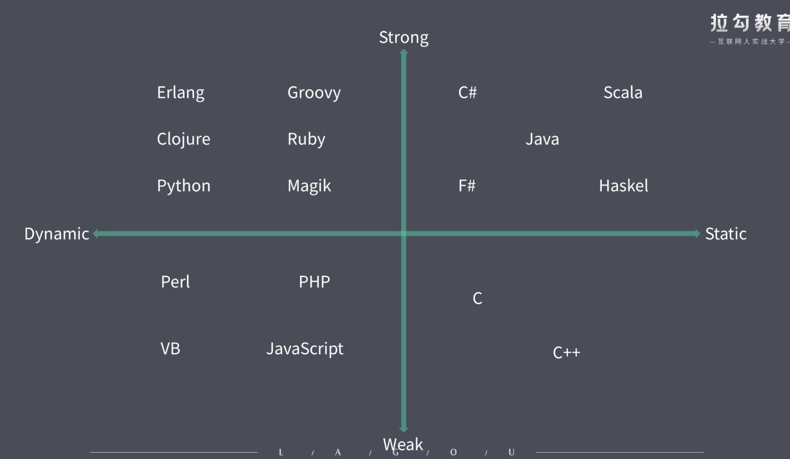

# 类型安全和类型检查

## 强类型和弱类型(类型安全)

### 强类型

语言层面限制函数的实参类型必须和形参类型相同

### 弱类型

语言层面不限制实参类型

### 理解
> 强类型有更强的类型约束, 而弱类型中几乎没有什么约束
> 强类型中不允许存在隐式类型转换, 但是弱类型中允许存在
> 弱类型语言编译时不会抛出异常, 而是运行时抛出异常。

## 静态类型和动态类型(类型检查)

### 静态类型

一个变量声明时，类型就是明确的, 并且声明过后就不允许修改了(c#, java)

### 动态类型

运行阶段才明确变量类型, 并且变量类型可以发生变化(js, python)

## 总结

