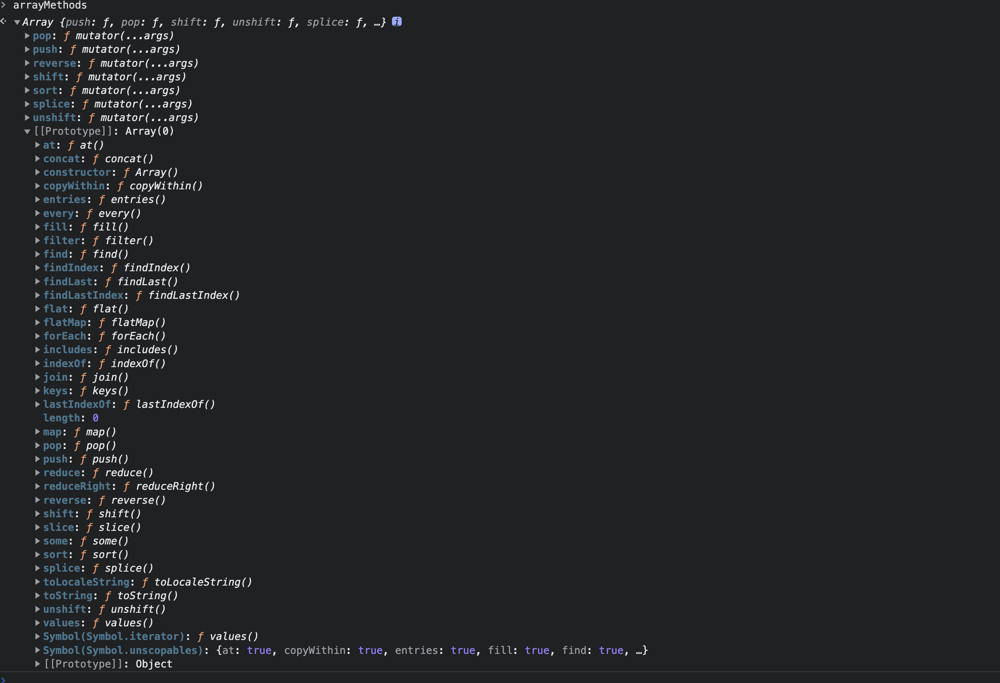

# 数组的响应式原理

数组响应式的核心代码, 在`Observer`类的构造函数中

## 过程分析

1. 首先看一下`Observer`类的构造器, 先初始化三个变量`value(观测对象), dep(依赖对象), vmCount(实例计数器)`, 通过`observe`观察数组时, 初始化`ob`时创建`Observer`对象, 并赋值给`ob`
2. 所以构造器参数, `value`表示当前数组, 然后初始化`dep`实例, 将实例计数器设置为0
3. 接着将`__ob__`挂到当前value上, 也就是当前数组上, 设置为`不可枚举`, 防止数组遍历时找到该属性, 进而对`__ob__`设置响应式
4. 通过`Array.isArray(value)`的判断后, 开始处理数组, 通过`hasProto`判断浏览器环境是否支持`__proto__`, 用于处理浏览器兼容性, 原理很简单: `const hasProto = '__proto__' in {}`, 浏览器环境的对象上存在`__proto__`属性
5. 通过`hasProto`判断, 执行 `protoAugment(value, arrayMethods)`方法
   1. 函数有两个参数, 一个是`value`表示当前数组, 一个是`arrayMethods`, `arrayMethods`是一个经过响应式改造的和数组相关的7个方法的合集
   2. `protoAugment`方法很简单, 就是重新设置当前数组的原型属性, 让他重新指向传入的第二个参数`arrayMethods`, 也就是改造后的数组原型方法(7个, 同时这7个方法又继承了最初的所有数组原型方法, 由于原型链查找特性, 是不断的通过实例往`__proto__`上层层查找, 优先查找爹, 所以优先调用最近的一级, 也就是重写后的方法)
   3. 其实这里的核心就在于`arrayMethods`
      1. 首先使用数组的原型创建一个新对象 `const arrayMethods = Object.create(Array.prototype)`
      2. 然后声明一个数组, 用于存放需要修改的数组方法的名称(string), 也就是`methodsToPatch`, 意思是要修补的方法
      3. 这七个方法为: `push, pop, shift, unshift, splice, sort, reverse`, 这些方法都有一个共同的特点, 就是他们都会修改原数组, 而当数组的元素发生变化后, 需要调用`dep.notify`去发送通知, 派发更新, 通知watcher需要更新视图
      4. 但是原始的数组方法, 并不知道`dep`的存在, 也就不会调用`dep.notify`发送通知
      5. 重写的核心在于下面的源码中所描述的forEach循环
      6. 遍历上述的`methodsToPatch`
      7. 首先保存元素组方法`const original = arrayProto[method]`, 也就是`original`
      8. 然后调用Object.defineProperty 重新定义数组的方法, 如下
         1. 执行原始数组方法, 通过apply改变原有的this指向, 指向新的调用者(也就是当前数组, 比如组件`data`中的`arrayTst`), `args`获取调用时入参, 直接传入方法中调用, 并将结果存储到`result`中
         2.  获取当前数组的`ob`对象(这个this代表当前处理的数组, 这个数组在`observe`调用后添加了`__ob__`)
         3.  `inserted`用于暂存数组方法调用后新增的元素, 比如`push, unshift, splice`
         4.  如果是`push`或`unshift`, 参数就是新增的元素, 如果是`splice`, 那么新增的元素是参数的第三个元素开始的后续元素(前两个是需要删除元素的开始位置和数量)
         5.  如果有新增的元素, 则调用`ob.observeArray(inserted)`, 该方法作用是遍历入参, 执行`observe`方法, 如果新元素是对象, 那么将为其修改为响应式对象
         6.  最终通过`ob.dep.notify()`发送通知, 将对应的结果返回
         7.  返回当前数组方法的调用结果
6. 若没有通过`hasProto`判断, 说明当前环境不支持`__proto__`, 则调用`copyAugment(value, arrayMethods, arrayKeys)`
   1. 前两个参数和之前的`protoAugment`一样, 但是多了`arrayKeys`
   2. `arrayKeys`定义如下: `const arrayKeys = Object.getOwnPropertyNames(arrayMethods)`
   3. 其实就是获取了`arrayMethods`中特有的成员的键名, 也就是获取在`arrayMethods`中新增的修补原数组的那7个方法的名称, 返回的是一个数组
   4. 然后在`copyAugment`内部遍历这七个元素, 使用`def`方法将上面重写后的`arrayMethods`中对应的方法直接附加在当前数组上, 并设置为不可枚举类型, 防止被遍历到(因为没有原型属性, 所以不能使用原型链, 直接挂载当前数组对象上, 设置为不可枚举即可, 方法的重写在`arrayMethods`初始化时已经完成呢)
7. 上述5和6两个步骤, 核心作用就是修补会改变原数组数据的那7个方法, 当这些方法被调用时, 调用`dep.notify`, 通知watcher去更新视图
8. 然后调用`observerArray(value)`, 传入数组, 遍历数组中所有可被遍历的成员, 将其中的对象成员转换为响应式对象

## 核心源码

### Observer构造器

```ts
constructor (value: any) {
  this.value = value
  this.dep = new Dep()
  this.vmCount = 0
  // def 基于 Object.defineProperty封装, 将value.__ob__设置为不可枚举, 防止后续设置getter和setter时, __ob__ 被遍历
  // ? 不可枚举属性主要作用就是遍历隐身
  def(value, '__ob__', this)
  if (Array.isArray(value)) {
    if (hasProto) {
      // 服务端渲染或部分浏览器环境下, 对象上没有 __proto__属性, 以此来区分是否服务端渲染
      protoAugment(value, arrayMethods)
    } else {
      copyAugment(value, arrayMethods, arrayKeys)
    }
    // * 遍历数组中的每一个对象, 创建一个 observer 实例
    this.observeArray(value)
  } else {
    // * 遍历对象中的每一个属性, 添加getter/setter
    this.walk(value)
  }
}
```

### arrayMethods初始化

```ts
const arrayProto = Array.prototype
// 使用数组的原型创建一个新的对象, 对象的__proto__就是数组的原型
export const arrayMethods = Object.create(arrayProto)

// 修改数组元素的方法
const methodsToPatch = [
  'push',
  'pop',
  'shift',
  'unshift',
  'splice',
  'sort',
  'reverse'
]

/**
 * Intercept mutating methods and emit events
 */
methodsToPatch.forEach(function (method) {
  // cache original method
  // 保存数组原方法
  const original = arrayProto[method]
  // 调用Object.defineProperty 重新定义数组的方法
  def(arrayMethods, method, function mutator (...args) {
    // 执行数组的原始方法
    const result = original.apply(this, args)
    // 获取数组对象的 ob 对象
    const ob = this.__ob__
    // 暂存新增的元素
    let inserted
    switch (method) {
      case 'push':
      case 'unshift':
        // * 如果是 push 或者 unshift 就是往数组最后或者最前面插入值的方法, 就把 inserted 的值置为 数组方法参数值
        inserted = args
        break
      case 'splice':
        // * 如果是 splice 那么这个inserted 就是 参数数组的第三个值, 也就是插入或者改变的值
        inserted = args.slice(2)
        break
    }
    if (inserted) ob.observeArray(inserted) // * 对参数数组中的每一项添加一次响应式(当然, 这一项首先得是 Object)
    // notify change
    // * 通知订阅者更新
    ob.dep.notify()
    return result
  })
})
```

#### 修补过程简介
> 首先调用数组原有的方法
> 
> 接着找到可能给数组新增元素的方法, 并取出新增的元素
> 
> 如果新增了元素, 则通过`ob.observeArray`方法, 将新增元素中的对象数据类型转换为响应式对象
> 
> 调用数组的ob对象的`notify`方法发送通知
> 
> 最后返回当前数组方法的调用结果


#### 最终结果如下所示:


### protoAugment函数

```ts
function protoAugment (target, src: Object) {
  /* eslint-disable no-proto */
  target.__proto__ = src
  /* eslint-enable no-proto */
}
```

### copyAugment

```ts

const arrayKeys = Object.getOwnPropertyNames(arrayMethods)

/**
 * Augment a target Object or Array by defining
 * hidden properties.
 */
/* istanbul ignore next */
function copyAugment (target: Object, src: Object, keys: Array<string>) {
  for (let i = 0, l = keys.length; i < l; i++) {
    const key = keys[i]
    def(target, key, src[key])
  }
}
```

### Observer 中的 observeArray实例方法

```ts
observeArray (items: Array<any>) {
  for (let i = 0, l = items.length; i < l; i++) {
    // * 也就是说数组添加响应式，只针对数组下面是一个对象的条目，如果数组的成员是值类型就不会添加响应式
    observe(items[i])
  }
}
```

## 总结

> 数组响应式的核心就在于将会改变原有数组元素的方法, 进行重新修补, 当这些方法被调用时, 调用`dep.notify`进行派发更新
>
> 调用`observerArray`去遍历所有数组中可遍历的成员, 如果该成员是对象, 则设置为响应式对象
> 
> 可以发现上述代码中并没有处理数组对象的属性, 因为数组中的元素可能会非常多(上E的量级), 如果去处理数组对象的属性, 将会导致严重的性能问题
> 
> 如果一定要处理数组中某个元素, 最好的方式是通过splice来实现, 比如说`arr = [1,2,3]`, 此时要改变第三个元素, `arr.splice(2, 1, 100)`
> 
> 删除元素: `arr.splice(0)`, 不需要传个数, 代表从0开始全部删除
> 
