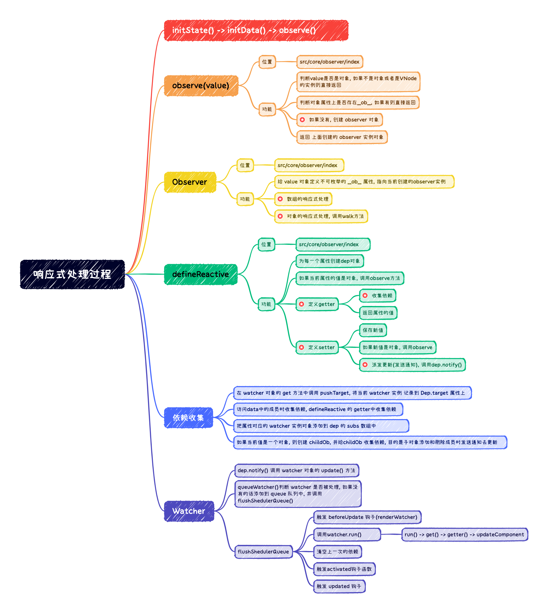

# 数据响应式原理-总结

## 图示总结

## 过程总结

1. 整个响应式是从`Vue实例的_init`方法开始的
  + 通过`initState`初始化`Vue`实例的状态
  + 在`initState`中调用`initData`
  + `initData`通过`proxy`方法将`data`属性注入到`Vue实例`上
  + 调用`observe()`方法将`data`对象转换为响应式对象
2. `observe`方法就是响应式的入口
  + 接收的参数是响应式要处理的对象
  + 判断参数`value`是否为对象, 或者是否为VNode实例, 如果不是对象或者为VNode实例, 直接返回
  + 判断`value`对象上是否存在`__ob__`, 如果有直接返回
  + 核心: 如果没有, 创建 `observer` 实例对象
  + 返回 上面创建的 `observer` 实例对象
3. 创建 `Observer`实例对象 (`new Observer(value)`)
  + `def(value, '__ob__', this)`, 为当前的value对象, 定义一个不可枚举的 `__ob__`属性, 这个属性指向当前的`observer`实例
  + 进行数组的响应式处理, 也就是设置`arrayMethods`, 然后调用`protoAugment 或 copyAugment`, 将重写的那7个方法挂载到数组原型上(支持原型)或者当前属性上(不支持原型), 最后调用`observeArray`, 为数组中的对象添加响应式
    - 数组调用上面拦截的7个方法`pop, push, splice, unshift, shift, sort, reverse`会触发当前数组身上的`dep`实例的`notify`去派发更新
    - 更改完上面的7个方法后, 遍历数组中的每个成员, 对每个成员调用`observe`, 如果该成员是对象, 则会转换为`响应式对象`, 不是对象则不会, 所以下标直接更新数组的值是不会引起组件更新的
    - 不为对象下所有属性添加响应式的原因: 数组没有固定的键名, 也许会有非常庞大的数组, 容易引起性能问题
  + 对象的响应式处理, 调用 `walk` 方法
    - 深度遍历 对象的所有属性, 对每一个属性调用 `defineReactive`
4. defineReactive
  + 为每一个属性创建 `dep` 对象, 让`dep`去收集依赖
  + 如果当前属性的值是对象, 则调用 `observe`继续添加响应式处理, 转换为响应式对象
  + 定义`getter`
    - 收集依赖, 如果属性的值是对象, 则需要为子对象的值收集依赖
    - 返回属性的值 
  + 定义`setter`
    - 保存新值
    - 如果新的值是对象, 则调用 `observe` 将新设置的对象转换为响应式对象
    - 最后要发送通知, 派发更新, 也就是调用 `dep.notify()`
5. 收集依赖
  + 在 `Watcher` 对象的 `get` 方法中调用 `pushTarget` , 将当前的`watcher`实例记录 到`Dep.target` 属性中
  + 访问 data 中的成员时就会触发收集依赖, 也就是触发`defineReactive` 的 `getter`, 在`getter`中收集依赖
  + 把属性对应的 `watcher` 对象添加到 `dep` 的`subs`数组中
  + 如果这个属性的值是一个对象, 此时要创建一个 childOb 对象, 为子对象收集依赖, 目的是将来子对象添加和删除成员时(发生变化)也会发送通知
  + 数组中成员发生变化其实就用到了这个 `childOb`
6. Watcher
  + 之前演示了数据发生变化时, Watcher 的执行过程
  + 当数据发生变化时, 会调用 `dep.notify()`发送通知, 内部会调用 `watcher` 实例的 `update` 方法
  + 在`update`方法中, 调用 `queueWatcher`函数, 在内部首先判断 `watcher` 是否被处理, 如果没有, 则添加到 `queue`队列中, 并通过 `nextTick(flushSchedulerQueue)` 最终调用`flushSchedulerQueue`方法刷新任务队列函数
  + `flushSchedulerQueue`
    - 首先触发 `beforeUpdate`钩子函数(`renderWatcher`)
    - 调用 `watcher.run`
      - 在`watcher.run`方法中, 调用 `watcher.get`
      - 然后调用 `watcher.getter`方法 
      - `watcher.getter`对于`renderWatcher`就是`updateComponent`, `computedWatcher`就是获取属性的函数(用户设置的)
      - `userWatcher`会继续触发 `cb` 方法, 也就是用户设置的 `watch`属性侦听器
    - 运行完成 `watcher.run`之后, 会清空上一次的依赖， 重置 `watcher`中的一些状态
    - 触发 `activated`钩子
    - 触发 `updated` 钩子
