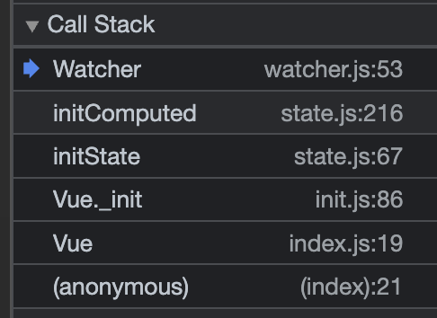
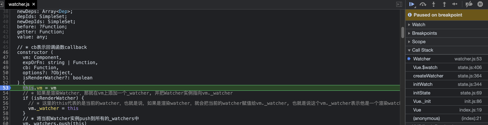
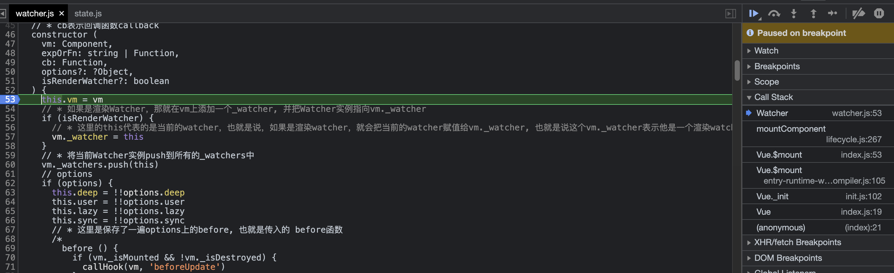

# 数据响应式原理-\$watch

## watch 回顾

### `vm.$watch`

> `vm.$watch(expOrFn, callback, [options])`

-   功能
    -   观察 Vue 实例变化的一个表达式或计算属性函数。回调函数得到的参数为新值和旧值。表达式只接受监督的键路径。对于更复杂的表达式, 用一个函数取代。
-   参数
    -   expOrFn: 要监视的 `$data` 中的属性, 可以是表达式函数
    -   callback: 数据变化后执行的函数
        -   函数: 回调函数
        -   函数: 具有 `handler` 属性(字符串或者函数), 如果该属性为字符串则 `methods` 中相应的定义
    -   options: 可选的选项
        -   deep: 布尔类型, 深度监听
        -   immediate: 布尔类型, 是否立即执行一次回调函数

### 示例

```ts
const vm = new Vue({
    el: "#app",
    data: {
        a: "1",
        b: "2",
        msg: "hello vue",
        user: {
            firstName: "赵",
            lastName: "云",
            fullName: ""
        },
    },
});

vm.$watch(
    "user",
    function(newVal, oldVal) {
        console.info(newVal);
        this.user.fullName = newVal.firstName + " " + newVal.lastName;
    },
    {
        immediate: true,
        deep: true,
    }
);
```

## 三种类型的Watcher

+ `$watch`没有静态方法, 因为`$watch`方法中需要使用到Vue的实例
+ `Watcher`分三种: 计算属性 Watcher、用户 Watcher(侦听器)、渲染 Watcher
  - 创建顺序: 计算属性 Watcher、 用户 Watcher(侦听器)、 渲染 Watcher
+ vm.$watch()
  - 位置: src/core/instance/state.js 

### 调试代码

```ts
const vm = new Vue({
  el: "#app",
  data: {
    a: "1",
    b: "2",
    msg: "!euV olleH",
    user: {
      firstName: "赵",
      lastName: "云",
      fullName: ""
    }
  },
  computed: {
    reversedMsg() {
      return this.msg.split('').reverse().join('');
    }
  },
  watch: {
    user: {
      handler: function (newVal, oldVal) {
        console.info(newVal);
        this.user.fullName = newVal.firstName + ' ' + newVal.lastName;
      },
      immediate: true,
      deep: true
    }
  }
});
```

### Watcher创建顺序

> 开启调试后, 可以在`Call Stack`中看到是哪一个函数调用的 `new Watcher`

1. 首先第一个初始化的`Watcher`是`computedWatcher`, 如下图所示
  + 通过属性名可以发现, 创建`Watcher`的入口是`initComputed`, 在其中调用`new Watcher`创建`computedWatcher`
  + 在`initState`函数中调用`initComputed`初始化了`computed`属性(在`initState`中先后初始化了`props, methods, data, computed和watch`)
  + 通过这个名字可以发现, 首先初始化的是`computedWatcher`, 执行`initComputed(vm, opts.computed)`, 传入vue实例和当前计算属性
  + 将断点设置到`Watcher`的构造函数中, 初始化id的位置, 可以发现当前`computedWatcher`的id值为`1`, 也可以表示他是第一个被初始化的`Watcher`

2. 继续前进到下一次`Watcher`实例初始化的位置, 观察右侧`Call Stack`, 可以发现第二个`Watcher`是通过`$watch`创建的
  + 依然是在`_init`中调用`initState`, 然后调用`initWatch(vm, opts.watch)`, 传入选项中设置的`watch`侦听器
  + 接着是通过`createWatcher(vm, key, handler)`进入中间过程
  + 在`createWatcher`中通过`vm.$watch(expOrFn, handler, options)`
  + 最后在`$watch`中调用`new Watcher(vm, expOrFn, cb, options)`创建`UserWatcher`实例
  + 此时`Watcher`对应的id是`2`

3. 最后是创建`renderWatcher`
  + 这里可以看到是在`mountComponent`中创建的`renderWatcher`
  + `mountComponent`是在首次渲染时候调用的函数, 也就是说`renderWatcher`是在首次渲染后创建的, 通过参数(`isRenderWatcher`)标识此时创建的`watcher`是一个`renderWatcher`
  + 此时`Watcher`的id是`3`

1. 以上就是Watcher的创建顺序, 现在看执行顺序, 执行Watcher的入口是调用`flushSchedulerQueue`函数
  + 在其中首先会对`Watcher`通过创建顺序排序, 然后依次执行这几个`Watcher`, 当前前提是这几个`Watcher`都要执行
  + 所以执行的顺序也是先执行`computedWatcher`, 再执行`userWatcher`, 最后执行`renderWatcher`


### computedWatcher

#### initState -> initComputed

> 1. 在`initState`中触发`initComputed`方法, 初始化`computed`属性
> 
> 2. `initComputed`在`initWatch`之前
> 
> 3. 通过`initComputed(vm, opts.computed)`创建了 `computedWatcher`, 传入`当前vue实例`和选项中的`computed`属性值
> 

```ts
export function initState(vm: Computed) {
  ...
  const opts = vm.$options
  ...
  if (opts.computed) initComputed(vm, opts.computed)
  // 后续继续初始化 watch
  ...
}
```

#### initComputed

> 1. 首先将`vm._computedWatchers`直接拷贝给 `watchers`变量, 如果没有则通过 `Object.create(null)`创建一个新的空对象(无原型)
> 
> 2. 判断是否`服务端渲染`, 并用 `isSSR`存储结果
> 
> 3. 遍历vue实例的计算属性配置
> 
> 4. `const userDef = computed[key]`获取当前计算属性值
> 
> 5. 使用`getter`接收获取当前值的函数
> 
> 6. 如果 `getter` 不存在则开发环境抛错, 说明使用有误
> 
> 7. 非`SSR`环境下, 通过`watchers[key]`接收创建的`watcher`实例
>   + 传入四个参数, 依次为: 
>      - `vm`实例
>      - `getter`方法, 如果没有`getter`则是空函数, 防止阻塞
>      - `noop`空函数
>      - `computedWatcherOptions`, 这个`options`内部只有一个属性, 就是`lazy: true`
> 
> 8. 判断是否在vm上有`key`, 计算属性的`key`不能和 `data`, `methods`, `props`上的名字重复
> 
> 9. 若没有重复, 则通过 `defineComputed(vm, key, userDef)`, 劫持计算属性值
> 
> 10. 若有重复则对应开发环境抛错
> 
> 注: 为什么计算属性要设置`lazy: true`, 主要就是在初始化`Watcher`时
> 计算属性不用立即获取值而是在render中获取计算属性对应的值时, 在调用`get`去获取值即可

```ts
const computedWatcherOptions = { lazy: true }

function initComputed (vm: Component, computed: Object) {
  // * 初始化计算属性
  // $flow-disable-line
  // * 向计算属性订阅者的原型上设置一个空对象, 并且将其缓存下来
  const watchers = vm._computedWatchers = Object.create(null)
  // computed properties are just getters during SSR
  const isSSR = isServerRendering() // * 用于判断是不是服务端渲染

  for (const key in computed) {
    // * 遍历所有计算属性(定义的)
    const userDef = computed[key]
    // * 本身可以是一个函数，也可以是一个对象，我们一般都写得函数，当然也可以写一个对象，但是对象必须有get
    const getter = typeof userDef === 'function' ? userDef : userDef.get
    if (process.env.NODE_ENV !== 'production' && getter == null) {
      warn(
        `Getter is missing for computed property "${key}".`,
        vm
      )
    }

    if (!isSSR) {
      // create internal watcher for the computed property.
      watchers[key] = new Watcher(
        vm, // * vm实例
        getter || noop, // * 传入的getter
        noop, // * 传入的回调函数
        computedWatcherOptions // * 传入的配置, 这里是{lazy: true}
      )
      // * 在这里实例化每一个computed的watcher
    }

    // component-defined computed properties are already defined on the
    // component prototype. We only need to define computed properties defined
    // at instantiation here.
    if (!(key in vm)) {
      // * computed的key不能和 data 或者 props下面的key有重复
      defineComputed(vm, key, userDef)
    } else if (process.env.NODE_ENV !== 'production') {
      if (key in vm.$data) {
        warn(`The computed property "${key}" is already defined in data.`, vm)
      } else if (vm.$options.props && key in vm.$options.props) {
        warn(`The computed property "${key}" is already defined as a prop.`, vm)
      }
    }
  }
}
```

#### defineComputed

> 1. 首先根据是否SSR设置一个值`shouldCache`, 主要是看是否需要缓存, 非服务端环境需要缓存
> 
> 2. 判断入参`userDef`是否是一个函数, 如果是函数
>   + 设置`sharedPropertyDefinition`的get属性
>   + 如果非SSR环境, 则设置为`createComputedGetter(key)`
>   + 如果是SSR环境, 则设置为`createGetterInvoker(userDef)`
>   + 由于`userDef`是一个函数, 说明没有`set`方法, 所以调用`sharedPropertyDefinition.set = noop`将set设置为一个空函数
> 
> 3. 一般`userDef`不是函数就是对象
>   + 还是先设置`sharedPropertyDefinition.get`, 根据`shouldCache`和`userDef.cache !== false`来确定
>   + 默认情况下走`createComputedGetter(key)`
>   + 如果是服务端渲染或者说`userDef.cache设置为了false`, 就会走`createGetterInvoker(userDef.get)`, 和上面一样
>   + 将`set`属性设置为`userDef.set`, 如果没有就是空函数
> 
> 4. 如果set属性是空函数, 则设置为抛错, 提示用户当前没有`setter`属性
> 
> 5. 通过`Object.defineProperty(target, key, sharedPropertyDefinition)`将`computed`挂载到实例上
>   + 通过`this`访问计算属性就会访问 `sharedPropertyDefinition.get`
>   + 通过`this`设置计算属性, 就会访问 `sharedPropertyDefinition.set`
> 6. `createComputedGetter`
>   + 返回一个命名函数`computedGetter`
>   + 获取当前`key`所对应的`watcher`(computedWatcher)
>   + `watcher.dirty`在`computedWatcher`执行`update`方法时, 就变成了`true`(默认值也是`true`, 以确保第一次执行可以进入)
>   + 执行`watcher.evaluate`方法, 内部主要是执行`watcher.get`, 并将结果赋值给`this.value(也就是watcher.value)`, 然后将`watcher.dirty`设置为`false`
>   + 上面执行`get`方法后, `Dep.target`就变成了当前的`computedWatcher`, 然后执行`getter`, 对于`computedWatcher`来说, `getter`就是定义的回调函数(或者get属性), 然后做清除工作, 并返回`getter`得到的值, 将这个值赋值给`this.value`(`evaluate函数逻辑`)
>   + 经过`get`后的清理工作后, `Dep.target`变成了栈里面剩下的`watcher`, 剩下的那一个的`lazy`为`false`, 说明不是 `computedWatcher`, `user`也是`false`, 说明不是`userWatcher`, 所以他是`renderWatcher`
>   + 继续执行`watcher.depend()`, 进行依赖收集, 继续将`renderWatcher`收集到`当前计算属性`的`dep`的`subs`中, 便于下一次派发更新(派发更新的过程就如上面所示, 在`watcher.update`中只修改了`dirty`为true在重新执行`updateComponent`(也就是`renderWatcher的getter`)时, 触发`render`, 在`render`中触发新的计算属性的`getter`, 也就是当前`computedGetter`, 重新走一遍当前逻辑, 然后结束)
>   + 最终返回`watcher.value`, 也就是上面的`watcher.evaluate()`执行后赋给`watcher`的新的值
> 
> 7. `createGetterInvoker`
>   + 接受一个函数, 返回一个命名函数, 命名函数内部直接执行入参函数, this指向为当前调用者(比如通过`this.xxx`访问`xxx`, 指向`this(组件实例)`)

```ts
const sharedPropertyDefinition = {
  enumerable: true,
  configurable: true,
  get: noop, // * 空函数noop
  set: noop
}
export function defineComputed (
  target: any,
  key: string,
  userDef: Object | Function
) {
  const shouldCache = !isServerRendering() // * 如果不是服务端渲染, 那么就需要缓存, 将 shouldCache 置为 true
  if (typeof userDef === 'function') {
    // * 在计算属性下面直接定义的就是一个函数的情况
    sharedPropertyDefinition.get = shouldCache
      ? createComputedGetter(key)
      : createGetterInvoker(userDef)
    sharedPropertyDefinition.set = noop // * 非SSR情况下，计算属性是没有set属性的, 他只是根据订阅的数据发生变化的时候, 执行并返回一个值
  } else {
    // * 当然，如果定义的是一个对象，那么就可以设置set和get方法，通过set方法可以对其进行赋值，但实际上直接对计算属性赋值的情况是很少的
    sharedPropertyDefinition.get = userDef.get
      ? shouldCache && userDef.cache !== false
        ? createComputedGetter(key)
        : createGetterInvoker(userDef.get)
      : noop
    sharedPropertyDefinition.set = userDef.set || noop
  }
  if (process.env.NODE_ENV !== 'production' &&
      sharedPropertyDefinition.set === noop) {
    sharedPropertyDefinition.set = function () {
      warn(
        `Computed property "${key}" was assigned to but it has no setter.`,
        this
      )
    }
  }
  Object.defineProperty(target, key, sharedPropertyDefinition)
}

function createComputedGetter (key) {
  // * 访问计算属性，就会执行以下方法并且得到他的返回值
  return function computedGetter () {
    const watcher = this._computedWatchers && this._computedWatchers[key]
    if (watcher) {
      if (watcher.dirty) { // * lazy为true, 所以watcher.dirty也是true
        watcher.evaluate()
        // * 执行完后获得value, 并且将 dirty 设置为 false
        // * 通过getters 获取 value, 这个getters就是定义的计算属性
      }
      // 此时Dep.target是`renderWatcher`
      if (Dep.target) {
        watcher.depend()
      }
      return watcher.value
    }
  }
}

function createGetterInvoker(fn) {
  return function computedGetter () {
    return fn.call(this, this)
  }
}
```

### userWatcher

> 先从侦听器创建的开始, 因为在侦听器创建的过程中最终调用了`$watch`方法

#### initState -> initWatch

> 1. 首先在`src/core/instance/state.js`中, 找到`initState`
> 
> 2. 在`initState`中触发`initWatch`传入组件(或Vue入口)设置的`watch`配置
> 
```ts
export function initState (vm: Component) {
  vm._watchers = []
  const opts = vm.$options
  ...
  if (opts.watch && opts.watch !== nativeWatch) {
    initWatch(vm, opts.watch)
  }
}
```
#### initWatch -> createWatch

> 1. 首先遍历 `watch`对象的`key`(键名)
> 
> 2. 使用 `handler` 存储当前 `watch`成员的值
> 
> 3. 从判断可以看出, `watch` 中的属性值, 可以是一个`数组`
> 
> 4. 如果当前`watch`属性值是一个数组, 则遍历数组成员, 调用 `createWatcher`继续处理
>   + 这里可以看到, 如果传入的属性值是一个数组, 那么Vue会遍历数组, 创建多个对应的处理函数
>   + 也就是说, 当这个属性发生变化时, 会执行多个回调函数
> 5. 如果传递的不是数组, 则直接调用 `createWatcher(vm, key, handler)` 进行后续的处理
>

```ts
function initWatch (vm: Component, watch: Object) {
  // * 侦听属性的初始化
  for (const key in watch) {
    // * 遍历所有的watch, 拿到每一个设置的侦听属性
    const handler = watch[key]
    if (Array.isArray(handler)) {
      for (let i = 0; i < handler.length; i++) {
        createWatcher(vm, key, handler[i])
      }
    } else {
      createWatcher(vm, key, handler)
    }
  }
}
```

#### createWatcher -> $watcher

> 1. 先判断当前传入的 `handler` 是否是一个原生对象
> 
> 2. 如果是原生对象, 先用`options`存储该对象, 然后将其中 `handler` 函数(回调函数)取出来
>   + 上面的例子就是这样的形式
> 
> 3. 判断`handler`是否是一个字符串
>   + 这里可以直接写一个字符串, 然后会通过`vm`去`methods`中寻找对应的函数
>   + 通过`initState`可以看出来, 在`initWatch`执行时, `initMethods`已经执行完毕, `vm`上可以获取到所有的`methods`成员
> 
> 4. 最后调用 `vm.$watch(expOrFn, handler, options)`, 将刚刚解析好的数据, 作为`$watch`的参数

```ts
function createWatcher (
  vm: Component,
  expOrFn: string | Function,
  handler: any,
  options?: Object
) {
  // ! 这里, 如果直接定义的 userWatcher 就是一个函数, 那么以下两个判断都不会走进去, options 就是 undefined
  // ! 在new Watcher 的时候, 执行 Watcher 类的构造器, 此时 options 那个判断中会将所有的设置为false
  if (isPlainObject(handler)) {
    options = handler
    handler = handler.handler
  }
  if (typeof handler === 'string') {
    handler = vm[handler]
  }
  return vm.$watch(expOrFn, handler, options)
}
```

#### $watch -> new Watcher

> 1. `$watch`接收了三个参数, 一个`expOrFn(一般是监听的对象)`, 一个`cb(回调函数)`和一个`options(watch中的属性值)`
> 
> 2. 第一步是获取当前组件(或Vue)实例
> 
> 3. 判断当前传入的`cb`是不是一个对象, 因为`$watch`可以直接调用, 不一定会经过`createWatcher`, 而这个参数也可以直接传递一个对象
>   + 之前$watch的例子中, 传递的是一个函数
>   + 如果传入的是一个对象, 那么就重新经过一次`createWatcher`处理一下
> 
> 4. 如果`options`曾经解析过(`createWatch`解析过options), 就直接赋值
> 
> 5. 使用`options.user = true`标记当前watcher是 `userWatcher`, 当然这也是为什么这个`watcher`叫做`用户watcher`的原因
> 
> 6. 将处理好的参数, 传入 `Watcher`的构造函数, 创建`userWatcher`实例
> 
> 7. 判断是否需要立即执行, 如果需要, 通过try catch 执行侦听器回调函数
>   + try catch 主要是确保后续代码没有错误
>   + 因为是首次执行, 因此没有`oldValue`, 而`newValue`就是当前值, 所以直接传入 `watcher.value`即可
> 
> 8. 如果回调函数执行有报错, 则通过 catch 捕获并抛出异常
> 
> 9. 返回一个取消监听的方法, 内部调用 `watcher.teardown`来取消监听
> 

```ts
Vue.prototype.$watch = function (
    expOrFn: string | Function,
    cb: any,
    options?: Object
): Function {
  const vm: Component = this
  if (isPlainObject(cb)) {
    return createWatcher(vm, expOrFn, cb, options)
  }
  options = options || {}
  options.user = true
  const watcher = new Watcher(vm, expOrFn, cb, options)
  if (options.immediate) {
    try {
      cb.call(vm, watcher.value)
    } catch (error) {
      handleError(error, vm, `callback for immediate watcher "${watcher.expression}"`)
    }
  }
  return function unwatchFn () {
    watcher.teardown()
  }
}
```

#### 通过 new Watcher 创建 userWatcher

> 主要是`user`属性和 `userWatcher`有关, 其余和`renderWatcher`类似
> 
> 1. 首先取出`options`中的`user`, 为`watcher`实例的`user`赋值
> 
> 2. 如果通过`$watch`直接传入的函数, 那么就直接将`expOrFn`传给`getter`
> 
> 3. 正常情况下, `getter`应该通过`parsePath(expOrFn)`去生成, 返回的是`获取属性的方法`
>   + 主要是因为`expOrFn`一般情况下就是属性名称, 否则通过`$watch`传递的第一个参数应该也是获取属性的方法
> 
> 4. 然后调用`get`方法时, 如果调用上面的`getter`, 也就是获取属性的方法, 出现了异常, 此时会处理这个异常
> 
> 5. 接着判断有没有`deep`属性, 如果有的话, 会深度监听
>   + 由于在`get`的第一句, 就将`Dep.target`换成了当前 `userWatcher`
>   + 所以对象的子孙成员进行监听的时候, 都会收集到当前这个`userWatcher`, 一旦变化, 则通过`dep.notify`, 最终会触发当前`watcher`的更新
> 6. 在更新过程中, 会触发 `run`方法
>   + 在run方法中, 首先通过`get`属性去获取侦听对象的值
>   + 通过`新旧值对比`和`deep`属性, 决定是否继续执行
>   + 一旦需要继续执行, 则先通过`oldValue`存储旧的值
>   + 给`this.value`赋新值
>   + 通过`this.user`判断是否是`userWatcher`
>   + 满足`userWatcher`的条件则调用`cb`, 也就是侦听器的回调函数
>   + 同样使用 `try catch`, 防止程序阻塞
> 

```ts
class Watcher {
  constructor(
    vm: Component,
    expOrFn: string | Function,
    cb: Function,
    options?: ?Object,
    isRenderWatcher?: boolean
  ) {
    ...
    if (options) {
      ...
      this.user = !!options.user;
      this.deep = !!options.deep;
      ...
    }
    ...
    if (typeof expOrFn === 'function') {
      this.getter = expOrFn
    } else {
      this.getter = parsePath(expOrFn);
      ...
    }
    ...
  }

  get () {
    pushTarget(this)
    let value
    const vm = this.vm
    try {
      value = this.getter.call(vm, vm)
    } catch (e) {
      if (this.user) {
        handleError(e, vm, `getter for watcher "${this.expression}"`)
      } else {
        throw e
      }
    } finally {
      // "touch" every property so they are all tracked as
      // dependencies for deep watching
      if (this.deep) {
        // * 递归的把每一个数组或者对象下的所有值都跑一遍，目的是为了触发每一个值的getter来收集依赖
        // * 这样只要deep下面的监听对象发生了改变, 就会触发setter去派发更新, 然后就会触发userWatcher的this.run(), 去执行this.cb
        traverse(value)
      }
      popTarget()
      this.cleanupDeps()
    }
    return value
  }

  run () {
    if (this.active) {
      const value = this.get()
      if (
        value !== this.value ||
        // Deep watchers and watchers on Object/Arrays should fire even
        // when the value is the same, because the value may
        // have mutated.
        isObject(value) ||
        this.deep
      ) {
        // set new value
        const oldValue = this.value
        this.value = value
        if (this.user) {
          try {
            this.cb.call(this.vm, value, oldValue)
          } catch (e) {
            handleError(e, this.vm, `callback for watcher "${this.expression}"`)
          }
        } else {
          this.cb.call(this.vm, value, oldValue)
        }
      }
    }
  }
}
```

### renderWatcher

### Watcher源码
```ts
// Watcher
export default class Watcher {
  vm: Component;
  expression: string;
  cb: Function;
  id: number;
  deep: boolean;
  user: boolean;
  lazy: boolean;
  sync: boolean;
  dirty: boolean;
  active: boolean;
  deps: Array<Dep>;
  newDeps: Array<Dep>;
  depIds: SimpleSet;
  newDepIds: SimpleSet;
  before: ?Function;
  getter: Function;
  value: any;

  // * cb表示回调函数callback
  constructor (
    vm: Component,
    expOrFn: string | Function,
    cb: Function,
    options?: ?Object,
    isRenderWatcher?: boolean
  ) {
    this.vm = vm
    // * 如果是渲染Watcher，那就在vm上添加一个_watcher, 并把Watcher实例指向vm._watcher
    if (isRenderWatcher) {
      // * 这里的this代表的是当前的watcher，也就是说，如果是渲染watcher，就会把当前的watcher赋值给vm._watcher, 也就是说这个vm._watcher表示他是一个渲染watcher
      vm._watcher = this
    }
    // * 将当前Watcher实例push到所有的_watchers中
    vm._watchers.push(this)
    // options
    if (options) {
      this.deep = !!options.deep
      this.user = !!options.user
      this.lazy = !!options.lazy
      this.sync = !!options.sync
      // * 这里是保存了一遍options上的before, 也就是传入的 before函数
      /*
        before () {
          if (vm._isMounted && !vm._isDestroyed) {
            callHook(vm, 'beforeUpdate')
          }
        }
      */
      this.before = options.before
    } else {
      this.deep = this.user = this.lazy = this.sync = false
    }
    // * 将回调函数cb传给this.cb
    this.cb = cb
    this.id = ++uid // uid for batching
    this.active = true
    this.dirty = this.lazy // for lazy watchers
    this.deps = []
    this.newDeps = []
    this.depIds = new Set()
    this.newDepIds = new Set()
    // * 如果是开发环境，就将传入的expOrFn转换为字符串
    // * 实际上这个expression只是让你看一下是什么，并没有太大的用处，关键是下面的
    // * toString()并不改变原来的类型, 只会返回一个新的字符串
    this.expression = process.env.NODE_ENV !== 'production'
      ? expOrFn.toString()
      : ''
    // parse expression for getter
    // * 如果expOrFn是一个函数，那就将这个函数赋值给Watcher的getter
    // * 否则就使用parsePath将expOrFn转换为一个函数在赋值给实例的getter
    if (typeof expOrFn === 'function') {
      this.getter = expOrFn
    } else {
      this.getter = parsePath(expOrFn)
      // TODO parsePath 返回一个函数,在userWatcher中，expOrFn代表的watch变量的键名
      // TODO 最后这个键名会变成一个数组，数组中只有一个成员就是这个键名
      // TODO 就是以下函数, 其中 segments 就是 ['expOrFn'], 毕竟在userWatcher 中 expOrFn就代表的是 userWatcher的键名
      /* 
      *  function (obj) {
      *    for (let i = 0; i < segments.length; i++) {
      *      if (!obj) return
      *      obj = obj[segments[i]]
      *    }
      *    return obj
      *  }
      */
      if (!this.getter) {
        this.getter = noop
        process.env.NODE_ENV !== 'production' && warn(
          `Failed watching path: "${expOrFn}" ` +
          'Watcher only accepts simple dot-delimited paths. ' +
          'For full control, use a function instead.',
          vm
        )
      }
    }
    // * 如果是lazy模式，那就不作任何操作，否则将this.get()返回值赋值给this.value
    // TODO 在new Watcher的时候, 就会对userWatcher进行一次求值
    this.value = this.lazy
      ? undefined
      : this.get()
  }
}
```

