# Vue初始化完整流程

```ts
new Vue({
  el: "#app",
  data: {
    msg: 'Hello Vue'
  }
});
```
## Vue初始化过程

1. 首先在`src/core/instance/index`中声明了Vue一个构造函数
2. 然后调用了`initMixin(Vue)`, `stateMixin(Vue)`, `eventsMixin(Vue)`, `lifecycleMixin(Vue)`, `renderMixin(Vue)`给Vue的原型上挂载了一系列实例成员(可以在调试器的Source => Watch的位置添加一个Vue来观察实例成员注册情况)
> 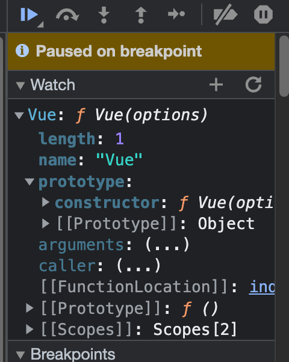
  + a. `initMixin(Vue)`: 向Vue原型上挂载 `_init`方法
> 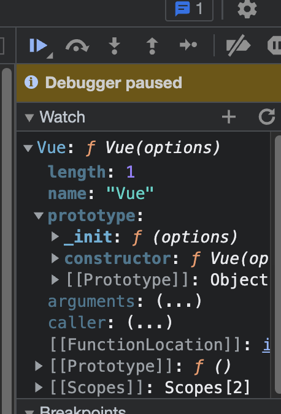
  + b. `stateMixin(Vue)`: 向Vue原型上挂载`$data`(初始化为undefined), `$props`(同样初始化为undefined), `$delete`, `$set`以及`$watch`
> 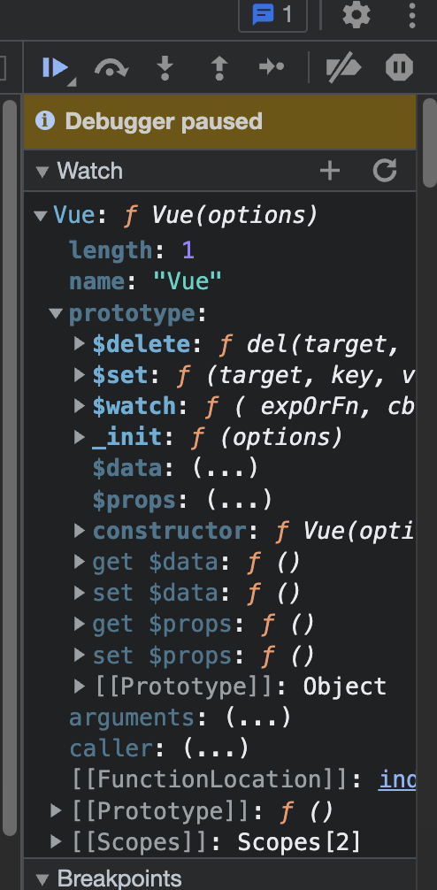
  + c. `eventsMixin(Vue)`: 向Vue原型上挂载了`$on`, `$once`, `$off`和`$emit`四个和事件相关的方法
> 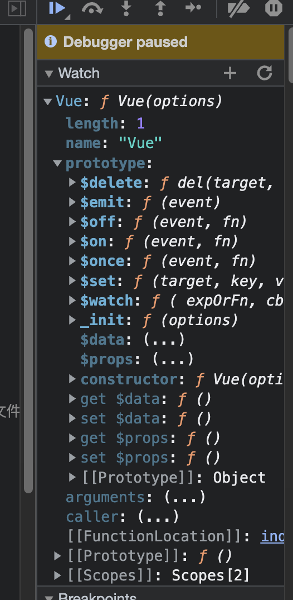
  + d. `lifecycleMixin(Vue)`: 向Vue原型上挂载了`_update`, `$forceUpdate`, `$destroy`这三个和生命周期相关的方法, 其中`_update`方法内部调用了`__patch__`方法, 作用是将`VNode`转换为`realNode`
> 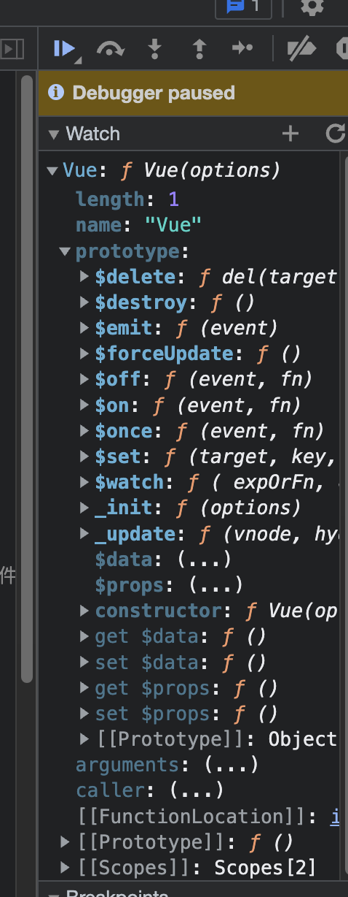
  + e. `renderMixin(Vue)`: 执行完毕后, 会在原型上挂载一系列`_`开头的方法, 主要作用是将模板转换为render函数后, 在render函数中会调用这些方法, 同时注册了`$nextTick`和`_render`, `_render`主要是调用用户的render函数或者模板编译后的render函数
> 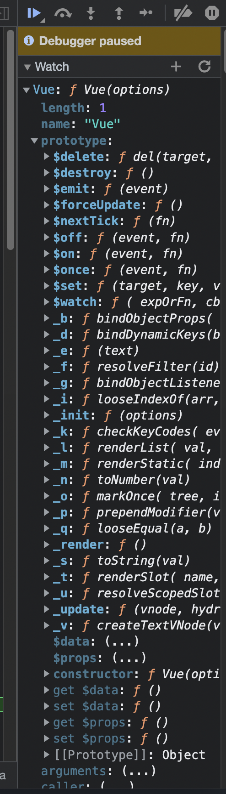
3. 然后通过`src/core/index`中执行`initGlobalAPI`初始化了Vue的静态成员
  + a. 通过`Object.defineProperty(Vue, 'config', configDef)`为Vue的构造函数中增加了一个`config`属性, 这是一个对象, 并且其中已经初始化了很多内容, 主要通过给`config`对象增加一个get方法, 通过这个get方法获取config
  + 而这个config, 主要来自于外部模块`src/core/config.js`, 都是和平台相关的
> 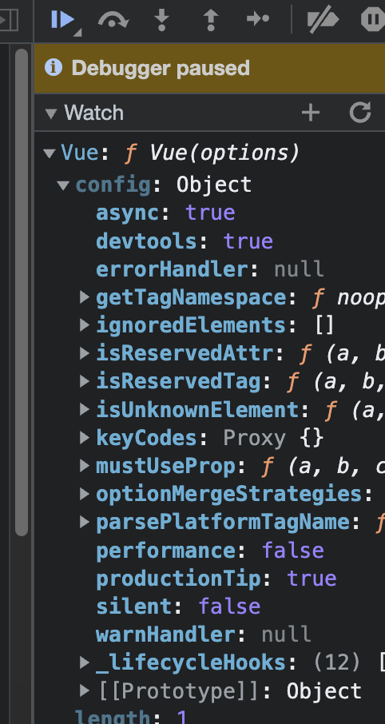
  + b. 初始化了`Vue.util`, 并且在其中增加了几个方法, 这几个方法Vue都不建议直接调用(但是可以调用)
> 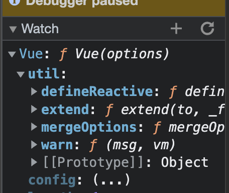
  + c. 接下来按顺序初始化了`set`, `delete`, `nextTick`方法
> 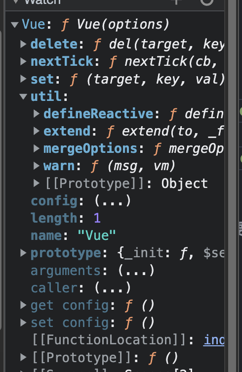
  + d. 然后初始化了`observable`
  + e. 然后通过`Vue.options = Object.create(null)`初始化了`options`成员(无`__proto__`的全空数组), 然后向内部初始化了`components/directives/filters`这几个成员
> 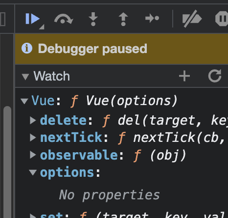
> 
> 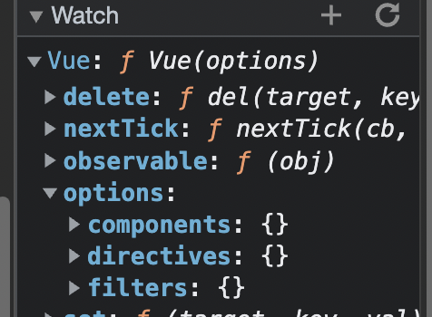
  + f. 用`options._base`来缓存`Vue`构造函数: `Vue.options._base = Vue`
  + g. 通过`extend(Vue.options.components, builtInComponents)`初始化第一个组件`keep-alive`, 并将这个组件放到`options.components`中作为全局组件
> 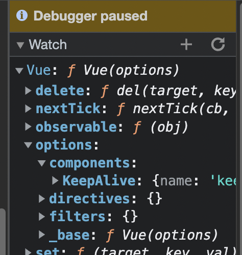
  + h. `initUse(Vue)`: 向Vue上扩展静态方法`use`, 用于注册插件
  + i. `initMixin(Vue)`: 向Vue上扩展静态方法`mixin`, 实现全局混入
  + j. `initExtend(Vue)`: 向Vue上扩展静态方法`extend`, 该方法基于传入的options返回一个组件的构造函数
  + k. `initAssetRegisters(Vue)`: 扩展`Vue.directive`, `Vue.component`, 和 `Vue.filter`, 主要用于注册全局的指令、组件和过滤器, 调用他们时, 会将前三者注册到Vue.options下对应的属性(`Vue.options.directives/components/filters`)中
> 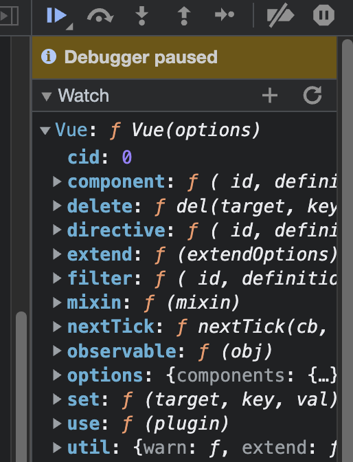

> 上述1-3是与平台无关的, 所有平台均要执行
4. 在`src/platform/web/runtime/index`中, 首先给Vue.config中注册了一些与平台相关的方法
  + a. 首先在Vue的原型上注册几个和平台相关的方法: `mustUseProp/isReservedTag/isReservedAttr/getTagNamespace/isUnknownElement`
  + b. 接下来注册了几个和平台相关的指令(`v-show/v-model`)和组件(`Transition/TransitionGroup`)
  + c. 在Vue原型上注册`__patch__`和`$mount`方法
> 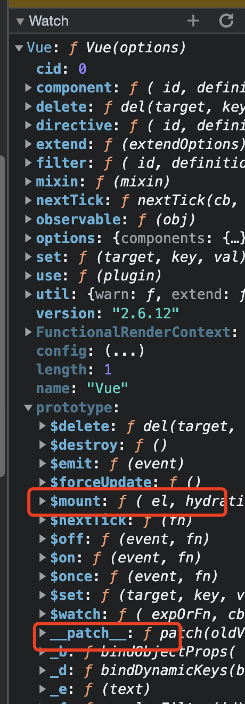
5. `src/platform/web/runtime/entry-runtime-with-compiler`是打包的入口, 打包的是完整版Vue, 在这里包含`运行时`和`编译器`, 在这里重写了上面的 `$mount`方法, 在其中增加了将模板编译成函数的功能
  + a. 首先缓存了`runtime/index`中在原型上声明的`$mount`方法: `const mount = Vue.prototype.$mount`
  + b. 然后重写`$mount`, 增加了将模板编译为render函数的功能
  + c. 然后在Vue上增加静态成员`compile`, 可以让我们手动将模板转换为render函数

## Vue首次渲染的过程

依然在上述四个导出Vue的文件中设置对应的断点

前面的步骤和Vue初始化一样, 核心部分在于Vue构造函数中调用的`this._init`方法

1. 和上面一样, 首先在`core/instance/index`中声明Vue的构造函数后, 经过一系列的操作初始化了一系列实例成员
2. 然后通过`initGlobalAPI`声明了一系列静态成员
3. 然后在`web/runtime/index`中初始化了一系列和平台相关的内容
4. 在入口文件`src/platform/web/runtime/entry-runtime-with-compiler`中重写`$mount`方法
5. 然后执行`new Vue()`就开始执行`_init`方法
6. 首先使用`vm`存储Vue实例
7. 在实例上增加唯一标识`_uid`
8. 然后是做一些性能检测内容, 与功能无关
9. 实例上设置标记`_isVue`为`true`, 后续设置响应式对象的时候通过该标记来忽略, 不进行`observe`
10. 通过`options._isComponent`判断当前实例是否为组件`if (options && options._isComponent) {`(options来自`_init`入参), 如果是组件, 通过`initInternalComponent`来合并options选项
11. 此处非组件初始化, 为Vue实例初始化, 则通过`vm.$options = mergeOptions(resolveConstructorOptions(vm.constructor), options || {}, vm)`来合并options, 并将合并后的options添加到实例的`$options`上
12. 合并后vm.$options上就拥有了用户传过来的`el`和`data`等, 以及上面Vue初始化过程中添加到Vue静态成员的options上的`_base/components/filters/directives`
13. 接下来是设置`vm._renderProxy`也就是渲染时的代理对象, 如果是开发环境则通过调用`initProxy`设置, 生产环境直接就是当前实例`vm`, 也就是直接将`vm`赋值给`vm._renderProxy`(`vm._renderProxy = vm`)
14. initProxy: 1. 首先判断当前浏览器环境是否支持Proxy对象, 不支持则和生产环境一致。2.若支持, 则通过 `new Proxy(vm, handler)`来代理vue实例, 也就是`vm._renderProxy = new Proxy(vm, handlers)`
15. 接下来通过`initLifecycle/initEvents/initRender`挂载一些成员, 详细的上一节说过, 然后通过`callHook`触发 `beforeCreate`周期, 继续通过`initInjections/initState/initProvide`等继续挂载实例成员, 在通过`callHook`触发 `created`周期
16. 首次渲染的重点在于`$mount`方法, 调用`vm.$mount(vm.$options.el)`
17. 入参为用户传入的`el`(也就是`vm.$options.el`, 上面合并的)
18. 此时触发的是`entry-runtime-with-compiler`中的`$mount`方法, 核心是将模板编译为render函数
  1. 首先`el = el && query(el)`, 转换el标识符为dom对象, 然后通过`options`来存储`vm.$options`(`const options = vm.$options`)
  2. 判断`options`中是否存在`render`函数
  3. 如果没有`render`, 则获取选项中的`template`
  4. 如果`template`存在, 则判断`template`是否是一个字符串
  5. 如果不是字符串, 则判断是否存在`nodeType`, 存在则说明模板是一个DOM元素, 直接获取`template.innerHTML`, 然后将其作为模板继续处理
  6. 如果是字符串, 将继续判断字符串的第一个字符是不是`#`(模板是否为id选择器), 如果是, 则通过`idToTemplate`将这个id转换为DOM元素, 获取其中的`innerHTML`作为模板
     1. `idToTemplate`很简单, 主要是通过`document.querySelector(el)`直接获取元素, 如果本身是元素则直接返回, 然后返回其`innerHTML`
     2. 通过`cached`包裹一层做缓存处理
  7. 如果既不是字符串, 也不是一个DOM元素, 会在开发环境告警, 说我们的模板不合法, 并且返回当前的Vue实例(`return this;`)
  8. 接下来判断是否存在el, 则直接通过`getOuterHTML(el)`将结果赋值给template(此处的例子就走这里)
     1. 如果有el.outerHTML, 则直接返回
     2. 如果没有的话, el可能不是一个dom元素, 是一个文本节点或注释节点, 此时会创建一个div, 然后将el对应的内容添加到div下面, 最终将div的innerHTML返回作为模板
  9. 调用`compileToFunctions`, 将模板编译为`render`函数, 执行后返回 `render`和`staticRenderFns(主要是优化用的, 编译部分在继续看)`
  10. 然后将`render`和`staticRenderFns`存储到`options`选项中
  11. 最终通过`mount.call(this, el, hydrating)`执行最初的`$mount`方法, 也就是`web/runtime/index`中定义的`$mount`实例方法, 运行时版本直接走这里
  12. 这里要重新获取el, 因为运行时版本会直接执行这个mount方法, 是没有获取el对应的dom对象的, 就是一个字符串, 因此要重新获取一次
  13. 接下来执行`mountComponent`
19. 上面的代码都是和浏览器相关的, `mountComponent`是与浏览器无关的, 他是Vue的核心代码
      1. 首先使用vm.$el将传入的el做一次缓存
      2. 然后判断`!vm.$options.render`, 内部的一系列判断主要针对如下情况: 当前处于runtime环境, 但是又通过选项传入了模板(因为无render函数)。此时会在开发环境发送一个警告, 意思是当前使用的是运行时版本, 编译器是无效的, 应该使用render函数或使用编译器版本(因为编译版本会自动将模板编译为render函数, 这里不可能出现没有render函数的情况)
      3. 接下来触发 `beforeMount`生命周期
      4. 接下来定义 `updateComponent`, 就是更新组件(挂载), 后续进行赋值
      5. 判断是否为开发环境, 如果是则启动一系列性能监测埋点
      6. 核心在于`updateComponent = () => { vm._update(vm._render(), hydrating) }`
      7. 内部调用了`vm._render`方法, 作用是调用用户传入的render或编译器生成的render, 最终会返回`VNode`, 然后将`VNode`传给`vm._update`方法去生成真实的dom, 最后更新到页面上
      8. 但是当前updateComponent只是定义, 并不执行
      9. 接下来创建`Watcher`对象(`new Watcher(vm, updateComponent, noop, { before () { if (vm._isMounted && !vm._isDestroyed) { callHook(vm, 'beforeUpdate') } } }, true)`), 传入了 updateComponent, 所以updateComponent的执行是在Watcher中调用的(这个Watcher是renderWatcher)
         1. Watcher构造函数一共接收5个参数, 1是`Vue实例(组件实例)`, 2是updateComponent, 3是空函数, 4号参数的options内部有一个before方法用于触发 `beforeUpdate`钩子, 5用于标识是一个renderWatcher(渲染Watcher)
         2. 接着在其中定义了一系列属性, 后续在继续关注
         3. 这里只关注`lazy`, 这里的`options`中没有传递`lazy`, 使用双感叹号将`lazy`的值转换为了`false`
         4. `lazy`的意思是`延迟执行`, `watcher`最终的目的是更新视图, `lazy`的目的就是告诉这个`watcher`是否需要延迟更新视图
         5. 此处为首次渲染, 需要立即更新视图, 所以这里的`lazy`是false, 如果是`computedWatcher`, 则是延迟执行, 因为`computedWatcher`需要依赖值发生变化在执行视图更新
         6. 判断二号参数expOrFn是否为一个function, 如果是的话, 则将expOrFn赋值给`this.getter`, 此处为function, 如果不是(userWatcher不是function), 则需要解析处理
         7. 接下来给`this.value`赋值, 首先判断`lazy`, 如果为false, 则直接执行`get()`
            1. get方法首先执行`pushTarget(this)`, 将当前的watcher对象压入栈中
            2. 每一个组件都有一个renderWatcher, 用于渲染视图, 嵌套组件首先渲染的是内部组件, 所以需要将`爹的renderWatcher`保留起来, 首先触发`儿子的renderWatcher`的渲染, 去渲染儿子
            3. 关键在于`value = this.getter.call(vm, vm)`, 这里调用了上面存储的getter, 也就是二号参数`updateComponent`
            4. 这里主要就是说在 get 方法内部调用 updateComponent 并改变内部this的指向, 使其指向当前vue实例或组件实例, 并传入该实例
      10. 最后通过callHook触发`mounted`生命周期钩子, 并返回最新的vue实例(组件实例)


### $mount
```ts
Vue.prototype.$mount = function (
  el?: string | Element,
  hydrating?: boolean
): Component {
  el = el && query(el)

  /* istanbul ignore if */
  // * 如果el是一个body或者是html文档标签，那么就会抛错，然后直接返回
  // * 如果是body或者html标签，在编译之后就会直接将body或者html标签直接覆盖了，会导致整个html文档就错了，因此在开发环境直接报错
  if (el === document.body || el === document.documentElement) {
    process.env.NODE_ENV !== 'production' && warn(
      `Do not mount Vue to <html> or <body> - mount to normal elements instead.`
    )
    return this
  }

  const options = this.$options
  // resolve template/el and convert to render function
  // * 判断是否定义了render方法
  if (!options.render) {
    // * 判断是否存在template
    let template = options.template
    if (template) {
      // * template可以是一个"#xxx"这种形式
      if (typeof template === 'string') {
        // * 如果template是一个string，并且是#开头，那么将执行idToTemplate，判断是否存在该id的选择器，如果存在则返回该选择器下面的内容赋值给template，如果不存在，则template会得到一个空字符串
        // * 如果template是一个空字符串，那么在开发环境就会抛错
        if (template.charAt(0) === '#') {
          template = idToTemplate(template)
          /* istanbul ignore if */
          if (process.env.NODE_ENV !== 'production' && !template) {
            warn(
              `Template element not found or is empty: ${options.template}`,
              this
            )
          }
        }
      } else if (template.nodeType) {
        // * 如果template是一个标签，那么就将内部的所有节点取出来，赋值给新的template
        template = template.innerHTML
      } else {
        // * 如果存在template，但是既不是一个string也不是一个ELement，直接抛错
        if (process.env.NODE_ENV !== 'production') {
          warn('invalid template option:' + template, this)
        }
        return this
      }
    } else if (el) {
      // * 如果没有template有el，则获取el所在的dom节点，如果el所在的dom节点不存在，则创建一个空的div,拿到div的InnerHTML
      // ! outerHTML是一个字符串,此处的template是一个字符串
      template = getOuterHTML(el)
    }
    if (template) {
      // * 以下为编译部分
      /* istanbul ignore if */
      if (process.env.NODE_ENV !== 'production' && config.performance && mark) {
        mark('compile')
      }

      // * 通过compileToFunctions编译函数拿到一个render函数和静态staticRenderFns函数
      const { render, staticRenderFns } = compileToFunctions(template, {
        outputSourceRange: process.env.NODE_ENV !== 'production',
        shouldDecodeNewlines,
        shouldDecodeNewlinesForHref,
        delimiters: options.delimiters,
        comments: options.comments
      }, this)
      // * 然后赋值给options的render函数和staticRender函数
      options.render = render
      options.staticRenderFns = staticRenderFns

      /* istanbul ignore if */
      if (process.env.NODE_ENV !== 'production' && config.performance && mark) {
        mark('compile end')
        measure(`vue ${this._name} compile`, 'compile', 'compile end')
      }
    }
  }
  // * 这一步$mount主要就是拿到el，然后判断是否存在render函数，如果没有render函数，就把template转换为一个render函数
  // * 也就是说Vue只认识一个render函数，如果说有render函数，那就直接忽略上面所有的步骤，直接走到这一步
  // * 这里的this指向Vue实例
  return mount.call(this, el, hydrating)
}
```

### getOuterHTML

```ts
function getOuterHTML (el: Element): string {
  if (el.outerHTML) {
    // * 如果存在则返回el本身的标签
    return el.outerHTML
  } else {
    // * 如果不存在则创建一个新的标签并返回
    const container = document.createElement('div')
    container.appendChild(el.cloneNode(true))
    return container.innerHTML
  }
}
```

### runtime/mount

```ts
Vue.prototype.$mount = function (
  el?: string | Element,
  hydrating?: boolean
): Component {
  el = el && inBrowser ? query(el) : undefined
  // * 内部调用mountComponent, 用于渲染DOM
  return mountComponent(this, el, hydrating)
}
```

### mountComponent(与浏览器无关)

> mountComponent方法 在 core/instance/lifecycle 中定义

```ts
export function mountComponent (
  vm: Component,
  el: ?Element,
  hydrating?: boolean
): Component {
  // * 首先使用vm.$el将传入的el做一次缓存
  vm.$el = el
  // * 如果本身就没有传入一个render函数，并且template也没有转换为一个render函数
  if (!vm.$options.render) {
    // * 首先创建一个空的虚拟节点
    vm.$options.render = createEmptyVNode
    if (process.env.NODE_ENV !== 'production') {
      /* istanbul ignore if */
      // * 在开发环境中抛出警告，如果定义了template并且template的第一个值不是#，定义了el或者执行mountComponent时候传入了el，则抛出警告
      // * 这个警告表明使用的runtime-only版本，但是又使用了template，而不是渲染函数render
      if ((vm.$options.template && vm.$options.template.charAt(0) !== '#') ||
        vm.$options.el || el) {
        warn(
          'You are using the runtime-only build of Vue where the template ' +
          'compiler is not available. Either pre-compile the templates into ' +
          'render functions, or use the compiler-included build.',
          vm
        )
      } else {
        warn(
          'Failed to mount component: template or render function not defined.',
          vm
        )
      }
    }
  }
  // * 在此处执行beforeMount
  // * 和mounted不同的是，beforeMount这个钩子函数，是先父后子的
  // * 因为mountComponent的执行，是一层一层向内部执行的
  callHook(vm, 'beforeMount') 

  let updateComponent
  /* istanbul ignore if */
  // * 如果开发环境配置了performance，则使用mark = window.performance.mark()
  // * window.performance.mark()用于记录一个传入的名称从某一时刻到记录时刻的毫秒数
  // * 通过一个给定的名称，将该名称（作为键）和对应的DOMHighResTimeStamp（作为值）保存在一个哈希结构里。该键值对表示了从某一时刻（注：某一时刻通常是 navigationStart 事件发生时刻）到记录时刻间隔的毫秒数。
  // * 通常用来多次记录时间间隔
  // * 上下两个实际上没有太大的区别，只是第一个部上了两个性能埋点，用于测量vnode渲染花了多少时间，以及vm.update()执行花了多少时间
  if (process.env.NODE_ENV !== 'production' && config.performance && mark) {
    updateComponent = () => {
      // * Vue提供的性能埋点，文档有介绍
      const name = vm._name
      const id = vm._uid
      const startTag = `vue-perf-start:${id}`
      const endTag = `vue-perf-end:${id}`

      mark(startTag)
      const vnode = vm._render()
      mark(endTag)
      // * measure表示window.performance.measure()，同时将前面的startTag和endTag记录的时间节点清除
      // * window.performance.measure(name, start, end)用于创建一个名为name, 测量开始标志为start，测量结束标志位end的一次测量
      measure(`vue ${name} render`, startTag, endTag)

      mark(startTag)
      vm._update(vnode, hydrating)
      mark(endTag)
      measure(`vue ${name} patch`, startTag, endTag)
    }
  } else {
    // * 定义了一个updateComponent函数，在函数中调用vm._update(vm._render(), hydrating)
    // * 第一个参数是通过vm._render()来渲染出的一个VNode，第二个参数和服务端渲染相关
    // * 在Watcher这个渲染观察者的constructor中，调用this.get()中就会使用到updateComponent，然后执行vm._render()渲染一个vNode
    // * 在通过vm._update将其挂载出来
    updateComponent = () => {
      // * 通过vm_render()返回了一个VNode，这是顶层的一个VirtualDom节点
      vm._update(vm._render(), hydrating)
    }
  }

  // we set this to vm._watcher inside the watcher's constructor
  // since the watcher's initial patch may call $forceUpdate (e.g. inside child
  // component's mounted hook), which relies on vm._watcher being already defined
  // * 通过new Watcher来执行上面定义的updateComponent, 这里的Watcher是一个渲染Watcher
  // * Watcher是和响应式原理相关的一个类，他是一个观察者，在Vue中有很多自定义的Watcher也有这样的渲染Watcher
  // * 此处就是一个渲染Watcher
  // * 此处向Watcher传入五个参数，也是Watcher类的constructor接收的五个参数，分别为
  /**
   * @param vm  当前Vue实例
   * @param expOrFn 此处传入函数或其他情况， updateComponent表示一个函数
   * @param cb 回调函数 此处使用noop空函数
   * @param options 一些配置
   * @param isRenderWatcher 是否为渲染Watcher，此处为true
   */
  // * 在watcher初始化的时候，先执行一次beforeUpdate
  // * 并且在执行beforeUpdate的时候，这个时候数据更新已经完成，只是还没有更新视图
  // TODO updateComponent是作为渲染Watcher的getter传入的
  // TODO 对于渲染watcher而言，他的回调是noop，他的getter是updateComponent
  new Watcher(vm, updateComponent, noop, {
    before () {
      if (vm._isMounted && !vm._isDestroyed) {
        callHook(vm, 'beforeUpdate')
      }
    }
  }, true /* isRenderWatcher */)
  hydrating = false

  // manually mounted instance, call mounted on self
  // mounted is called for render-created child components in its inserted hook
  if (vm.$vnode == null) {
    vm._isMounted = true
    // * 执行mounted的时期有两个，第一个就是此处，如果实例初始化的时候没有$vnode说明这是一个根节点，在mountComponent中就会触发mounted周期的函数
    callHook(vm, 'mounted')
  }
  return vm
}
```

### Watcher

```ts
class Watcher {
  constructor (
    vm: Component,
    expOrFn: string | Function,
    cb: Function,
    options?: ?Object,
    isRenderWatcher?: boolean
  ) {
    this.vm = vm
    // * 如果是渲染Watcher，那就在vm上添加一个_watcher, 并把Watcher实例指向vm._watcher
    if (isRenderWatcher) {
      // * 这里的this代表的是当前的watcher，也就是说，如果是渲染watcher，就会把当前的watcher赋值给vm._watcher, 也就是说这个vm._watcher表示他是一个渲染watcher
      vm._watcher = this
    }
    // * 将当前Watcher实例push到所有的_watchers中
    vm._watchers.push(this)
    // options
    if (options) {
      this.deep = !!options.deep
      this.user = !!options.user
      this.lazy = !!options.lazy
      this.sync = !!options.sync
      // * 这里是保存了一遍options上的before, 也就是传入的 before函数
      /*
        before () {
          if (vm._isMounted && !vm._isDestroyed) {
            callHook(vm, 'beforeUpdate')
          }
        }
      */
      this.before = options.before
    } else {
      this.deep = this.user = this.lazy = this.sync = false
    }
    // * 将回调函数cb传给this.cb
    this.cb = cb
    this.id = ++uid // uid for batching
    this.active = true
    this.dirty = this.lazy // for lazy watchers
    this.deps = []
    this.newDeps = []
    this.depIds = new Set()
    this.newDepIds = new Set()
    // * 如果是开发环境，就将传入的expOrFn转换为字符串
    // * 实际上这个expression只是让你看一下是什么，并没有太大的用处，关键是下面的
    // * toString()并不改变原来的类型, 只会返回一个新的字符串
    this.expression = process.env.NODE_ENV !== 'production'
      ? expOrFn.toString()
      : ''
    // parse expression for getter
    // * 如果expOrFn是一个函数，那就将这个函数赋值给Watcher的getter
    // * 否则就使用parsePath将expOrFn转换为一个函数在赋值给实例的getter
    if (typeof expOrFn === 'function') {
      this.getter = expOrFn
    } else {
      this.getter = parsePath(expOrFn)
      // TODO parsePath 返回一个函数,在userWatcher中，expOrFn代表的watch变量的键名
      // TODO 最后这个键名会变成一个数组，数组中只有一个成员就是这个键名
      // TODO 就是以下函数, 其中 segments 就是 ['expOrFn'], 毕竟在userWatcher 中 expOrFn就代表的是 userWatcher的键名
      /* 
      *  function (obj) {
      *    for (let i = 0; i < segments.length; i++) {
      *      if (!obj) return
      *      obj = obj[segments[i]]
      *    }
      *    return obj
      *  }
      */
      if (!this.getter) {
        this.getter = noop
        process.env.NODE_ENV !== 'production' && warn(
          `Failed watching path: "${expOrFn}" ` +
          'Watcher only accepts simple dot-delimited paths. ' +
          'For full control, use a function instead.',
          vm
        )
      }
    }
    // * 如果是lazy模式，那就不作任何操作，否则将this.get()返回值赋值给this.value
    // TODO 在new Watcher的时候, 就会对userWatcher进行一次求值
    this.value = this.lazy
      ? undefined
      : this.get()
  }

  get () {
    pushTarget(this) // TODO 在new Watcher的时候执行 get 方法, 这个时候这个 this 代表就是当前 watcher
    let value
    const vm = this.vm
    try {
      // * 这里使用了一次getter
      // * 这个getter就是在mountComponent的时候传入的updateComponet
      // * 这里执行getter也就是执行updateComponent的逻辑, 当执行updateComponent的时候，就会执行vm._render方法
      // * 在执行vm._render的时候就会触发render方法，在其中计算出最后的VNode的过程中就会触发绑定在data、props等上面的getter属性
      // * getter属性触发，就会执行dep.depend()这个方法，在其内部触发dep.target.addDep(this)，也就是watcher的addDep方法

      // TODO 也就是说，render执行过程中，访问getter属性，最终就是将订阅者watcher添加到订阅者集合subs里面去，作为当前数据的桥梁
      // TODO 然后到最后会判断是否需要深层次的订阅, 完了之后，就会执行popTarget，将当前使用的订阅者watcher给pop出去，恢复之前的watcher栈，保持Dep(类)上面的target(watcher)是最初的状态
      // TODO 在派发更新的时候，执行vm._update方法patch出真实DOM和首次渲染，并不是完全相同的

      // TODO 这里的 vm 是当前的 vue 实例
      // TODO 执行 userWatcher 的 get 方法到此处时, 通过这个 getter 传入一个当前 vue 实例, 实际上就是访问 this[key], 这里的 key 就是 userWatcher 的键名
      // TODO 然后这一次访问, 就会触发被监听对象的getter, 因此就会触发他的依赖收集
      // TODO 这样就会触发监听对象的 dep.depend(), 并且之前如之前一样, 监听对象getter执行完拿到值之后, dep.Target 又恢复成了 userWatcher
      // TODO 这样 监听对象执行 dep.depend() 的时候 就会在监听对象的 dep.subs 中 加入 userWatcher 的依赖
      // TODO 然后在 监听对象值改变的时候, 就会通过 dep.notify() 触发 userWatcher 的 update()
      // TODO 就会执行 watcher.run() 或者 queueWatcher(), 如果执行 queueWatcher() 那么就会在下一次执行 flushSchedulerQueue 的时候执行watcher.run
      value = this.getter.call(vm, vm)
    } catch (e) {
      if (this.user) {
        handleError(e, vm, `getter for watcher "${this.expression}"`)
      } else {
        throw e
      }
    } finally {
      // "touch" every property so they are all tracked as
      // dependencies for deep watching
      if (this.deep) {
        // * 递归的把每一个数组或者对象下的所有值都跑一遍，目的是为了触发每一个值的getter来收集依赖
        // * 这样只要deep下面的监听对象发生了改变, 就会触发setter去派发更新, 然后就会触发userWatcher的this.run(), 去执行this.cb
        traverse(value)
      }
      popTarget()
      this.cleanupDeps()
    }
    return value
  }
}
```
