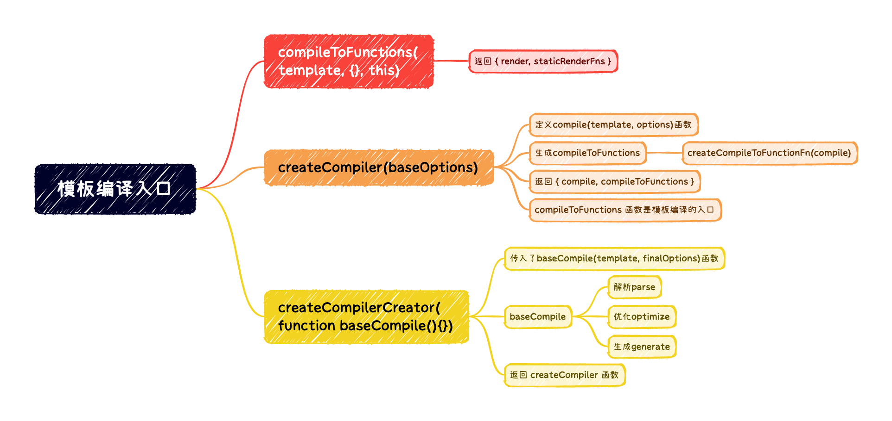

# 模板编译的入口

> 之前找模板的过程中, 在Vue的入口文件中, 看到过把template转换为render函数的位置
>
> 直接找到entry-runtime-with-compiler.js
> 
> 在存在template的情况下, 通过[compileToFunctions](/blogs/vue-resource/templateCompile/2.html#compiletofunctions)转换template, 返回了如下两个属性
>   + `render` 函数
>   + 以及`staticRendersFns`, 这是一个数组, 后面再细🔐
> 
> 然后将生成的render和staticRenderFns记录到options对应的属性中

```ts
// * 通过compileToFunctions编译函数拿到一个render函数和静态staticRenderFns函数
const { render, staticRenderFns } = compileToFunctions(template, {
  outputSourceRange: process.env.NODE_ENV !== 'production',
  shouldDecodeNewlines,
  shouldDecodeNewlinesForHref,
  delimiters: options.delimiters,
  comments: options.comments
}, this)
```

## compileToFunctions

> compileToFunctions在`web/compile/index`中定义
> 
> 与createElement类似, 他也是由一个函数生成的, 这个函数是 `createCompiler` 
> 
> 调用 createCompiler时, 传入了参数 [baseOptions](/blogs/vue-resource/templateCompile/2.html#baseoptions)选项, 这个是和web平台相关的选项
> 
> [createCompiler](/blogs/vue-resource/templateCompile/2.html#createcompiler)函数在src/compiler/index中定义

## baseOptions

> expectHTML这个表示选项期望的是HTML中的内容, 恒定为true
> 
> 然后是模块和指令
> 
> 然后是是否为Pre标签(`isPreTag`), 以及是否是一元标签(`isUnaryTag`)(也就是自闭和标签, ``这种)
> 
> 然后是是否为HTML保留标签(`isReservedTag`)等
> 
> 模块属性([modules](/blogs/vue-resource/templateCompile/2.html#modules))就在当前目录下的modules/index中
> 
> 指令([directives](/blogs/vue-resource/templateCompile/2.html#directives))也在当前目录的directives/index中


```ts
import {
  isPreTag,
  mustUseProp,
  isReservedTag,
  getTagNamespace
} from '../util/index'

import modules from './modules/index'
import directives from './directives/index'
import { genStaticKeys } from 'shared/util'
import { isUnaryTag, canBeLeftOpenTag } from './util'

export const baseOptions: CompilerOptions = {
  expectHTML: true,
  modules,
  directives,
  isPreTag,
  isUnaryTag,
  mustUseProp,
  canBeLeftOpenTag,
  isReservedTag,
  getTagNamespace,
  staticKeys: genStaticKeys(modules)
}
```

## modules

> 可以看到模块主要用于处理类样式, 行内样式以及 和v-if一起使用的v-model指令(这里是和v-if一起使用的v-model, [model](/blogs/vue-resource/templateCompile/2.html#model)的注释中有)

```ts
import klass from './class'
import style from './style'
import model from './model'

export default [
  klass,
  style,
  model
]
```

## model

> 这段注释写的很清楚, 这个model主要是处理与v-if一起出现的v-model

```ts
/**
 * Expand input[v-model] with dynamic type bindings into v-if-else chains
 * Turn this:
 *   <input v-model="data[type]" :type="type">
 * into this:
 *   <input v-if="type === 'checkbox'" type="checkbox" v-model="data[type]">
 *   <input v-else-if="type === 'radio'" type="radio" v-model="data[type]">
 *   <input v-else :type="type" v-model="data[type]">
 */
```

### directives

> 主要处理3个指令, 一个是v-model, 一个v-text, 以及v-html
> 
> 注意, 这里处理的都是模板中的指令, 都是对AST进行处理的

```ts
import model from './model'
import text from './text'
import html from './html'

export default {
  model,
  text,
  html
}
```

## createCompiler

> createCompiler这个函数, 又是通过一个函数返回的
> 
> 它调用了 createCompilerCreator, 传入了一个 baseCompile
> 
> baseCompile 是一个核心的函数, 里面做了三件事
>   + 把模板转换成 ast 抽象语法树
>   + 优化抽象语法树
>   + 把抽象语法树生成字符串形式的js代码
> 
> 这里的baseCompile, 接受模板(template)和选项(options)两个参数, 稍后重点解析这个函数
> 
> 接着进入 [createCompilerCreator](/blogs/vue-resource/templateCompile/2.html#createcompilercreator)

```ts
// `createCompilerCreator` allows creating compilers that use alternative
// parser/optimizer/codegen, e.g the SSR optimizing compiler.
// Here we just export a default compiler using the default parts.
export const createCompiler = createCompilerCreator(function baseCompile (
  template: string,
  options: CompilerOptions
): CompiledResult {
  const ast = parse(template.trim(), options)
  if (options.optimize !== false) {
    optimize(ast, options)
  }
  const code = generate(ast, options)
  return {
    ast,
    render: code.render,
    staticRenderFns: code.staticRenderFns
  }
})
```

## createCompilerCreator

> 在 `createCompiler`函数中定义了一个`compile`函数
> 
> compile函数用于接收`模板`和用户传入的`选项`
> 
> 在compile这个函数内部, 会把`createCompiler`这个函数中会把和平台相关的选项参数(`baseOptions`)以及用户传入的选项参数(`options`)进行合并
> 
> 然后再调用`baseCompile`, 将合并后的选项, 传递进去
> 
> 这是通过函数返回函数的目的, 就是用于将和平台相关的参数以及用户传入的参数准备好, 最后调用`baseCompile`开始去编译模板
> 
> 也是在其返回的 `createCompiler`函数中, 返回的两个函数, `compile`和`compileToFunctions`
>   + 其中 `compileToFunctions`这个函数, 又是通过一个函数`createCompileToFunctionFn`创建的
>   + 这个函数就是模板编译的入口, 少后继续分析这个函数做了什么
> 
> 整个过程有点绕, 后面[总结](/blogs/vue-resource/templateCompile/2.html#总结)一下

```ts
export function createCompilerCreator (baseCompile: Function): Function {
  return function createCompiler (baseOptions: CompilerOptions) {
    function compile (
      template: string,
      options?: CompilerOptions
    ): CompiledResult {
      const finalOptions = Object.create(baseOptions)
      const errors = []
      const tips = []

      let warn = (msg, range, tip) => {
        (tip ? tips : errors).push(msg)
      }

      if (options) {
        if (process.env.NODE_ENV !== 'production' && options.outputSourceRange) {
          // $flow-disable-line
          const leadingSpaceLength = template.match(/^\s*/)[0].length

          warn = (msg, range, tip) => {
            const data: WarningMessage = { msg }
            if (range) {
              if (range.start != null) {
                data.start = range.start + leadingSpaceLength
              }
              if (range.end != null) {
                data.end = range.end + leadingSpaceLength
              }
            }
            (tip ? tips : errors).push(data)
          }
        }
        // merge custom modules
        if (options.modules) {
          finalOptions.modules =
            (baseOptions.modules || []).concat(options.modules)
        }
        // merge custom directives
        if (options.directives) {
          finalOptions.directives = extend(
            Object.create(baseOptions.directives || null),
            options.directives
          )
        }
        // copy other options
        for (const key in options) {
          if (key !== 'modules' && key !== 'directives') {
            finalOptions[key] = options[key]
          }
        }
      }

      finalOptions.warn = warn

      const compiled = baseCompile(template.trim(), finalOptions)
      if (process.env.NODE_ENV !== 'production') {
        detectErrors(compiled.ast, warn)
      }
      compiled.errors = errors
      compiled.tips = tips
      return compiled
    }

    return {
      compile,
      compileToFunctions: createCompileToFunctionFn(compile)
    }
  }
}
```

## 总结

1. 在完整版的Vue入口中, 调用了`compileToFUnctions(template, {}, this)`
  1. 这个函数的作用是将模板编译为render函数
2. 这个函数是由`createCompiler(baseOptions)`生成的
  + `createCompiler`接收和平台相关的选项参数
  + 在`createCompiler`函数中
      - 定义了compile(template, options)函数, 他接收两个参数, 分别是模板和用户传入的选项
      - compile函数中, 首先会将平台相关的选项和用户传入的选项进行合并, 然后调用baseCompile, 把合并后的选项传入
      - createCompiler最后还要生成 compileToFunctions 函数
      - compileToFunctions函数就是编译的入口函数, 他又是通过一个函数返回的
      - 这个函数是`createCompileToFunctionFn`, compileToFunctions的定义, 就在这个函数中
> 到此, [入口函数](/blogs/vue-resource/templateCompile/3.html)就找到了
1. 而`createCompiler`又是通过调用`createCompilerCreator(function baseCompile(){})`生成
  + createCompilerCreator 通过接收`baseCompile`函数作为参数
  + baseCompile 这个函数接收两个参数, 分别是模板template和合并后的选项(options)
  + baseCompile主要做三件事:
      - 将模板解析为AST抽象语法树
      - 优化抽象语法树
      - 将优化后的抽象语法数转换为js形式的字符串代码
  + createCompilerCreator最后返回`createCompiler`



