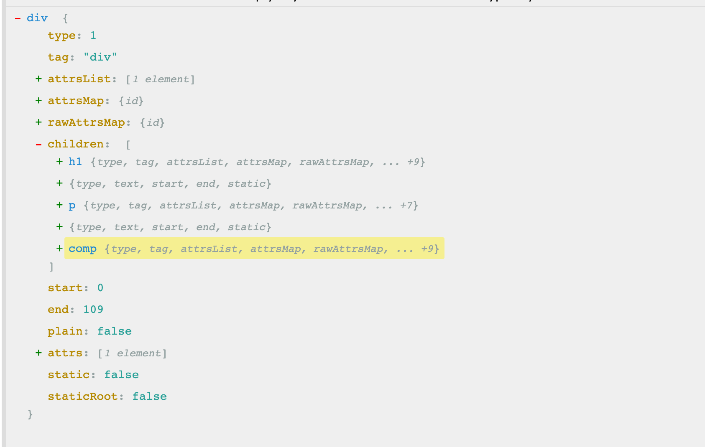

# baseCompile-AST

在compile函数中合并完选项后, 接下来调用baseCompile开始编译模板

baseCompile是模板编译的核心函数, 内部做了三件事, 这个[之前](/blogs/vue-resource/templateCompile/2.html#createcompiler)看过

+ 在`createCompilerCreator`函数调用时, 传递的参数, 就是baseCompile
+ bseCompile其实非常清晰, 但是没意见事情内部都比较复杂
    - 这种形式值得学习, 将不同功能的代码, 拆分到不同的函数中进行分别处理, 让代码结果更清晰

## 主流程

### baseCompile

1. 调用parse函数将模板字符串转换为 ast 抽象语法树
  + 抽象语法树, 用来以树形的方式描述代码结构
2. 调用optimize优化抽象语法树
3. 最后调用gererate将抽象语法树转换成字符串形式的JS代码
4. baseCompile返回值包含了ast, render以及staticRenderFns
  + 注意, 这里的render不是最终调用的render函数, 这个render是字符串形式的, 最终还要通过 toFunction转换为函数的形式
5. 在分析之前, 首先要解决两个问题:
  + 什么是 [抽象语法树AST](/blogs/vue-resource/templateCompile/2.html#ast), 因为第一步parse函数返回的就是抽象语法树
  + 为什么要使用AST

```ts
function baseCompile (
  template: string,
  options: CompilerOptions
): CompiledResult {
  // 把模板转换成 ast 抽象语法树
  // 抽象语法树, 用来以树形的方式描述代码结构
  const ast = parse(template.trim(), options)
  if (options.optimize !== false) {
    // 优化抽象语法树
    optimize(ast, options)
  }
  // 把抽象语法数生成字符串形式的js代码
  const code = generate(ast, options)
  return {
    ast,
    // 渲染函数
    render: code.render,
    // 静态渲染函数, 生成静态 VNode 树
    staticRenderFns: code.staticRenderFns
  }
}
```

## AST

### 什么是AST

+ 抽象语法树简称AST(Abstract Syntax Tree)
+ 使用对象的形式描述树形的代码结构(对象中记录父子节点, 形成树形结构)
+ 此处的抽象语法树是用来描述树形结构的HTML字符串(先把HTML字符串, 解析为AST, 记录标签中的一些必要属性, 以及解析Vue中的一些指令, 将解析后的指令记录到AST, 也就是抽象语法树, 他是一个对象)

### 为什么要使用AST

+ 模板字符串转换为AST后, 可以通过AST对模板做优化处理(标记模板中的静态部分, 也就是标签中的纯文本内容, 可以视作静态内容)
+ 标记模板中的静态内容, 在patch的时候直接跳过静态内容(称之为静态子树)
+ 在patch的过程中静态内容不需要对比和重新渲染
+ 在使用babel对代码进行降级处理的时候, 也是会先把代码转换为AST, 再把AST转换成降级之后的js代码


### vue中将模板解析后的AST样子

查看AST对象的方式有很多, 比如说打印, 或者通过调试查看

这里使用一个和`Vue Template Explorer`类似的工具, 他也是一个网站, 他可以查看各种解析器生成的AST

+ [AST Explorer](https://astexplorer.net/)

### 案例

#### template

```html
<div id="app">
  <h1>Vue<span>模板编译结果</span></h1>
  <p>{{ msg }}</p>
  <comp @myclick="handler"></comp>
</div>
```

#### AST



+ 上面的type用于记录节点的类型, type为1记录的是标签, type为3记录的是文本
+ attrsXXX用于记录标签中的属性
+ children记录子节点
  - div中的第一个标签h1, 对应的就是children中的第一个子节点
    + h1中还有子节点
    + 第一个子节点的type是3, 是一个文本节点, text记录的是文本的内容, 还有一个`static`属性, 用于标记当前节点是静态的
  - 在h1和下一个div之前, 有一个换行, 对应的AST也有一个节点来记录, 也就是children中的第二个节点
    + 会通过一个空白的文本节点来记录
    + 其实编译生成的render函数中, 标签之间的空白, 也会对应一个内容是空格的VNode节点, 这个是一致的, 因为render就是通过ast生成的
+ 其实还有个parent, 记录的爹,但是这里没有显示


