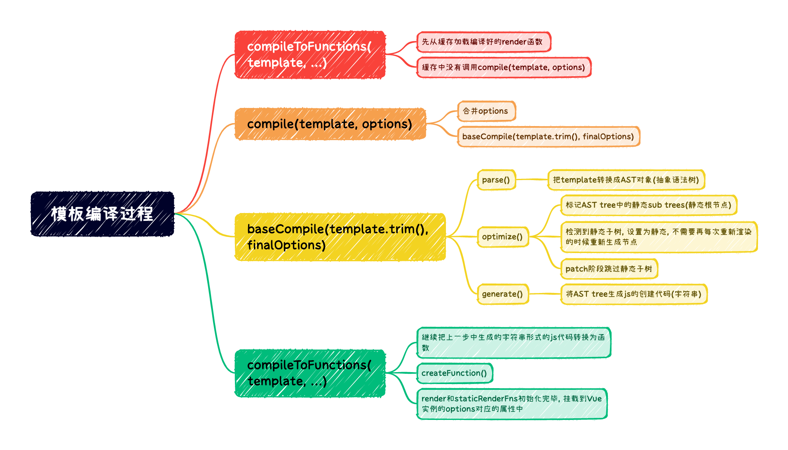

# 模板编译总结

整体过下如下所示

1. 首先执行compileToFunctions(template, ...)
    + 先从缓存加载编译好的render函数 
    + 缓存中没有调用compile(template, options)
2. 然后是执行compile(template, options)
    + 首先去合并options 
    + 然后调用baseCompile(template.trim(), finalOptions)编译模板
    + compile函数的核心是合并选项, 真正处理模板编译的工作, 实在baseCompile中完成的
3. baseCompile(template.trim(), finalOptions), 传递模板和合并好的选项
    + parse() 把template转换成AST对象(抽象语法树)
    + optimize() 对AST进行优化
      - 标记AST tree中的静态sub trees(静态根节点)
      - 检测到静态子树, 设置为静态, 不需要再每次重新渲染的时候重新生成节点
      - patch阶段跳过静态子树
    + generate() 将AST tree生成js的创建代码(字符串)
4. compileToFunctions(template, ...)
    + 当compile执行完毕后, 会继续回到compileToFunctions 
    + 继续把上一步中生成的字符串形式的js代码转换为函数
    + createFunction()
    + render和staticRenderFns初始化完毕, 挂载到Vue实例的options对应的属性中

通过编译的源码可以知道模板编译的过程中会标记静态根节点, 对静态根节点会进行处理, 在重新渲染时不会渲染静态根节点, 因为内容不会发生改变

另外, 再模板中不要写过多的空白和换行, 否则生成的AST对象会保留这些空白和换行, 会被存储到内存中, 对浏览器渲染没有任何意义, 代码规范中其实有相应的约定
