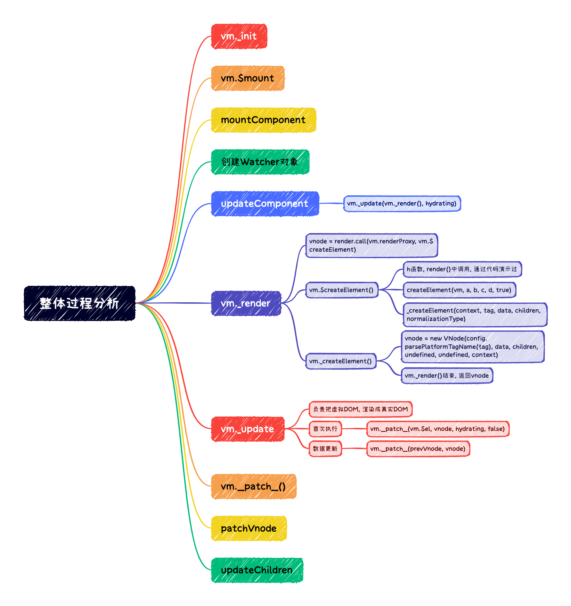

# 整体过程分析

主要分为两个部分:

1. 第一部分是之前的首次渲染的过程
2. 第二部分是和virtualDOM相关的更新和渲染部分

## 整体流程

1. 首先调用`vm._init`, 进行Vue的初始化, 开始初始化Vue的实例成员
2. 在`vm._init`中最终调用了`vm.$mount`, 在$mount中调用了`mountComponent`开始挂载组件
3. 在`mountComponent`中创建`renderWatcher`对象和定义了`updateComponent`
4. 在`watcher`对象的get方法中调用了`getter`也就是`updateComponent`, 最终调用了`vm._update(vm._render(), hydrating)`
5. 首先调用`vm._render`方法
  + 在_render中实际上就是调用开发人员自己传入的`render`函数或者编译生成的`render`函数: `vnode = render.call(vm.renderProxy, vm.$createElement)`
  + 上述render函数在调用的时候, 是通过call来调用的, 保证内部this指向当前实例, 传递的第二个参数就是`h`函数, 也就是`vm.$createElement`的简写, 最终返回了一个vnode
6. 当获取到vnode之后, 会将虚拟节点传递给`_update`方法, 在`_update`方法中调用`__patch__`, 负责将虚拟DOM转换为真实DOM并渲染到页面上
7. 在`_update`中最终调用`__patch__`函数, 在`__patch__`函数中最终调用了`patchVnode`
8. 在`patchVnode`中最终调用`updateChildren`
9. 从`vm.__patch__`开始, 几乎和`snabbdom`中的内容差不多, 只是在vue中处理了组件等

