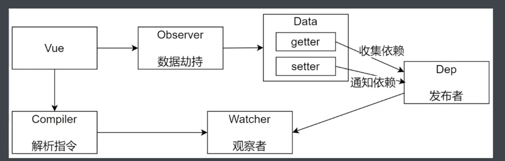
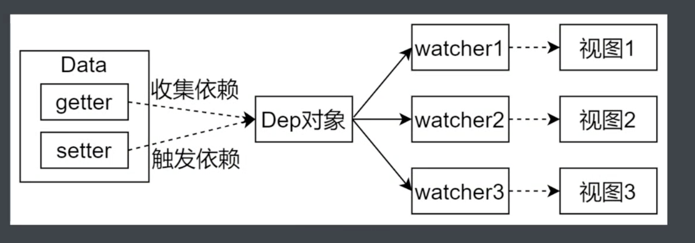

# 模拟Vue响应式原理

一个简易的Vue需要实现以下功能:

+ Vue的基本机构
+ Observer数据劫持
+ Compiler解析指令
+ Watcher观察者
+ Dep发布者

+ 将data中的成员注入到Vue实例, 并且把data中的成员转换成getter/setter
+ Observer: 能够对数据对象的所有属性进行监听, 如果变动可以拿到最新的值并通知Dep

## 实现一个小的Vue需要实现的成员

1. 首先是创建一个Vue实例, 传入挂载点`el`
2. 将data中的成员记录到$data中, 并且转换成getter和setter, $data中的getter和setter才是真正监听数据变化的地方
3. `$options`: 将构造函数的参数记录到了`$options`中
4. `_data`: 其实就是`$data`, 只不过他是私有成员
5. `$el`: 可以是选择器, 也可以是DOM对象

## Vue类实现

### 功能

+ 负责接收初始化的参数(选项)
+ 负责把data中的相互ing注入到Vue实例, 转换成getter/setter
+ 负责调用 observer 监听data中所有属性的变化
+ 负责调用 compiler 解析指令/差值表达式

### 结构

| Vue |
| ------------- |
| 属性: $options |
| 属性: $el |
| 属性: $data |
| 方法: _proxyData() |

### 初步实现

```js
class Vue {
  // 调用Vue构造函数时, 要传入一个参数 options
  constructor(options) {
    // 1. 通过属性, 保存选项的数据
    this.$options = options || {};
    this.$data = options.data || {};
    // * 如果是字符串, 说明是一个选择器则需要将这个dom对象获取下来, 如果不是, 则直接是一个dom结构
    this.$el = typeof options.el === 'string' ? document.querySelector(options.el) : options.el;
    // 2. 把data中的成员转换成getter和setter， 注入到vue实例中
    this._proxyData(this.$data);
    // 3. 调用 observer 对象, 监听数据的变化
    // 4. 调用 compiler 对象去解析指令和插值表达式
  }

  // 让Vue代理data中的属性
  _proxyData(data) {
    // 遍历data中的所有属性, 然后调用defineProperty注入到vue实例中
    Object.keys(data).forEach(key => {
      Object.defineProperty(this, key, {
        enumerable: true, // 可遍历
        configurable: true, // 可枚举
        get() {
          return data[key];
        },
        set(newVal) {
          // 数据未发生变化
          if (newVal === data[key]) {
            return
          }
          // 数据变化
          data[key] = newVal;
        }
      })
    })
  }
}
```

### Observer

Observer的作用是数据劫持, 也就是监听data中属性的变化并做出处理
1. 负责将data中的属性转换为响应式数据
2. data中如果某个属性也是对象, 将该对象下的属性也转换为响应式数据
3. 数据变化发送通知

#### 结构:

| Observer |
| ------------- |
| 方法: walk(data), 遍历data中的所有属性 |
| 方法: defineReactive(data, key, value), 将属性转换为响应式数据 |

```js
import { isObject } from './utils.js';
import Dep from './Dep.js';
// Observer的作用是数据劫持, 也就是监听data中属性的变化并做出处理
// 1. 负责将data中的属性转换为响应式数据
// 2. data中如果某个属性也是对象, 将该对象下的属性也转换为响应式数据
// 3. 数据变化发送通知

// 主要有两个东西
export default class Observer {

  constructor(data) {
    this.walk(data)
  }

  walk(data) {
    // 边界判断
    if (!data || !isObject(data)) {
      return;
    }
    Object.keys(data).forEach(key => {
      this.defineReactive(data, key, data[key]);
    })
  }

  // ? 为什么不直接通过obj[key]获取值
  // * 在直接访问vm.xx 时, 首先触发的是vue中的第一层代理 proxyData下的get, 然后再触发 Observer下的get方法
  // * 如果不是传入的val, 而是直接return obj[key], 则会发生堆栈溢出错误
  // * 因为每次触发 obj[key]时, 都会触发 getter, 而这里, 直接返回的就是obj[key], 因此不停的触发getter, 也就造成了堆栈溢出
  // * 因此, 这里应该传入一个val, 生成一个闭包, 暂存这个val, 这样就不会出现这样的问题了
  defineReactive(obj, key, val) {
    // * 如果val是一个对象, 则会把val也转换成响应式数据
    // * 实际上这里就是一个递归
    // ! 获取实例对象, 后续使用
    const vm = this;
    vm.walk(val);

    // 创建dep对象(负责收集依赖和派发更新)
    const dep = new Dep();

    // 获取属性上的描述符
    const property = Object.getOwnPropertyDescriptor(obj, key);

    if (property && property.configurable === false) {
      // 如果是不可枚举的对象直接返回, 不添加响应式
      return;
    }

    const getter = property && property.get
    const setter = property && property.set
    if ((!getter || setter) && arguments.length === 2) {
      // * 如果满足没有getter或者存在setter并且参数只传了两个那么就会将obj[key]赋值给val暂存起来
      // * 主要是做一个错误处理, 否则将反复触发getter
      val = obj[key]
    }

    Object.defineProperty(obj, key, {
      enumerable: true,
      configurable: true,
      get() {
        // 依赖收集
        Dep.target && dep.addSub(Dep.target);
        return val;
      },
      set(newVal) {
        const value = getter ? getter.call(obj) : val;
        
        if (Object.is(newVal, value)) {
          // 主要是要筛选出 NaN === NaN 以及 +0 !== -0
          return
        }
        if (getter && !setter) return; // 边界处理

        if (setter) {
          // 在setter存在的情况下, 直接触发setter即可(通常情况下是不存在的, 因为setter定义的时, 在属性描述符上并不存在setter, 并且数据不会重复劫持)
          setter.call(obj, newVal);
        } else {
          // 由于上述getter触发, 返回的是val, 因此这里直接给val赋值即可, 否则不停触发setter
          val = newVal;
        }
        // obj[key] = newVal;
        vm.walk(newVal);// 如果新赋值的属性是一个对象, 则继续添加响应式

        // 派发更新(发送通知)
        dep.notify();
      }
    })
  }
}
```

### Compiler

#### Compiler功能
1. 负责编译模板, 解析指令/插值表达式
2. 负责页面的首次渲染
3. 当数据变化后重新渲染视图

#### 结构

| Compiler |
| ------------- |
| 属性: el, 构造函数传过来的options.el, 实际上就是模板 |
| 属性: vm, vue实例 |
| 方法: compiler(el) |
| 方法: compilerElement(node) |
| 方法: compilerText(node) |
| 方法: isDirective(attrName) |
| 方法: isTextNode(node) |
| 方法: isElementNode(node) |

#### 实现

```js
import Watcher from "./Watcher.js";

export default class Compiler {
  constructor(vm) {
    // 传入vm实例
    // 将el和vm单独拿出来, 主要是为了方便后续的使用
    this.el = vm.$el;
    this.vm = vm;
    // 需要在创建完compile实例时, 立即开始编译模板, 因此这里需要立即使用compile方法
    this.compile(this.el);
  }

  // 编译模板, 处理文本节点和元素节点
  compile(el) {
    const childNodes = el.childNodes; // 这是一个伪数组, 如果要遍历, 需要转换为数组
    Array.from(childNodes).forEach(node => {
      if (this.isTextNode(node)) {
        // 文本节点则编译文本节点(处理文本节点)
        this.compileText(node);
      } else if (this.isElementNode(node)) {
        // 处理元素节点
        this.compileElement(node);
      }

      // 判断node节点是否存在子节点(尾递归)
      if (node.childNodes && node.childNodes.length) {
        this.compile(node);
      }
    });
  }

  // 编译元素节点, 处理指令
  // 只需要搞一下v-text和v-model
  // 需要知道指令的名称, 以及指令所对应的绑定值
  compileElement(node) {
    // console.info(node.attributes)
    // name属性就是属性的名称
    // value属性就是属性值(也就是指令对应的值)
    // * 1. 遍历所有的属性节点
    // * 2. 判断是否是指令
    Array.from(node.attributes).forEach(attr => {
      let attrName = attr.name;
      if (this.isDirective(attrName)) {
        // 由于指令的节点非常多, 因此这里, 不会使用又臭又长的if else 判断
        // 去除指令开头的 v-
        // const removeVAttrName = attrName.replace(/^(v\-)/g, "");
        // 也可以使用subString
        attrName = attrName.substring(2);
        let key = attr.value;
        this.update(node, key, attrName);
      }
    });
  }

  textUpdater(node, value, key) {
    // 处理v-text 指令
    node.textContent = value;
    new Watcher(this.vm, key, (newVal) => {
      node.textContent = newVal;
    });
  } 

  modelUpdater(node, value, key) {
    // 处理v-model 指令
    node.value = value;
    new Watcher(this.vm, key, (newVal) => {
      node.value = newVal;
    });
    // 双向绑定实现
    node.addEventListener('input', (e) => {
      // 触发 setter
      this.vm[key] = e.target.value;
    })
  }

  update(node, key, attrName) {
    const updateFn = this[`${attrName}Updater`];
    // 这里要将绑定的值赋给节点的value
    // 否则在update方法中, this指向不正确
    updateFn && updateFn.call(this, node, this.vm[key], key);
  }

  // 处理文本节点, 处理插值表达式
  compileText(node) {
    // 要设置文本中的内容, 可以使用nodeValue或者textContent这两个属性
    // console.dir(node);
    // {{  }}
    // "." 表示任意单个字符(不包含换行)
    // ".+" 可以匹配变量名
    //  "?" 代表非判断模式, 也就是尽可能早的结束匹配
    const reg = /\{\{(.+?)\}\}/;
    const value = node.textContent; // 获取文本节点的内容
    if (reg.test(value)) {
      //  匹配成功
      const key = RegExp.$1.trim(); // .$1表示获取正则第一个分组的内容(也就是第一个括号中匹配的内容, 正则中一个括号就是一个分组)
      // 由于msg是变化的, 但是这个 key 就是从正则中筛选出来的每一个正则表达式的属性名
      node.textContent = value.replace(reg, this.vm[key]);

      // 创建watcher对象, 当数据改变, 更新视图
      new Watcher(this.vm, key, (newVal) => {
        node.textContent = newVal;
      })
    }
  }

  // 判断元素属性的名字是否是指令, 指令一般是以v-开头
  isDirective(attrName) {
    return attrName.startsWith('v-');
  }

  // 判断节点是否是文本节点
  isTextNode(node) {
    // node节点上有一个属性叫做nodeType, 表示节点类型, 还有一个nodeValue, 表示节点值
    // nodeType 为 3 表示文本节点, 为 1 表示元素节点
    return node.nodeType === 3;
  }

  // 判断节点是否是元素节点
  isElementNode(node) {
    return node.nodeType === 1;
  }
}
```

### utils

```js
export const isObject = (target) => typeof target === 'object' && target !== null;
```

### Dep(Dependency)



#### 功能

1. 依赖收集, 添加观察者(watcher)
2. 派发更新(通知所有被订阅的观察者执行update)

#### 结构

| Dep |
| ------------- |
| 属性: subs, 存储dep实例中所有的watcher |
| 方法: addSub(sub), 添加watcher |
| 方法: notify, 发布通知 |

#### 实现

```js
export default class Dep {
  constructor() {
    // 初始化subs数组, 用于dep实例对象中的所收集的所有观察者
    this.subs = [];
  }

  static target = null;

  addSub(sub) {
    // 添加观察者
    if (sub && sub.update) {
      // 约定: 所有观察者必须存在update方法
      this.subs.push(sub);
    }
  }

  notify() {
    // 发送通知
    // 遍历subs数组, 执行update方法
    this.subs.forEach(sub => {
      sub.update();
    })
  }
}
```

### Watcher(观察者)



#### 功能

1. 当数据变化时触发依赖, dep通知所有的watcher实例更新视图
2. 自身实例化的时候往dep对象中添加自己

#### 结构

| Watcher |
| ------------- |
| 属性: vm, vue实例对象 |
| 属性: key, 被观察的属性的名称 |
| 属性: cb, 回调函数 |
| 属性: oldValue, 被观察的数据之前的值 |
| 方法: update(), 视图更新方法 |

#### 实现

> Watcher实例创建的时机: 由于watcher主要作用是更新视图, 而视图的更新, 主要是通过dom操作(该小版本vue), 而dom操作在compile中, 因此, watcher的实例化, 也就在dom操作之前, 同样位于compile类中。并且在compile实例化的时候, 就需要实例化watcher了, 否则后续依赖收集无法进行。

```js
import Dep from "./Dep.js";

// * 1. 当数据发生变化时, 更新视图
// * 2. 创建watcher对象时, 还需要将当前的watcher实例添加到对应的Dep的subs数组中
export default class Watcher {
  constructor(vm, key, cb) {
    this.vm = vm; // vue实例
    this.key = key; // data中的属性名称
    this.cb = cb; // 回调函数, 负责更新视图
    // 要把watcher对象记录到Dep类的静态属性target中, 触发get方法, 在get方法中会调用addSub;
    Dep.target = this;
    // vm[key]就会触发 get 方法
    this.oldValue = vm[key]; // data中属性的当前值(也就是旧的值)
    Dep.target = null; // 防止重复添加
  }

  // 当数据发生变化时, 更新视图
  update() {
    const newVal = this.vm[this.key];
    if (this.oldValue === newVal) {
      return;
    }
    // cb回调函数需要负责更新视图, 因此需要传入最新的值
    this.cb(newVal);
  }
}
```

