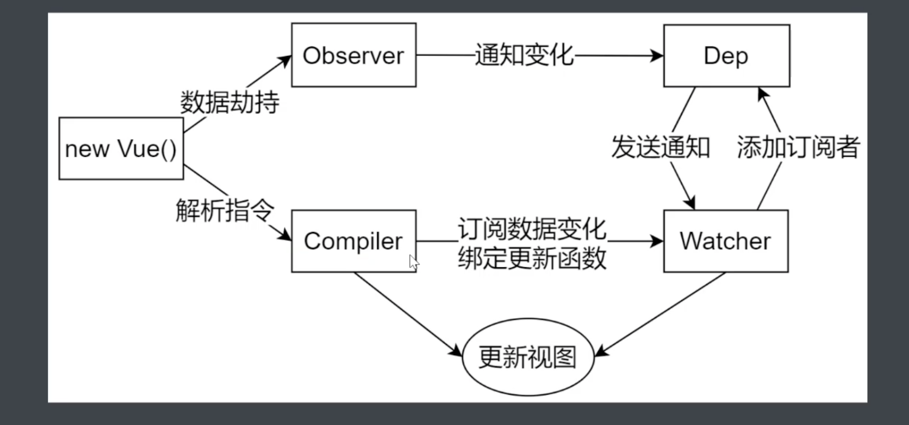

# 响应式原理总结

## 问题

1. 修改原属性为一个对象是不是响应式? 是, 因为setter中, 对原属性的新的值为一个对象时, 执行walk方法, 会添加响应式
2. 给vm新增一个成员是不是响应式? 不是。新增属性并不会转换为响应式属性, 在vue中, 对于已经创建的实例, Vue不允许动态添加根级别的响应式属性，在一个主要还是添加响应式对象是在initData和initProps中完成的。因此新增的属性, 并不会转换为响应式属性。官方提供的方法是$set。但是该方法主要是给实例上的一个对象下的某一个属性添加响应式。

## 整体流程

1. 首先调用 _proxyData, 将data中的属性注入到vue实例中
2. 创建Observer实例和一个Compiler实例, Observer主要是数据劫持, 将data中的属性转换为getter和setter, 当数据变化的时候, 通知dep数据变化, 执行dep.notify()方法, 派发更新, 执行watcher.update()方法, 在update方法中更新视图(这就是最简版本的数据驱动视图)。
  + 在Vue中有三大watcher, RenderWatcher, ComputedWatcher和UserWatcher, 其中renderWatcher主要用于视图更新, 最终都会执行renderWatcher的update方法, 触发视图更新以及新的数据的再获取。
3. 在被劫持数据的getter中, 执行Dep.addSubs, 添加依赖, 让dep将这些watcher都记录下来
4. Observer创建完成后还要创建Compiler对象, 作用是解析指令, 在页面首次加载时, 会调用compiler中的相关方法, 首先是在update中, 执行 `this.vm[this.key];`会触发依赖收集, 并且在初始化watcher实例时, 将Dep.target属性指向了当前watcher实例, 而依赖收集就是收集的当前watcher实例。同时触发Watcher初始化时的回调函数, 更新视图。前面的依赖收集就是图上的订阅数据变化, 绑定更新函数, 这个更新函数就是Watcher实例化时传入的回调函数, 而数据变化时, 在派发更新的过程中, dep就会触发更新函数。

