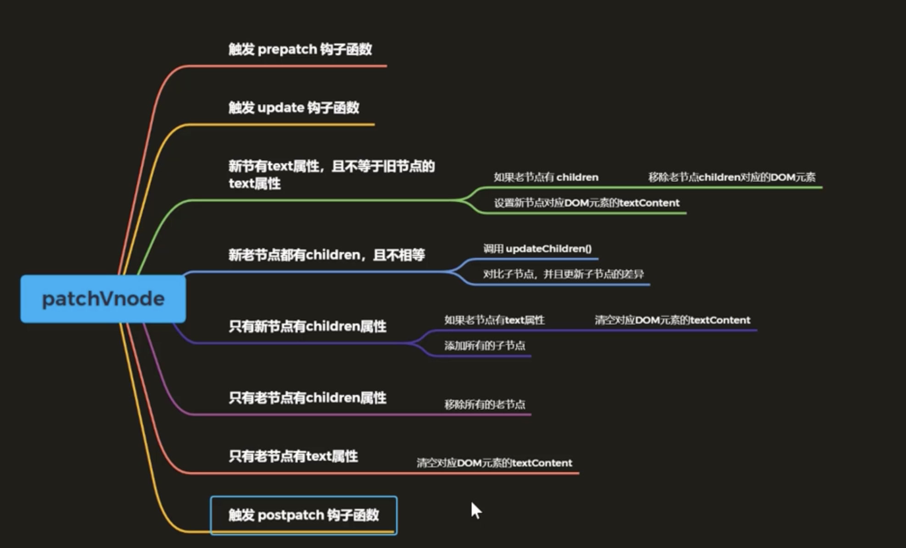

# patch

patch 函数主要就是将 VNode 渲染成真实 dom

## patch 整体执行过程分析

patch 函数在 init 函数中定义, 这个函数俗称打补丁, 主要对比新旧节点的差异, 然后将差异更新到真实节点中, 而寻找差异这个过程, 也就是尝说的`diff算法`

-   patch(oldVnode, newVnode)
-   把新节点中变化的内容渲染到真实 DOM, 最后返回新节点作为下一次处理的旧节点
-   对比新旧 VNode 是否相同节点(节点的 key 和 sel 相同)
-   如果不是相同节点, 删除之前的内容, 重新渲染
-   如果是相同节点, 在判断新的 VNode 是否有 text, 如果有并且和 oldVnode 的 text 不同, 直接更新文本内容
-   如果新的 VNode 有 children, 判断子节点是否有变化

## init 函数

在之前的案例中, 使用 patch 函数的之前, 都是先调用 init 函数, 执行后返回了一个 patch 函数。

因此, 在看 patch 函数之前, 需要先查看 init 函数中做了哪些工作。

1. 首先导入了一些后面要使用的模块
2. 然后定义了一些类型和辅助函数(判断类型等)
3. 定义了生命周期钩子的数组, 将会在 init 中初始化, 然后在特定的时刻触发
4. init

```ts
function init(modules: Array<Partial<Module>>, domApi?: DOMAPI){...}
```

init 函数有两个参数, 一个是 modules, 一个是 domApi，但是在之前用 snabbdom 做案例的时候, 只给 init 传过一个参数, 那就是 modules

`modules`是模块数组, 之前用过 snabbdom 提供的模块, 用于处理元素的行内样式和注册事件, 之前并没有传递第二个参数`domApi`

`domApi`, 主要是用于将 VNode 对象转换为其他平台下对应的元素, 在没有传递的情况下, 默认设置成 dom 操作的 api(这也是虚拟 dom 最大的好处 ———— 跨平台)

### init 详解

1. 定义 cbs

```ts
// 初始化cbs(callbacks回调函数)， 这里面存储的就是模块中的钩子函数, 在合适的时机去执行
// 对象的键名和上面的hooks成员一致
const cbs: ModuleHooks = {
    create: [],
    update: [],
    remove: [],
    destroy: [],
    pre: [],
    post: [],
};
```

2. 处理平台 api

```ts
// 若没有指定domApi, 则使用htmlDomApi
// htmlDomApi中初始化了一些方法, 这些方法都是用于操作dom元素的
const api: DOMAPI = domApi !== undefined ? domApi : htmlDomApi;
```

3. 初始化 cbs

```ts
// 双层循环初始化cbs
for (const hook of hooks) {
    for (const module of modules) {
        const currentHook = module[hook];
        // 只要module中包含当前钩子, 则将其添加到cbs对应的钩子数组中
        if (currentHook !== undefined) {
            (cbs[hook] as any[]).push(currentHook);
        }
    }
}
```

4. 接下来定义了一系列的辅助函数, 暂时先不看
5. 最后就是返回了一个 patch 函数

整个 init 函数, 其实就是一个高阶函数, 也就是一个函数返回另一个函数

这样做的好处就是, 让 patch 函数的入参变少了, 本来需要四个参数, modules, oldApi, olvVnode 和 newVnode, 但是现在只需要两个, 那就是 oldVnode 和 newVnode, 前两个参数都前置处理了

其实这样的高阶函数, 也叫函数柯里化

由于 patch 函数需要经常调用, 因此在这里, 先处理前两个参数, 并且缓存起来(因为形成了闭包), 在后面多次使用的时候, 都不用反复处理, 这样的优势更明显, 在之后的 vue 源码中, 这样的多层柯里化还还很多

### path 函数过程

patch 函数两个参数, 两个参数表示的是新旧 VNode 对象, 但是第一个参数既可以是 VNode 对象, 也可以是一个普通的 DOM 对象

首次渲染的时候, oldVnode 需要提供一个真实的 DOM 对象, 这个 DOM 对象其实是用于`占位`的, 新创建的元素会替换掉这个位置的参数

1. 进入 patch 之后, 首先定义了几个成员, `i`, `elm` 和 `parent`
2. 然后定义一个常量 `insertedVnodeQueue`, 用于存储新插入节点, 是一个队列, 存入这个队列的目的, 是为了触发这些节点上设置的 insert 钩子函数。在创建 VNode 对象时, 也可以设置一些用户定义的钩子函数。

Snabbdom 的示例中, 有这种做法, 典型的就是在 Vue 中创建组件时, 传入的 created、mounted 等, 都是我们(用户)自己设置的钩子函数。

3. 接下来遍历 cbs.pre 钩子数组, 并依次执行 pre 钩子函数

在上面说到, 在 init 中, 初始化了`cbs`对象, 并且将所有模块的钩子函数, 存储到了`cbs`对象下对应的钩子属性数组中。

在`cbs`的 create、updated 和 destroy 属性中, 存储了模块中所有的钩子函数。

4. 在 patch 开始之前, 第一个触发的钩子函数, 就是 pre 钩子, 而 pre 钩子, 也是 Snabbdom 正式开始处理 VNode 对象之前, 首先执行的第一个钩子函数, 可以被认为是`预处理`。
5. 判断 oldVnode 是否是一个 VNode 对象, 因为他可以是 VNode, 也可以是真实的 DOM 对象

    - isVnode 函数

```ts
function isVnode(vnode: any): vnode is VNode {
    return vnode.sel !== undefined;
}
```

主要就是通过判断 vnode 上的 sel 属性是否不是 undefined, 因为 VNode 是存在 sel 选择器属性的

主要原因在于 vnode 挂载为 DOM 时，Snabbdom 会基于这个属性构造 DOM 元素, 因此在 Snabbdom 约定中, 存在 sel 选择器属性的对象, 那么久被认为是一个真实的 DOM 对象, 而不是 VNode 对象

6. 如果 oldVNode 不是一个 VNode 对象, 那么就会通过`emptyNodeAt`方法, 将真实的 DOM 对象(用于占位)转换为一个 VNode 对象。

转换方法`emptyNodeAt`如下所示:

```ts
function emptyNodeAt(elm: Element) {
    const id = elm.id ? "#" + elm.id : "";

    const classes = elm.getAttribute("class");

    const c = classes ? "." + classes.split(" ").join(".") : "";
    return vnode(
        api.tagName(elm).toLowerCase() + id + c,
        {},
        [],
        undefined,
        elm
    );
}
```

首先将 id 转换为选择器的形式, 比如说`tst => #tst`, 当然, 没有 id 就是空

接下来处理类的样式, 如果类存在, 则会调用 split 方法将类进行分割, 在每一个类的前面加上一个`.`, 然后再重新转换为类选择器的形式。

最后调用 vnode 函数, 创建 vnode 对象, 第一个 sel 参数, 就是通过将标签选择器、id 选择器和类选择器拼接起来形成的

然后 data 是空对象, children 是空数组, text 和 children 互斥, 因此 text 为 undefined, 最后的 element, 默认就是当前 dom 元素。

7. 当新旧节点都是 VNode 之后, 他们就可以对比了。首先需要判断, 新旧 VNode 是否是相同节点, 通过`sameVnode`方法

`sameVnode`方法非常简单

```ts
function sameVnode(vnode1: VNode, vnode2: VNode): boolean {
    const isSameKey = vnode1.key === vnode2.key;
    const isSameIs = vnode1.data?.is === vnode2.data?.is;
    const isSameSel = vnode1.sel === vnode2.sel;

    return isSameSel && isSameKey && isSameIs;
}
```

其实就是判断两个节点的 key(节点唯一标识)是否相同, sel(节点选择器)是否相同, 以及 data 下的 is 属性是否相同, 如果相同, 则表示是同一个 VNode 对象。

8. 如果是相同节点, 那么直接调用`patchVnode`, 对比两个节点上的内容是否存在变化, 传入参数为 `oldVnode`、 `newVnode` 和 `insertedVnodeQueue`。

`patchVnode`方法的作用是真正的去寻找两个节点的差异， 然后将差异更新到 dom 上。

VNode 对应的 DOM 元素, 是不需要重新创建的, 这样能提升效率, 他的内部实现较复杂。

9.  如果新旧节点不相同, 将进入 else 中, 会创建新的 VNode 对应的 DOM 元素, 并且将新创建的 DOM 元素插入到 DOM 树上, 并且从 DOM 树上移除老的 DOM 元素。
10. 首先创建一个 elm, 直接使用旧节点的 element(感叹号标识属性一定有值), 后续可以直接使用
11. 获取 element 元素的父元素, 目的是为了让创建完新的 DOM 节点直接挂载到这个父元素下

`parentNode`方法实现:

```ts
function parentNode(node: Node): Node | null {
    return node.parentNode;
}
```

其实很简单, 就是返回传入的 DOM 节点上的 parentNode, 直接获取 DOM 元素的父节点(当然, 这个只是在 DOM 树上, 非 Web 的 DOM 结构需要自己定义 parentNode 方法)

12. 接着调用`createElm`方法, 这个方法就是创建 VNode 节点对应的 DOM 元素, 并且将新插入的 VNode 的队列, 作为参数, 传给`createElement`, 同时函数内部还会触发一些钩子函数
13. 判断`parent`是否有值, 如果他不是一个 null, 那么就说明有父元素, 则需调用 insertBefore 将新创建的元素插入到父元素下, 内部其实就是调用的 DOM 上的`insertBefore`方法

```ts
function insertBefore(
    parentNode: Node,
    newNode: Node,
    referenceNode: Node | null
): void {
    parentNode.insertBefore(newNode, referenceNode);
}
```

一共三个参数, 第一个参数代表父元素, 第二个参数就是新的 VNode 节点对应的真实 DOM, 第三个参数表示调用 api,nextSibling 来获取 elm(`oldVnode`对应的 DOM 元素)的下一个兄弟节点

这里要查看 index.html 的结构, 也就是 id 为 app 的 div(所谓的容器节点)的下一个兄弟节点, 一般会有一个回车, 因此这个兄弟节点是一个文本节点(就是那个换行符), 所以这里是把新节点对应的 DOM 元素插入到老节点对应的 DOM 元素之后

14. 然后调用`removeVnodes`, 从 parent 中移除老节点
15. 首次渲染其实就结束了, 接下来是钩子函数的触发。
16. 遍历 insertVnodeQueue, 现在这个队列中存储的是具有 insert 钩子函数的新的 Vnode 节点, 这个队列中的函数是在`createElement`中添加的, 然后触发队列中的`insert`钩子函数, 这个`insert`钩子从 data 中获取, 也就是说这个钩子是用户传进来的。
17. `createElement`主要就是在将新的 dom 节点挂载到 vnode.elm 上(就是根据 vnode 创建的)
18. 当 VNode 对应的 dom 元素, 添加到 dom 树上后, 用户可以执行自己想要执行的操作(!.操作符和 ES2020 中的?.是一样的)。
19. 最后遍历 cbs 中所有的 post 钩子, 然后触发, 也就是触发模块中的 post 钩子函数, 最后返回新的 vnode 节点, 作为下一次的老节点处理。

```ts
return function patch(oldVnode: VNode | Element, vnode: VNode): VNode {
    let i: number, elm: Node, parent: Node;
    const insertedVnodeQueue: VNodeQueue = [];
    for (i = 0; i < cbs.pre.length; ++i) cbs.pre[i]();

    if (!isVnode(oldVnode)) {
        oldVnode = emptyNodeAt(oldVnode);
    }

    if (sameVnode(oldVnode, vnode)) {
        patchVnode(oldVnode, vnode, insertedVnodeQueue);
    } else {
        elm = oldVnode.elm!;
        parent = api.parentNode(elm) as Node;

        createElm(vnode, insertedVnodeQueue);

        if (parent !== null) {
            api.insertBefore(parent, vnode.elm!, api.nextSibling(elm));
            removeVnodes(parent, [oldVnode], 0, 0);
        }
    }

    for (i = 0; i < insertedVnodeQueue.length; ++i) {
        insertedVnodeQueue[i].data!.hook!.insert!(insertedVnodeQueue[i]);
    }
    for (i = 0; i < cbs.post.length; ++i) cbs.post[i]();
    return vnode;
};
```

### createElm 函数过程

作用: 将 VNode 节点转换为对应的 dom 元素, 将 dom 元素挂载到 VNode 的 elm 属性上, 但是并没有挂载到 dom 树上

挂载操作是在执行`api.insertBefore`方法时, 才将其挂载到老节点的父节点下

```ts
function createElm(vnode: VNode, insertedVnodeQueue: VNodeQueue): Node {
    // 1. 执行用户设置的init钩子函数
    let i: any;
    let data = vnode.data;
    if (data !== undefined) {
        const init = data.hook?.init;
        // 要先判断一下这个init是否定义
        if (isDef(init)) {
            init(vnode);
            data = vnode.data;
        }
    }

    const children = vnode.children; // VNode子结点(后面会递归创建VNode的子结点对应的DOM元素)
    const sel = vnode.sel; // 选择器
    // 将vnode转换为真实DOM对象(此时并没有渲染到页面)
    if (sel === "!") {
        // 选择器为 ! 时创建注释节点
        if (isUndef(vnode.text)) {
            vnode.text = "";
        }
        vnode.elm = api.createComment(vnode.text!);
    } else if (sel !== undefined) {
      // 创建VNode对应的DOM元素
        ...
    } else {
      // 创建文本节点
        vnode.elm = api.createTextNode(vnode.text!);
    }
    // 返回创建的DOM
    return vnode.elm;
}
```

1. 执行用户设置的 init 钩子函数

init 这个钩子函数, 是在创建真实 DOM 之前, 让用户可以对 VNode 做一次修改, 比如可以修改将来创建 DOM 对象的样式或者属性等

当 init 执行完毕后, 就会将 data 更新为最新的 data(因为可能在 init 中有改变)

2. 将 vnode 转换为真实 DOM 对象(但是没有渲染到页面上)

如果 sel 的值为 `!`, 会创建注释节点

`api.createComment`其实就是`document.createComment`

如果 sel 的值不是 undefined, 则创建对应的 dom 元素

最后当 sel 为空的时候, 直接创建文本节点(其实就是`document.createTextNode`方法)

3. 返回创建的 DOM

#### 创建 VNode 对应的 DOM 元素

核心就是上面第二步中中间`else if (sel !== undefined)`, 创建 VNode 对应的 DOM 元素, 代码片段(就是上面省略号中的部分)如下

```ts
// 解析标签名
const hashIdx = sel.indexOf("#");
const dotIdx = sel.indexOf(".", hashIdx);
const hash = hashIdx > 0 ? hashIdx : sel.length;
const dot = dotIdx > 0 ? dotIdx : sel.length;
const tag =
    hashIdx !== -1 || dotIdx !== -1 ? sel.slice(0, Math.min(hash, dot)) : sel; // 获取标签名

const elm = (vnode.elm =
    isDef(data) && isDef((i = data.ns))
        ? api.createElementNS(i, tag, data)
        : api.createElement(tag, data));
if (hash < dot) elm.setAttribute("id", sel.slice(hash + 1, dot));
if (dotIdx > 0)
    elm.setAttribute("class", sel.slice(dot + 1).replace(/\./g, " "));

for (i = 0; i < cbs.create.length; ++i) cbs.create[i](emptyNode, vnode);

if (is.array(children)) {
    for (i = 0; i < children.length; ++i) {
        const ch = children[i];
        if (ch != null) {
            api.appendChild(elm, createElm(ch as VNode, insertedVnodeQueue));
        }
    }
} else if (is.primitive(vnode.text)) {
    api.appendChild(elm, api.createTextNode(vnode.text));
}
const hook = vnode.data!.hook;

if (isDef(hook)) {
    hook.create?.(emptyNode, vnode);
    if (hook.insert) {
        insertedVnodeQueue.push(vnode);
    }
}
```

1. 解析标签名

因为我们传入的选择器也许是`div#id.class`这样的形式

因此第一步是获取`#`的位置

第二步获取`.`的位置

然后第三部, 如果存在`#`, 则定义一个`hash`就是`#`所在的位置

第四部, 和上面类似, 如果存在`.`, 则定义一个`dot`就是`.`所在的位置

第五步, 获取标签, 用`tag`变量保存, 方法就是判断是否存在`#`或者`.`, 如果都不存在, 那这一串只有标签, 如果有一个存在, 那么只需要解析出谁在前面就行了, 然后用`slice(0, 最前面的下标)`取出来即可(因为标签肯定是在最前面的)。

2. 根据标签名创建 dom 元素并设置 id 和 class

第一步, 查找 data 是否存在命名空间, 如果存在, 那么久使用命名空间创建方法(`document.createElementNS`)创建 dom 元素, 入参为(i: 命名空间, tag: 标签, data: 数据), 一般用于创建 svg

假如说不存在命名空间, 就直接使用元素创建方法(`document.createElement`)创建 dom 元素, 入参为(tag: 标签, data: 数据)

第二步, `hash`比`dot`小, 直接说明肯定存在 id, 因为顺序是 tag+id+class(前面生成 vnode 的方法里面有, h 函数里面顺序一样, 这个是约定), id 不存在的情况只能是`>=`

然后通过`sel.slice(hash + 1, dot)`直接取出 id, 因为 class 不存在的时候 dot 就是 sel 的长度, 也就是从 hash 开始直接取到最后, 如果 class 存在, 那么 dot 代表点的位置, 取到点的位置前一个结束, 也就恰好是 id, hash + 1 主要是不需要取`#`符号

然后通过`document.setAttribute`, 将 id 的值设置到 dom 元素的 id 上

第三步, 判断是否存在 class, 存在即开始取, 直接从 dot + 1 开始取, 然后将后面所有的的`.`都替换为 `" "`, 比如说 `class1.class2.class3` => `class1 class2 class3`

3. 调用 cbs 下, 所有的 created 钩子

4. 遍历 children, 如果 children 是个数组, 并且存在子结点, 那么将根据子结点创建 dom 元素, 并插入到 elm 元素下(这里可以看出来, 虚拟 dom 挂载到 dom 树上, 是先子后父的), 这里其实是包含了递归的逻辑的, 因为 child 进入到 createElm 这个函数, 如果 child 还有 children, 其实还会继续, 所以这里是一个递归转换和挂载子结点
5. 子结点和文本节点是互斥的, 因此这里还需要判断是否存在 text, 如果存在, 则直接创建文本节点, 并且挂载到 elm 下
6. 如果 data 上存在 hook, 那么将执行 hook 的 create 周期(这里其实是判断了是否存在 create 周期的, 用的?., ?.在前面为 undefined 时, 将不会向下继续执行), 同时如果 hook 上存在 insert, 紧接着将会把 vnode 入队(插入到 insertVnodeQueue 这个队列中)
7. insert 钩子是在这一次的 dom 元素, 已经插入后, 才会在 patch 函数中去执行 insertVnodeQueue 这个队列中的 insert 方法, 而这些方法, 都是在 createElm 函数中插入的
8. 结束了

## removevnodes 和 addvnodes

### removeVNodes

patch 函数内部调用的 removeVNodes 函数, 作用是从 dom 树上批量移除 VNodes 对应的 DOM 元素

与其对应的函数为`addVNodes`, 作用是批量添加 VNode 对应的 DOM 元素到 DOM 树

#### 参数解析

> `parentElm`: 被移除函数的爹
>
> `vnodes`: 由需要删除的元素对应的 VNode 组成的数组
>
> `startIdx`: 数组中要删除节点的开始位置
>
> `endIdx`: 数组中要删除节点的结束位置

#### 步骤

1. 遍历传递的 VNodes 数组, 循环条件是开始和结束的索引
2. 在循环中找到每一个需要删除的节点
3. 判断需要删除的节点是否为 null
4. 在不为 null 的情况下(不是空节点), 需要判断节点上是否存在`sel`属性
    - 有`sel`属性那么该节点为一个`元素节点`
    - 否则被认为是`文本节点`, 那么直接调用`node.removeChild`直接删除 vnode 对应的文本 element 对象(真实 DOM 对象)
5. 非文本节点操作略复杂
    1. 调用`invokeDestroyHook`触发节点(组件)的`destroy`钩子
    2. 获取 cbs 中 remove 钩子函数的个数, 并且个数加一, 表示又移除了一个(`cbs`为 init 时声明的模块钩子数组 ModuleHooks)
    3. `listeners`变量作用: 用于防止重复删除 dom 元素, 会将 listeners 传递给 createRmCb 这个函数, 该函数是一个高阶函数(HOF), 用于生成真正删除 dom 的事件
    4. 生成 rm 函数, 也就是上面所说的调用 createRmCb 函数
    5. 遍历 cbs 中所有的`remove`钩子, 并且依次触发`remove`钩子函数, 入参为 ch(元素 vnode 节点), 和 rm(元素移除方法)
    6. 在 remove 钩子函数中, 最终(并非此处删除, rm 触发会滞后)会调用 rm 去移除 vnode
    7. 获取用户传入的 remove 钩子函数
        1. 如果用户传入了 remove 钩子函数, 此处需要用户手动调用 rm 方法, 删除 vnode 节点
        2. 如果用户没有传入 remove 钩子, 则直接调用 rm
    8. 但不管是用户传入的 remove 钩子函数, 还是 cbs 中的 remove 钩子函数, 内部都会调用 rm 删除元素, 所以调用 rm 时, 需要判断当前的这些 remove 钩子是否都执行完毕, 只有当前置所有的 remove 钩子执行完成后, 才会调用 rm 真正删除元素, 否则就会造成同一个 dom 元素被多次删除的问题

#### 实现

```ts
function removeVnodes(
    parentElm: Node, // 被移除函数的爹
    vnodes: VNode[], // 需要删除的节点
    startIdx: number, // 开始索引
    endIdx: number // 结束索引
): void {
    // 遍历所有需要被删除的节点
    for (; startIdx <= endIdx; ++startIdx) {
        let listeners: number;
        let rm: () => void; // 移除函数
        const ch = vnodes[startIdx]; // 需要被删除的节点
        if (ch != null) {
            // 节点不能是空节点
            if (isDef(ch.sel)) {
                // 在不为null的情况下, 需要判断节点中是否存在sel属性
                invokeDestroyHook(ch); // 执行节点上对应的destroy回调
                // ! listeners作用是用于防止重复删除dom元素, 会将listeners传递给createRmCb这个函数
                listeners = cbs.remove.length + 1; // 获取cbs中remove钩子函数的个数
                rm = createRmCb(ch.elm!, listeners);
                // 遍历cbs中所有的remove钩子, 并且依次触发
                for (let i = 0; i < cbs.remove.length; ++i)
                    cbs.remove[i](ch, rm); // 这里其实就执行元素remove钩子的逻辑, 用于扩展rm
                const removeHook = ch?.data?.hook?.remove; // 获取用户传入的remove钩子函数
                if (isDef(removeHook)) {
                    removeHook(ch, rm);
                } else {
                    rm();
                }
            } else {
                // 文本节点
                // 也就是调用 parentElm.removeChild(ch.elm)方法移除文本节点
                api.removeChild(parentElm, ch.elm!);
            }
        }
    }
}

// HOF, 每一次触发都会对监听数进行--, 直到所有的remove钩子执行完毕后
// 此处使用HOF缓存listeners数量
// 这也是为什么存在用户自己传入的remove钩子时, 一定要自己调用rm钩子, 因为在rmCb中, 并不会真正的去执行rm移除节点, 一定要手动触发
function createRmCb(childElm: Node, listeners: number) {
    return function rmCb() {
        // 因为之前记录listeners的时候, 实际上是进行了 +1 操作
        // 因此这里要进行自减, 用以保障所有的remove钩子全部执行完成(否则会造成节点先被移除了, 但是remove钩子还没有执行完)
        if (--listeners === 0) {
            const parent = api.parentNode(childElm) as Node; // 获取被删除元素的爹
            api.removeChild(parent, childElm); // 移除元素
        }
    };
}

// destroy钩子
function invokeDestroyHook(vnode: VNode) {
    const data = vnode.data; // 查看是否存在用户传入的data
    if (data !== undefined) {
        // 获取传入destroy钩子, 并执行, 没有传入则不作处理
        data?.hook?.destroy?.(vnode);
        // 遍历cbs中所有的钩子函数, 并且执行
        for (let i = 0; i < cbs.destroy.length; ++i) cbs.destroy[i](vnode);
        // 遍历当前vnode的所有儿子, 再次触发invokeDestroyHook, 也就是递归触发节点上的destroy钩子, 以及cbs中的钩子
        // 同时也可以知道, 节点移除钩子destroy, 是 `先父后子`
        // 同时destroy钩子实在删除节点之前执行的
        if (vnode.children !== undefined) {
            for (let j = 0; j < vnode.children.length; ++j) {
                const child = vnode.children[j];
                if (child != null && typeof child !== "string") {
                    invokeDestroyHook(child);
                }
            }
        }
    }
}
```

#### 部分结论

> 节点销毁钩子 destroy, 执行顺序是 `先父后子`
>
> destroy 钩子执行时间, 实在删除节点之前
>
> 最终使用 rm 移除节点, 如果有自定义的 remove 钩子, 一定要手动调用一次, 否则节点不会移除

### addVnodes

#### 实现

```ts
function addVnodes(
    parentElm: Node, // 爹
    before: Node | null, // 参考节点, 要被插入到参考节点之前
    vnodes: VNode[], // 被插入节点数组
    startIdx: number, // 开始位置 （可以指定vnodes数组中哪些节点被插入到数组中）
    endIdx: number, // 结束位置
    insertedVnodeQueue: VNodeQueue // 在createElm中用到过, 存储刚刚插入过的具有insert钩子函数的节点
) {
    // 遍历vnodes所有需要添加的节点
    for (; startIdx <= endIdx; ++startIdx) {
        const ch = vnodes[startIdx];
        // 如果当前节点不为null(非空)
        if (ch != null) {
            // 然后调用insertBefore将刚刚创建的dom元素, 插入到dom树中, 处于参考节点之前
            api.insertBefore(
                parentElm,
                // 先将vnode通过createElm转换为DOM元素
                createElm(ch, insertedVnodeQueue),
                before
            );
        }
    }
}
```

## patchVnode

### 过程

1. 触发`prepatch`钩子函数
2. 定义 elm 对象, 新节点的 elm 直接拷贝旧节点的 elm 对象, 同时挂到变量 elm 上, 三者对应同一索引
3. oldCh 存储旧节点的所有子节点
4. ch 存储新节点的所有子节点
5. 如果新旧节点索引相同, 说明没有变化, 直接结束 patchVnode
6. 执行 cbs 上所有的 update 钩子
7. 执行自定义 update 钩子
8. 处理文本节点
    1. 如果新节点存在 text 属性且不等于老节点的 text 属性, 说明新节点是一个文本节点且有更新
    2. 移除旧节点下所有子结点(这里一定要调用 removeVnodes 去移除, 而不是直接替换, 原因有二: 一是要触发所有子节点极其可能存在的后代节点的 remove 钩子, 二是要等待删除的过渡动画执行)
    3. 将新节点的 text 文本直接赋值给 elm 对象的 textContent 上完成文本节点更新(因为是浅拷贝, 给了 elm, 也就等于给了 vnode.elm)
9. 处理非文本新节点
    1. 新旧节点同时存在 children, 调用`updateChildren`方法, 去对比新旧节点的所有子节点, 并更新子节点的差异(该函数核心内容, 也就是所谓的 diff)
    2. 旧节点为文本节点, 而新节点有 children, 则直接将 elm.textContent 置空, 同时将新节点的所有子结点通过 addVnodes 方法添加到 elm 中
    3. 旧节点有 children, 而新节点没有 children(新节点为空标签), 调用 removeVnodes 方法移除 elm 下所有的子结点及其后代节点
    4. 旧节点有 text, 新节点没有(新节点同样为空标签), 直接将 elm 上的 textContent 置空
10. 触发`postpatch`钩子完成 patchVnode 方法

### patchVnode实现

```ts
function patchVnode(
    oldVnode: VNode,
    vnode: VNode,
    insertedVnodeQueue: VNodeQueue
) {
    const hook = vnode.data?.hook;
    // 1. 触发prepatch钩子函数
    hook?.prepatch?.(oldVnode, vnode);
    // 获取当前elm, 将旧的节点的elm对象直接赋值给vnode节点, 同时缓存到elm变量上
    const elm = (vnode.elm = oldVnode.elm)!;
    // 获取旧节点的儿子们(皆为vnode)
    const oldCh = oldVnode.children as VNode[];
    // 获取新vnode节点的儿子们(同上)
    const ch = vnode.children as VNode[];
    // 如果新旧节点全等(说明没有任何变化, 索引地址都一样)直接返回, 结束patchVnode
    if (oldVnode === vnode) return;
    if (vnode.data !== undefined) {
        // 2. 遍历cbs上的update钩子, 并依次执行
        for (let i = 0; i < cbs.update.length; ++i)
            cbs.update[i](oldVnode, vnode);
        // 3. 执行自定义的update钩子
        vnode.data.hook?.update?.(oldVnode, vnode);
    }
    if (isUndef(vnode.text)) {
        // 非文本节点情况
        if (isDef(oldCh) && isDef(ch)) {
            // 是否同时存在children属性
            // 同时新旧节点的children属性不等, 则调用updateChildren方法, 去对比新旧节点的所有子节点, 并更新子节点的差异(该函数核心内容, 也就是所谓的diff)
            if (oldCh !== ch)
                updateChildren(elm, oldCh, ch, insertedVnodeQueue);
        } else if (isDef(ch)) {
            // 如果只有新节点存在children属性
            // 老节点为文本节点, 则直接将elm上的文本节点置空
            if (isDef(oldVnode.text)) api.setTextContent(elm, "");
            // 同时执行addVnodes方法, 将新的children全部添加到elm上
            addVnodes(elm, null, ch, 0, ch.length - 1, insertedVnodeQueue);
        } else if (isDef(oldCh)) {
            // 只有老节点有children属性, 则移除老节点的所有子结点
            removeVnodes(elm, oldCh, 0, oldCh.length - 1);
        } else if (isDef(oldVnode.text)) {
            // 如果只有老节点有text属性, 则直接置空(这里说明新节点是个空标签)
            api.setTextContent(elm, "");
        }
    } else if (oldVnode.text !== vnode.text) {
        // 如果新节点存在text属性且不等于老节点的text属性, 说明新节点是一个文本节点且有更新
        if (isDef(oldCh)) {
            // 移除老节点中所有的儿子(文本节点没有儿子)
            // ? 这里删除的原因在于: removeVnodes函数实现时, 删除dom元素之前, 会触发remove钩子函数, remove钩子函数执行之前, 会等待所有的transition属性都执行完成, 也就是过度动画执行完毕, 在transitionEnd事件中才会真正删除元素
            // ? 如果直接赋值替换, 而不是删除节点, 那么所有子结点的remove钩子不会触发, 同时删除的过度动画也看不到了
            removeVnodes(elm, oldCh, 0, oldCh.length - 1);
        }
        // 同时需要把新节点的text属性, 更新到elm上, 前面是一个浅拷贝, 因此这里会直接更新到vnode.elm上
        // 其实就是elm.textContent = vnode.text
        api.setTextContent(elm, vnode.text!);
    }
    // 最后触发postpatch钩子函数, 表示整个对比和更新结束了
    hook?.postpatch?.(oldVnode, vnode);
}
```

### path 函数实现

```ts
function patch(oldVnode: VNode | Element, vnode: VNode): VNode {
    let i: number, elm: Node, parent: Node;
    const insertedVnodeQueue: VNodeQueue = [];
    for (i = 0; i < cbs.pre.length; ++i) cbs.pre[i]();

    if (!isVnode(oldVnode)) {
        oldVnode = emptyNodeAt(oldVnode);
    }

    // 通过sameVnode判断新旧节点是否相等, 相等则进入patchVnode更新新旧节点
    // 方法很简单, 同时满足三个条件, 说明他们是新旧节点, 满足key相等, data.is相等以及sel相等
    if (sameVnode(oldVnode, vnode)) {
        // 此处调用patchVnode方法
        // insertedVnodeQueue作用是等着收集具有insert钩子函数的新节点
        patchVnode(oldVnode, vnode, insertedVnodeQueue);
    } else {
        elm = oldVnode.elm!;
        parent = api.parentNode(elm) as Node;

        createElm(vnode, insertedVnodeQueue);

        if (parent !== null) {
            api.insertBefore(parent, vnode.elm!, api.nextSibling(elm));
            removeVnodes(parent, [oldVnode], 0, 0);
        }
    }

    for (i = 0; i < insertedVnodeQueue.length; ++i) {
        insertedVnodeQueue[i].data!.hook!.insert!(insertedVnodeQueue[i]);
    }
    for (i = 0; i < cbs.post.length; ++i) cbs.post[i]();
    return vnode;
}

function sameVnode(vnode1: VNode, vnode2: VNode): boolean {
  const isSameKey = vnode1.key === vnode2.key;
  const isSameIs = vnode1.data?.is === vnode2.data?.is;
  const isSameSel = vnode1.sel === vnode2.sel;

  return isSameSel && isSameKey && isSameIs;
}
```

### patch 过程思维导图


