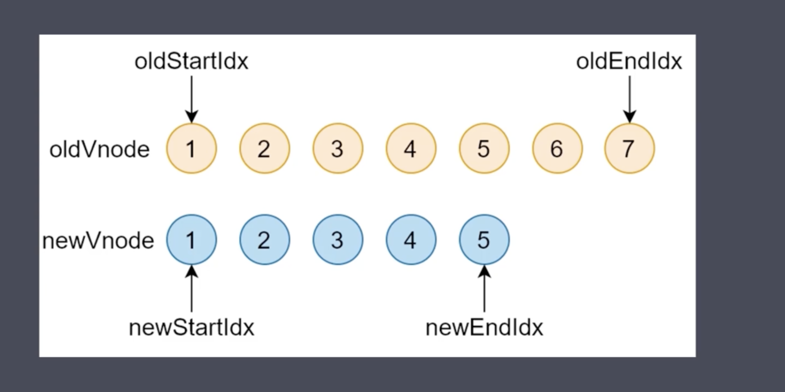
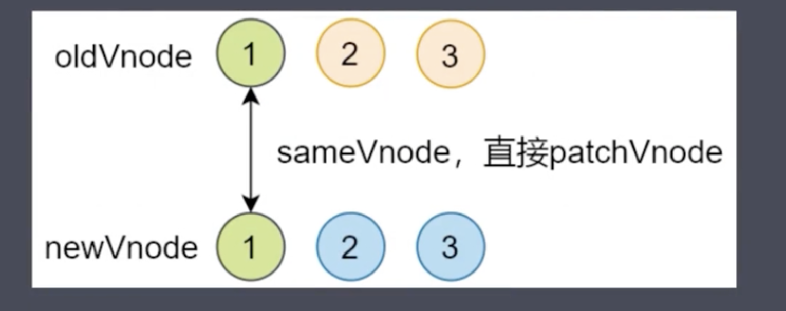
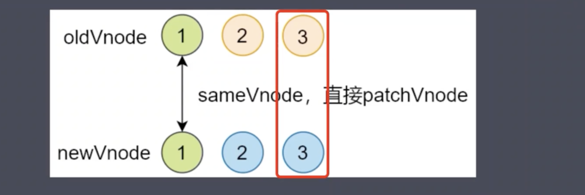
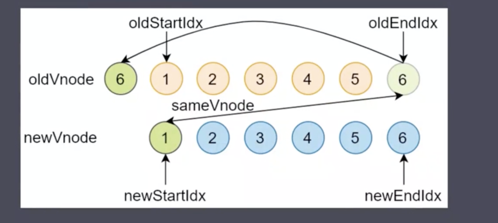
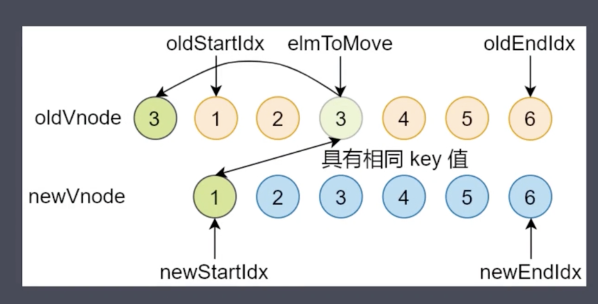
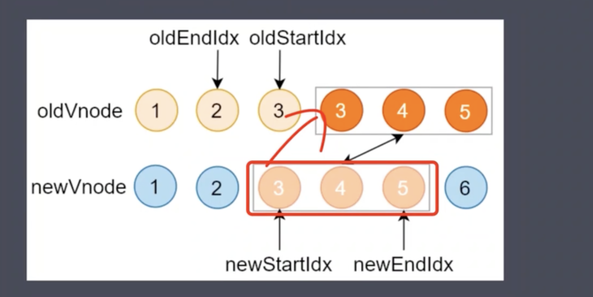
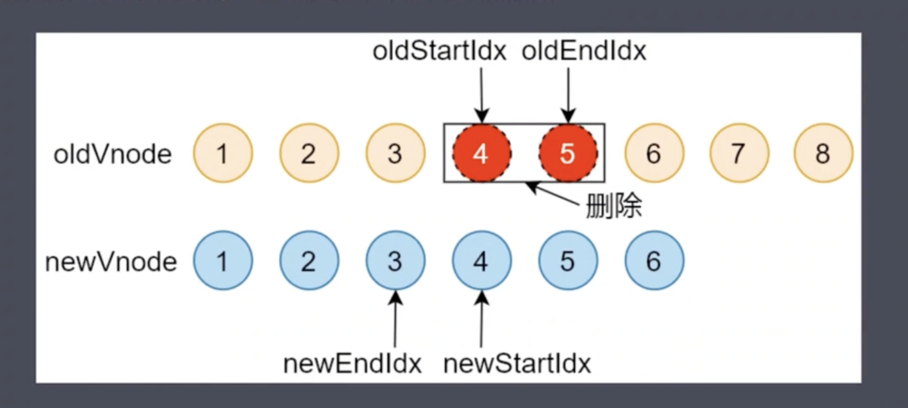

# Snabbdom 库中 Diff 过程

## 虚拟 DOM 中的 Diff 算法

### 为什么要使用 Diff?

渲染真实 DOM 的开销很大, DOM 操作会引起浏览器的重排和重绘, 也就是浏览器的重新渲染, 浏览器重新渲染页面是非常耗性能的, 因为要重新渲染整个页面, 当大量数据变化后, 比如列表数据变化, 如果直接操作 dom, 会让浏览器重新渲染整个列表

虚拟 DOM 中 Diff 的核心, 就是当数据变化后, 不直接操作 DOM, 而是用 JS 对象来描述真实 DOM, 当数据变化后, 会先对比的是描述 DOM 节点的 JS 对象是否发生变化, 找到所有发生变化的位置, 最后只去最小化的更新变化后的位置, 从而提高性能

Diff 是一种算法, 类似于排序算法, 只不过, 排序算法是对一组数进行排序。而 Diff 算法是用于查找两棵树上虚拟节点的差异, 实现的方式有很多

> 1. 最麻烦的方式: 将新旧两棵树上每个节点对比一次, 如果有 n 个节点, 将对比 n^2 次, 找到差异后, 在循环遍历所有差异的部分, 去更新。
>
> 2. Snabbdom 根据 DOM 的特点对传统的 Diff 算法做了优化
>
> -   第一是 DOM 操作时很少会跨级别操作节点, 比如将父子节点换位
> -   因此 Snabbdom 中只比较同级别的节点, 同级别不相同则直接删除重新创建, 而同级别的节点, 仅比较了一次, 减少了比较次数, 如果有 n 个节点, 也就只比较了 n 次, 大大降低了比较次数

## Snabbdom 中 Diff 过程

### 在对开始和结束节点比较时, 一共分为四种情况:

1. oldStartVnode / newStartVnode(旧头/新头)
2. oldEndVnode / newEndVnode(旧尾/新尾)
3. oldStartVnode / newEndVnode(旧头/新尾)
4. oldEndVnode / newStartVnode(旧尾/新头)



### 开始和结束节点

-   如果新旧开始节点是 sameVnode(key, sel 以及 data?.is 均相同) - 调用`patchVnode()`对比和更新节点 - 索引均后移一位 => oldStartIdx++ / newStartIdx++ - 继续对比
    ;

*   如果新旧节点的尾部是 sameVnode
    -   调用`patchVnode()`对比和更新节点
    -   索引均前移一位 => oldEndIdx-- / newEndIdx--
    -   继续对比

;

> `注: 在sameVnode的情况下, 新节点不会重新创建dom元素, 而是复用老节点上的dom元素, 也就是patchVnode方法进来缓存的那个elm对象`

### 旧头/新尾

-   如果两个节点是 sameVnode, 则调用 patchVnode 对比和更新节点
-   将 oldStartVnode 对应的 DOM 元素, 移动到右边, 更新索引
    -   说明旧节点的开始元素实际上已经成了新节点的尾部元素, 由于最终完成 diff 后, 要保持新旧节点数组的相同, 因此要旧节点的开始节点移动到旧的结束节点之后
    -   同时 oldStartIdx++, newEndIdx-- 然后继续对比


### 旧尾/新头

-   如果旧节点的尾部节点和新节点的头部节点是 sameVnode, 则调用 patchVnode 对比更新两个节点的差异
-   将 oldEndVnode 对应的 DOM 元素移动到旧的开始节点之前
-   oldEndIdx--, 同时 newStartIdx++, 继续对比



### 非上述四种情况

说明开始和结束节点均互相不相同, 此时要去旧节点数组中依次查找是否存在相同的新节点

1. 遍历新的开始节点, 在旧节点数组中查找是否存在相同的 key 值的节点
    1. 如果没有找到, 说明此时的开始节点是新节点, 需要创建新的 dom 元素, 并且将其插入到旧节点的最前面
    2. 如果找到了, 并且需要判断节点的 sel 属性和老节点的 sel 属性是否相同, 如果 sel 不相同, 说明不是 same 节点, 则还是要创建 dom 元素, 并插入到旧的开始节点之前
    3. 如果是 same 节点, 则会将找出来的旧节点赋值给`elmToMove`变量, 然后调用 patchVnode 对比和更新两者差异, 然后将 elmToMove 节点对应的 dom 元素移动到最前面



### 循环结束

还有一些收尾工作

-   当老节点的所有子结点先遍历完(oldStartIdx > oldEndIdx), 循环结束(老节点先遍历完, 新节点还有剩余, 剩下的直接调用 addVnodes 批量插入)



-   当新节点的所有子结点先遍历完(newStartIdx > newEndIdx), 循环结束(新节点先遍历完, 老节点还有剩余, 直接删除)



## updateChildren 实现

```ts
function updateChildren(
    parentElm: Node,
    oldCh: VNode[],
    newCh: VNode[],
    insertedVnodeQueue: VNodeQueue
) {
    // 旧开始节点索引
    let oldStartIdx = 0;
    // 新开始节点索引
    let newStartIdx = 0;
    // 旧结束节点索引
    let oldEndIdx = oldCh.length - 1;
    // 旧开始节点
    let oldStartVnode = oldCh[0];
    // 旧结束节点
    let oldEndVnode = oldCh[oldEndIdx];
    // 新结束节点索引
    let newEndIdx = newCh.length - 1;
    // 新的开始节点
    let newStartVnode = newCh[0];
    // 新的结束节点
    let newEndVnode = newCh[newEndIdx];
    // * 头头 尾尾 头尾 尾头 四种情况比较完成后使用的变量
    // 用于存储一个对象, 对象中的键是老节点的key, 值是老节点的索引
    // 目的是方便根据新节点的key, 找到老节点在数组中的索引
    let oldKeyToIdx: KeyToIndexMap | undefined;
    // 新节点的key在老节点数组中的索引
    let idxInOld: number;
    // 需要移动的节点
    let elmToMove: VNode;
    // 插入参考节点
    let before: any;

    // 同级别节点比较
    // 循环条件是新旧节点都没有遍历完成, 也就是新旧节点的开始结束索引都不能相互穿越(最后一次比对就是开始结束的索引相同)
    while (oldStartIdx <= oldEndIdx && newStartIdx <= newEndIdx) {
        // 首先需要做的是判断新旧开始节点的值是否为null
        // 因为当节点是相同节点时, 处理完毕后会对开始结束节点重新赋值, 赋值过程中有可能赋值为null, 因此前置剔除为null的情况
        if (oldStartVnode == null) {
            oldStartVnode = oldCh[++oldStartIdx]; // Vnode might have been moved left
        } else if (oldEndVnode == null) {
            oldEndVnode = oldCh[--oldEndIdx];
        } else if (newStartVnode == null) {
            newStartVnode = newCh[++newStartIdx];
        } else if (newEndVnode == null) {
            newEndVnode = newCh[--newEndIdx];
            // 比较开始结束的四种情况
            // 相同节点才会重用旧节点对应的dom元素, 而不会创建新的dom元素
            // sameVnode方法中使用到了key进行对比两个节点
            // 相同节点则会调用patchVnode对比新旧节点差异更新vnode.elm也就是dom元素
        } else if (sameVnode(oldStartVnode, newStartVnode)) {
            // 1. 头头比较
            // 对比新旧节点差异更新dom
            patchVnode(oldStartVnode, newStartVnode, insertedVnodeQueue);
            // 新旧开始索引指向下一个节点, 进入下一轮循环
            oldStartVnode = oldCh[++oldStartIdx];
            newStartVnode = newCh[++newStartIdx];
        } else if (sameVnode(oldEndVnode, newEndVnode)) {
            // 2. 尾尾比较
            // 对比新旧节点差异更新dom
            patchVnode(oldEndVnode, newEndVnode, insertedVnodeQueue);
            // 新旧开始节点指向上一个节点, 进入下一个循环
            oldEndVnode = oldCh[--oldEndIdx];
            newEndVnode = newCh[--newEndIdx];
        } else if (sameVnode(oldStartVnode, newEndVnode)) {
            // 3. 头尾比较
            // Vnode moved right
            // 对比新旧节点差异更新dom
            patchVnode(oldStartVnode, newEndVnode, insertedVnodeQueue);
            // 插入到结束节点的后一位(这里其实在更新旧节点数组, diff完成后最终要保持新旧节点的一致, dom是使用功patchVnode更新, 顺序就是通过插入和删除来进行控制)
            api.insertBefore(
                parentElm,
                oldStartVnode.elm!,
                api.nextSibling(oldEndVnode.elm!)
            );
            // 旧的开始节点索引后移
            oldStartVnode = oldCh[++oldStartIdx];
            // 新的结束节点前移
            newEndVnode = newCh[--newEndIdx];
        } else if (sameVnode(oldEndVnode, newStartVnode)) {
            // 4. 尾头比较
            // Vnode moved left
            // 对比新旧节点更新差异
            patchVnode(oldEndVnode, newStartVnode, insertedVnodeQueue);
            // 将旧节点插入到开始节点的前一位
            api.insertBefore(parentElm, oldEndVnode.elm!, oldStartVnode.elm!);
            // 旧节点结束索引往前
            oldEndVnode = oldCh[--oldEndIdx];
            // 新节点开始索引往后
            newStartVnode = newCh[++newStartIdx];
        } else {
            // 移动遍历所有新节点的key, 去老节点数组中找相同key的节点
            // 找到了会移动dom元素到合适的位置
            if (oldKeyToIdx === undefined) {
                // 由于只需要找当次循环下未处理的节点, 因此不必遍历整个老节点数组, 只需要当次循环中老节点的开始结束索引之间的节点即可
                // 同时该方法在一次同级别比较中只会进行一次
                oldKeyToIdx = createKeyToOldIdx(oldCh, oldStartIdx, oldEndIdx);
            }
            // 找到新节点的key在老节点数组中对应的索引
            idxInOld = oldKeyToIdx[newStartVnode.key as string];
            if (isUndef(idxInOld)) {
                // 说明新的开始节点是全新生成的Vnode
                // New element
                // 创建dom元素, 同时插入到老节点开始节点之前
                // 如果给定的子节点是对文档中现有节点的引用，insertBefore() 会将其从当前位置移动到新位置（在将节点附加到其他节点之前，不需要从其父节点删除该节点）。
                api.insertBefore(
                    parentElm,
                    createElm(newStartVnode, insertedVnodeQueue),
                    oldStartVnode.elm!
                );
            } else {
                // 非新节点, 说明老节点数组中该节点需要移动
                elmToMove = oldCh[idxInOld];
                // 对比sel查看该节点是否被更新
                if (elmToMove.sel !== newStartVnode.sel) {
                    // sel不等说明该节点有更新, 同样需要生成新的dom元素, 同时插入到开始节点之前
                    api.insertBefore(
                        parentElm,
                        createElm(newStartVnode, insertedVnodeQueue),
                        oldStartVnode.elm!
                    );
                } else {
                    // 调用patchVnode更新dom差异
                    patchVnode(elmToMove, newStartVnode, insertedVnodeQueue);
                    // 清除原有老节点
                    oldCh[idxInOld] = undefined as any;
                    // 将更新后差异的dom插入到老开始节点对应的dom元素之前
                    api.insertBefore(
                        parentElm,
                        elmToMove.elm!,
                        oldStartVnode.elm!
                    );
                }
            }
            // 新开始节点后移
            newStartVnode = newCh[++newStartIdx];
        }
    }
    // 循环结束的收尾工作
    if (oldStartIdx <= oldEndIdx || newStartIdx <= newEndIdx) {
        if (oldStartIdx > oldEndIdx) {
            // 表示老节点先遍历完, 新节点还有剩余, 于是批量插入到新节点的结束节点的位置
            before =
                newCh[newEndIdx + 1] == null ? null : newCh[newEndIdx + 1].elm;
            addVnodes(
                parentElm,
                before,
                newCh,
                // 这个新节点的开始结束索引, 表示需要新增的节点
                newStartIdx,
                newEndIdx,
                insertedVnodeQueue
            );
        } else {
            // 新节点先遍历完, 剩余未遍历的老节点批量删除
            removeVnodes(parentElm, oldCh, oldStartIdx, oldEndIdx);
        }
    }
}
```


## key的意义


### 没有key

> 通过上面的updateChildren源码解析, 我们可以发现, 在没有给key的情况下, 那么节点的key均为null, 此时调用sameVnode时, 只要标签一致, 就会认为是相同的节点(一般data.is也是undefined)
> 
> 那么此时会发现, diff的过程永远都会进入头头比较, 然后使用patchVnode更新节点差异
> 
> 假如列表只是单纯的顺序变化, 但是在patchVnode中, 还是会调用dom方法去强行更新差异, 比如说 `[{sel: 'li', text: '1'}, {sel: 'li', text: '2'}, {sel: 'li', text: '3'}]`和`[{sel: 'li', text: '1'}, {sel: 'li', text: '3'}, {sel: 'li', text: '2'}]`
> 
> 可以看到上述例子中, 走到 `老 -> 2` 和 `新 -> 3`对比时, 还是会走入text !== text的位置, 调用dom操作更新差异
> 
> 但如果有key的情况下, 仅仅只是变换位置, 实际上就更新完成了, 减少了dom操作

### 意义

```js
let patch = init([attributesModule, eventListenersModule]);

const data = [1, 2, 3, 4, 5];
let olvVnode = null;

function view(data) {
  let arr = [];
  data.forEach(item => {
    // 不设置key
    arr.push(h('li', [h('input', { attrs: { type: 'checkbox' } }), h('span', item)]));
    // 设置key
    // arr.push(h('li', { key: item }, [h('input', { attrs: { type: 'checkbox' } }), h('span', item)]));
  });

  let vnode = h('div', [h('button', { on: { click: function() {
    data.unshift(100);
    vnode = view(data);
    oldVnode = patch(oldVnode, vnode);
  } }}, '按钮'), h('ul', arr)])
  return vnode;
}

let app = document.querySelector('#app');
// 首次渲染
oldVnode = patch(app, view(data))
```

可以看到上述代码在view函数执行时, 每一次data的头部都会添加一个元素, 然后触发重新渲染

随便选中一个数据, 然后点击按钮, 触发更新, 就会发现, 选中的位置, 并没有发生变化, 如果选中的是1, 增加100后, 会发现选中的值变成了100, 此时就产生了bug

原因就在于在updateChildren过程中, 判断新旧vnode时, 100和1会变成相同节点, 标签内的文字发生了变化, 也就只更新了差异部分, 也就是文字

也就是说第一个节点, 其实从未改变过, 还是原来的1, dom元素是复用的, 只是更新了差异, 将text更新为了100, 其余的从未变化不过

然后还有一个节点没有被遍历到, 此时会新增节点, 插入到了新节点结束节点之后, 造成了列表更新的假象, 实际上这里新增的dom元素其实是4, 而不是100

但是在有key的情况下, 最终会发现多了一个100没有遍历到, 将会创建新节点, 插入到新节点的结束节点的索引位置上, 也就是插到第一位, 此时才是正确的列表


### 结论

我们需要给所有具有相同父元素的子元素设置具有唯一值的key, 否则可能会造成渲染错误

key值的存在, 首先是避开了渲染错误, 同时还最大程度的节约了dom操作, 提高了性能
