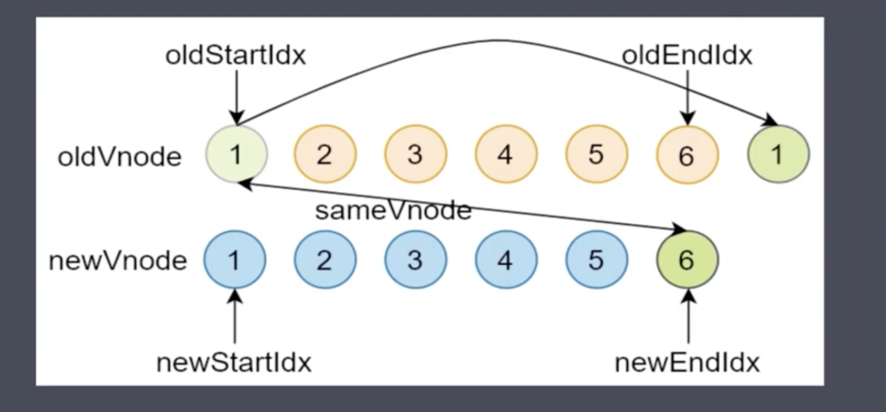

# Snabbdom库中Diff过程

## 虚拟DOM中的Diff算法

### 为什么要使用Diff?

渲染真实DOM的开销很大, DOM操作会引起浏览器的重排和重绘, 也就是浏览器的重新渲染, 浏览器重新渲染页面是非常耗性能的, 因为要重新渲染整个页面, 当大量数据变化后, 比如列表数据变化, 如果直接操作dom, 会让浏览器重新渲染整个列表

虚拟DOM中Diff的核心, 就是当数据变化后, 不直接操作DOM, 而是用JS对象来描述真实DOM, 当数据变化后, 会先对比的是描述DOM节点的JS对象是否发生变化, 找到所有发生变化的位置, 最后只去最小化的更新变化后的位置, 从而提高性能

Diff是一种算法, 类似于排序算法, 只不过, 排序算法是对一组数进行排序。而Diff算法是用于查找两棵树上虚拟节点的差异, 实现的方式有很多

> 1. 最麻烦的方式: 将新旧两棵树上每个节点对比一次, 如果有n个节点, 将对比n^2次, 找到差异后, 在循环遍历所有差异的部分, 去更新。
> 
> 2. Snabbdom根据DOM的特点对传统的Diff算法做了优化
> 
>   + 第一是DOM操作时很少会跨级别操作节点, 比如将父子节点换位
>   + 因此Snabbdom中只比较同级别的节点, 同级别不相同则直接删除重新创建, 而同级别的节点, 仅比较了一次, 减少了比较次数, 如果有n个节点, 也就只比较了n次, 大大降低了比较次数
> 

## Snabbdom中Diff过程

### 在对开始和结束节点比较时, 一共分为四种情况:

1. oldStartVnode / newStartVnode(旧头/新头)
2. oldEndVnode / newEndVnode(旧尾/新尾)
3. oldStartVnode / newEndVnode(旧头/新尾)
4. oldEndVnode / newStartVnode(旧尾/新头)

### 开始和结束节点

+ 如果新旧开始节点是sameVnode(key, sel以及data?.is均相同)
    - 调用`patchVnode()`对比和更新节点
    - 索引均后移一位 => oldStartIdx++ / newStartIdx++
    - 继续对比
;

+ 如果新旧节点的尾部是sameVnode
   - 调用`patchVnode()`对比和更新节点
   - 索引均前移一位 => oldEndIdx-- / newEndIdx--
   - 继续对比

;

> `注: 在sameVnode的情况下, 新节点不会重新创建dom元素, 而是复用老节点上的dom元素, 也就是patchVnode方法进来缓存的那个elm对象`

### 旧头/新尾

+ 如果两个节点是sameVnode, 则调用patchVnode对比和更新节点
+ 将oldStartVnode对应的DOM元素, 移动到右边, 更新索引
  - 说明旧节点的开始元素实际上已经成了新节点的尾部元素, 由于最终完成diff后, 要保持新旧节点数组的相同, 因此要旧节点的开始节点移动到尾部去
  - 同时oldStartIdx++, newEndIdx-- 然后继续对比

### 旧尾/新头

+ 如果旧节点的尾部节点和新节点的头部节点是sameVnode, 则调用patchVnode对比更新两个节点的差异
+ 将oldEndVnode对应的DOM元素移动到开头
+ oldEndIdx--, 同时newStartIdx++, 继续对比

### 非上述四种情况

说明开始和结束节点均互相不相同, 此时要去旧节点数组中依次查找是否存在相同的新节点

1. 遍历新的开始节点, 在旧节点数组中查找是否存在相同的key值的节点
   1. 如果没有找到, 说明此时的开始节点是新节点, 需要创建新的dom元素, 并且将其插入到旧节点的最前面
   2. 如果找到了, 并且需要判断节点的sel属性和老节点的sel属性是否相同, 如果sel不相同, 说明不是same节点, 则还是要创建dom元素, 并插入到最前方
   3. 如果是same节点, 则会将找出来的旧节点赋值给`elmToMove`变量, 然后调用patchVnode对比和更新两者差异, 然后将elmToMove节点对应的dom元素移动到最前面

### 循环结束

还有一些收尾工作

+ 当老节点的所有子结点先遍历完(oldStartIdx > oldEndIdx), 循环结束(老节点先遍历完, 新节点还有剩余, 剩下的直接调用addVnodes批量插入)

+ 当新节点的所有子结点先遍历完(newStartIdx > newEndIdx), 循环结束(新节点先遍历完, 老节点还有剩余, 直接删除)

