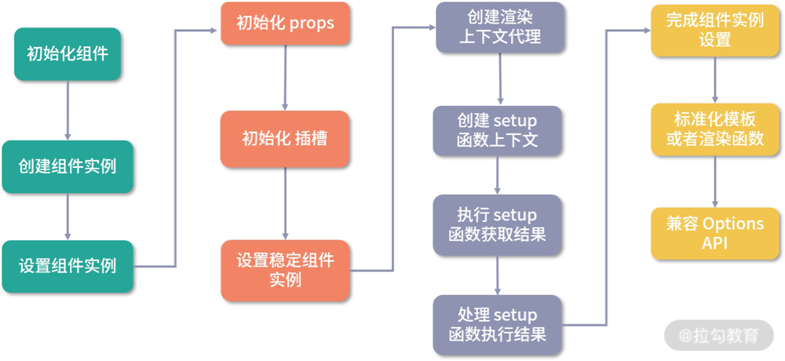

# 判断处理setup函数

整个逻辑涉及的代码如下所示:

```ts
// 处理setup函数
const { setup } = Component
if (setup) {
// 如果setup函数带参数, 则创建一个 setupContext
const setupContext = (instance.setupContext =
  setup.length > 1 ? createSetupContext(instance) : null)
// 执行setup函数, 获取结果
const setupResult = callWithErrorHandling(
  setup,
  instance,
  ErrorCodes.SETUP_FUNCTION, // 0
  // 开发环境为props设置readonly属性, 赋值告警
  [__DEV__ ? shallowReadonly(instance.props) : instance.props, setupContext]
)
// 处理 setup 执行结果
handleSetupResult(instance, setupResult, isSSR)
}
```

如果在组件中定义了setup函数, 接下来就是处理setup函数的流程, 主要有三个步骤:

1. 创建setup函数上下文
2. 执行setup函数并获取结果
3. 处理setup函数执行结果

## 创建setupContext

首先判断setup函数参数的长度, 如果存在参数, 则创建setupContext上下文(注入参数)

```ts
const setupContext = (instance.setupContext = setup.length > 1 ? createSetupContext(instance) : null)
```

举个例子, 这里哟录一个HelloWorld子组件, 如下:

```vue
<template>
  <p>{{ msg }}</p>
  <button @click="onClick">Toggle</button>
</template>
<script>
  export default {
    props: {
      msg: String
    },
    setup (props, { emit }) {
      function onClick () {
        emit('toggle')
      }
      return {
        onClick
      }
    }
  }
</script>
```

然后在父组件引用这个组件:

```vue
<template>
  <HelloWorld @toggle="toggle" :msg="msg"></HelloWorld>
</template>
<script>
  import { ref } from 'vue'
  import HelloWorld from "./components/HelloWorld";
  export default {
    components: { HelloWorld },
    setup () {
      const msg = ref('Hello World')
      function toggle () {
        msg.value = msg.value === 'Hello World' ? 'Hello Vue' : 'Hello World'
      }
      return {
        toggle,
        msg
      }
    }
  }
</script>
```

可以看到, HelloWorld子组件的setup函数接收两个参数

第一个参数props对应父组件传入的props数据

第二个参数emit是一个对象, 他其实就是setupContext

下面是用createSetupContext函数来创建setupContext:

```ts
export function createSetupContext(
  instance: ComponentInternalInstance
): SetupContext {
  const expose: SetupContext['expose'] = exposed => {
    if (__DEV__ && instance.exposed) {
      warn(`expose() should be called only once per setup().`)
    }
    instance.exposed = proxyRefs(exposed)
  }

  if (__DEV__) {
    // We use getters in dev in case libs like test-utils overwrite instance
    // properties (overwrites should not be done in prod)
    // 开发环境下不允许扩展setupContext, 主要通过get方法来返回对应的属性
    return Object.freeze({
      get props() {
        return instance.props
      },
      get attrs() {
        return new Proxy(instance.attrs, attrHandlers)
      },
      get slots() {
        return shallowReadonly(instance.slots)
      },
      get emit() {
        return (event: string, ...args: any[]) => instance.emit(event, ...args)
      },
      expose
    })
  } else {
    return {
      attrs: instance.attrs,
      slots: instance.slots,
      emit: instance.emit,
      expose
    }
  }
}
```

可以看到在开发环境下, 对setupContext进行冻结, 防止扩展

并且expose只能在setup中调用, 否则开发环境抛错

总体来说主要就是返回一个对对象, 包括attrs, slots, emit合expose四个属性。

setupContext让我们在setup函数内部可以获取到组件的属性, 插槽, 派发事件的方法emit以及暴露属性的方法expose

可以预见的是, 这个setupContext其实就是setup函数的第二个参数, 接下来就是看一下setup函数具体是如何执行的

## 执行setup

主要通过如下代码来执行setup函数并获取结果

```ts
// 执行setup函数, 获取结果
const setupResult = callWithErrorHandling(
  setup,
  instance,
  ErrorCodes.SETUP_FUNCTION,
  [__DEV__ ? shallowReadonly(instance.props) : instance.props, setupContext]
)
```

具体看一下 callWithErrorHandling 的实现

### callWithErrorHandling

```ts
export function callWithErrorHandling(
  fn: Function,
  instance: ComponentInternalInstance | null,
  type: ErrorTypes,
  args?: unknown[]
) {
  let res
  try {
    res = args ? fn(...args) : fn()
  } catch (err) {
    handleError(err, instance, type)
  }
  return res
}
```

可以看到 callWithErrorHandling 的实现非常简单, 就是对fn做了一层包裹, 内部还是执行了fn, 并在有参数的时候传入参数, 所以setup的第一个参数就是instance.props, 第二个参数就是 setupContext。函数执行的过程中通过try catch捕获报错, 并执行 handleError函数处理错误

执行setup函数并拿到了返回的结果, 接下来就要用 handleSetupResult 函数来处理结果

## handleSetupResult

```ts
handleSetupResult(instance, setupResult, isSSR)
```

实现如下:

```ts
export function handleSetupResult(
  instance: ComponentInternalInstance,
  setupResult: unknown,
  isSSR: boolean
) {
  if (isFunction(setupResult)) {
    if (__NODE_JS__ && (instance.type as ComponentOptions).__ssrInlineRender) {
      // ssr相关
      ...
    } else {
      // setup函数返回渲染函数
      instance.render = setupResult as InternalRenderFunction
    }
  } else if (isObject(setupResult)) {
    if (__DEV__ && isVNode(setupResult)) {
      // 返回vnode说明使用tsx执行setup的返回值有误, 应该返回渲染函数
      // 对应的情况就是 return <div></div>
      // 应该使用return () => <div></div>
      warn(
        `setup() should not return VNodes directly - ` +
          `return a render function instead.`
      )
    }
    // 添加响应式, 老版本使用reactive, 后改为proxyRefs
    instance.setupState = proxyRefs(setupResult)
  } else if (__DEV__ && setupResult !== undefined) {
    // setupResult 应该是一个对象, 非对象也不是undefined则开发环境抛错
    warn(
      `setup() should return an object. Received: ${
        setupResult === null ? 'null' : typeof setupResult
      }`
    )
  }
  finishComponentSetup(instance, isSSR)
}
```
可以看到, 当setupResult时一个对象的时候, 我们为他设置代理, 并赋值给instance.setupState

主要通过 [proxyRefs](/blogs/vue3-resource/compositionAPI/3.html#proxyrefs) 设置getter和setter, 设置getter的时候, 如果实现响应式对象, 会直接取出对应的值, 这也是为什么ref响应式对象在模板中不需要调用.value。再根据前面的代理规则, instance.ctx就可以从instance.setupState上获取到对应的数据, 这就在setup函数与模板渲染之间建立了联系

另外setup不仅支持返回一个对象, 也可以返回一个函数作为组件的render函数, 可以改写前面的示例, 如下:

```vue
<script lang="tsx">
  import { h } from 'vue'
  export default {
    props: {
      msg: String
    },
    setup (props, { emit }) {
      function onClick () {
        emit('toggle')
      }
      return (ctx) => {
        return [
          h('p', null, ctx.msg),
          h('button', { onClick: onClick }, 'Toggle')
        ]
      }
    }
  }
</script>
```

这里，我们删除了 HelloWorld 子组件的 template 部分，并把 setup 函数的返回结果改成了函数，也就是说它会作为组件的渲染函数，一切运行正常。

在handleSetupResult的最后, 会执行 finishComponentSetup 函数完成组件实例的设置, 其实这个函数和setup函数的执行结果已经没有什么关系了, 提取到外面放在handleSetupResult函数后面执行更合理一些

另外当组件没有定义setup的时候, 也会执行 finishComponentSetup 函数去完成组件实例的设置

## 完成组件实例的设置

主要就是通过调用 finishComponentSetup, 实现如下:

```ts
finishComponentSetup(instance, isSSR)

function finishComponentSetup(
  instance: ComponentInternalInstance,
  isSSR: boolean
) {
  const Component = instance.type as ComponentOptions

  // template / render function normalization
  if (__NODE_JS__ && isSSR) {
    if (Component.render) {
      instance.render = Component.render as InternalRenderFunction
    }
  } else if (!instance.render) {
    // 对模板或渲染函数的标准化
    // could be set from setup()
    if (compile && Component.template && !Component.render) {
      if (__DEV__) {
        // 开发环境性能埋点
        startMeasure(instance, `compile`)
      }
      // 运行时编译
      Component.render = compile(Component.template, {
        isCustomElement: instance.appContext.config.isCustomElement,
        delimiters: Component.delimiters
      })
      if (__DEV__) {
        endMeasure(instance, `compile`)
      }
    }
    // 组件对象的render函数赋值给instance
    instance.render = (Component.render || NOOP) as InternalRenderFunction

    // for runtime-compiled render functions using `with` blocks, the render
    // proxy used needs a different `has` handler which is more performant and
    // also only allows a whitelist of globals to fallthrough.
    if (instance.render._rc) {
      // 对使用with块的运行时编译的渲染函数, 使用新的渲染上下文的代理
      instance.withProxy = new Proxy(
        instance.ctx,
        RuntimeCompiledPublicInstanceProxyHandlers
      )
    }
  }

  // support for 2.x options
  // 兼容Vue2 Options API
  if (__FEATURE_OPTIONS_API__) {
    currentInstance = instance
    pauseTracking()
    applyOptions(instance, Component)
    resetTracking()
    currentInstance = null
  }

  // warn missing template/render
  // 对于没有render的情况将在开发环境报错
  if (__DEV__ && !Component.render && instance.render === NOOP) {
    /* istanbul ignore if */
    if (!compile && Component.template) {
      warn(
        `Component provided template option but ` +
          `runtime compilation is not supported in this build of Vue.` +
          (__ESM_BUNDLER__
            ? ` Configure your bundler to alias "vue" to "vue/dist/vue.esm-bundler.js".`
            : __ESM_BROWSER__
              ? ` Use "vue.esm-browser.js" instead.`
              : __GLOBAL__
                ? ` Use "vue.global.js" instead.`
                : ``) /* should not happen */
      )
    } else {
      warn(`Component is missing template or render function.`)
    }
  }
}
```

函数主要做了两件事:

1. 标准化模板或者渲染函数
2. 兼容Options API

### 标准化模板或者渲染函数

#### 背景

在分析这个过程之前, 首先需要了解一些背景

组件最终是通过运行render函数生成子树vnode, 但是我们很少直接去编写render函数, 通常会使用两种方式开发组件

+ 第一种是使用SFC(Single File Component)单文件的开发方式来开发组件
  - 通过编写组件的template模板去描述一个组件的DOM结构。
  - 我们知道.vue类型的文件无法在Web端直接加载, 因此在webpack的编译阶段, 他会通过vue-loader编译生成组件相关的js和css, 并把template不分转换为render函数添加到组件对象的属性中
+ 另一种开发方式是不借助webpack编译, 直接引入Vue, 开箱即用
  - 我们直接在组件对象template属性中编写组件的模板, 然后在运行阶段编译生成render函数, 这种方式通常用于有一定历史包袱的古老项目

因此在Vue中有两个版本: 
+ runtime-only
+ runtime-compiler

一般情况下, 推荐使用runtime-only版本的Vue, 因为相对而言他的体积更小, 而且在运行时不用编译, 不仅耗时更少, 而且性能更优秀

遇到一些不得已的情况比如上述提到的古老项目, 也可以选择runtime-compiler版本

runtime-only和runtime-compiler的区别就在于是否注册了这个compile方法

在Vue3中, compile方法是通过外部注册的:

```ts
let compile: CompileFunction | undefined

// dev only
export const isRuntimeOnly = () => !compile

export function registerRuntimeCompiler(_compile: any) {
  compile = _compile
}
```

#### 标准化流程

回到标准化模板或者渲染函数逻辑，我们先看 instance.render 是否存在, 如果不存在, 则开始标准化流程, 主要处理以下三种情况:

1. compile和组件template属性存在, render方法不存在的情况
  - 此时, runtime-compile版本会在js运行时进行模板编译, 生成render函数
2. compile和render方法不存在, 组件template属性存在的情况
  - 此时由于没有compile, 这里用的是runtime-only版本, 因此要报一个警告来告诉用户, 想要运行编译得使用runtime-compile版本的Vue
3. 组件既没写render, 也没有template模板
  - 此时要报一个警告, 告诉用户组件缺少render函数或template模板 

处理完第一种情况后, 就要把组件的render函数赋值给instance.render, 后续两种情况留到处理完OptionsAPI后进行判断。到了组件渲染的时候, 就可以运行instance.render函数生成组件的子树vnode了


另外, 对于使用with块运行时编译的渲染函数, 渲染上下文的代理是`RuntimeCompiledPublicInstanceProxyHandlers`, 它是在之前渲染上下文代理`PublicInstanceProxyHandlers`的基础上进行的扩展, 主要对has函数的实现做了优化:

```ts
export const RuntimeCompiledPublicInstanceProxyHandlers = extend(
  {},
  PublicInstanceProxyHandlers,
  {
    get(target: ComponentRenderContext, key: string) {
      // fast path for unscopables when using `with` block
      // 此时key从with中已被排除, 返回undefined防止报错
      if ((key as any) === Symbol.unscopables) {
        return
      }
      // 返回对应值
      return PublicInstanceProxyHandlers.get!(target, key, target)
    },
    has(_: ComponentRenderContext, key: string) {
      // 如果key以 _ 开头或者 key 在全局变量白名单内, 则has为false
      const has = key[0] !== '_' && !isGloballyWhitelisted(key)
      if (__DEV__ && !has && PublicInstanceProxyHandlers.has!(_, key)) {
        warn(
          `Property ${JSON.stringify(
            key
          )} should not start with _ which is a reserved prefix for Vue internals.`
        )
      }
      return has
    }
  }
)
```

这里如果 key 以 _ 开头，或者 key 在全局变量的白名单内，则 has 为 false，此时则直接命中警告，不用再进行之前那一系列的判断了。

否则继续判断, 如果开发环境下前面的判断为false, 但是在 PublicInstanceProxyHandlers 存在对应的值, 则抛错变量以下划线开头或为全局白名单内成员

#### OptionsAPI: 兼容Vue2

了解完标准化模板或渲染函数流程, 接下来就是组件实例设置的最后一个流程, 兼容Vue2的Options API


```ts
// 兼容Vue2 Options API
if (__FEATURE_OPTIONS_API__) {
  currentInstance = instance
  pauseTracking()
  applyOptions(instance, Component)
  resetTracking()
  currentInstance = null
}
```
主要是通过调用 applyOptions 实现, 核心代码如下所示:

```ts
export function applyOptions(
  instance: ComponentInternalInstance,
  options: ComponentOptions,
  deferredData: DataFn[] = [],
  deferredWatch: ComponentWatchOptions[] = [],
  deferredProvide: (Data | Function)[] = [],
  asMixin: boolean = false
) {
  const {
    // composition
    // 组合
    mixins,
    extends: extendsOptions,
    // 数据状态和方法
    // state
    data: dataOptions,
    computed: computedOptions,
    methods,
    watch: watchOptions,
    provide: provideOptions,
    inject: injectOptions,
    // assets
    // 组件和指令
    components,
    directives,
    // lifecycle
    // 生命周期
    beforeMount,
    mounted,
    beforeUpdate,
    updated,
    activated,
    deactivated,
    beforeDestroy,
    beforeUnmount,
    destroyed,
    unmounted,
    render,
    renderTracked,
    renderTriggered,
    errorCaptured,
    // public API
    expose
  } = options

  // instance.proxy为this
  const publicThis = instance.proxy!
  const ctx = instance.ctx

  // 处理mixin
  const globalMixins = instance.appContext.mixins

  if (asMixin && render && instance.render === NOOP) {
    instance.render = render as InternalRenderFunction
  }

  // applyOptions is called non-as-mixin once per instance
  if (!asMixin) {
    isInBeforeCreate = true
    callSyncHook(
      'beforeCreate',
      LifecycleHooks.BEFORE_CREATE,
      options,
      instance,
      globalMixins
    )
    isInBeforeCreate = false
    // global mixins are applied first
    applyMixins(
      instance,
      globalMixins,
      deferredData,
      deferredWatch,
      deferredProvide
    )
  }

  // extending a base component...
  // 处理extend
  if (extendsOptions) {
    applyOptions(
      instance,
      extendsOptions,
      deferredData,
      deferredWatch,
      deferredProvide,
      true
    )
  }
  // 处理本地mixins
  // local mixins
  if (mixins) {
    applyMixins(instance, mixins, deferredData, deferredWatch, deferredProvide)
  }

  const checkDuplicateProperties = __DEV__ ? createDuplicateChecker() : null

  if (__DEV__) {
    const [propsOptions] = instance.propsOptions
    if (propsOptions) {
      for (const key in propsOptions) {
        checkDuplicateProperties!(OptionTypes.PROPS, key)
      }
    }
  }

  // options initialization order (to be consistent with Vue 2):
  // - props (already done outside of this function)
  // - inject
  // - methods
  // - data (deferred since it relies on `this` access)
  // - computed
  // - watch (deferred since it relies on `this` access)

  // props已经在外面处理过了
  // 处理inject
  if (injectOptions) {
    if (isArray(injectOptions)) {
      for (let i = 0; i < injectOptions.length; i++) {
        const key = injectOptions[i]
        ctx[key] = inject(key)
        if (__DEV__) {
          checkDuplicateProperties!(OptionTypes.INJECT, key)
        }
      }
    } else {
      for (const key in injectOptions) {
        const opt = injectOptions[key]
        if (isObject(opt)) {
          ctx[key] = inject(
            opt.from || key,
            opt.default,
            true /* treat default function as factory */
          )
        } else {
          ctx[key] = inject(opt)
        }
        if (__DEV__) {
          checkDuplicateProperties!(OptionTypes.INJECT, key)
        }
      }
    }
  }

  // 处理methods
  if (methods) {
    for (const key in methods) {
      const methodHandler = (methods as MethodOptions)[key]
      if (isFunction(methodHandler)) {
        // In dev mode, we use the `createRenderContext` function to define methods to the proxy target,
        // and those are read-only but reconfigurable, so it needs to be redefined here
        if (__DEV__) {
          Object.defineProperty(ctx, key, {
            value: methodHandler.bind(publicThis),
            configurable: true,
            enumerable: true,
            writable: true
          })
        } else {
          ctx[key] = methodHandler.bind(publicThis)
        }
        if (__DEV__) {
          checkDuplicateProperties!(OptionTypes.METHODS, key)
        }
      } else if (__DEV__) {
        warn(
          `Method "${key}" has type "${typeof methodHandler}" in the component definition. ` +
            `Did you reference the function correctly?`
        )
      }
    }
  }

  // 处理data
  if (!asMixin) {
    if (deferredData.length) {
      deferredData.forEach(dataFn => resolveData(instance, dataFn, publicThis))
    }
    if (dataOptions) {
      // @ts-ignore dataOptions is not fully type safe
      resolveData(instance, dataOptions, publicThis)
    }
    if (__DEV__) {
      const rawData = toRaw(instance.data)
      for (const key in rawData) {
        checkDuplicateProperties!(OptionTypes.DATA, key)
        // expose data on ctx during dev
        if (key[0] !== '$' && key[0] !== '_') {
          Object.defineProperty(ctx, key, {
            configurable: true,
            enumerable: true,
            get: () => rawData[key],
            set: NOOP
          })
        }
      }
    }
  } else if (dataOptions) {
    deferredData.push(dataOptions as DataFn)
  }

  // 处理计算属性
  if (computedOptions) {
    for (const key in computedOptions) {
      const opt = (computedOptions as ComputedOptions)[key]
      const get = isFunction(opt)
        ? opt.bind(publicThis, publicThis)
        : isFunction(opt.get)
          ? opt.get.bind(publicThis, publicThis)
          : NOOP
      if (__DEV__ && get === NOOP) {
        warn(`Computed property "${key}" has no getter.`)
      }
      const set =
        !isFunction(opt) && isFunction(opt.set)
          ? opt.set.bind(publicThis)
          : __DEV__
            ? () => {
                warn(
                  `Write operation failed: computed property "${key}" is readonly.`
                )
              }
            : NOOP
      const c = computed({
        get,
        set
      })
      Object.defineProperty(ctx, key, {
        enumerable: true,
        configurable: true,
        get: () => c.value,
        set: v => (c.value = v)
      })
      if (__DEV__) {
        checkDuplicateProperties!(OptionTypes.COMPUTED, key)
      }
    }
  }

  // 处理watch
  if (watchOptions) {
    deferredWatch.push(watchOptions)
  }
  if (!asMixin && deferredWatch.length) {
    deferredWatch.forEach(watchOptions => {
      for (const key in watchOptions) {
        createWatcher(watchOptions[key], ctx, publicThis, key)
      }
    })
  }

  // 处理provide
  if (provideOptions) {
    deferredProvide.push(provideOptions)
  }
  if (!asMixin && deferredProvide.length) {
    deferredProvide.forEach(provideOptions => {
      const provides = isFunction(provideOptions)
        ? provideOptions.call(publicThis)
        : provideOptions
      Reflect.ownKeys(provides).forEach(key => {
        provide(key, provides[key])
      })
    })
  }

  // asset options.
  // To reduce memory usage, only components with mixins or extends will have
  // resolved asset registry attached to instance.
  if (asMixin) {
    // 处理组件
    if (components) {
      extend(
        instance.components ||
          (instance.components = extend(
            {},
            (instance.type as ComponentOptions).components
          ) as Record<string, ConcreteComponent>),
        components
      )
    }
    // 处理指令
    if (directives) {
      extend(
        instance.directives ||
          (instance.directives = extend(
            {},
            (instance.type as ComponentOptions).directives
          )),
        directives
      )
    }
  }

  // 处理生命周期options
  // lifecycle options
  if (!asMixin) {
    callSyncHook(
      'created',
      LifecycleHooks.CREATED,
      options,
      instance,
      globalMixins
    )
  }
  if (beforeMount) {
    onBeforeMount(beforeMount.bind(publicThis))
  }
  if (mounted) {
    onMounted(mounted.bind(publicThis))
  }
  if (beforeUpdate) {
    onBeforeUpdate(beforeUpdate.bind(publicThis))
  }
  if (updated) {
    onUpdated(updated.bind(publicThis))
  }
  if (activated) {
    onActivated(activated.bind(publicThis))
  }
  if (deactivated) {
    onDeactivated(deactivated.bind(publicThis))
  }
  if (errorCaptured) {
    onErrorCaptured(errorCaptured.bind(publicThis))
  }
  if (renderTracked) {
    onRenderTracked(renderTracked.bind(publicThis))
  }
  if (renderTriggered) {
    onRenderTriggered(renderTriggered.bind(publicThis))
  }
  if (__DEV__ && beforeDestroy) {
    warn(`\`beforeDestroy\` has been renamed to \`beforeUnmount\`.`)
  }
  if (beforeUnmount) {
    onBeforeUnmount(beforeUnmount.bind(publicThis))
  }
  if (__DEV__ && destroyed) {
    warn(`\`destroyed\` has been renamed to \`unmounted\`.`)
  }
  if (unmounted) {
    onUnmounted(unmounted.bind(publicThis))
  }

  if (isArray(expose)) {
    if (!asMixin) {
      if (expose.length) {
        const exposed = instance.exposed || (instance.exposed = proxyRefs({}))
        expose.forEach(key => {
          exposed[key] = toRef(publicThis, key as any)
        })
      } else if (!instance.exposed) {
        instance.exposed = EMPTY_OBJ
      }
    } else if (__DEV__) {
      warn(`The \`expose\` option is ignored when used in mixins.`)
    }
  }
}
```

主要就是将instance.proxy作为全局this, 依次处理了全局mixin, extend, mixins, inject, 方法, data, 计算属性, watch, provide, 组件, 指令和生命周期


## proxyRefs

```ts
export function proxyRefs<T extends object>(
  objectWithRefs: T
): ShallowUnwrapRef<T> {
  return isReactive(objectWithRefs)
    ? objectWithRefs
    : new Proxy(objectWithRefs, shallowUnwrapHandlers)
}

const shallowUnwrapHandlers: ProxyHandler<any> = {
  // 解除响应式返回对应值
  get: (target, key, receiver) => unref(Reflect.get(target, key, receiver)),
  // 设置值
  set: (target, key, value, receiver) => {
    const oldValue = target[key]
    if (isRef(oldValue) && !isRef(value)) {
      oldValue.value = value
      return true
    } else {
      return Reflect.set(target, key, value, receiver)
    }
  }
}
```

## 总结

到此为止, 组件的初始化流程就结束了

整个流程主要包含了创建组件实例和设置组件实例

通过进一步细节的深入, 也了解了渲染上下文的代理过程, 了解了CompositionAPI中setup启动函数执行的时机, 以及如何建立setup返回结果和模板渲染之间的联系, 了解了组件定义的模板或者渲染函数的标准化过程, 了解了如何兼容Vue2的OptionsAPI

最后通过一张图直观感受一下Vue3组件初始化的流程:



