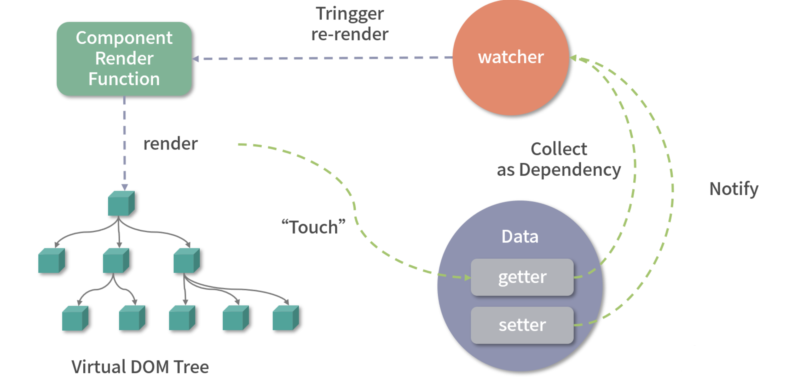
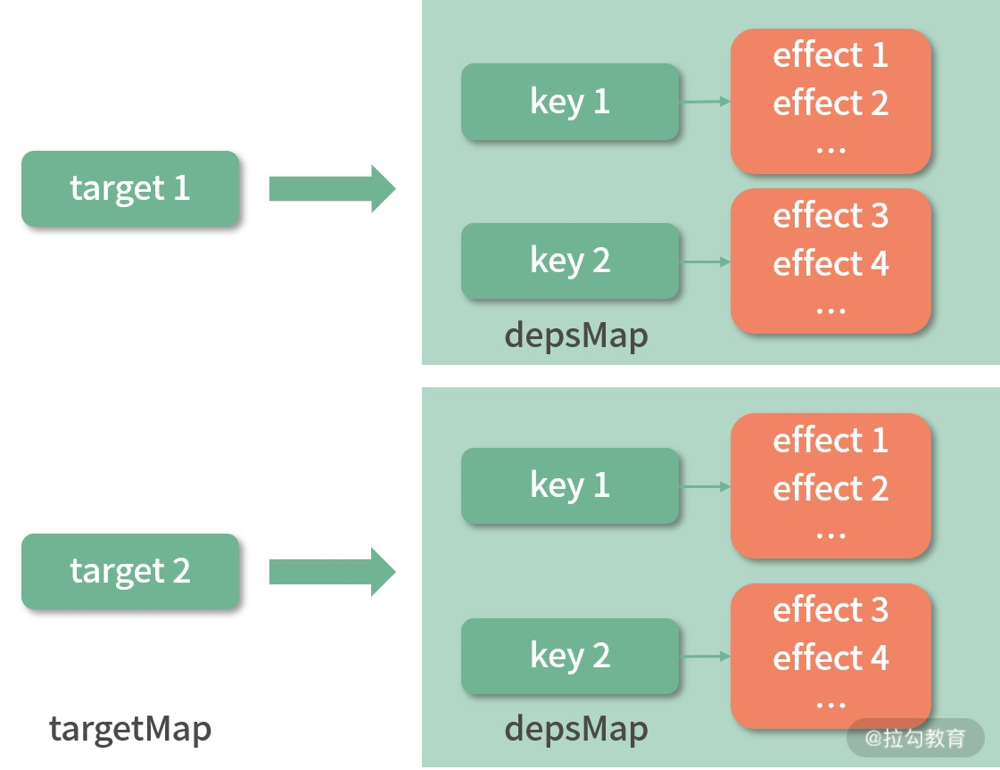

# 响应式内部原理实现(一)

在setup函数中, 多次使用一些API让数据变成响应式, 这里主要就是深入学习响应式内部的实现原理

除了组件化, Vue的另一个核心设计思想就是`响应式`。本质上是当数据变化后会自动执行某个函数, 映射到组件的实现就是当数据变化后, 会自动触发组件的重新渲染。`响应式是Vue组件化更新渲染的一个核心机制。`

## Vue2中的响应式实现

在介绍Vue3响应式实现之前, 先回顾一下Vue2响应式实现的部分: 它在内部通过`Object.defineProperty API`劫持数据变化, 在数据被访问的时候收集依赖, 然后在数据被修改的时候通知依赖更新。整个流程如下图所示:



在Vue2中, Watcher就是依赖, 有专门控制组件渲染的`render watcher`。这里有两个流程, 首先是`依赖收集`, 组件在render的时候会访问this中的数据, 访问数据时, 首先会通过组件实例对象this上的外部代理, 访问到data等实例属性内部的具体属性, 然后访问具体属性时, 就会触发getter把render watcher作为依赖手机起来, 并和数据建立联系；然后是`派发更新`，当对这些数据修改的时候, 就会触发劫持数据时设置的setter属性, 通知内部最终会render watcher进行更新, 进而触发组件的重渲染流程。

之前提到了`Object.defineProperty`这个API的缺陷, 不能监听对象属性新增和删除, 初始化阶段递归执行Object.defineProperty会带来性能负担。

Vue3中为了解决这些缺陷, 使用了`Proxy API`重写响应式部分, 并独立维护和发布整个reactivity库, 下面就重点深入一下Vue3响应式部分的实现原理

## 响应式对象的实现差异

在Vue2中, 只要在data, props, computed中定义数据, 并且不作特殊处理(比如Object.freeze, Object.seal等), 那么就是响应式的, 如下:

```vue
<template>
  <div>
    <p>{{ msg }}</p>
    <button @click="random">Random msg</button>
  </div>
</template>
<script>
  export default {
    data() {
      return {
        msg: 'msg reactive'
      }
    },
    methods: {
      random() {
        this.msg = Math.random()
      }
    }
  }
</script>
```

初次渲染时会显示 msg reactive, 当点击按钮时，会执行random函数，random函数会修改this.msg，组件就重新渲染了

如果做如下改动:

```vue
<script>
export default {
  created() {
    this.msg = 'msg not reactive'
  }, 
  methods: {
    random() {
      this.msg = Math.random()
    }
  }
}
</script>
```

此时初始化渲染为msg not reactive, 执行random后, 依然不会发生变化

因为在created中通过this直接添加的属性msg, 并不会添加响应式处理, Vue没有对他做响应式处理。而在data中定义的数据, Vue在组件初始化时，会把他变成响应式对象, 这是一个相对黑盒的过程，用户通常感受不到

在一些场景下，如果我们仅仅想在组件上下文中共享某个变量，而不必去监测它的这个数据变化，这时就特别适合在 created 钩子函数中去定义这个变量，因为创建响应式的过程是有性能代价的，这相当于一种 Vue 应用的性能优化小技巧，你掌握了这一点就可以在合适的场景中应用了。

到了 Vue3 创建组件时，可以使用 Composition API。对于刚才的例子，可以如下编写:

```vue
<template>
  <div>
    <p>{{ state.msg }}</p>
    <button @click="random">Random msg</button>
  </div>
</template>
<script>
  import { reactive } from 'vue'
  export default {
    setup() {
      const state = reactive({
        msg: 'msg reactive'
      })

      const random = function() {
        state.msg = Math.random()
      }

      return {
        random,
        state
      }
    }
  }
</script>
```

这里通过setup实现了和上面一样的功能, 这里引入了reactive API, 他可以把一个对象数据变成响应式对象。

可以看出来, Composition API更推荐用户主动定义响应式对象, 而不是内部黑盒直接处理。这样用户会更加明确哪些数据是响应式的, 如果不想让数据变成响应式的, 就直接定义原始数据类型即可。

### Reactive API

Reactive API 实现如下:

```ts
export function reactive(target: object) {
  // 如果尝试把一个 readonly proxy 变成响应式，直接返回这个 readonly proxy 对象
  if (target && (target as Target)[ReactiveFlags.IS_READONLY]) {
    return target
  }
  return createReactiveObject(
    target,
    false,
    mutableHandlers,
    mutableCollectionHandlers
  )
}

// * 用于reactIve响应式
function createReactiveObject(
  target: Target,
  isReadonly: boolean,
  baseHandlers: ProxyHandler<any>,
  collectionHandlers: ProxyHandler<any> // 只有get
) {
  // 如果不是对象则直接在开发环境抛错并返回
  if (!isObject(target)) {
    if (__DEV__) {
      console.warn(`value cannot be made reactive: ${String(target)}`)
    }
    return target
  }
  // 如果对象已经是一个Proxy对象, 直接返回
  // 但是有一个意外, 如果是 readonly作用于一个响应式对象, 则继续
  if (
    // __v_row 表示是一个响应式对象
    target[ReactiveFlags.RAW] &&
    // __v_reactive表示这个对象已经被变成响应式过
    !(isReadonly && target[ReactiveFlags.IS_REACTIVE])
  ) {
    return target
  }
  const proxyMap = isReadonly ? readonlyMap : reactiveMap
  const existingProxy = proxyMap.get(target)
  if (existingProxy) {
    // target 已经有对应的 Proxy, 直接返回当前Proxy
    return existingProxy
  }
  // 白名单中的数据类型才能变成响应式对象
  const targetType = getTargetType(target)
  if (targetType === TargetType.INVALID) {
    // 非白名单对象直接返回
    return target
  }
  // 创建响应式对象
  const proxy = new Proxy(
    target,
    targetType === TargetType.COLLECTION ? collectionHandlers : baseHandlers
  )
  // 添加到缓存中, 使用weakMap便于不使用时直接回收
  proxyMap.set(target, proxy)
  // 返回当前响应式对象
  return proxy
}
```

通过上述代码, 可以看到reactive内部是通过 createReactiveObject 函数把 target 变成了一个响应式对象

在这个过程中, createReactiveObject 函数主要做了以下几件事情:

1. 首先判断target是不是对象, 或者数组, 如果不是, 则直接返回
2. 对于已经是响应式的对象再次执行reactive, 那么将直接返回这个响应式对象, 如下:

  ```ts
  import { reactive } from 'vue'
  const original = { foo: 1 }
  const observed = reactive(original)
  const observed2 = reactive(observed)
  observed === observed2
  ```
  + 可以看到 observed已经是响应式对象了, 如果在对他执行reactive, 那么返回的值 observed2 和 observed 指向同一个引用
  + reactive 函数会通过 target.__v_raw 属性来判断 target 是否已经是一个响应式对象（因为响应式对象的 __v_raw 属性会指向它自身，后面会提到），如果是的话则直接返回响应式对象。
3. 如果对同一个原始数据多次执行reactive, 那么会返回相同的响应式对象, 如下:

  ```ts
  import { reactive } from 'vue'
  const original = { foo: 1 }
  const observed = reactive(original)
  const observed2 = reactive(original)
  observed === observed2
  ```
  + 可以看到, 原始数据original被反复执行reactive, 但是响应式结果 observed 和 observed2 指向同一个引用
  + 所以这里reactive函数会通过 target.__v_reactive判断target是否已经有对应的响应式对象(因为创建完响应式对象后, 会给原始对象打上__v_reactive标识, 后面会说), 如果有则返回这个响应式对象
4. 使用 getTargetType 来获取target的类型, 对target对象做进一步限制
  ```ts
  function getTargetType(value: Target) {
  // 对象是否带有 __v_skip, 或者对象不可扩展(freeze或者seal过)
  return value[ReactiveFlags.SKIP] || !Object.isExtensible(value)
    ? TargetType.INVALID
    // 判断白名单
    : targetTypeMap(toRawType(value))
  }
  ```
  + 带有__v_skip属性的对象, 或者不可扩展的对象, 以及不在白名单内的对象都是不能变成响应式的
5. 通过 Proxy API劫持target对象, 把它变成响应式。我们把Proxy函数返回的结果称作响应式对象, 这里Proxy对应的处理器对象会根据数据类型的不同而不同, 稍后会重点分析基本数据类型的Proxy处理器对象, reactive函数传入的 baseHandlers 值是 mutableHandlers
6. 将创建完成的响应式对象添加到缓存中(proxyMap)
  + 这就是前面“对同一个原始数据多次执行 reactive ，那么会返回相同的响应式对象”逻辑的判断依据。
  + 仔细想想看，响应式的实现方式无非就是劫持数据，Vue3 的 reactive API 就是通过 Proxy 劫持数据，而且由于 Proxy 劫持的是整个对象，所以我们可以检测到任何对对象的修改，弥补了 Object.defineProperty API 的不足。 

### mutableHandlers

接下来是Proxy处理器对象 mutableHandlers 的实现:

```ts
export const mutableHandlers: ProxyHandler<object> = {
  get,
  set,
  deleteProperty,
  has,
  ownKeys
}
```

其实就是劫持对target对象的一些操作:

+ get: 访问对象属性时触发
+ set: 设置对象属性时触发
+ deleteProperty: 删除对象属性时触发
+ has: in操作符对target进行操作时触发
+ onwKeys: 通过Object.getOwnPropertyNames访问对象属性名时触发ownKeys

因为无论命中哪个处理器函数, 它都会做`依赖收集`或者`派发更新`, 所以这里主要看get和set即可

## 依赖收集: get函数

`依赖收集发生在数据访问的阶段`

由于我们用 Proxy API 劫持了数据对象, 所以当这个响应式对象属性被访问的时就会执行get函数, 这里一起看一下get函数的实现, 其实它是执行createGetter函数的返回值, isReadonly默认为false

实现如下:

```ts
const get = /*#__PURE__*/ createGetter()

/**
 * 
 * @param isReadonly 是否只读get
 * @param shallow 是否浅观察get
 * @returns 目标字段值
 */
function createGetter(isReadonly = false, shallow = false) {
  return function get(target: Target, key: string | symbol, receiver: object) {
    if (key === ReactiveFlags.IS_REACTIVE) {
      // 访问 __v_isReactive
      return !isReadonly
    } else if (key === ReactiveFlags.IS_READONLY) {
      // 访问 __v_isReadonly
      return isReadonly
    } else if (
      key === ReactiveFlags.RAW &&
      receiver === (isReadonly ? readonlyMap : reactiveMap).get(target)
    ) {
      // 访问 __v_raw, 指向原有对象
      return target
    }

    // 目标对象是否数组
    const targetIsArray = isArray(target)

    // arrayInstrumentations 修改了一些数组方法
    if (!isReadonly && targetIsArray && hasOwn(arrayInstrumentations, key)) {
      return Reflect.get(arrayInstrumentations, key, receiver)
    }

    // 获取值
    // Reflect.get消除不同对象类型的差异
    const res = Reflect.get(target, key, receiver)

    if (
      isSymbol(key)
        ? builtInSymbols.has(key as symbol)
        : isNonTrackableKeys(key)
    ) {
      // 内建Symbol或者不需收集的key直接返回
      return res
    }

    if (!isReadonly) {
      // 依赖收集
      track(target, TrackOpTypes.GET, key)
    }

    // 是否浅层代理,是的话直接返回
    if (shallow) {
      return res
    }

    if (isRef(res)) {
      // 嵌套ref会自动解ref, 数组成员或者key为数字除外
      const shouldUnwrap = !targetIsArray || !isIntegerKey(key)
      return shouldUnwrap ? res.value : res
    }

    if (isObject(res)) {
      // 如果res是个对象或者数组类型, 则递归执行 reactive函数把res变成响应式对象
      return isReadonly ? readonly(res) : reactive(res)
    }

    return res
  }
}
```

结合上述代码, get函数主要做了如下几件事情:

1. 首先对特殊的key做了代理, 这就是为什么我们在createReactiveObject函数中判断对象是否存在__v_raw属性, 如果存在就返回这个响应式对象本身。
2. 接着通过Reflect.get方法求值, 如果target是数组且key命中了arrayInstrumentations, 则执行对应的函数
  + 下面可以看一下 arrayInstrumentations 的实现
  ```ts
  (['includes', 'indexOf', 'lastIndexOf'] as const).forEach(key => {
    // ? 劫持 includes, indexOf和lastIndexOf
    // 缓存原有方法
    const method = Array.prototype[key] as any;
    // 重写
    arrayInstrumentations[key] = function(this: unknown[], ...args: unknown[]) {
      // toRaw将响应式对象转换为原始对象
      const arr = toRaw(this)
      for (let i = 0, l = this.length; i < l; i++) {
        // 依赖收集
        track(arr, TrackOpTypes.GET, i + '')
      }
      // we run the method using the original args first (which may be reactive)
      // 尝试使用参数本身执行原数组方法, 可能会因为是响应式数据导致失败
      const res = method.apply(arr, args)
      if (res === -1 || res === false) {
        // 如果失败, 在尝试将参数转换为原始数据重新执行
        // if that didn't work, run it again using raw values.
        return method.apply(arr, args.map(toRaw))
      } else {
        // 成功则返回
        return res
      }
    }
  })
  ``` 
  + 这里可以看到, 当target是一个数组的时候, 访问 target.includes, target.indexOf或者target.lastIndexOf就会执行对应的代理函数
  + 除了调用数组本身的方法求值外, 还对数组每个元素做了依赖收集, 一旦数组的元素被修改, 数组的这几个API的返回结果都可能发生变化, 所以需要跟踪数组每个元素的变化
3. 第三步就是通过Reflect.get求值, 然后执行track函数[收集依赖](/blogs/vue3-resource/compositionAPI/4.html#依赖收集)
4. 多级判断不同情况
  1. 浅Proxy直接返回结果即可
  2. 如果结果是Ref响应式对象, 在原对象不是数组 或 key也不是数字的情况下, 对结果进行解ref(嵌套Ref对象解除ref响应式直接返回结果即可)
  3. 如果结果是对象或者数组, 会递归执行reactive将res变成响应式对象
    +  这么做是因为 Proxy 劫持的是对象本身，并不能劫持子对象的变化，这点和 Object.defineProperty API 一致。但是 Object.defineProperty 是在初始化阶段，即定义劫持对象的时候就已经递归执行了，而 Proxy 是在对象属性被访问的时候才递归执行下一步 reactive，这其实是一种延时定义子对象响应式的实现，在性能上会有较大的提升。


## 依赖收集

> 整个get函数最核心的部分就是执行`track`函数收集依赖

### track

先来看一下track函数的实现

```ts
// 原始数据对象 map
const targetMap = new WeakMap<any, KeyToDepMap>()
// 存储effect的栈
const effectStack: ReactiveEffect[] = []
// 当前激活的effect
let activeEffect: ReactiveEffect | undefined
// 是否应该收集依赖
let shouldTrack = true
/**
 * 
 * @param target 依赖收集的目标对象
 * @param type 收集的类型 get | has | iterate
 * @param key 目标的键名
 */
export function track(target: object, type: TrackOpTypes, key: unknown) {
  // 如果不需要收集依赖或者当前没有激活的effect则跳过收集
  if (!shouldTrack || activeEffect === undefined) {
    return
  }
  // 获取当前对象对应的depsMap
  let depsMap = targetMap.get(target)
  if (!depsMap) {
    // 每一个target对应一个depsMap, 如果不存在, 则初始化一个新的depsMap, 并存入原始数据对象的map ———— targetMap中
    targetMap.set(target, (depsMap = new Map()))
  }
  // 获取dep集合
  let dep = depsMap.get(key)
  if (!dep) {
    // 每一个key对应一个 dep 集合
    // 如果dep集合不存在, 则初始化一个新的dep集合并存入当前对象的depsMap中
    depsMap.set(key, (dep = new Set()))
  }
  if (!dep.has(activeEffect)) {
    // 收集当前激活的 effect 作为依赖
    dep.add(activeEffect)
    // 当前激活的 effect 收集 dep 集合作为依赖
    activeEffect.deps.push(dep)
    ...
  }
}
```

分析track函数的实现之前, 先想一下要收集的依赖是什么?

整个依赖收集的目的是为了实现响应式, 就是当数据变化的时候可以自动做一些事情, 比如执行某些函数, 所以收集的依赖就是数据变化后执行的副作用函数。

这一点和Vue2类似, 只不过Vue2收集的依赖是三种类型的watcher, 而在这里是副作用函数effect

再来看实现, 把target作为原始的数据, key作为访问的属性。

这里创建了全局的targetMap作为原始数据对象的Map, 他的键是target, 值是 depsMap, 作为依赖的Map, 其中包含了当前目标对象下所有属性的dep集合；

这个depsMap的键是target的key, 值是dep集合, dep集合中存储的是依赖的副作用函数(用于更新的函数, 类似于Vue2的Watcher实例)

为了方便理解, 可以通过下图表示他们的关系:



> 所以每次 track, 就是把当前激活的副作用函数 activeEffect 作为依赖, 然后收集到 target 相关的depsMap对应key下的依赖集合dep中

以上就是依赖收集的过程
