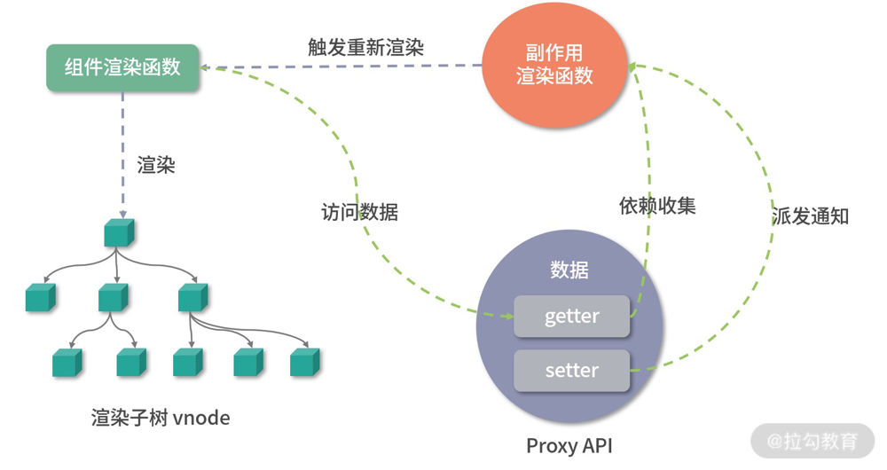

# 其他响应式API
除了 reactive API，Vue3 还提供了其他好用的响应式 API，接下来看一些常用的, 比如 readonly API 和 ref API(Vue3更加推荐使用的响应式API)

## readonly API

如果用const声明一个对象变量, 虽然不能直接对这个变量赋值, 但我们可以修改它的属性。如果我们希望创建组件对象, 不能修改它的属性, 也不能给这个对象添加和删除属性, 让它变成一个真正意义上的只读对象

```ts
const original = {
  foo: 1
}
const wrapped = readonly(original)
wrapped.foo = 2 // 报错, wrapped是一个只读对象
```

显然, 想实现上述需求就需要劫持对象, 于是Vue3在reactiveAPI的基础上实现了readonlyAPI

readonly API实现如下:

```ts
export function readonly<T extends object>(
  target: T
): DeepReadonly<UnwrapNestedRefs<T>> {
  return createReactiveObject(
    target,
    true,
    readonlyHandlers,
    readonlyCollectionHandlers
  )
}

function createReactiveObject(
  target: Target,
  isReadonly: boolean, // true
  baseHandlers: ProxyHandler<any>,
  collectionHandlers: ProxyHandler<any> // 只有get
) {
  // 如果不是对象则直接在开发环境抛错并返回
  if (!isObject(target)) {
    if (__DEV__) {
      console.warn(`value cannot be made reactive: ${String(target)}`)
    }
    return target
  }
  // 如果对象已经是一个Proxy对象, 直接返回
  // 但是有一个意外, 如果是 readonly作用于一个响应式对象, 则继续
  if (
    // __v_row 表示是一个响应式对象
    target[ReactiveFlags.RAW] &&
    // __v_reactive表示这个对象已经被变成响应式过
    !(isReadonly && target[ReactiveFlags.IS_REACTIVE])
  ) {
    return target
  }
  // target already has corresponding Proxy
  const proxyMap = isReadonly ? readonlyMap : reactiveMap
  const existingProxy = proxyMap.get(target)
  // 处理 __v_reactive
  if (existingProxy) {
    // target 已经有对应的 Proxy, 直接返回当前Proxy
    return existingProxy
  }
  // only a whitelist of value types can be observed.
  // 白名单中的数据类型才能变成响应式对象
  const targetType = getTargetType(target)
  if (targetType === TargetType.INVALID) {
    // 非白名单对象直接返回
    return target
  }
  // 创建响应式对象
  const proxy = new Proxy(
    target,
    targetType === TargetType.COLLECTION ? collectionHandlers : baseHandlers
  )
  // 添加到缓存中, 使用weakMap便于不使用时直接回收
  proxyMap.set(target, proxy)
  // 返回当前响应式对象
  return proxy
}
```

readonly和reactive函数的主要区别, 就是执行 createReactiveEffect时, 参数 isReadonly 传的true

也就是说 proxyMap用的readonlyMap

我们来看这里的代码，首先 isReadonly 变量为 true，所以在创建过程中会给原始对象 target 打上一个 __v_readonly 的标识。另外还有一个特殊情况，如果 target 已经是一个 reactive 对象，就会把它继续变成一个 readonly 响应式对象。

其次就是 baseHandlers 的 collectionHandlers 的区别，我们这里仍然只关心基本数据类型的 Proxy 处理器对象，readonly 函数传入的 baseHandlers 值是 readonlyHandlers。

### readonlyHandlers

```ts
export const readonlyHandlers: ProxyHandler<object> = {
  get: readonlyGet,
  set(target, key) {
    if (__DEV__) {
      // 开发环境走set抛错
      console.warn(
        `Set operation on key "${String(key)}" failed: target is readonly.`,
        target
      )
    }
    return true
  },
  deleteProperty(target, key) {
    if (__DEV__) {
      // 删除抛错
      console.warn(
        `Delete operation on key "${String(key)}" failed: target is readonly.`,
        target
      )
    }
    return true
  }
}
```

readonlyHandler和mutableHandlers的区别主要在get, set和deleteProperty三个函数上。显然, 作为一个只读的响应式属性, 是不允许修改属性以及删除属性的, 所以在开发环境下set和deleteProperty函数的实现都会告警, 提示用户 target 是 readonly的

再来看一下readonlyGet的实现, 其实就是createGetter(true)

```ts
function createGetter(isReadonly = false, shallow = false) {
  return function get(target: Target, key: string | symbol, receiver: object) {
    ...
    // arrayInstrumentations 修改了一些数组方法
    if (!isReadonly && targetIsArray && hasOwn(arrayInstrumentations, key)) {
      return Reflect.get(arrayInstrumentations, key, receiver)
    }

    // 获取值
    // Reflect.get消除不同对象类型的差异
    const res = Reflect.get(target, key, receiver)

    if (
      isSymbol(key)
        ? builtInSymbols.has(key as symbol)
        : isNonTrackableKeys(key)
    ) {
      // 内建Symbol或者不需收集的key直接返回
      return res
    }
    ...
    if (!isReadonly) {
      // 依赖收集
      track(target, TrackOpTypes.GET, key)
    }

    if (isRef(res)) {
      // ref unwrapping - does not apply for Array + integer key.
      // 解ref, 数组成员或者key为数字除外
      const shouldUnwrap = !targetIsArray || !isIntegerKey(key)
      return shouldUnwrap ? res.value : res
    }

    if (isObject(res)) {
      // Convert returned value into a proxy as well. we do the isObject check
      // here to avoid invalid value warning. Also need to lazy access readonly
      // and reactive here to avoid circular dependency.
      // 如果res是个对象或者数组类型, 则递归执行 reactive函数把res变成响应式对象
      return isReadonly ? readonly(res) : reactive(res)
    }

    return res
  }
}
```

可以看到, 他和 reactiveAPI最大的区别就是他不需要依赖收集了, 这一点非常好理解, 因为他的属性不会被修改, 所以不需要跟踪其变化

## ref API

通过前面的分析, 可以看到reactive API对传入的target类型是有限制的, 必须是对象或者数组类型, 而对于一些基础类型, 比如String, Number, Boolean等是不支持的

但是大部分时候从需求上来说, 可能我们只希望把一个字符串变成响应式, 却不得不封装成一个对象, 这样使用上多少有一些不方便, 于是Vue3设计并实现了ref API

实现如下:

```ts
export function ref<T extends object>(value: T): ToRef<T>
export function ref<T>(value: T): Ref<UnwrapRef<T>>
export function ref<T = any>(): Ref<T | undefined>
export function ref(value?: unknown) {
  return createRef(value)
}

function createRef(rawValue: unknown, shallow = false) {
  if (isRef(rawValue)) {
    // 如果传入的是一个ref, 那么返回自身即可, 处理嵌套ref的情况
    return rawValue
  }
  return new RefImpl(rawValue, shallow)
}

// 如果传入参数是对象类型, 但不能是null, 则调用reactive
const convert = <T extends unknown>(val: T): T =>
  isObject(val) ? reactive(val) : val

class RefImpl<T> {
  private _value: T

  // 标识是否为ref响应式变量
  public readonly __v_isRef = true

  constructor(private _rawValue: T, public readonly _shallow = false) {
    // 如果是浅ref, 则_value直接指向原始数据
    // 否则根据原始数据类型进行判断, 如果是引用类型, 则使用reactive变成响应式, 原始数据类型直接返回
    this._value = _shallow ? _rawValue : convert(_rawValue)
  }

  get value() {
    // 访问value则执行track 进行依赖收集
    track(toRaw(this), TrackOpTypes.GET, 'value')
    return this._value
  }

  set value(newVal) {
    if (hasChanged(toRaw(newVal), this._rawValue)) {
      // 发生改变则对value更新
      this._rawValue = newVal
      this._value = this._shallow ? newVal : convert(newVal)
      // 执行 trigger 派发更新
      trigger(toRaw(this), TriggerOpTypes.SET, 'value', newVal)
    }
  }
}
```
可以看到函数首先处理了嵌套ref的情况, 如果传入的rawValue是ref, 那么就直接返回当前ref响应式变量

接着对rawValue做了一层转换, 首先判断是不是浅响应式, 如果是则直接返回当前值, 如果不是, 则判断rawValue是不是一个引用类型, 如果rawValue是引用类型, 那么就转换为一个reactive对象, 否则返回当前值

最后定义一个对value属性做getter和setter劫持的对象并返回

get就是调用track进行依赖收集并发挥当前值, set就是判断值的变化, 变化后设置新值并执行 trigger 函数派发通知

## 总结

最后通过一张图来看一下整个响应式API实现和组件更新的关系:



其实总体来说和Vue2的响应式流程变化不是很大, 设计思路几乎相同, 主要是劫持方式改成了用Proxy实现, 然后依赖收集用的watcher实例改成了使用组件副作用渲染函数

> 最后, 可以思考一个问题
> 
> 为什么Vue3的响应式API实现和Vue2相比性能更好, 具体好在哪里?有什么问题?
