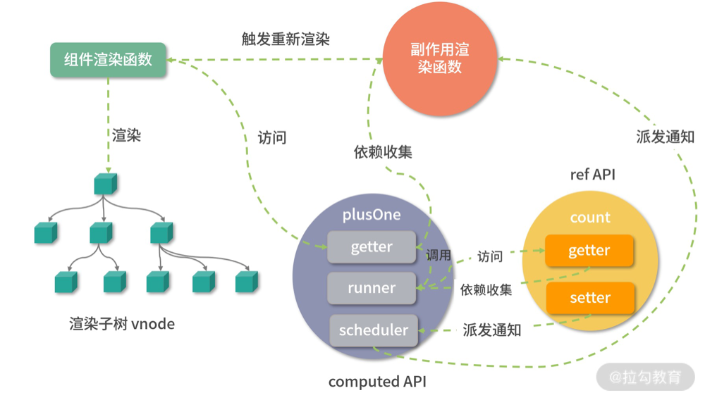

# 计算属性

前面说了响应式的基本实现原理, 接下来将梳理一个非常常用的响应式API ———— 计算属性

计算属性是Vue中一个非常常用的API, 它允许用户定义一个计算方法, 然后根据一些依赖的响应式数据计算出新值并返回, 当依赖发生变化时, 计算属性可以自动计算并重新获取新值, 所以使用起来非常方便。

在Vue2中, 老练的开发对计算属性的应用肯定已经非常清楚了, 我们可以在对象中定义 computed属性。

而到了Vue3, 虽然也可以使用optionsAPI， 沿用Vue2的方式, 但是更推荐单独使用 computed API直接定义计算属性。

毕竟计算属性本质上来说还是对依赖的计算, 那么为什么不直接使用函数呢？以下就是在Vue3中计算属性API的实现

## 计算属性API: computed

Vue3提供了一个 computed函数作为计算属性API, 可以看看他们是如何使用的

举个例子:

```ts
const count = ref(1);
const plusOne = computed(() => count.value + 1);
console.info(plusOne.value); // 2
plusOne.value++; // 报错
count.value++;
console.info(plusOne.value);// 3
```

从代码中可以看到, 我们先使用 ref API创建了一个响应式对象count, 然后使用 computed API创建了另一个响应式对象 plusOne, 它的值是 count.value + 1, 当修改count.value的时候, plusOne.value会自动增加

注意，这里我们直接修改 plusOne.value 会报一个错误，这是因为如果我们传递给 computed 的是一个函数，那么这就是一个 getter 函数，我们只能获取它的值，而不能直接修改它。

在 getter 函数中，我们会根据响应式对象重新计算出新的值，这也就是它被叫做计算属性的原因，而这个响应式对象，就是计算属性的依赖。

当然, 有时候我们也希望能够直接修改 computed的返回值, 那么可以给 computed传入一个对象

```ts
const count = ref(1) 
const plusOne = computed({ 
  get: () => count.value + 1, 
  set: val => { 
    count.value = val - 1 
  } 
}) 
plusOne.value = 1 
console.log(count.value) // 0
```
在这个例子中，结合上述代码可以看到，当开发人员给computed 函数传入了一个拥有 getter 函数和 setter 函数的对象，getter 函数和之前一样，还是返回 count.value + 1；而 setter 函数，请注意，这里修改 plusOne.value 的值就会触发 setter 函数，其实 setter 内部实际上会根据传入的参数修改计算属性的依赖值 count.value，因为一旦依赖的值被修改了，再去获取计算属性就会重新执行一遍 getter，所以这样获取的值也就发生了变化。

## 实现

computed实现如下

```ts
class ComputedRefImpl<T> {
  // 指向值
  private _value!: T
  // 是否为脏数据
  private _dirty = true

  public readonly effect: ReactiveEffect<T>

  // ref响应式标识
  public readonly __v_isRef = true;
  // readonly标识
  public readonly [ReactiveFlags.IS_READONLY]: boolean

  constructor(
    getter: ComputedGetter<T>,
    // ? private关键字会直接将 _setter绑定到实例上
    private readonly _setter: ComputedSetter<T>,
    isReadonly: boolean
  ) {
    // 创建副作用函数
    this.effect = effect(getter, {
      // 默认延迟执行
      lazy: true,
      // 调度执行的实现
      scheduler: () => {
        if (!this._dirty) {
          this._dirty = true
          // 派发通知, 通知运行访问该计算属性的 activeEffect
          trigger(toRaw(this), TriggerOpTypes.SET, 'value')
        }
      }
    })
    // 标识为只读属性, 只要不存在set就是只读属性
    this[ReactiveFlags.IS_READONLY] = isReadonly
  }

  get value() {
    // 计算属性的getter
    if (this._dirty) {
      // 只有数据为脏数据时才会重新计算
      this._value = this.effect()
      this._dirty = false
    }
    // 依赖收集, 收集运行访问该计算属性的activeEffect
    track(toRaw(this), TrackOpTypes.GET, 'value')
    // 返回value
    return this._value
  }

  set value(newValue: T) {
    this._setter(newValue)
  }
}
// 重载以适配不同参数类型的compouted
export function computed<T>(getter: ComputedGetter<T>): ComputedRef<T>
export function computed<T>(
  options: WritableComputedOptions<T>
): WritableComputedRef<T>
export function computed<T>(
  getterOrOptions: ComputedGetter<T> | WritableComputedOptions<T>
) {
  // getter
  let getter: ComputedGetter<T>
  // setter
  let setter: ComputedSetter<T>

  if (isFunction(getterOrOptions)) {
    getter = getterOrOptions
    setter = __DEV__
      ? () => {
        // 开发环境抛错
          console.warn('Write operation failed: computed value is readonly')
        }
        // 空函数
      : NOOP
  } else {
    getter = getterOrOptions.get
    setter = getterOrOptions.set
  }

  return new ComputedRefImpl(
    getter,
    setter,
    isFunction(getterOrOptions) || !getterOrOptions.set
  ) as any
}
```

从上面的代码可以看出, computed属性主要做三件事情:

1. 标准化computed参数, 前置处理setter和getter
2. 实例化ComputedRefImpl, 创建effect副作用函数
3. 实例化实例化ComputedRefImpl, 返回computed对象

### 标准化computed参数

computed函数通过重载来接收不同参数类型, 让ts能够识别

主要接收的参数有两种, 一种是只有getter函数, 另一种是包含getter和setter的一个options

通过判断参数是否是一个函数, 来初始化函数内部定义的getter和setter函数

```ts
if (isFunction(getterOrOptions)) {
  // 没有setter传入
  getter = getterOrOptions
  setter = __DEV__
    ? () => {
      // 开发环境抛错
        console.warn('Write operation failed: computed value is readonly')
      }
      // 空函数
    : NOOP
} else {
  // 外部有setter传入
  getter = getterOrOptions.get
  setter = getterOrOptions.set
}
```

### 实例化ComputedRefImpl, 创建effect副作用函数

在执行 new ComputedRefImpl的过程中, 主要就是创建一个effect函数, 并挂在到实例上, 同时为实例对象初始化一个setter

```ts
// 创建副作用函数
    this.effect = effect(getter, {
      // 默认延迟执行
      lazy: true,
      // 调度执行的实现
      scheduler: () => {
        if (!this._dirty) {
          this._dirty = true
          // 派发通知, 通知运行访问该计算属性的 activeEffect
          trigger(toRaw(this), TriggerOpTypes.SET, 'value')
        }
      }
    })
    // 标识为只读属性, 只要不存在set就是只读属性
    this[ReactiveFlags.IS_READONLY] = isReadonly
```

副作用函数effect, 通过Vue3的effect创建, 它是对getter函数做的一层封装, 另外这里要注意第二个参数, 也就是effect函数的配置对象。

其中lazy为true, 表示effect函数返回的effect副作用函数并不会立即执行;

scheduler 表示它调度运行的方式, 稍后继续

### 实例化ComputedRefImpl并返回computed对象

这个computed对象中也包含了getter和setter函数, 同时确定这个是否是一个只读的computed

当computed属性被访问的时候会触发getter, 然后执行如下操作:


1. 首先判断当前computed是否为dirty, 如果是, 则执行`effect`副作用函数赋值, 同时将 dirty设置为false
2. 如果不是则直接进入下一步, 也就是调用track收集运行访问该计算属性的activeEffect
3. 最后返回该属性

```ts
get value() {
  // 计算属性的getter
  if (this._dirty) {
    // 只有数据为脏数据时才会重新计算
    this._value = this.effect()
    this._dirty = false
  }
  // 依赖收集, 收集运行访问该计算属性的activeEffect
  track(toRaw(this), TrackOpTypes.GET, 'value')
  // 返回value
  return this._value
}
```

setter的逻辑很简单, 就是执行用户初始化computed属性时传入的setter, 如果没有传入则执行上面设置的默认setter, 也就是一个空函数, 或者在开发环境抛警告的函数

## 计算属性的运行机制

computed函数的逻辑会有一点绕, 可以结合下面的例子, 通过断点的方式来理解整个计算属性的运行机制。

在其内部有两种重要的变量:

1. dirty表示一个计算属性的值是否是"脏的", 用来判断需不需要重新计算
2. value标识计算属性计算后的结果

例子如下:

```vue
<template> 
  <div> 
    {{ plusOne }} 
  </div> 
  <button @click="plus">plus</button> 
</template> 
<script> 
  import { ref, computed } from 'vue' 
  export default { 
    setup() { 
      const count = ref(0) 
      const plusOne = computed(() => { 
        return count.value + 1 
      }) 

      function plus() { 
        count.value++ 
      } 
      return { 
        plusOne, 
        plus 
      } 
    } 
  } 
</script>
```

可以看到在这个例子中, 利用 computedAPI 创建了计算属性对象 plusOne, 传入的是一个 getter函数, 为了和后面计算属性对象的getter函数区分, 我们把它称作 computed getter。

同时, 在模板中引用了plusOne变量和plus函数

组件渲染阶段会访问plusOne, 也就触发了 plusOne对象的getter函数:

```ts
get value() {
  // 计算属性的getter
  if (this._dirty) {
    // 只有数据为脏数据时才会重新计算
    this._value = this.effect()
    this._dirty = false
  }
  // 依赖收集, 收集运行访问该计算属性的activeEffect
  track(toRaw(this), TrackOpTypes.GET, 'value')
  // 返回value
  return this._value
}
```
由于dirty默认是true(创建实例的时候默认为true), 此时会执行effect函数, 并进一步执行 computed getter
也就是 count.value + 1
因为访问了 count的值, 并且由于count也是一个响应式对象, 所以就会触发 count对象的依赖收集过程

由于是在 effect 执行的时候访问count, 所以这个时候 activeEffect 是 effect 函数, effect函数执行完毕, 会把dirty设置为false, 并进一步执行track函数(computed对象, 'get', 'value')进行依赖收集, 这个时候 effect 已经执行完了, 所以 activeEffect组件副作用渲染函数

这里要特别注意这是两个依赖收集的过程:

1. 对于plusOne来说, 它收集的依赖是组件副作用渲染函数
2. 对于count来说, 它收集的依赖是 plusOne 内部的 effect 函数

当点击按钮的时候, 它会执行plus函数, 函数内部通过 count.value++修改count的值, 并派发通知。注意: 这里不是直接调用 effect 函数, 而是将effect 做为参数去执行 scheduler 函数

这里可以在看一下 trigger函数内部对于 effect 函数的执行方式: tap

```ts
const run = (effect: ReactiveEffect) => {
  // 调度运行
  if (effect.options.scheduler) {
    effect.options.scheduler(effect)
  } else {
    // 直接运行
    effect()
  }
}
// 遍历effects执行
  effects.forEach(run)
```

在 computed API 内部创建副作用函数时, 已经配置了 scheduler函数:

```ts
scheduler: () => {
  if (!this._dirty) {
    this._dirty = true
    // 派发通知, 通知运行访问该计算属性的 activeEffect
    trigger(toRaw(this), TriggerOpTypes.SET, 'value')
  }
}
```

它并没有对计算属性求值, 仅仅是把dirty设置为true, 在执行 trigger(computed对象, 'set', 'value') 去通知执行 plusOne 依赖的组件渲染副作用函数, 触发组件的重新渲染

在组件重新渲染的时候, 会再次访问plusOne, 我们发现这个时候dirty为true, 然后会再次执行 computed getter, 此时才会执行 count.value + 1求新值。

这里虽然组件没有直接访问 count, 但是当修改 count的值的时候, 组件依然会重新渲染的原因。

这个过程和Vue2.6也是一致的, 只不过在Vue2.6中, 是computed属性依赖的响应式变量收集的computedWatcher, 但是在computedWatcher更新过程中, 执行 computedWatcher.update时, 将 dirty设置为true, 方便下一次收集, 最终会通过flushSchedulerQueue执行调度, 最终触发 renderWatcher, 在renderWatcher的执行过程中, 去触发computed的getter获取最新值和执行下一个tick的依赖收集。

整个过程可以用下面这张图来表示:



通过以上分析, 可以看出computed属性有两个特点:

1. 延迟计算: 只有访问计算属性时, 才会真正运行computed getter 函数计算
2. 缓存: 内部会缓存上一次计算的结果value, 只有dirty为true时才会重新计算。如果访问计算属性的dirty为false, 那么直接返回这个value

所以说和普通函数相比, 计算属性的优势是: 只要依赖不变化, 就可以使用换粗的value而不用每次在渲染组件的时候都执行函数去计算

这其实是典型的空间换时间的优化思想

## 嵌套计算属性

计算属性也支持嵌套, 这里可以针对上述的例子做个修改, 即不在渲染函数中访问plusOne, 而在另一个计算属性中访问:

```ts
const count = ref(0) 
const plusOne = computed(() => { 
  return count.value + 1 
}) 
const plusTwo = computed(() => { 
  return plusOne.value + 1 
}) 
console.log(plusTwo.value)
```

从代码中可以看到, 当访问plusTwo的时候, 过程和前面差不多, 同样也是两个依赖收集的过程。对于plusOne来说, 它收集的依赖是plusTwo内部的effect函数;对于 count 来说, 它收集的一来是 plusOne内部的effect函数

接着当我们修改 count 的值, 他会先派发通知, 运行 plusOne内部的scheduler函数, 把plusOne内部的dirty改为true, 然后执行 trigger函数再次派发通知, 接着运行 plusTwo 内部的 scheduler 函数, 把plusTwo内部的 dirty 设置为 true

当我们再次访问 plusTwo 的值时, 发现 dirty 为 true, 就会执行 plusTwo 的 computed getter函数去执行 plusOne.value + 1, 进而执行 plusOne的getter函数也就是 count.value + 1 + 1, 得到最终值为2

得益于 computed这种巧妙的设计, 无论嵌套多少层计算属性, 都可以正常的工作

## 计算属性的执行顺序

在Vue3.2之前, 会对computed单独处理, 在创建计算属性副作用函数的时候会配置 computed 为true, 标识这是一个 computed effect, 用于在 trigger阶段的优先级排序。

但是在Vue3.2以后, 这个标记就没有了, 都按顺序进入 effects 中。


## 总结

到此为止, 计算属性的学习就结束了, 这里主要是要理解计算属性的工作机制, 能够明白计算属性嵌套场景代码的执行顺序, 知道计算属性的两个特点 ———— 延迟计算和缓存, 能够合理使用computed属性

题目: computed函数返回的对象实际上劫持的是value属性的getter和setter, 但是为什么我们在组件的模板中访问一个计算属性变量, 不用手动在后面加.value呢?

主要原因在于:

1. setup照方法执行结果的在保存为 computed instance的setupState之前, 进行了一层代理包装, 该代理的操作函数 shallowUnwrapHandlers中的get方法中会对ref类型对象进行拆包
2. 在component options 中配置，这种方式的computed使用了Object.defineProperty代理到component instance 的 ctx 上，其中get方法返回的是 computed 对象的value值。
