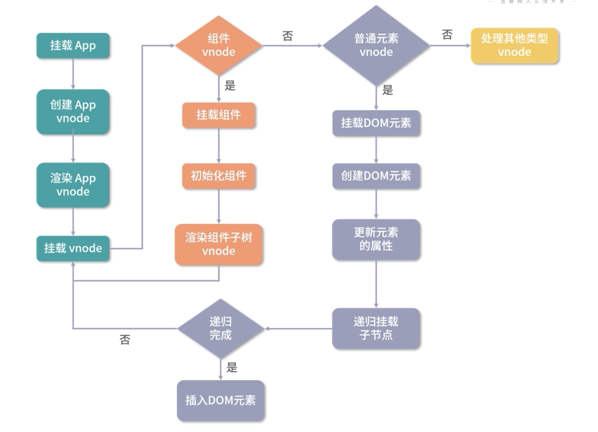

# 核心渲染流程: 创建vnode和渲染vnode

vnode本质上是用来描述DOM的JavaScript对象, 他在Vue中可以描述不同类型的节点

比如普通元素节点、组件节点等

## 普通元素节点

举个例子, 比如在HTML中, 使用button元素来写一个按钮

```html
<button class="btn" style="width: 100px; height: 50px;">click me</button>
```

用vnode时这样表示`<button>`标签的

```ts
const vnode = {
  type: 'button',
  props: {
    class: 'btn',
    style: {
      width: '100px',
      height: '50px'
    }
  },
  children: 'click me'
}
```
用vnode来表示button标签, 其实就是在vnode对象中添加相关的属性

其中type表示dom的标签名, props属性表示DOM的一些附加信息, 比如class, style等， children表示dom的子节点, 也是一个vnode数组, 只不过可以用字符串表示文本内容

## 组件节点等

其实vnode除了可以像上面一样描述一个真实dom节点以外, 同样也可以用于描述一个组件

比如在模板中引入一个 `<custom-component msg="test"></custom-component>`组件

同样可以用vnode描述这个组件:

```ts
const CustomComponent = {
  // 组件定义
}

const vnode = {
  type: CustomComponent,
  props: {
    msg: 'test'
  }
}
```

先定义一个 CustomComponent 组件对象, 然后在vnode中添加相关属性

> 组件vnode, 是对抽象事物的描述
> 
> 因为我们并不会在页面上真正渲染一个 custom-component 标签
> 
> 而是渲染组件内部定义的html标签

## 其他vnode

除了上述两种vnode类型之外, 还有:

+ 纯文本vnode
+ 注释vnode

## patch flag

另外, Vue3内部还针对vnode tag做了更详尽的分类, 包括` Suspense(处理多层异步组件)`, `Teleport(将组件内容渲染到to属性对应的位置)`等

且把 vnode 的类型信息做了编码(其实就是前面说过的patch flag)，以便在后面的 patch 阶段，可以根据不同的类型执行相应的处理逻辑

```ts
const shapeFlag = isString(type)
  ? 1 /* ELEMENT */
  : isSuspense(type)
    ? 128 /* SUSPENSE */
    : isTeleport(type)
      ? 64 /* TELEPORT */
      : isObject(type)
        ? 4 /* STATEFUL_COMPONENT */
        : isFunction(type)
          ? 2 /* FUNCTIONAL_COMPONENT */
          : 0
```

## vnode优势

> 为什么一定要设计vnode这样的数据结构呢?

从以下两个点进行说明:
+ 抽象
  - 引入vnode, 可以把渲染过程抽象化, 从而使得组件的抽象能力也得到提升
+ 跨平台
  - 因为patch vnode 的过程不同平台可以有自己的实现
  - 基于vnode再做服务端渲染、weex平台、小程序平台的渲染会变得容易很多

<style type="text/css" rel="stylesheet">
.good-words {
  font-size: 30px;
  font-weight: 900;
}
</style>
<p class="good-word">特别注意: 使用vnode并不意味着不用操作DOM了</p>

很多人会误以为vnode的性能一定比手动操作原生DOM好, 这个其实是不一定的

+ 首先这种基于vnode实现的MVVM框架, 在每次render to vnode 的过程中渲染组件会有一定的javascript耗时, 特别是大组件
  - 比如一个 1000 * 10 的 Table 组件
  - render to vnode 的过程会遍历 1000 * 10 次去创建内部 cell vnode
  - 整个耗时就会变得比较长，加上 patch vnode 的过程也会有一定的耗时
+ 当我们去更新组件的时候，用户会感觉到明显的卡顿
  - 虽然 diff 算法在减少 DOM 操作方面足够优秀，但最终还是免不了操作 DOM，所以说性能并不是 vnode 的优势

## Vue3创建vnode

Vue3内部是通过 createVNode函数创建的根组件的vnode, 位置就在[mount方法中](/blogs/vue3-resource/core/2.html#原始mount方法)

```ts
const vnode = createVNode(rootComponent, rootProps)
```

[createVNode](/blogs/vue3-resource/core/3.html#createvnode大致实现)大致实现见此处

他做的事情其实很简单

1. 首先是对props进行标准化处理
2. 对vnode类型信息进行编码(patch flag)
3. 创建vnode对象
4. 标准化子节点children

接下来就是[渲染vnode的过程](/blogs/vue3-resource/core/3.html#vue3渲染vnode)

## createVNode大致实现

他做的事情其实很简单

1. 首先是对props进行标准化处理
2. 对vnode类型信息进行编码(patch flag)
3. 创建vnode对象
4. 标准化子节点children


```ts
export const createVNode = (__DEV__
  ? createVNodeWithArgsTransform
  : _createVNode) as typeof _createVNode

function _createVNode(
  type: VNodeTypes | ClassComponent | typeof NULL_DYNAMIC_COMPONENT,
  props: (Data & VNodeProps) | null = null,
  children: unknown = null,
  patchFlag: number = 0,
  dynamicProps: string[] | null = null,
  isBlockNode = false
): VNode {
  ...
  // class & style normalization.
  // 处理props相关逻辑, 标准化class和style
  if (props) {
    // for reactive or proxy objects, we need to clone it to enable mutation.
    if (isProxy(props) || InternalObjectKey in props) {
      props = extend({}, props)
    }
    let { class: klass, style } = props
    if (klass && !isString(klass)) {
      props.class = normalizeClass(klass)
    }
    if (isObject(style)) {
      // reactive state objects need to be cloned since they are likely to be
      // mutated
      if (isProxy(style) && !isArray(style)) {
        style = extend({}, style)
      }
      props.style = normalizeStyle(style)
    }
  }

  // encode the vnode type information into a bitmap
  // 对vnode信息进行编码
  const shapeFlag = isString(type)
    ? ShapeFlags.ELEMENT
    : __FEATURE_SUSPENSE__ && isSuspense(type)
      ? ShapeFlags.SUSPENSE
      : isTeleport(type)
        ? ShapeFlags.TELEPORT
        : isObject(type)
          ? ShapeFlags.STATEFUL_COMPONENT
          : isFunction(type)
            ? ShapeFlags.FUNCTIONAL_COMPONENT
            : 0
  ...

  const vnode: VNode = {
    __v_isVNode: true,
    [ReactiveFlags.SKIP]: true,
    type,
    props,
    key: props && normalizeKey(props),
    ref: props && normalizeRef(props),
    scopeId: currentScopeId,
    slotScopeIds: null,
    children: null,
    component: null,
    suspense: null,
    ssContent: null,
    ssFallback: null,
    dirs: null,
    transition: null,
    el: null,
    anchor: null,
    target: null,
    targetAnchor: null,
    staticCount: 0,
    shapeFlag,
    patchFlag,
    dynamicProps,
    dynamicChildren: null,
    appContext: null
  }

  // validate key
  if (__DEV__ && vnode.key !== vnode.key) {
    warn(`VNode created with invalid key (NaN). VNode type:`, vnode.type)
  }

  normalizeChildren(vnode, children)

  // normalize suspense children
  if (__FEATURE_SUSPENSE__ && shapeFlag & ShapeFlags.SUSPENSE) {
    const { content, fallback } = normalizeSuspenseChildren(vnode)
    vnode.ssContent = content
    vnode.ssFallback = fallback
  }

  if (
    shouldTrack > 0 &&
    // avoid a block node from tracking itself
    !isBlockNode &&
    // has current parent block
    currentBlock &&
    // presence of a patch flag indicates this node needs patching on updates.
    // component nodes also should always be patched, because even if the
    // component doesn't need to update, it needs to persist the instance on to
    // the next vnode so that it can be properly unmounted later.
    (patchFlag > 0 || shapeFlag & ShapeFlags.COMPONENT) &&
    // the EVENTS flag is only for hydration and if it is the only flag, the
    // vnode should not be considered dynamic due to handler caching.
    patchFlag !== PatchFlags.HYDRATE_EVENTS
  ) {
    currentBlock.push(vnode)
  }

  return vnode
}
```

## Vue3渲染vnode

回顾app.mount函数的实现, 内部通过render函数去渲染创建好的vnode

这个渲染函数render(就在baseCreateRenderer中, 也就是createRenderer的执行结果)的实现也很简单

1. 判断vnode是否存在, 如果不存在, 则根据是否存在缓存(也就是组件是否创建过)来决定是否执行销毁组件逻辑
2. 如果存在vnode, 则调用[patch]()执行创建或更新组件逻辑
3. 缓存vnode节点, 表示已经渲染

```ts
render(vnode, rootContainer, isSVG)

const render: RootRenderFunction = (vnode, container, isSVG) => {
  // 如果vnode为空, 则执行销毁组件逻辑
  if (vnode == null) {
    if (container._vnode) {
      // 销毁组件
      unmount(container._vnode, null, null, true)
    }
  } else {
    // 调用patch执行创建或者更新组件逻辑
    patch(container._vnode || null, vnode, container, null, null, null, isSVG)
  }
  flushPostFlushCbs()
  // 缓存vnode节点, 表示已经渲染
  container._vnode = vnode
}
```

## patch

上面渲染vnode代码中涉及到的patch函数核心逻辑

patch本意是打补丁的意思, 这个函数有两个功能:

+ 根据vnode挂载dom
+ 根据新旧vnode更新dom

主要流程如下(由于是初次渲染, 所以这里只看创建过程即可, 具体的更新过程后面再看):

1. 在创建过程中, patch函数接收多个参数, 这里主要关注前三个参数
  + n1: 表示旧的vnode, 当n1为null的时候, 表示是一次挂载的过程
  + n2: 新的vnode节点, 后续会根据这个vnode类型执行不同的处理逻辑
  + container: 表示DOM容器, 在vnode渲染生成DOM后, 会挂载到container下面
2. 对于渲染vnode, 这里重点关注两种类型节点的渲染逻辑
  + 对组件处理使用[processComponent](/blogs/vue3-resource/core/3.html#processcomponent)
  + 对普通DOM处理使用[processElement](/blogs/vue3-resource/core/3.html#processelement)

主要代码如下:

```ts
const patch: PatchFn = (
  n1,
  n2,
  container,
  anchor = null,
  parentComponent = null,
  parentSuspense = null,
  isSVG = false,
  slotScopeIds = null,
  optimized = false
) => {
  // patching & not same type, unmount old tree
  // 如果存在新旧节点, 且新旧节点类型不同, 则销毁旧节点
  if (n1 && !isSameVNodeType(n1, n2)) {
    anchor = getNextHostNode(n1)
    unmount(n1, parentComponent, parentSuspense, true)
    n1 = null
  }
  if (n2.patchFlag === PatchFlags.BAIL) {
    optimized = false
    n2.dynamicChildren = null
  }
  const { type, ref, shapeFlag } = n2
  switch (type) {
    // 处理文本节点
    case Text:
      processText(n1, n2, container, anchor)
      break
    // 处理注释节点
    case Comment:
      processCommentNode(n1, n2, container, anchor)
      break
    // 处理静态节点
    case Static:
      if (n1 == null) {
        mountStaticNode(n2, container, anchor, isSVG)
      } else if (__DEV__) {
        patchStaticNode(n1, n2, container, isSVG)
      }
      break
    // 处理 Fragment 元素
    case Fragment:
      processFragment(
        n1,
        n2,
        container,
        anchor,
        parentComponent,
        parentSuspense,
        isSVG,
        slotScopeIds,
        optimized
      )
      break
    default:
      if (shapeFlag & ShapeFlags.ELEMENT) {
        // 处理普通 DOM 元素
        processElement(
          n1,
          n2,
          container,
          anchor,
          parentComponent,
          parentSuspense,
          isSVG,
          slotScopeIds,
          optimized
        )
      } else if (shapeFlag & ShapeFlags.COMPONENT) {
        // 处理组件
        processComponent(
          n1,
          n2,
          container,
          anchor,
          parentComponent,
          parentSuspense,
          isSVG,
          slotScopeIds,
          optimized
        )
      } else if (shapeFlag & ShapeFlags.TELEPORT) {
        // 处理 TELEPORT
        ;(type as typeof TeleportImpl).process(
          n1 as TeleportVNode,
          n2 as TeleportVNode,
          container,
          anchor,
          parentComponent,
          parentSuspense,
          isSVG,
          slotScopeIds,
          optimized,
          internals
        )
      } else if (__FEATURE_SUSPENSE__ && shapeFlag & ShapeFlags.SUSPENSE) {
        // 处理 SUSPENSE
        ;(type as typeof SuspenseImpl).process(
          n1,
          n2,
          container,
          anchor,
          parentComponent,
          parentSuspense,
          isSVG,
          slotScopeIds,
          optimized,
          internals
        )
      } else if (__DEV__) {
        warn('Invalid VNode type:', type, `(${typeof type})`)
      }
  }
  // set ref
  if (ref != null && parentComponent) {
    setRef(ref, n1 && n1.ref, parentSuspense, n2)
  }
}
```

## processComponent

1. 如果n1(旧的vnode)不存在, 则执行挂载逻辑
  + 挂载分两种
  + 一个是keep-alive缓存组件直接激活
  + 另一个是新组建直接挂载([mountComponent](/blogs/vue3-resource/core/3.html#mountcomponent))
2. 旧的vnode存在, 执行更新逻辑 

```ts
const processComponent = (
  n1: VNode | null,
  n2: VNode,
  container: RendererElement,
  anchor: RendererNode | null,
  parentComponent: ComponentInternalInstance | null,
  parentSuspense: SuspenseBoundary | null,
  isSVG: boolean,
  slotScopeIds: string[] | null,
  optimized: boolean
) => {
  n2.slotScopeIds = slotScopeIds
  // 如果n1(旧的vnode)不存在, 则执行挂载逻辑(挂载分为缓存组件直接激活和新组件挂载)
  if (n1 == null) {
    if (n2.shapeFlag & ShapeFlags.COMPONENT_KEPT_ALIVE) {
      // keep-alive缓存组件, 直接激活即可
      ;(parentComponent!.ctx as KeepAliveContext).activate(
        n2,
        container,
        anchor,
        isSVG,
        optimized
      )
    } else {
      // 执行挂载组件逻辑
      mountComponent(
        n2,
        container,
        anchor,
        parentComponent,
        parentSuspense,
        isSVG,
        optimized
      )
    }
  } else {
    // 旧的vnode存在, 则执行更新逻辑
    updateComponent(n1, n2, optimized)
  }
}
```

## processElement

对于普通dom元素, 如果旧节点不存在, 则走挂载元素节点逻辑([mountElement](//blogs/vue3-resource/core/3.html#mountelement)), 否则走更新元素节点逻辑

```ts
const processElement = (
  n1: VNode | null,
  n2: VNode,
  container: RendererElement,
  anchor: RendererNode | null,
  parentComponent: ComponentInternalInstance | null,
  parentSuspense: SuspenseBoundary | null,
  isSVG: boolean,
  slotScopeIds: string[] | null,
  optimized: boolean
) => {
  isSVG = isSVG || (n2.type as string) === 'svg'
  if (n1 == null) {
    // 挂载元素
    mountElement(
      n2,
      container,
      anchor,
      parentComponent,
      parentSuspense,
      isSVG,
      slotScopeIds,
      optimized
    )
  } else {
    // 更新元素
    patchElement(
      n1,
      n2,
      parentComponent,
      parentSuspense,
      isSVG,
      slotScopeIds,
      optimized
    )
  }
}
```

## mountComponent

分三步:

1. 创建组件实例
  + 内部也通过对象的方式去创建了当前渲染的组件实例 
2. 设置组件实例
  + instance保留了很多组件相关的数据, 维护了组件的上下文
  + 包括对props, 插槽以及其他实例的属性的初始化处理 
3. 设置并运行带副作用的渲染函数([setupRenderEffect](/blogs/vue3-resource/core/3.html#setuprenderrffect))

```ts
const mountComponent: MountComponentFn = (
    initialVNode,
    container,
    anchor,
    parentComponent,
    parentSuspense,
    isSVG,
    optimized
  ) => {
    // 创建组件实例
    const instance: ComponentInternalInstance = (initialVNode.component = createComponentInstance(
      initialVNode,
      parentComponent,
      parentSuspense
    ))
    ...
    // 设置组件实例
    setupComponent(instance)
    ...
    // 设置并运行带副作用的渲染函数
    setupRenderEffect(
      instance,
      initialVNode,
      container,
      anchor,
      parentSuspense,
      isSVG,
      optimized
    )
  }
```

## setupRenderEffect

该函数利用响应式库的effect函数创建了一个副作用渲染函数 componentEffect(effect的实现后面来看)。

> 副作用: 可以简单理解为当组件数据发生变化时, effect函数包裹的内部渲染函数 componentEffect 会重新执行一遍, 从而达到重新渲染组件的目的

在 componentEffect渲染函数内部也会判断这是一次初始渲染还是更新, 这里主要看初始渲染

初始渲染时, 主要做两件事情:

1. 渲染组件生成subTree
  + 他也是一个vnode对象, 但是subTree(组件内部真实dom节点对应的vnode对象, 子树vnode)并不是initialVNode(组件占位vnode, 组件标签直接渲染出来用于占位)弄混了
  + 其实在Vue3中, 根据命名我们已经能很好的区分他们了
  + 而在vue2中, 他们分别命名为了_vnode(组件vnode)和$vnode(占位vnode)
  + 每个组件都会有对应的render函数, 哪怕是template也会编译为render函数
  + 而renderComponentRoot函数就是去执行render函数, 创建整个组件内部真实dom对应的vnode
  + 把这个vnode在经过一层标准化, 就得到了内部的返回结果, 也就是子树vnode
2. 调用patch方法把subTree挂载到container中(其实相当于是在递归了)
3. 再次进入patch, 会继续对子树vnode中的类型进行判断

```ts
const setupRenderEffect: SetupRenderEffectFn = (
  instance,
  initialVNode,
  container,
  anchor,
  parentSuspense,
  isSVG,
  optimized
) => {
  // 创建响应式的副作用渲染函数
  instance.update = effect(function componentEffect() {
    if (!instance.isMounted) {
      // 渲染生成子树vnode
      const subTree = (instance.subTree = renderComponentRoot(instance))

      // 把子树 vnode 挂载到 container 中
      patch(
        null,
        subTree,
        container,
        anchor,
        instance,
        parentSuspense,
        isSVG
      )
      // 保留生成的子树根DOM节点
      initialVNode.el = subTree.el
      // 标记挂载完成
      instance.isMounted = true
    } else {
      // 更新组件
    }
  }, __DEV__ ? createDevEffectOptions(instance) : prodEffectOptions)
}
```

## mountElement

优化: 如果节点是被标记为静态节点, 并且当前静态节点已提升, 那么直接复用, 跳过后续所有逻辑

挂载dom元素主要做4件事情：

1. 创建DOM元素节点, 通过hostCreateElement创建
  + 其实就是调用底层DOM API `document.createElement`去创建节点
  + 所以vue所说的不操作dom, 只是强调不让用户直接去触碰dom, 底层也没有什么特殊, 还是使用DOM API进行相关操作
  + 如果是其他平台, 比如weex, uniapp, hostCreateElement方法就不再是操作DOM, 而是平台相关的API了, 这些平台相关的方法是在创建渲染器阶段作为参数传入的
2. 处理children
  + 一个是处理纯文本子节点, 也就是执行`hostSetElementText`方法, 在web中, 是通过设置节点的textContent属性, 直接设置文本
  + 另一个是处理children数组子节点, 执行[mountChildren](/blogs/vue3-resource/core/3.html#mountchildren)
3. 处理props
  + 如果有props的话, 给这个DOM节点添加上相关的class, style, event等属性, 并做相关的处理
  + 这些逻辑都是在hostPatchProp函数内部做的 
4. 把创建的 DOM 元素节点挂载到 container 上
  + 在web环境的定义中, 就是根据是否存在锚点选择使用insertBefore方法还是直接使用appendChild方法, 完成节点的挂载

<style type="text/css" rel="stylesheet">
.good-words {
  font-size: 30px;
  font-weight: 900;
}
.good-words2 {
  font-size: 24px;
  font-weight: 900;
}
</style>
<p class="good-words">
  组件挂载的顺序对比Vue2没有变化, 因为insert的执行是在处理子节点后, 所以挂在的顺序是先子节点, 后父节点, 最终挂载到最外层的容器上
</p>

```ts
const mountElement = (
  vnode: VNode,
  container: RendererElement,
  anchor: RendererNode | null,
  parentComponent: ComponentInternalInstance | null,
  parentSuspense: SuspenseBoundary | null,
  isSVG: boolean,
  slotScopeIds: string[] | null,
  optimized: boolean
) => {
  let el
  const { type, props, shapeFlag } = vnode

  if (
    !__DEV__ &&
    vnode.el &&
    hostCloneNode !== undefined &&
    patchFlag === PatchFlags.HOISTED
  ) {
    // If a vnode has non-null el, it means it's being reused.
    // Only static vnodes can be reused, so its mounted DOM nodes should be
    // exactly the same, and we can simply do a clone here.
    // only do this in production since cloned trees cannot be HMR updated.
    // 静态节点直接复制
    el = vnode.el = hostCloneNode(vnode.el)
  } else {
    // 创建 DOM 元素节点
    el = vnode.el = hostCreateElement(vnode.type, isSVG, props && props.is)
    if (shapeFlag & ShapeFlags.TEXT_CHILDREN) {
      // 处理子节点是纯文本的情况
      hostSetElementText(el, vnode.children as string)
    } else if (shapeFlag & ShapeFlags.ARRAY_CHILDREN) {
      // 处理子节点是数组的情况
      mountChildren(
        vnode.children as VNodeArrayChildren,
        el,
        null,
        parentComponent,
        parentSuspense,
        isSVG && type !== 'foreignObject',
        slotScopeIds,
        optimized || !!vnode.dynamicChildren
      )
    }
    // props
    if (props) {
      // 处理props, 比如 class, style, event等属性
      for (const key in props) {
        if (!isReservedProp(key)) {
          hostPatchProp(
            el,
            key,
            null,
            props[key],
            isSVG,
            vnode.children as VNode[],
            parentComponent,
            parentSuspense,
            unmountChildren
          )
        }
      }
      if ((vnodeHook = props.onVnodeBeforeMount)) {
        invokeVNodeHook(vnodeHook, parentComponent, vnode)
      }
    }
    // scopeId
    setScopeId(el, vnode, vnode.scopeId, slotScopeIds, parentComponent)
    // 把创建的 DOM 元素节点挂载到 container 上
    hostInsert(el, container, anchor)
  }
}
```

## mountChildren

同样很简单, 就是递归遍历每一个child, 然后递归执行patch方法, 挂载每个child

> 注意: 这里有对child坐预处理的情况(后面说编译优化时会详细分析)

可以看到, mountChildren函数的第二个参数是container, 而调用 mountChildren 传入的第二个参数, 是在mountElement时创建的DOM节点

这就很好的建立了父子关系

另外通过递归patch的这种深度优先遍历树的方式, 就可以构造完整的sub子树(dom树), 完成组件的渲染

<p class="good-words2">
  在mountChildren时递归执行的是patch函数 而不是mountElement函数
</p>
<p class="good-words2">
  这是因为子节点可能有其他类型的vnode, 比如组件vnode
</p>

```ts
const mountChildren: MountChildrenFn = (
  children,
  container,
  anchor,
  parentComponent,
  parentSuspense,
  isSVG,
  optimized,
  slotScopeIds,
  start = 0
) => {
  for (let i = start; i < children.length; i++) {
    // 预处理child
    const child = (children[i] = optimized
      ? cloneIfMounted(children[i] as VNode)
      : normalizeVNode(children[i]))
    // 递归patch挂载child
    patch(
      null,
      child,
      container,
      anchor,
      parentComponent,
      parentSuspense,
      isSVG,
      optimized,
      slotScopeIds
    )
  }
}
```

## 嵌套组件

1. 组件挂载的顺序对比Vue2没有变化, 因为insert的执行是在处理子节点后, 所以挂在的顺序是先子节点, 后父节点, 最终挂载到最外层的容器上
2. 在mountChildren时递归执行的是patch函数 而不是mountElement函数, 这是因为子节点可能有其他类型的vnode, 比如组件vnode
3. 在真实开发场景中, 嵌套组件场景是在正常不过的了
  + 组件vnode主要维护者组件的定义对象, 组件上的各种props
  + 而组件本身是一个抽象节点, 它自身的渲染其实是通过执行组件定义的render函数渲染生成的子树vnode来完成, 然后再patch
  + 通过这种递归的方式, 无论组件的嵌套层级有多深, 都可以完成整个组件树的渲染


## 整个组件的渲染流程总结:




## 思考

组件的拆分粒度是越细越好吗?为什么?
