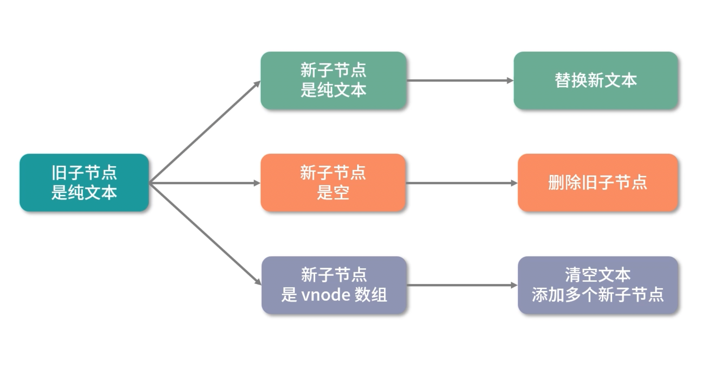
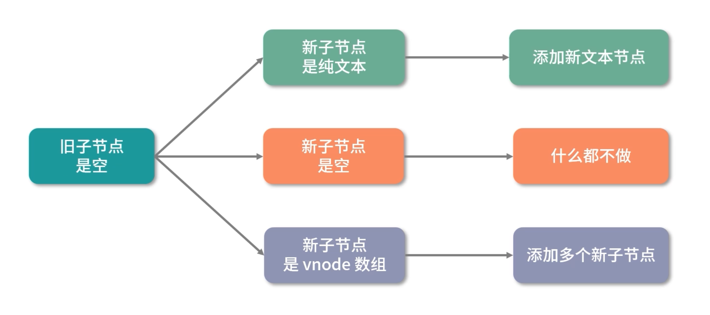
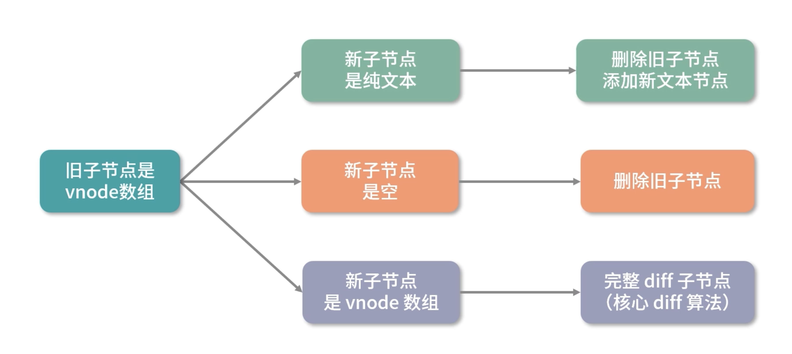

# Vue3组件渲染 - 完整的DOM Diff 流程(一)

+ Vue组件的渲染流程, 本质上就是把各种类型的vnode渲染为真实DOM
+ 组件是由模板、组件描述对象和数据构成的, 数据的变化会影响组件的变化
  - 组件的渲染过程中创建了一个带副作用的渲染函数
  - 当数据变化的时候就会执行这个渲染函数来触发组件更新


## 带副作用渲染函数更新组件的过程

以下是副作用渲染函数 setupRenderEffect 的实现

```ts
const setupRenderEffect: SetupRenderEffectFn = (
    instance,
    initialVNode,
    container,
    anchor,
    parentSuspense,
    isSVG,
    optimized
  ) => {
    // create reactive effect for rendering
    // 创建响应式的副作用渲染函数
    instance.update = effect(function componentEffect() {
      if (!instance.isMounted) {
        // 创建组件
      } else {
        // 更新组件
        // updateComponent
        // This is triggered by mutation of component's own state (next: null)
        // OR parent calling processComponent (next: VNode)
        let { next, bu, u, parent, vnode } = instance
        let originNext = next
        let vnodeHook: VNodeHook | null | undefined
        if (__DEV__) {
          pushWarningContext(next || instance.vnode)
        }

        // next表示新的组件VNode
        // 这里先判断新的组件实例中是否有新的组件VNode(这里设计一个组件更新的逻辑, 稍后会说, 这也是需要判断的原因)
        if (next) {
          // 有则更新组件VNode
          next.el = vnode.el
          updateComponentPreRender(instance, next, optimized)
        } else {
          // 没有则next指向之前的组件VNode
          next = vnode
        }

        // beforeUpdate hook
        if (bu) {
          invokeArrayFns(bu)
        }
        // onVnodeBeforeUpdate
        if ((vnodeHook = next.props && next.props.onVnodeBeforeUpdate)) {
          invokeVNodeHook(vnodeHook, parent, next, vnode)
        }

        // render
        if (__DEV__) {
          startMeasure(instance, `render`)
        }
        // 渲染新的子树vnode
        const nextTree = renderComponentRoot(instance)
        if (__DEV__) {
          endMeasure(instance, `render`)
        }
        // 缓存旧的子树vnode
        const prevTree = instance.subTree
        // 更新子树vnode
        instance.subTree = nextTree

        if (__DEV__) {
          startMeasure(instance, `patch`)
        }
        // 组件更新核心逻辑, 根据新旧子树vnode做patch
        patch(
          prevTree,
          nextTree,
          // parent may have changed if it's in a teleport
          // 如果在teleport组件中父节点可能已经改变, 所以容器直接找旧树DOM元素的父节点
          hostParentNode(prevTree.el!)!,
          // anchor may have changed if it's in a fragment
          // 参考节点(锚点)在fragment的情况可能改变, 所以直接找旧树DOM元素的下一个节点
          getNextHostNode(prevTree),
          instance,
          parentSuspense,
          isSVG
        )
        if (__DEV__) {
          endMeasure(instance, `patch`)
        }
        // 缓存更新后的DOM节点
        next.el = nextTree.el
        if (originNext === null) {
          // self-triggered update. In case of HOC, update parent component
          // vnode el. HOC is indicated by parent instance's subTree pointing
          // to child component's vnode
          updateHOCHostEl(instance, nextTree.el)
        }
        // updated hook
        if (u) {
          queuePostRenderEffect(u, parentSuspense)
        }
        // onVnodeUpdated
        if ((vnodeHook = next.props && next.props.onVnodeUpdated)) {
          queuePostRenderEffect(() => {
            invokeVNodeHook(vnodeHook!, parent, next!, vnode)
          }, parentSuspense)
        }

        if (__DEV__ || __FEATURE_PROD_DEVTOOLS__) {
          devtoolsComponentUpdated(instance)
        }

        if (__DEV__) {
          popWarningContext()
        }
      }
    }, __DEV__ ? createDevEffectOptions(instance) : prodEffectOptions)
  }
```

可以看到更新组件主要做三件事情:

1. 更新组件VNode节点
  + 这里会有一个条件判断, 判断新的组件实例中是否会有新的组件VNode, 用 next 表示
  + 有则更新组件VNode
  + 没有则next指向之前的组件VNode
  + 关于需要条件判断的原因, 这里涉及一个组件更新策略的逻辑, 后续细🔐 
2. 渲染新子树vnode(subTree)
  + 因为渲染发生了变化, 模板也和数据相关, 所以渲染生成的子树vnode也会发生相应的变化
  + 调用 renderComponentRoot 渲染新的子树vnode
  + 然后缓存旧的子树vndoe
  + 缓存完毕后, 将新的子树vnode指向 instance.subTree, 更新子树vnode
3. 根据新旧子树VNode执行[patch](/blogs/vue3-resource/core/4.html#patch更新逻辑)逻辑
  + 组件更新的核心逻辑
  + 用来找出子树vnode的不同, 并找出一种合适的方式更新dom 


## patch更新逻辑

根据patch的逻辑可以看到

1. 首先判断新旧节点是否存在且是否为相同的vnode类型
  + 如果不同, 则销毁旧节点。比如一个div更新成p, 最简单的操作就是删除div, 在挂载新的p节点
  + 如果是相同的vnode类型, 就需要走diff更新流程了
2. 他的更新流程已经是根据不同的vnode类型走不同的处理逻辑, 依然是主要看普通元素节点和组件的处理流程
  + 处理组件
    - 组件的更新最终还是要转换成内部真实DOM的更新, 而普通元素的处理流程才是真正做DOM更新
    - 组件更新依然调用[processComponent](/blogs/vue3-resource/core/4.html#processcomponent)
  + 处理普通元素节点
    - 通过调用 [processElement](/blogs/vue3-resource/core/4.html#processelement)

```ts
const patch: PatchFn = (
    n1,
    n2,
    container,
    anchor = null,
    parentComponent = null,
    parentSuspense = null,
    isSVG = false,
    slotScopeIds = null,
    optimized = false
  ) => {
    // patching & not same type, unmount old tree
    // 如果存在新旧节点, 且新旧节点类型不同，则销毁旧节点
    if (n1 && !isSameVNodeType(n1, n2)) {
      anchor = getNextHostNode(n1)
      unmount(n1, parentComponent, parentSuspense, true)
      n1 = null
    }

    if (n2.patchFlag === PatchFlags.BAIL) {
      optimized = false
      n2.dynamicChildren = null
    }

    const { type, ref, shapeFlag } = n2
    switch (type) {
      case Text:
        // 处理文本节点
        processText(n1, n2, container, anchor)
        break
      case Comment:
        // 处理注释节点
        processCommentNode(n1, n2, container, anchor)
        break
      case Static:
        // 处理静态节点
        if (n1 == null) {
          mountStaticNode(n2, container, anchor, isSVG)
        } else if (__DEV__) {
          patchStaticNode(n1, n2, container, isSVG)
        }
        break
      case Fragment:
        // 处理Fragment
        processFragment(
          n1,
          n2,
          container,
          anchor,
          parentComponent,
          parentSuspense,
          isSVG,
          slotScopeIds,
          optimized
        )
        break
      default:
        if (shapeFlag & ShapeFlags.ELEMENT) {
          // 处理普通DOM元素
          processElement(
            n1,
            n2,
            container,
            anchor,
            parentComponent,
            parentSuspense,
            isSVG,
            slotScopeIds,
            optimized
          )
        } else if (shapeFlag & ShapeFlags.COMPONENT) {
          // 处理组件
          processComponent(
            n1,
            n2,
            container,
            anchor,
            parentComponent,
            parentSuspense,
            isSVG,
            slotScopeIds,
            optimized
          )
        } else if (shapeFlag & ShapeFlags.TELEPORT) {
          // 处理TELEPORT
          ;(type as typeof TeleportImpl).process(
            n1 as TeleportVNode,
            n2 as TeleportVNode,
            container,
            anchor,
            parentComponent,
            parentSuspense,
            isSVG,
            slotScopeIds,
            optimized,
            internals
          )
        } else if (__FEATURE_SUSPENSE__ && shapeFlag & ShapeFlags.SUSPENSE) {
          // 处理SUSPENSE
          ;(type as typeof SuspenseImpl).process(
            n1,
            n2,
            container,
            anchor,
            parentComponent,
            parentSuspense,
            isSVG,
            slotScopeIds,
            optimized,
            internals
          )
        } else if (__DEV__) {
          warn('Invalid VNode type:', type, `(${typeof type})`)
        }
    }

    // set ref
    if (ref != null && parentComponent) {
      setRef(ref, n1 && n1.ref, parentSuspense, n2)
    }
  }
```

## processComponent

和渲染过程类似, 更新过程也是一个树的深度优先遍历过程

主要通过执行 [updateComponent](/blogs/vue3-resource/core/4.html#updatecomponent) 函数更新子组件

通过下面的分析我们可以知道, processComponent 处理组件 vnode，本质上就是去判断子组件是否需要更新

如果需要则递归执行子组件的副作用渲染函数来更新

否则仅仅更新一些 vnode 的属性，并让子组件实例保留对组件 vnode 的引用，用于子组件自身数据变化引起组件重新渲染的时候，在渲染函数内部可以拿到新的组件 vnode。


```ts
const processComponent = (
    n1: VNode | null,
    n2: VNode,
    container: RendererElement,
    anchor: RendererNode | null,
    parentComponent: ComponentInternalInstance | null,
    parentSuspense: SuspenseBoundary | null,
    isSVG: boolean,
    slotScopeIds: string[] | null,
    optimized: boolean
  ) => {
    n2.slotScopeIds = slotScopeIds
    // 如果n1(旧的vnode)不存在, 则执行挂载逻辑(挂载分为缓存组件直接激活和新组件挂载)
    if (n1 == null) {
      // 挂载组件
    } else {
      // 旧的vnode存在, 则执行更新逻辑
      updateComponent(n1, n2, optimized)
    }
  }
```

## updateComponent

updateComponent函数在更新子组件的时候会先执行 `shouldUpdateComponent` 函数, 根据新旧子组件vnode来判断是否需要更新子组件

在 shouldUpdateComponent 函数内部, 主要是通过检测和对比组件vnode中的props, children, dirs, transition等属性, 来决定子组件是否需要更新

因为一个组件的子组件是否需要更新, 主要依据子组件vnode是否存在一些会影响组件更新的属性变化进行判断, 如果存在就会更新子组件

> 虽然vue的更新粒度是组件级别的, 组件的数据变化只会影响当前组件的更新
> 
> 但是在组件更新的过程中, 也会对子组件做一定的检查, 判断子组件是否也需要更新, 并通过某种机制避免子组件重复更新
> 
> 在updateComponent函数中, 如果 `shouldUpdateComponent`函数执行返回true, 那么在它的最后, 先执行`invalidateJob(instance.update)`来避免子组件因自身数据变化导致的重复更新
> 
> 然后继续执行子组件的副作用渲染函数 `instance.update`来主动触发子组件的更新
> 
> 接着进入[instance.update](/blogs/vue3-resource/core/4.html#update)
> 
> 如果不需要更新, 则子组件实例保留对组件vnode的引用, 仅仅更新一些vnode的属性
> 
> 在子组件自身数据变化引起组件重新渲染的时候, 再渲染函数内部可以拿到新的组件vnode

```ts
const updateComponent = (n1: VNode, n2: VNode, optimized: boolean) => {
    const instance = (n2.component = n1.component)!
    // 根据新旧子组件vnode判断是否需要更新
    if (shouldUpdateComponent(n1, n2, optimized)) {
      if (
        __FEATURE_SUSPENSE__ &&
        instance.asyncDep &&
        !instance.asyncResolved
      ) {
        // 异步组件更新逻辑
        ...
        return
      } else {
        // 新的子组件vnode赋值给instance.next
        instance.next = n2
        // 子组件也可能因为数据变化被添加到更新队列里了, 移除他们防止对一个子组件重复更新
        invalidateJob(instance.update)
        // 执行子组件的副作用渲染函数
        instance.update()
      }
    } else {
      // 不需要更新则直接复制原组件即可
      n2.component = n1.component
      n2.el = n1.el
      instance.vnode = n2
    }
  }
```

## update 

update函数其实定义于setupRenderEffect(副作用渲染函数)中

其实组件更新的逻辑很好理解：

1. 在更新组件的DOM前, 需要先更新组件vnode节点信息, 包括更改组件实例的vnode指针, 更新props和更新插槽等一系列操作
2. 因为组件在稍后执行renderComponentRoot时会重新渲染新的子树vnode, 依赖了更新后的组件vnode中的props和slots等数据
3. 主要通过 updateComponentPreRender实现, 主要做了如下操作
  + 在 updateComponentPreRender 中
  + 首先将新组件vnode的component属性指向组件实例
  + 缓存旧组件vnode的props属性
  + 组件实例的vnode属性指向新的组件vnode
  + 清空next属性, 为下一次更新做准备
  + 更新props
  + 更新插槽
```ts
// updateComponentPreRender
const updateComponentPreRender = (
  instance: ComponentInternalInstance,
  nextVNode: VNode,
  optimized: boolean
) => {
  // 新组件vnode的component属性指向组件实例
  nextVNode.component = instance
  // 缓存旧组件vnode的props属性
  const prevProps = instance.vnode.props
  // 组件实例的vnode属性指向新的组件vnode
  instance.vnode = nextVNode
  // 清空next属性, 为了下一次更新准备
  instance.next = null
  // 更新props
  updateProps(instance, nextVNode.props, prevProps, optimized)
  // 更新插槽
  updateSlots(instance, nextVNode.children)
  ...
}
```

4. 所以一个组件重新渲染可能会有两种情况:
  + 一种是组件本身的数据变化, 这种情况下next是null
  + 另一种是父组件在更新的过程中, 遇到子组件节点, 先判断子组件是否需要更新
  + 如果需要则主动执行子组件的重新渲染方法, 这种情况下next就是新的子组件vnode
5. 这个地方可能还会存在一个疑问, 那就是这个子组件对应的新的组件vnode是什么时候创建的呢?
  + 答案很简单, 他是在父组件重新渲染的过程中, 通过renderComponentRoot渲染子树vnode的时候生成
  + 因为子树vnode是个树形结构, 通过遍历它的子节点就可以访问到其对应的组件vnode
```ts
instance.update = effect(function componentEffect() {
      if (!instance.isMounted) {
        // 初始渲染逻辑
      } else {
        // 更新组件
        // updateComponent
        // This is triggered by mutation of component's own state (next: null)
        // OR parent calling processComponent (next: VNode)
        let { next, bu, u, parent, vnode } = instance
        let originNext = next
        let vnodeHook: VNodeHook | null | undefined
        if (__DEV__) {
          pushWarningContext(next || instance.vnode)
        }

        // next表示新的组件VNode
        // 这里先判断新的组件实例中是否有新的组件VNode(这里设计一个组件更新的逻辑, 稍后会说, 这也是需要判断的原因)
        if (next) {
          // 有则更新组件VNode
          next.el = vnode.el
          // 更新组件vnode节点信息
          updateComponentPreRender(instance, next, optimized)
        } else {
          // 没有则next指向之前的组件VNode
          next = vnode
        }
        // 渲染新的子树vnode
        const nextTree = renderComponentRoot(instance)
        // 缓存旧的子树vnode
        const prevTree = instance.subTree
        // 更新子树vnode
        instance.subTree = nextTree
        // 组件更新核心逻辑, 根据新旧子树vnode做patch
        patch(
          prevTree,
          nextTree,
          // parent may have changed if it's in a teleport
          // 如果在teleport组件中父节点可能已经改变, 所以容器直接找旧树DOM元素的父节点
          hostParentNode(prevTree.el!)!,
          // anchor may have changed if it's in a fragment
          // 参考节点(锚点)在fragment的情况可能改变, 所以直接找旧树DOM元素的下一个节点
          getNextHostNode(prevTree),
          instance,
          parentSuspense,
          isSVG
        )
        // 缓存更新后的DOM节点
        next.el = nextTree.el
        if (originNext === null) {
          // self-triggered update. In case of HOC, update parent component
          // vnode el. HOC is indicated by parent instance's subTree pointing
          // to child component's vnode
          updateHOCHostEl(instance, nextTree.el)
        }
      }
    }, __DEV__ ? createDevEffectOptions(instance) : prodEffectOptions)
```

## processElement

元素更新逻辑核心就是执行 patchElement

而在patchElement中, 也只做两件事:

+ 更新props
  + 下面的 patchProps函数就是在更新DOM节点的class, style, event以及其他的一些DOM属性 
+ 更新子节点
  + 这里看一下patchChildren的实现
    - 首先根据patchFlag > 0也就是存在patchFlag, 进一步判断是否处理fragment
    - 如果有, 则处理fragment
    - 接着处理非fragment的子节点, 共三种情况, 数组、文本节点和空节点
    - 如果当前节点是文本节点, 之前是数组, 则删除原有子节点
    - 如果当前节点是文本节点, 之前是文本, 且两个文本内容不等, 则直接更新文本内容, 替换新的文本
    - 如果之前子节点是数组, 新的子节点还是数组, 则执行 patchKeyedChildren, 做完整的diff流程, 和更新带key的fragment类似(这是最复杂的情况)
    - 如果之前子节点是数组, 新的子节点是文本或者空节点, 则删除原有子节点
    - 如果之前子节点是文本或者空, 新的子节点是空节点, 则将原有文本信息设置为空字符串(不管原来是文本还是空节点, 现在是空的都更新成空的)
    - 如果之前子节点是文本或空, 新的子节点是数组, 则挂载新的子节点

> 这里用几张图表示上述情况

1. 旧的子节点是纯文本

2. 旧子节点是空

3. 旧子节点是数组


```ts
const patchChildren: PatchChildrenFn = (
    n1,
    n2,
    container,
    anchor,
    parentComponent,
    parentSuspense,
    isSVG,
    slotScopeIds,
    optimized = false
  ) => {
    const c1 = n1 && n1.children
    const prevShapeFlag = n1 ? n1.shapeFlag : 0
    const c2 = n2.children

    const { patchFlag, shapeFlag } = n2
    // fast path
    if (patchFlag > 0) {
      // 处理有key的fragment
      if (patchFlag & PatchFlags.KEYED_FRAGMENT) {
        // this could be either fully-keyed or mixed (some keyed some not)
        // presence of patchFlag means children are guaranteed to be arrays
        patchKeyedChildren(
          c1 as VNode[],
          c2 as VNodeArrayChildren,
          container,
          anchor,
          parentComponent,
          parentSuspense,
          isSVG,
          slotScopeIds,
          optimized
        )
        return
      } else if (patchFlag & PatchFlags.UNKEYED_FRAGMENT) {
        // unkeyed
        // 处理没有key的fragment
        patchUnkeyedChildren(
          c1 as VNode[],
          c2 as VNodeArrayChildren,
          container,
          anchor,
          parentComponent,
          parentSuspense,
          isSVG,
          slotScopeIds,
          optimized
        )
        return
      }
    }

    // children has 3 possibilities: text, array or no children.
    // 逻辑与, 二者相等则返回相等的数, 否则为0
    // 除了fragement之外, 子节点还有 3 种可能情况：文本、数组、空
    if (shapeFlag & ShapeFlags.TEXT_CHILDREN) {
      // 当前节点是文本节点
      // text children fast path
      if (prevShapeFlag & ShapeFlags.ARRAY_CHILDREN) {
        // 数组 -> 文本的更新, 删除之前的子节点
        unmountChildren(c1 as VNode[], parentComponent, parentSuspense)
      }
      if (c2 !== c1) {
        // 文本对比不同, 则替换新文本
        hostSetElementText(container, c2 as string)
      }
    } else {
      if (prevShapeFlag & ShapeFlags.ARRAY_CHILDREN) {
        // 之前的节点是数组
        // prev children was array
        if (shapeFlag & ShapeFlags.ARRAY_CHILDREN) {
          // 现在的节点也是数组, 做完整diff流程
          // two arrays, cannot assume anything, do full diff
          patchKeyedChildren(
            c1 as VNode[],
            c2 as VNodeArrayChildren,
            container,
            anchor,
            parentComponent,
            parentSuspense,
            isSVG,
            slotScopeIds,
            optimized
          )
        } else {
          // 数组 -> 非文本的单节点, 同样删除原来的节点
          // no new children, just unmount old
          unmountChildren(c1 as VNode[], parentComponent, parentSuspense, true)
        }
      } else {
        // 之前的子节点是文本节点或者空
        // 新的子节点是数组或者空
        // prev children was text OR null
        // new children is array OR null
        if (prevShapeFlag & ShapeFlags.TEXT_CHILDREN) {
          // 之前是文本节点, 则将其清空
          hostSetElementText(container, '')
        }
        // mount new if array
        if (shapeFlag & ShapeFlags.ARRAY_CHILDREN) {
          // 如果新节点是数组, 则挂载新的子节点
          mountChildren(
            c2 as VNodeArrayChildren,
            container,
            anchor,
            parentComponent,
            parentSuspense,
            isSVG,
            slotScopeIds,
            optimized
          )
        }
      }
    }
  }
```

其实这是很好理解的，因为一个 DOM 节点元素就是由它自身的一些属性和子节点构成的。

```ts
const processElement = (
  n1: VNode | null,
  n2: VNode,
  container: RendererElement,
  anchor: RendererNode | null,
  parentComponent: ComponentInternalInstance | null,
  parentSuspense: SuspenseBoundary | null,
  isSVG: boolean,
  slotScopeIds: string[] | null,
  optimized: boolean
) => {
  if (n1 == null) {
    // 挂载元素节点
  } else {
    // 更新元素节点
    patchElement(
      n1,
      n2,
      parentComponent,
      parentSuspense,
      isSVG,
      slotScopeIds,
      optimized
    )
  }
}
const patchElement = (n1, n2, parentComponent, parentSuspense, isSVG, optimized) => {
  const el = (n2.el = n1.el)
  const oldProps = (n1 && n1.props) || EMPTY_OBJ
  const newProps = n2.props || EMPTY_OBJ
  // 更新 props
  patchProps(el, n2, oldProps, newProps, parentComponent, parentSuspense, isSVG)
  const areChildrenSVG = isSVG && n2.type !== 'foreignObject'
  // 更新子节点
  patchChildren(n1, n2, el, null, parentComponent, parentSuspense, areChildrenSVG)
}
```

