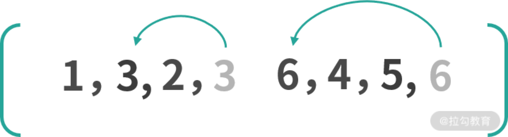

# 完整的DOM Diff流程

这一节主要分析上一节说的核心diff流程

新子结点数组相对于旧子节点数组的变化, 无非是通过更新、删除、添加和移动节点来完成

而核心diff算法, 就是在已知旧子节点的DOM结构, vnode和新子节点的vnode情况下, 以较低的成本完成子节点的更新为目的, 求解生成新子节点DOM的系列操作

## 例子

### 例1

比如这里有一个列表

```html
<ul>
  <li key="a">a</li>
  <li key="b">b</li>
  <li key="c">c</li>
  <li key="d">d</li>
</ul>
```

需要更新到如下列表

```html
<ul>
  <li key="a">a</li>
  <li key="b">b</li>
  <li key="e">e</li>
  <li key="c">c</li>
  <li key="d">d</li>
</ul>
```

在操作前后, 他们对应生成的vnode如下所示:


其实从上图可以直观感受到, 差异就是在b节点后面多了一个e节点

### 例2

此时改造一下例子

```html
<ul>
  <li key="a">a</li>
  <li key="b">b</li>
  <li key="c">c</li>
  <li key="d">d</li>
  <li key="e">e</li>
</ul>
```

然后删除其中的c节点

```html
<ul>
  <li key="a">a</li>
  <li key="b">b</li>
  <li key="d">d</li>
  <li key="e">e</li>
</ul>
```

可以看到更新前后的children如下图所示:


可以看到差异主要是在b节点后面少了一个c节点

> 综合上述两个例子, 可以很容易发现新旧children拥有相同的头尾节点。对于相同的节点, 我们只需要做对比更新即可
> 
> 在整个 diff 的过程，我们需要维护几个变量：头部的索引 i、旧子节点的尾部索引 e1和新子节点的尾部索引 e2。
> 
> 针对所有新的儿子节点数组中的vnode, 在对比是否相等前, 都要通过 [normalizeVNode](/blogs/vue3-resource/core/5.html#normalizevnode) 方法序列化vnode, 处理差异
> 
> 所以diff算法的第一步是`从头部开始同步`
> 
> 如果头部相同节点判断完成, 则开始[从尾部同步节点](/blogs/vue3-resource/core/5.html#同步尾部节点)

## 同步头部节点

+ 从头部开始循环
+ 判断是新旧子节点数组中开始节点是否为相同节点
+ 如果是, 则执行patch递归更新
+ 新旧子节点数组继续从头部往后
+ 如果不同或者索引 i 大于索引 e1 或者 e2，则同步过程结束。
+ 如果不是, 则退出循环, 开始下一批次[尾部节点同步](/blogs/vue3-resource/core/5.html#同步尾部节点)


同步头部节点代码如下:

```ts
const patchKeyedChildren = (
  c1: VNode[],
  c2: VNodeArrayChildren,
  container: RendererElement,
  parentAnchor: RendererNode | null,
  parentComponent: ComponentInternalInstance | null,
  parentSuspense: SuspenseBoundary | null,
  isSVG: boolean,
  slotScopeIds: string[] | null,
  optimized: boolean // 一般为false
) => {
  let i = 0
  const l2 = c2.length
  // 旧子节点尾部索引
  let e1 = c1.length - 1 // prev ending index
  // 新子节点尾部索引
  let e2 = l2 - 1 // next ending index

  // 1. sync from start
  // (a b) c
  // (a b) d e
  // 1. 从头部开始同步
  while (i <= e1 && i <= e2) {
    // 旧子节点vnode
    const n1 = c1[i]
    // 新子节点vnode
    const n2 = (c2[i] = optimized
      ? cloneIfMounted(c2[i] as VNode)
      : normalizeVNode(c2[i]))
    // 更新前后是否同一节点
    if (isSameVNodeType(n1, n2)) {
      // 对于相同节点执行patch递归更新
      patch(
        n1,
        n2,
        container,
        null,
        parentComponent,
        parentSuspense,
        isSVG,
        slotScopeIds,
        optimized
      )
    } else {
      break
    }
    i++
  }
}
```

## 同步尾部节点

同步尾部节点就是从尾部开始，依次对比新节点和旧节点，如果相同的则执行 patch 更新节点；如果不同或者索引 i 大于索引 e1 或者 e2，则同步过程结束。

主要流程如下:

1. 和同步新节点类似, 只不过是从尾部开始对比
2. 其中e1为旧的儿子节点结束位置, e2为新的儿子节点结束位置
3. n1旧的儿子结束vnode, n2 为新的儿子节点结束vnode
4. 对比新旧节点是否相同
  + 如果新旧vnode为相同vnode, 则调用patch递归更新, 和头部比较一样
  + 否则退出循环, 同步尾部节点过程结束, 继续进行后续的比较
5. 如果是相同节点, 那么在最后要让尾部往前, 也就是`e1--`和`e2--`, 

可以结合下图观察尾部节点同步的情况:


在a和b进行同步节点完成后, c和e不符合头部同步, 则继续往后进入尾部节点同步, 此时i是2, e1是3, e2是4

第一次对比`c1[e1]`和`c2[e2]`, 也就是d和d, 是相同节点, 执行patch递归更新

进入第二次比较, 也就是c和c, 还是相同节点, 执行patch递归更新

此时i不满足<= e1, 结束

完成尾部节点同步后：i 是 2，e1 是 1，e2 是 2。

接下来只有 3 种情况要处理：

1. 新子节点有剩余要[添加的新节点]()；
2. 旧子节点有剩余要删除的多余节点；
3. 未知子序列。

```ts
...
// 2. sync from end
// a (b c)
// d e (b c)
// 2. 从新旧子节点数组尾部开始对比
while (i <= e1 && i <= e2) {
  const n1 = c1[e1]
  const n2 = (c2[e2] = optimized
    ? cloneIfMounted(c2[e2] as VNode)
    : normalizeVNode(c2[e2]))
  // 是否相同节点
  if (isSameVNodeType(n1, n2)) {
    // 相同节点执行patch递归更新
    patch(
      n1,
      n2,
      container,
      null,
      parentComponent,
      parentSuspense,
      isSVG,
      slotScopeIds,
      optimized
    )
  } else {
    break
  }
  // 从后往前
  e1--
  e2--
}
...
```

## 添加新节点

首先判断新的子节点是否有剩余

满足剩余条件, 则计算挂载锚点(当前对比节点的下一个, 作为锚点)

调用patch方法挂载剩余节点

如果索引 i 大于尾部索引 e1 且 i 小于 e2，那么从索引 i 开始到索引 e2 之间，我们直接挂载新子树这部分的节点。

对上面的例子而言，同步完尾部节点后 i 是 2，e1 是 1，e2 是 2，此时满足条件需要添加新的节

通过下图看一下添加后的结果：


添加完 e 节点后，旧子节点的 DOM 和新子节点对应的 vnode 映射一致，也就完成了更新。

```ts
// 3. 挂载节点剩余部分
// (a b)
// (a b) c
// i = 2, e1 = 1, e2 = 2
// (a b)
// c (a b)
// i = 0, e1 = -1, e2 = 0
if (i > e1) {
  if (i <= e2) {
    // 旧的遍历完了, 还有多的新节点
    const nextPos = e2 + 1
    // 计算节点锚点
    const anchor = nextPos < l2 ? (c2[nextPos] as VNode).el : parentAnchor
    while (i <= e2) {
      // 挂载新节点
      patch(
        null,
        (c2[i] = optimized
          ? cloneIfMounted(c2[i] as VNode)
          : normalizeVNode(c2[i])),
        container,
        anchor,
        parentComponent,
        parentSuspense,
        isSVG,
        slotScopeIds,
        optimized
      )
      i++
    }
  }
}
```


## 删除多余节点

如果不满足添加新节点的情况，我就要接着判断旧子节点是否有剩余，如果满足则删除旧子节点，实现代码如下：

```ts
// 4. common sequence + unmount
// 4. 删除多余节点
// (a b) c
// (a b)
// i = 2, e1 = 2, e2 = 1
// a (b c)
// (b c)
// i = 0, e1 = 0, e2 = -1
else if (i > e2) {
  // 新的子节点先遍历完, 直接删除
  while (i <= e1) {
    // 删除节点
    unmount(c1[i], parentComponent, parentSuspense, true)
    i++
  }
}
```

## 处理未知子序列

单纯的添加和删除节点都是比较理想的情况, 操作起来也很容易, 但是有些时候并非这么幸运, 我们会遇到比较复杂的未知子序列, 这时diff算法会如何做呢?

这里还是通过例子来演示存在未知子序列的情况, 假设一个按照字母表排列的列表:

```html
<ul>
  <li key="a">a</li>
  <li key="b">b</li>
  <li key="c">c</li>
  <li key="d">d</li>
  <li key="e">e</li>
  <li key="f">f</li>
  <li key="g">g</li>
  <li key="h">h</li>
</ul>
```

需要更新为一个新表:

```html
<ul>
  <li key="a">a</li>
  <li key="b">b</li>
  <li key="e">e</li>
  <li key="d">c</li>
  <li key="c">d</li>
  <li key="i">i</li>
  <li key="g">g</li>
  <li key="h">h</li>
</ul>
```

这里依然从头部开始同步:


同步头部节点后的结果是: i是2, e1是7, e2是7

头部不满足后, 从尾部继续同步节点:


同步尾部节点后, 结果变成了i为2, e1是5, e2是5。

此时他既不能添加新节点, 也不能删除旧节点。

结合这个图可以知道, 要把旧的子节点c,d,e,f转变成新子节点的e, c, d, i

但不管情况多复杂, 最终都是通过更新、删除、添加和移动这些动作来操作节点, 而我们要做的就是找到相对优的解

+ 当两个节点类型相同时, 执行更新操作
+ 当新子节点中没有旧子节点中的某些节点时, 执行删除操作
+ 当新子节点中多了旧子节点中没有的节点时, 执行添加操作

前面这几个操作其实已经说的很清楚了, 相对这几个操作来说, 最复杂的就是移动了, 既要判断哪些节点需要移动, 也要清楚的知道他们如何移动

## 移动子节点

当子节点排序发生变化时, 就需要移动子节点了

比如下面这个例子:

```ts
const prev = [1, 2, 3, 4, 5, 6]
const next = [1, 3, 2, 6, 4, 5]
```

可以看到, 从prev变成next, 数组里的一些元素顺序发生了变化, 可以把子节点类比为元素。问题就简化为了从 prev -> next

一种思路是在next中找到一个递增子序列, 比如 `[1, 3, 6]`、`[1, 2, 4, 5]`。之后对next数组进行倒序遍历, 移动所有不在递增序列中的元素即可

如果选择了 `[1, 3, 6]`作为递增序列, 那么在倒序遍历的过程中, 遇到 `6, 3, 1`不动, 遇到 `5, 4, 2`移动即可

如图所示:


如果选择以 `[1, 2, 4, 5]`作为递增序列, 那么在倒序遍历的过程中, 遇到5, 4, 2, 1不动, 遇到6, 3移动即可, 如图所示:



可以看到第一种移动了三次, 而第二种只移动了两次, 递增子序列越长, 所需要移动元素的次数越少, 所以如何移动的问题其实就回到了求解最长递增子序列的问题。

现在要做的是在新旧子节点序列中找出相同节点并更新, 找出多余节点并删除以及找出新的节点添加, 找出是否需要移动的节点, 如果存在如何移动?

在查找过程中, 需要对比新旧子序列, 那么我们就要遍历某个序列, 如果在遍历旧子序列的过程中需要判断某个节点是否在新子序列中存在, 这就需要双重循环, 而双重循环的复杂度是O(n^2), 为了优化这个复杂度, 可以用一种空间换时间的思路, 建立索引图, 把时间复杂度降到O(n)

### 建立索引图

建立索引图很关键, 所以在处理未知子序列的第一步, 就是建立索引图

通常在开发过程中, 进行遍历生成节点时, 都会添加一个key作为唯一项, 这个key在diff过程中起到很关键的作用。

对于新旧子序列中的节点, 我们认为key相同的就是同一个节点, 直接执行patch递归更新即可

patchKeyedChildren中建立索引图代码如下:

```ts
// 5. 未知子序列处理
// [i ... e1 + 1]: a b [c d e] f g
// [i ... e2 + 1]: a b [e d c h] f g
// i = 2, e1 = 4, e2 = 5
// 旧子序列开始索引
const s1 = i // prev starting index
// 新子序列开始索引
const s2 = i // next starting index

// 5.1 build key:index map for newChildren
// 根据key建立新子序列的索引图
const keyToNewIndexMap: Map<string | number, number> = new Map()
for (i = s2; i <= e2; i++) {
  const nextChild = (c2[i] = optimized
    ? cloneIfMounted(c2[i] as VNode)
    : normalizeVNode(c2[i]))
  if (nextChild.key != null) {
    if (__DEV__ && keyToNewIndexMap.has(nextChild.key)) {
      // 开发环境校验重复key并抛错
    }
    keyToNewIndexMap.set(nextChild.key, i)
  }
}
```

新旧子序列都是从i开始的, 所以先用s1, s2分别作为新旧子节点的开始索引, 接着声明一个 keyToNewIndexMap

遍历新子序列, 把节点的key和index添加到map中, 键为key, 值为index值

keyToNewIndexMap存储的就是新子序列中每个节点在新子序列中的索引, 上面的示例处理后的结果如下图所示:


此时索引图为: `{e: 2, c: 3, d: 4, i: 5}`

### 更新和移除旧节点

建立完索引图后, 就需要遍历旧子序列, 有相同的节点就通过patch更新, 并且移除那些不在新子序列中的节点, 同时找出是否有需要移动的节点, 下面是其实现：

```ts
// 5.2 loop through old children left to be patched and try to patch
// matching nodes & remove nodes that are no longer present
// 正序遍历旧子序列, 找到匹配的节点更新, 删除不在新子序列中的节点, 判断是否有移动节点
let j
// 新子序列已更新节点的数量
let patched = 0
// 新子序列待更新节点的数量, 等于新子序列的长度
const toBePatched = e2 - s2 + 1
// 是否存在要移动的节点
let moved = false
// used to track whether any node has moved
// 用于跟踪判断是否有节点移动
let maxNewIndexSoFar = 0
// works as Map<newIndex, oldIndex>
// Note that oldIndex is offset by +1
// and oldIndex = 0 is a special value indicating the new node has
// no corresponding old node.
// used for determining longest stable subsequence
// 用于存储新子序列中的元素在旧子序列节点的索引, 用于确定最长递增子序列
const newIndexToOldIndexMap = new Array(toBePatched)
// 初始化数组, 每个元素的值都是0
for (i = 0; i < toBePatched; i++) newIndexToOldIndexMap[i] = 0
// 正序遍历旧子序列
for (i = s1; i <= e1; i++) {
  // 旧子节点vnode值
  const prevChild = c1[i]
  if (patched >= toBePatched) {
    // 所有子序列更新完成, 剩余的节点删除
    // all new children have been patched so this can only be a removal
    unmount(prevChild, parentComponent, parentSuspense, true)
    continue
  }
  let newIndex
  if (prevChild.key != null) {
    // 查找旧子序列中的节点在新子序列中的索引
    newIndex = keyToNewIndexMap.get(prevChild.key)
  } else {
    // 如果旧子节点vnode没有设置key, 则循环推断一个合适的索引
    // key-less node, try to locate a key-less node of the same type
    for (j = s2; j <= e2; j++) {
      if (
        newIndexToOldIndexMap[j - s2] === 0 &&
        isSameVNodeType(prevChild, c2[j] as VNode)
      ) {
        // 当前序列还没有存储过索引, 并且他们是一个sameVnode, 那么就说明这是一个合适的key, 将当前索引作为旧子序列中节点在新子序列中的索引
        newIndex = j
        break
      }
    }
  }
  if (newIndex === undefined) {
    // 如果找不到, 说明旧子序列已不存在于新子序列中, 该节点需删除
    unmount(prevChild, parentComponent, parentSuspense, true)
  } else {
    // 更新新子序列中的元素在旧子序列中的索引，这里加 1 偏移，是为了避免 i 为 0 的特殊情况，影响对后续最长递增子序列的求解
    newIndexToOldIndexMap[newIndex - s2] = i + 1
    // maxNewIndexSoFar 始终存储的是上次求值的 newIndex，如果不是一直递增，则说明有移动
    if (newIndex >= maxNewIndexSoFar) {
      maxNewIndexSoFar = newIndex
    } else {
      moved = true
    }
    // 更新新旧子序列中匹配的节点
    patch(
      prevChild,
      c2[newIndex] as VNode,
      container,
      null,
      parentComponent,
      parentSuspense,
      isSVG,
      slotScopeIds,
      optimized
    )
    patched++
  }
}
```

这里建立了一个newIndexToOldIndexMap的数组, 来存储新子序列节点的索引和旧子序列节点的索引之间的映射关系, 用于确定最长递增子序列

这个数组的长度为新子序列的长度, 每个元素的初始值设为0, 他是一个特殊的值, 如果遍历完了仍有元素的值为0, 则说明遍历旧子序列的过程中, 没有处理过这个节点, 那么这个节点就是新添加的

下面说一下具体操作过程:

正序遍历旧子序列, 根据前面建立的keyToNewIndexMap查找旧子序列中的节点在新子序列中的索引

如果找不到就说明新子序列中没有该节点, 就删除它, 如果找得到, 则将它在旧子序列中的索引更新到newIndexToOldIndexMap中

注意这里索引加了长度为 1 的偏移，是为了应对 i 为 0 的特殊情况，如果不这样处理就会影响后续求解最长递增子序列。

遍历过程中，我们用变量 maxNewIndexSoFar 跟踪判断节点是否移动
maxNewIndexSoFar 始终存储的是上次求值的 newIndex
一旦本次求值的 newIndex 小于 maxNewIndexSoFar，这说明顺序遍历旧子序列的节点在新子序列中的索引并不是一直递增的，也就说明存在移动的情况。

除此之外，这个过程中我们也会更新新旧子序列中匹配的节点，另外如果所有新的子序列节点都已经更新，而对旧子序列遍历还未结束，说明剩余的节点就是多余的，删除即可。

至此，我们完成了新旧子序列节点的更新、多余旧节点的删除，并且建立了一个 newIndexToOldIndexMap 存储新子序列节点的索引和旧子序列节点的索引之间的映射关系，并确定是否有移动。

实例处理后的结果如下图所示:


可以看到, c, d, e节点被更新, f节点被删除, newIndexToOldIndexMap的值为`[5, 3, 4, 0]`, 此时moved也为true, 也就是存在节点移动的情况

### 移动和挂载新节点

上一步说到, 更新完需要移动的节点后, 就需要将对应的节点移动到新的位置

接下来，就到了处理未知子序列的最后一个流程，移动和挂载新节点

```ts
// 5.3 move and mount
// 挂载和移动新节点
// generate longest stable subsequence only when nodes have moved
// 仅当节点移动时生成最长递增子序列
const increasingNewIndexSequence = moved
  ? getSequence(newIndexToOldIndexMap)
  : EMPTY_ARR
// 最长递增子序列的末尾index
j = increasingNewIndexSequence.length - 1
// looping backwards so that we can use last patched node as anchor
// 倒序遍历以便我们可以使用最后更新的节点作为锚点
for (i = toBePatched - 1; i >= 0; i--) {
  const nextIndex = s2 + i
  const nextChild = c2[nextIndex] as VNode
  // 锚点指向上一个更新的节点, 如果nextIndex超过子节点的长度, 则执行parentAnchor
  const anchor =
    nextIndex + 1 < l2 ? (c2[nextIndex + 1] as VNode).el : parentAnchor
  if (newIndexToOldIndexMap[i] === 0) {
    // mount new
    // 挂载新的子节点
    patch(
      null,
      nextChild,
      container,
      anchor,
      parentComponent,
      parentSuspense,
      isSVG,
      slotScopeIds,
      optimized
    )
  } else if (moved) {
    // move if:
    // There is no stable subsequence (e.g. a reverse)
    // OR current node is not among the stable sequence
    // 没有最长递增子序列（reverse 的场景）或者当前的节点索引不在最长递增子序列中，需要移动
    if (j < 0 || i !== increasingNewIndexSequence[j]) {
      // 此时知道当前节点的后一位应该谁(锚点), 也知道当前节点应该在的位置(nextIndex)
      // 所以直接将旧子序列中的节点移动到上面求出来的两个位置即可, 也就是nextIndex处, 锚点之前(无锚点就是最后一位)
      // moveType 为 REORDER 直接就是执行插入
      move(nextChild, container, anchor, MoveType.REORDER)
    } else {
      j--
    }
  }
}
```

前面已经判断了是否移动, 如果moved为true, 就通过 [getSequence(newIndexToOldIndexMap)](/blogs/vue3-resource/core/5.html#计算最长递增子序列)计算最长递增子序列

然后采用倒叙的方式遍历新子序列, 因为倒叙遍历可以方便使用最后更新的节点作为锚点。

倒叙的过程中, 锚点指向上一个更新的节点, 然后判断 `newIndexToOldIndexMap[i]`是否为0, 如果是0, 则表示这是新节点, 需要挂载。

接着判断是否存在移动节点的情况, 如果存在的话, 则看节点的索引是不是在最长递增子序列中, 如果在, 则倒叙最长递增子序列, 否则把他移动到锚点的前面

为了便于更直观的理解, 我们用前面的例子展示一下这个过程, 此时:

+ toBePatched 为4
+ j为1
+ 最长递增子序列increasingNewIndexSequence值为[1, 2]

在倒序新子序列的过程中, 首先遇到节点i, 发现他在 newIndexToOldIndexMap中的值为0, 说明他是新的节点, 我们需要挂载他

然后继续遍历遇到节点d, 因为moved为true, 且d的索引存在于最长递增子序列中, 则执行j-- 倒序最长递增子序列, j此时为0;

急着继续遍历遇到节点c, 它和d一样, 索引页存在于最长递增子序列中, 则执行j--, j此时为-1

接着继续遍历遇到节点e, 此时j是-1并且e的索引也不在最长递增子序列中, 所以做一次移动操作, 把e节点移到上一个更新的节点, 也就是c节点的前面

这里的移动其实就是插入

新子序列倒序完成, 即完成了新节点的插入和旧节点的移动操作,也就完成了整个核心diff算法对节点的更新

如下图所示


可以看到新子序列中的新节点 i 被挂载，旧子序列中的节点 e 移动到了 c 节点前面，至此，我们就在已知旧子节点 DOM 结构和 vnode、新子节点 vnode 的情况下，求解出生成新子节点的 DOM 的更新、移动、删除、新增等系列操作，并且以一种较小成本的方式完成 DOM 更新。

我们知道了子节点更新调用的是 patch 方法， Vue3 正是通过这种递归的方式完成了整个组件树的更新。

核心 diff 算法中最复杂就是[求解最长递增子序列](/blogs/vue3-resource/core/5.html#计算最长递增子序列)


## 计算最长递增子序列

求解最长递增子序列是一道经典的算法题，多数解法是使用动态规划的思想，算法的时间复杂度是 O(n2)，而 Vue.js 内部使用的是维基百科提供的一套“贪心 + 二分查找”的算法，贪心算法的时间复杂度是 O(n)，二分查找的时间复杂度是 O(logn)，所以它的总时间复杂度是 O(nlogn)。

单纯地看代码并不好理解，我们用示例来看一下这个子序列的求解过程。

假设我们有这个样一个数组 arr：[2, 1, 5, 3, 6, 4, 8, 9, 7]，求解它最长递增子序列的步骤如下：


最终求得最长递增子序列的值就是 [1, 3, 4, 8, 9]。

通过演示我们可以得到这个算法的主要思路：对数组遍历，依次求解长度为 i 时的最长递增子序列，当 i 元素大于 i - 1 的元素时，添加 i 元素并更新最长子序列；否则往前查找直到找到一个比 i 小的元素，然后插在该元素后面并更新对应的最长递增子序列。

这种做法的主要目的是让递增序列的差尽可能的小，从而可以获得更长的递增子序列，这便是一种贪心算法的思想。

了解了算法的大致思想后，接下来我们看一下源码实现：

```ts
function getSequence(arr: number[]): number[] {
  const p = arr.slice()
  const result = [0]
  let i, j, u, v, c
  const len = arr.length
  for (i = 0; i < len; i++) {
    const arrI = arr[i]
    if (arrI !== 0) {
      j = result[result.length - 1]
      if (arr[j] < arrI) {
        // 存储在 result 更新前的最后一个索引值
        p[i] = j
        result.push(i)
        continue
      }
      u = 0
      v = result.length - 1
      // 二分搜索, 查找比 arrI 小的节点, 更新result的值
      while (u < v) {
        c = ((u + v) / 2) | 0
        if (arr[result[c]] < arrI) {
          u = c + 1
        } else {
          v = c
        }
      }
      if (arrI < arr[result[u]]) {
        if (u > 0) {
          p[i] = result[u - 1]
        }
        result[u] = i
      }
    }
  }
  u = result.length
  v = result[u - 1]
  // 回溯数组p, 找到最终的索引
  while (u-- > 0) {
    result[u] = v
    v = p[v]
  }
  return result
}
```

其中 result 存储的是长度为 i 的递增子序列最小末尾值的索引。比如我们上述例子的第九步，在对数组 p 回溯之前， result 值就是 [1, 3, 4, 7, 9] ，这不是最长递增子序列，它只是存储的对应长度递增子序列的最小末尾。因此在整个遍历过程中会额外用一个数组 p，来存储在每次更新 result 前最后一个索引的值，并且它的 key 是这次要更新的 result 值：

```ts
j = result[result.length - 1]
p[i] = j
result.push(i)
```
可以看到，result 添加的新值 i 是作为 p 存储 result 最后一个值 j 的 key。上述例子遍历后 p 的结果如图所示：


从 result 最后一个元素 9 对应的索引 7 开始回溯，可以看到 p[7] = 6，p[6] = 5，p[5] = 3，p[3] = 1，所以通过对 p 的回溯，得到最终的 result 值是 [1, 3 ,5 ,6 ,7]，也就找到最长递增子序列的最终索引了。这里要注意，我们求解的是最长子序列索引值，它的每个元素其实对应的是数组的下标。对于我们的例子而言，[2, 1, 5, 3, 6, 4, 8, 9, 7] 的最长子序列是 [1, 3, 4, 8, 9]，而我们求解的 [1, 3 ,5 ,6 ,7] 就是最长子序列中元素在原数组中的下标所构成的新数组。

## normalizeVNode

序列化vnode, 目的主要是消除新的vnode的差异

逻辑很简单, 主要是对入参vnode的一系列判断

+ 如果vnode是空或者是boolean, 那么说明新的节点是注释节点, 直接创建注释节点
+ 如果是数组, 则创建一个fragment子vnode
+ 如果是对象, 也就是普通vnode, 那么判断是否存在el, 存在则说明已经是vnode了, 返回即可, 不存在则通过入参对象创建vnode
+ 如果上述都不是, 则说明是字符串或数字, 那么直接创建文本vnode即可

```ts
export function normalizeVNode(child: VNodeChild): VNode {
  if (child == null || typeof child === 'boolean') {
    // 如果节点不存在或者节点类型为boolean, 则创建注释节点
    // empty placeholder
    return createVNode(Comment)
  } else if (isArray(child)) {
    // 如果节点是一个数组, 则创建 Fragment
    // fragment
    return createVNode(Fragment, null, child)
  } else if (typeof child === 'object') {
    // 如果是一个常规vnode, 也就是一个对象, 判断el是否存在, 存在则直接返回, 不存在则创建vnode
    // 已经是 vnode，这应该是最常见的，因为编译的模板总是产生全 vnode 子数组
    // already vnode, this should be the most common since compiled templates
    // always produce all-vnode children arrays
    return child.el === null ? child : cloneVNode(child)
  } else {
    // strings and numbers
    // 数字或者字符串直接创建文本节点
    return createVNode(Text, null, String(child))
  }
}
```


## 总结

对于普通元素节点的更新，主要是更新一些属性，以及它的子节点。子节点的更新又分为多种情况，其中最复杂的情况为数组到数组的更新，内部又根据不同情况分成几个流程去 diff，遇到需要移动的情况还要去求解子节点的最长递增子序列。

整个更新过程还是利用了树的深度遍历，递归执行 patch 方法，最终完成了整个组件树的更新。

组件的更新流程如下图所示：


