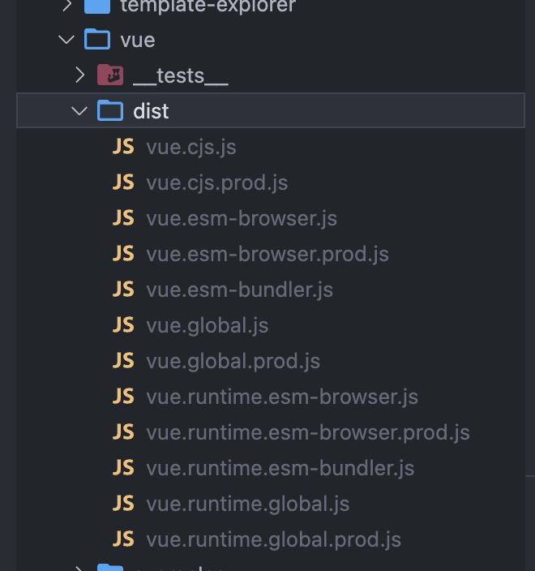

# Vue3简介

首先来介绍一下新版本和Vue2.x的区别

从下面四个部分来进行介绍:

+ 源码组织方式的变化
+ Composition API
+ 性能提升
+ Vite

1. Vue3的源码全部采用ts进行书写, 项目的组织方式也发生了变化, 使用monorepo的方式来组织项目的结构, 将独立的功能模块都提取到不同的包中
2. Vue3虽然全部重写, 但是90%以上的API依然兼容2.x, 并且根据社区的反馈增加了Composition API(组合式API), 主要用于解决在开发超大型项目时, 对于超大组件不好拆分和重用的问题
3. 在性能上, Vue3.0有大幅度提升, 使用 Proxy(代理对象) 重写了响应式代码, 并且对编译器做了优化, 重写了Virtual DOM, 从而让render和update的性能都有了大幅度的提升, 另外, 官方介绍, SSR性能也提升到了2-3倍
4. 使用Vite, 在开发阶段测试项目时, 不需要去打包, 可以直接运行项目, 提升开发效率

## Vue3源码组织方式

为了提升代码的可维护性, 在Vue3中

+ 源码全部采用TypeScript重写
  - 大型项目开发, 都推荐使用类型化的语言, 在编码过程中帮助开发者检查类型问题
+ 使用Monorepo管理项目结构
  - 一个项目管理多个包, 把不同功能的代码放到不同的packages种管理
  - 每个功能模块划分非常明确
  - 模块间的依赖关系也很明确
  - 每个功能模块可以单独测试, 单独发布和单独使用

## packages 目录结构

在packages下, 目录比较多, 依次说明一下:

在packages下, 都是独立发行的包, 可以独立使用

### compiler-*

以compiler开头的包, 都是和编译相关的代码

+ compiler-core: 和平台无关的编译器
+ compiler-dom: 浏览器平台下的编译器, 依赖于compiler-core
+ compiler-sfc: 用于编译单文件组件(SFC)
+ compiler-ssr: 服务端渲染的编译器, 依赖于compiler-dom

### reactivity

数据响应式系统, 可以独立使用

### runtime-*

运行时

+ runtime-core: 和平台无关的运行时
+ runtime-dom: 针对浏览器的运行时, 处理原生DOM API, 事件等
+ runtime-test: 专门为测试编写的轻量级运行时
  - 渲染出来的DOM树是一个js对象, 可以运行在所有的js环境中
  - 可用于测试渲染是否正确
  - 还可以用于序列化dom, 触发dom事件, 记录某次更新中的dom操作

### server-renderer

服务端渲染

### shared

vue内部使用的一些公共的api

### size-check

私有包, 不会发布到npm, 主要用于在tree-shaking之后检查包的大小

### template-explorer

在浏览器中运行的实时编译组件, 输出render函数, 在README中提供了在线访问地址

### vue

用于构建完整版的Vue, 依赖于compiler和runtime

## Vue3的不同构建版本

Vue3在构建时, 和Vue2类似, 都构建了不同的版本, 可以在不同的场合下使用

不同的是Vue3不在构建umd的模块化方式, 因为umd的模块化方式会让代码有更多的冗余, 需要支持多种模块化方式

Vue3.0的构建版本中, 将cjs, EsModule 和 IIFE(自执行函数)的方式, 分别打包到了不同的文件中

> 在packages/vue/dist目录中, 存放了Vue3的所有构建版本



总共分为四类:

### cjs

commonJs的模块化方式, 都是完整版的Vue, 包含编译器和运行时

+ vue.cjs.js, 开发板, 代码没有被压缩
+ vue.cjs.prod.js, 生产版本, 代码经过了压缩

### global

global是全局的意思, 这四个文件都可以在浏览器中直接通过script标签来导入

导入js之后, 会增加一个全局的Vue对象

其中: vue.global 和 vue.global.prod都是完整版的vue, 包含编译器和运行时

不同的是vue.global是开发版本, 代码没有压缩

而vue.runtime.global和vue.runtime.global.prod是只有运行时的构建版本, 同样有开发版本和生产版本

+ vue.global.js
+ vue.global.prod.js
+ vue.runtime.global.js
+ vue.runtime.global.prod.js


### browser

这组文件都包含esm, 也就是ESModule, 现代浏览器的原生模块化方式

在浏览器中可以直接通过 `<script type=module></script>` 的方式来导入这些模块

前两个是包含编译器和运行时的完整版, 后两个是只有运行时的版本

+ vue.esm-browser.js
+ vue.esm-browser.prod.js
+ vue.runtime.esm-browser.js
+ vue.runtime.esm-browser.prod.js

### bundler

这两个文件没有打包所有的代码, 需要配合打包工具来使用

均使用ESModule的模块化方式, 内部通过import导入了runtime-core

但是`vue.esm-bundler.js`是完整版的, 内部还导入了runtime-compiler 也就是编译器

使用脚手架创建的项目中, 默认使用的是 `vue.runtime.esm-bundler`, 这个文件只导入了运行时

他是Vue的最小版本, 在项目开发完毕后, 重新打包时, 只会打包使用到的代码, 让Vue的体积更小

+ vue.esm-bundler.js
+ vue.runtime.esm-bundler.js


## Composition API 设计动机

学习Composition API 最好的方式, 就是查查看官方的RFC

Vue2到Vue3的变动, 都是通过RFC的机制进行确认

官方首先给出一些提案, 然后收集社区的反馈并讨论进行确认

+ RFC(Request For Comments)(仓库)
  - https://github.com/vuejs/rfcs
+ Composition API RFC(文档, 主要是使用)
  - https://composition-api.vuejs.org

Vue2.x在开发中小型项目的时候已经很好用了, 但是使用Vue2.x开发需要长期迭代和维护的大型项目, 会有一些限制

在大型项目中, 可能会有一些功能比较复杂的组件, 在看他人开发的组件时, 可能会难以理解

+ 使用一个包含描述组件选项的对象来创建组件
+ 查看同一个功能的代码在复杂逻辑组件中需要反复上下拖动滚动条, 因为他们可能涉及到多个选项中, 如data, computed, methods和生命周期等
+ 难以提取组件中可重用的逻辑, mixin机制存在命名冲突以及数据来源不清晰等问题

主要原因是Vue2.x采用的是OptionsAPI, 也就是使用一个包含描述组件选项(data, methods, props等)的对象来创建组件的方式, 这种方式在2.x时代经常使用, 创建的data, methods, computed, 生命周期钩子函数等, 其实都是选项, 这些选项一起来描述一个组件

由于同一个功能的代码, 同时涉及data, methods, props, computed等选项, 会增加人的阅读难度, 因为一个功能逻辑的代码, 会被拆分到不同的选项中。为了查看某个功能, 可能需要不停地上下拖动滚动条, 来找到同一个功能对应的代码

另外, 使用OptionsAPI, 还难以提取组件中可重用的逻辑, 虽然有mixins机制, 但是在mixins使用过程中, 其实也会造成命名冲突, 数据来源不清晰等问题

### Composition API

+ vue3.0新增的一组API
+ 一组基于函数的API
+ 可以更灵活的组织组件的逻辑和结构
+ 功能可以作为函数模块提取出来, 便于其余任何组件复用和查看其中的逻辑

相对于OptionsAPI, 我们可以自由的通过hooks将某个逻辑抽离出来, 单独作为一个模块使用

在查看某个逻辑时, 只需要关注这个模块的代码即可, 而不用关注组件具体在做什么, 代码都封装在一个函数内部

## 性能提升

Vue3中性能提升可以从下面几个方面来说:

+ 响应式系统升级(使用Proxy对象重写响应式系统)
+ 编译优化(通过优化编译的过程和重写虚拟DOM, 提升渲染性能)
+ 源码体积的优化(通过减少源码体积和更好的tree-shaking支持, 减少打包的体积)


### 响应式系统升级

+ Vue2.x中响应式系统的核心是defineProperty(需要遍历和递归深度遍历属性为所有的属性添加响应式)
+ Vue3.x中使用Proxy对象重写响应式系统(初始化无需遍历, 多层嵌套对象, 只有访问某个属性时, 才会递归处理下一级的属性)
  - 可以监听动态新增的属性(Vue2需要使用set方法)
  - 可以监听删除的属性(Vue2不行)
  - 可以监听数组的索引和length属性


### 编译优化

以如下组件为例
```html
<template>
  <div id="app">
    <div> static root
      <div>static node</div>
    </div>
    <div>static node</div>
    <div>static node</div>
    <div>{{ count }}</div>
    <button @click="handler">button</button>
  </div>
</template>
```

在Vue2.x中, 模板首先需要编译为render函数, 这个过程一般是在构建的过程中完成的

在编译的时候会编译静态根节点和静态节点, 静态根节点中必须要求节点中存在一个静态子结点, 例如app下第一个div

当组件的状态发生变化后, 会通知watcher, 触发watcher的update, 最终执行虚拟dom的patch操作, 遍历所有的VNode, 找到差异, 并更新到真实DOM上

在Diff过程中, 会去比较整个虚拟DOM, 先对比新旧的div, 以及他们的属性, 然后再对比他内部的子节点

Vue2中渲染的最小单位是组件, 在更新的过程中会跳过静态根节点, 因为静态根节点在更新过程中不会发生任何变化, 来优化diff过程

+ Vue2.x通过标记静态根节点, 优化diff的过程（但是静态节点还需要diff, 这个过程并没有被优化）
+ Vue3中标记和提升所有的静态节点, diff的时候只需要对比动态节点内容
  - 引入Fragments, 模板中不需要创建一个唯一的根节点, 可以直接放文本内容, 或者很多同级的标签(升级vetur插件)
  - 静态提升
  - Patch flag
  - 缓存事件处理函数

通过Vue3的 vue template explorer, 可以发现, 其实删除根节点之后, 内部还是会维系一个树形结构, 只是引入的根节点是一个fragment, 还是通过`_createElementBlock`创建的一个根节点, 只是一个是div, 一个是fragment

```js
import { createElementVNode as _createElementVNode, createTextVNode as _createTextVNode, toDisplayString as _toDisplayString, openBlock as _openBlock, createElementBlock as _createElementBlock } from "vue"

export function render(_ctx, _cache, $props, $setup, $data, $options) {
  return (_openBlock(), _createElementBlock("div", { id: "app" }, [
    _createElementVNode("div", null, [
      _createTextVNode(" static root "),
      _createElementVNode("div", null, "static node")
    ]),
    _createElementVNode("div", null, "static node"),
    _createElementVNode("div", null, "static node"),
    _createElementVNode("div", null, _toDisplayString(_ctx.count), 1 /* TEXT */),
    _createElementVNode("button", { onClick: _ctx.handler }, "button", 8 /* PROPS */, ["onClick"])
  ]))
}
// Check the console for the AST
```

在这个工具的右上角, 有一个 hoistStatic, 也就是提升静态节点

勾选之后, 此时代码会变成如下

可以看到, 所有静态的内容, 都会被提升到最外层, 包裹静态事件 onClick

所有的静态属性, 都只在初始化的时候被创建一次, 后续所有的update, 都不会重新创建这些静态属性, 可以直接重用

```js
import { createElementVNode as _createElementVNode, createTextVNode as _createTextVNode, toDisplayString as _toDisplayString, openBlock as _openBlock, createElementBlock as _createElementBlock } from "vue"

const _hoisted_1 = { id: "app" }
const _hoisted_2 = /*#__PURE__*/_createElementVNode("div", null, [
  /*#__PURE__*/_createTextVNode(" static root "),
  /*#__PURE__*/_createElementVNode("div", null, "static node")
], -1 /* HOISTED */)
const _hoisted_3 = /*#__PURE__*/_createElementVNode("div", null, "static node", -1 /* HOISTED */)
const _hoisted_4 = /*#__PURE__*/_createElementVNode("div", null, "static node", -1 /* HOISTED */)
const _hoisted_5 = ["onClick"]

export function render(_ctx, _cache, $props, $setup, $data, $options) {
  return (_openBlock(), _createElementBlock("div", _hoisted_1, [
    _hoisted_2,
    _hoisted_3,
    _hoisted_4,
    _createElementVNode("div", null, _toDisplayString(_ctx.count), 1 /* TEXT */),
    _createElementVNode("button", { onClick: _ctx.handler }, "button", 8 /* PROPS */, _hoisted_5)
  ]))
}
```

#### patch flag

在带插值表达式语句中, 是如下生成的`_createElementVNode("div", null, _toDisplayString(_ctx.count), 1 /* TEXT */),`

最后有一个数字"1", 他是一个标记, 他就是`patch flag`, 也就是一个标记

将来在执行diff的时候, 会检查整个block里面带patch flag标记的节点, 静态节点都会被直接跳过

数字1代表文本节点, 后面的注释有一个TEXT, 代表文本节点, 于是只会比较文本内容是否发生变化

如果动态绑定一个id, 就会变成如下状态: 

```js
const _hoisted_5 = ["id"];
export function render(_ctx, _cache, $props, $setup, $data, $options) {
  return (_openBlock(), _createElementBlock("div", _hoisted_1, [
    _createElementVNode("div", { id: _ctx.id }, _toDisplayString(_ctx.count), 9 /* TEXT, PROPS */, _hoisted_5);
  ]
}
```

可以看到`patch flag`变成了9, 代表的是当前文本和props是动态内容, 后面有一个标记是_hoisted_5, 表示这个属性id, 因为属性名称是静态的, 所以也提升了, 和onClick事件名称一样

这个id其实就是记录的是这里的动态属性是id, 将来diff时, 也就只会检查文本和id是否发生变化, 大大提高了虚拟DOM diff的性能

> 毕竟虚拟DOM的diff的过程是最耗时的, 在Vue2中, 重新渲染的时候需要重新去创建新旧VNode, diff的时候跳过静态根节点, 对比剩下的新旧VNode, 哪怕这个节点什么都没有做
> 
> 而在Vue3中通过标记和提升静态节点, 以及`patch flag`标记动态节点大大提升了diff的性能

#### 缓存事件处理函数

在Vue template explorer中, 还有一个option可以勾选, 那就是 `cacheHandlers`, 缓存事件处理函数

主要以按钮为例, 先看缓存的情况

```js
const _hoisted_6 = ["onClick"]
export function render(_ctx, _cache, $props, $setup, $data, $options) {
  return (_openBlock(), _createElementBlock("div", _hoisted_1, [
    _createElementVNode("button", { onClick: _ctx.handler }, "button", 8 /* PROPS */, _hoisted_6),
  ]
}
```

通过onClick给这个按钮注册了一个事件, 同时通过提升事件名onClick, 并使用patch flag 8 标记onClick事件

handler就是事件处理函数, 提供的事件处理函数可能也是data中返回的, 有可能会将这个函数重新赋值成另一个函数, 此时需要进行一次更新的操作

当数据变化后会重新渲染视图

当开启 cacheHandlers 后, 如下:

```js
export function render(_ctx, _cache, $props, $setup, $data, $options) {
  return (_openBlock(), _createElementBlock("div", _hoisted_1, [
    _createElementVNode("button", {
      onClick: _cache[0] || (_cache[0] = (...args) => (_ctx.handler && _ctx.handler(...args)))
    }, "button"),
  ]
}
```

此时发生了变化, 首次渲染时, 首先会去生成一个函数, 函数内部返回的就是_ctx.handler执行的结果, 并且会将函数缓存到_cache这个数组中, 并且再次调用时, 会直接从缓存中获取函数

注意: 缓存的函数永远不会发生变化, 但是运行时, 会去重新获取handler(也就是最新的函数), 这样会避免不必要的更新(因为事件也是属性, 属性对应的值也就是函数, 这个函数发生变化, 同样会导致组件更新, 但是对于事件来说, 这个更新是无意义的)

### 优化打包体积

+ Vue3中移除了一些不常用的API
  - 如: inline-template、filter等 
+ Tree-shaking

#### 更好的tree-shaking

用于Vue3都是ESM, 可以在编译阶段快速找到没有被引用的模块, 在打包的时候直接摇掉过滤, 减少构建体积

Vue3在设计之初, 就考虑到了tree-shaking, 内置的组件, 比如transition, 内置的指令, 比如v-model, 都是按需引入的

除此之外, 大部分的API都是支持按需引入的, 比如新增了一些API, 但是项目中并没有使用的话, 这部分代码是不会被打包的, 只会打包使用过的API, 当然, 核心模块都会被打包

前面看版本的时候, 就说过, 默认Vue3使用vue.runtime.esm-bundler.js版本, 默认只会加载核心运行时和响应式系统

例如使用一个transition, 在不需要的时候, 是不会被引入的, 构建的时候就会被tree-shaking摇掉

## Vite

伴随Vue3的出现, Vue3团队还推出了自己的构建工具, Vite

Vite来自于法语, 意思是快(读V特)

意味着Vite这个工具, 比起过去基于webpack的Vue-cli, 更快

### ES Module

+ 除ie之外的现代浏览器都已经原生支持ES Module
+ 通过下面的方式加载模块: `<script type="module" src="..."></script>`
+ 支持模块的script默认延迟加载
  - 类似于script标签设置defer
  - 在文档解析完后, 触发DOMContentLoaded事件前执行 


#### Vite as Vue-Cli

Vite的快就是使用上面的方式, 直接使用ES Module在开发环境导入模块, 避免构建操作, 从而提升开发速度

+ Vite在开发模式下不需要打包可以直接运行, 所以在开发环境下打开页面是秒开的
+ Vue-Cli开发模式下必须对项目打包才可以运行, 如果项目比较大, 那么速度会比较慢
+ Vite在生产模式下使用Rollup打包
  - 基于原生的ES Module的方式进行打包, 不需要使用babel将import转换为require以及注入相应的辅助函数
  - 所以构建的体积会比webpack更小
+ Vue-cli使用webpack打包

Vue会开启一个测试的服务器, 会拦截所有的请求, 浏览器获取相应的模块会向服务器发送对应的请求, Vite会对浏览器不识别的模块进行处理, 比如说.vue的单文件组件, Vite会在服务器上对SFC进行编译, 将编译的结果返回给浏览器

在页面请求一个.vue组件时, Vite会劫持请求, 调用`compiler-sfc`将.vue文件编译为js文件, 并且将响应头中的`content-type`转变为: `application/javascript`, 然后将编译后的结果返回给浏览器

#### Vite特点

+ 快速冷启动
+ 按需编译
+ 模块热更新(并且性能与模块总数无关, 无论有多少模块, HRM的速度始终比较快)

